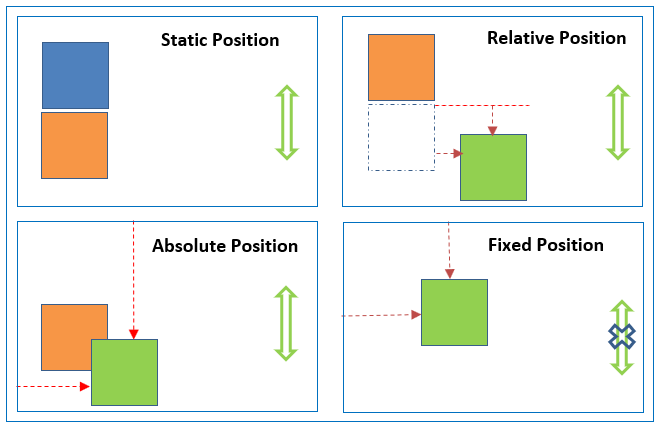
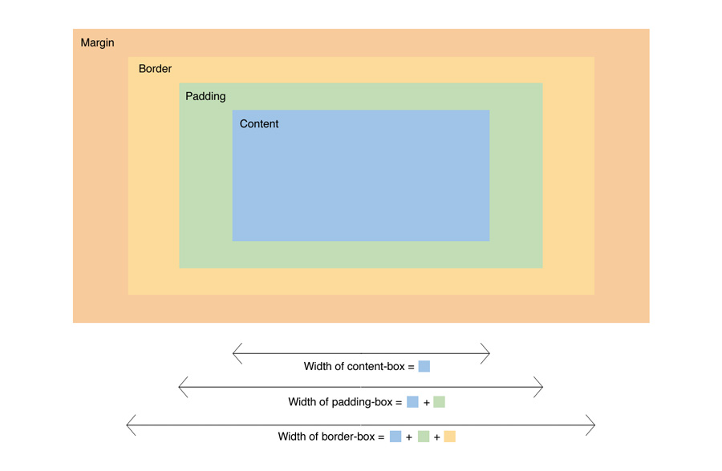
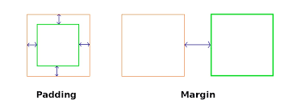
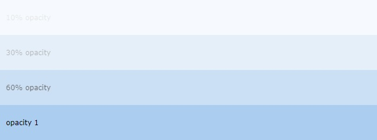

# CSS Interview Questions

*Click  if you like the project. Pull Request are highly appreciated.*

## Table of Contents

* *[CSS Practice](css-practice.md)*
* *[CSS3 Properties](css3-properties.md)*
* *[SCSS Interview Questions and Answers](scss-questions.md)* 
* *[CSS Multiple Choice Questions](css-multiple-choice-questions.md)*

## Q. ***What are the css selectors?***

A CSS selector is the part of a CSS rule set that actually selects the content you want to style.

**i) Universal Selector**: The universal selector works like a wild card character, selecting all elements on a page. Every HTML page is built on content placed within HTML tags. Each set of tags represents an element on the page.

```css
* {
   color: green;
   font-size: 20px;
   line-height: 25px;
}
```

**ii) Element Type Selector**: This selector match one or more HTML elements of the same name.

```css
ul {
   list-style: none;
   border: solid 1px #ccc;
}
```

```html
<ul>
  <li>Fish</li>
  <li>Apples</li>
  <li>Cheese</li>
</ul>

<div class="example">
  <p>Example paragraph text.</p>
</div>

<ul>
  <li>Water</li>
  <li>Juice</li>
  <li>Maple Syrup</li>
</ul>
```

**iii) ID Selector**: This selector matches any HTML element that has an ID attribute with the same value as that of the selector.

```css
#container {
   width: 960px;
   margin: 0 auto;
}
```

```html
<div id="container"></div>
```

**iv) Class Selector**: The class selector also matches all elements on the page that have their class attribute set to the same value as the class.

```css
.box {
   padding: 20px;
   margin: 10px;
   width: 240px;
}
```

```html
<div class="box"></div>
```

**v) Descendant Combinator**: The descendant selector or, more accurately, the descendant combinator lets you combine two or more selectors so you can be more specific in your selection method.

```css
#container .box {
   float: left;
   padding-bottom: 15px;
}
```

This declaration block will apply to all elements that have a class of box that are inside an element with an ID of `container`. It’s worth noting that the `.box` element doesn’t have to be an immediate child: there could be another element wrapping `.box`, and the styles would still apply.

```html
<div id="container">
  <div class="box"></div>

  <div class="box-2"></div>
</div>

<div class="box"></div>
```

**vi) Child Combinator**: A selector that uses the child combinator is similar to a selector that uses a descendant combinator, except it only targets immediate child elements.

```css
#container > .box {
   float: left;
   padding-bottom: 15px;
}
```

The selector will match all elements that have a class of `box` and that are immediate children of the `#container` element. That means, unlike the descendant combinator, there can’t be another element wrapping `.box`—it has to be a direct child element.

```html
<div id="container">
  <div class="box"></div>

  <div>
    <div class="box"></div>
  </div>
</div>
```

**vii) General Sibling Combinator**: A selector that uses a general sibling combinator matches elements based on sibling relationships. The selected elements are beside each other in the HTML.

```css
h2 ~ p {
   margin-bottom: 20px;
}
```

In this example, all paragraph elements (`<p>`) will be styled with the specified rules, but only if they are siblings of `<h2>` elements. There could be other elements in between the `<h2>` and `<p>`, and the styles would still apply.

```html
<h2>Title</h2>
<p>Paragraph example.</p>
<p>Paragraph example.</p>
<p>Paragraph example.</p>
<div class="box">
  <p>Paragraph example.</p>
</div>
```

**viii) Adjacent Sibling Combinator**: A selector that uses the adjacent sibling combinator uses the plus symbol (+), and is almost the same as the general sibling selector. The difference is that the targeted element must be an immediate sibling, not just a general sibling.

```css
p + p {
   text-indent: 1.5em;
   margin-bottom: 0;
}
```

In this example will apply the specified styles only to paragraph elements that immediately follow other paragraph elements. This means the first paragraph element on a page would not receive these styles. Also, if another element appeared between two paragraphs, the second paragraph of the two wouldn’t have the styles applied.

```html
<h2>Title</h2>
<p>Paragraph example.</p>
<p>Paragraph example.</p>
<p>Paragraph example.</p>

<div class="box">
  <p>Paragraph example.</p>
  <p>Paragraph example.</p>
</div>
```
**ix) Attribute Selector**: The attribute selector targets elements based on the presence and/or value of HTML attributes, and is declared using square brackets
```css
input[type="text"] {
   background-color: #444;
   width: 200px;
}
```
```html
<input type="text">
```
The attribute selector can also be declared using just the attribute itself, with no value, like this:
```css
input[type] {
   background-color: #444;
   width: 200px;
}
```

**x) Pseudo-class**: A pseudo-class uses a colon character to identify a pseudo-state that an element might be in—for example, the state of being hovered, or the state of being activated.

```css
a:hover {
   color: red;
}
```
**xi) Pseudo-element**: A CSS pseudo-element is used to style specified parts of an element. For example, it can be used to:

* Style the first letter, or line, of an element
* Insert content before, or after, the content of an element 

```html
<!DOCTYPE html>
<html>
  <head>
    <style>
      p::first-line {
        color: #ff0000;
        font-variant: small-caps;
      }

      p::first-letter {
        color: #ff0000;
        font-size: xx-large;
      }

      h1::before {
        content: url(smiley.gif);
      }

      h1::after {
        content: url(smiley.gif);
      }

      ::selection {
        color: red;
        background: yellow;
      }
    </style>
  </head>
<body>
  <p>Lorem Ipsum is simply dummy text of the printing and typesetting industry.
  Lorem Ipsum has been the industry\'s standard dummy text ever since the 1500s,
  <h1>when an unknown printer took a galley of type and scrambled it to make a
  type specimen book.<h1></p>
</body>
</html>
```

[Live Example](https://learning-zone.github.io/css-interview-questions/selector.html) 

<div align="right">
    <b><a href="#">↥ back to top</a></b>
</div>

## Q. ***What is contextual selector?***

Contextual selector addresses specific occurrence of an element. It is a string of individual selectors separated by white space (search pattern), where only the last element in the pattern is addressed providing it matches the specified contex.

It also check the context of the class in the html tree, assigning the style to the element through a specific route, taking into account the order of depth in the tree.

**Example:**
```css
table p { property: value; } 
```
<div align="right">
    <b><a href="#">↥ back to top</a></b>
</div>

## Q. ***What is the difference between Pseudo-classes and pseudo-elements?***

A pseudo-class is a selector that assists in the selection of something that cannot be expressed by a simple selector, for example `:hover`. A pseudo-element however allows us to create items that do not normally exist in the document tree, for example `::after`.

**Pseudo-classes**  

Pseudo-classes select regular elements but under certain conditions, like when their position relative to siblings or when they’re under a particular state. Here is a list of pseudo-classes in CSS3:

**a) Dynamic pseudo-classes**  

* :link
* :visited
* :hover
* :active
* :focus

**b) UI element states pseudo-classes**  

* :enabled
* :disabled
* :checked

**c) Structural pseudo-classes**  

* :first-child
* :nth-child(n)
* :nth-last-child(n)
* :nth-of-type(n)
* :nth-last-of-type(n)
* :last-child
* :first-of-type
* :last-of-type
* :only-child
* :only-of-type
* :root
* :empty

**d) Other pseudo-classes**  

:not(x)
:target
:lang(language)


**Pseudo-elements**  

Pseudo-elements effectively create new elements that are not specified in the markup of the document and can be manipulated much like a regular element. 


* ::before
* ::after
* ::first-letter
* ::first-line
* ::selection

<div align="right">
    <b><a href="#">↥ back to top</a></b>
</div>

## Q. ***What is Combinator selector?***

A combinator is the character in a selector that connects two selectors together. There are four types of combinators. 

**a) Descendant Combinator (space)**: The descendant selector matches all elements that are descendants of a specified element.

The following example selects all `<p>` elements inside `<div>` elements: 
```css
div p {
  background-color: yellow;
}
```
**b) Child Combinator (>)**: The child selector selects all elements that are the children of a specified element.

The following example selects all `<p>` elements that are children of a `<div>` element:
```css
div > p {
  background-color: yellow;
}
```
**c) Adjacent Sibling Combinator (+)**: The adjacent sibling selector selects all elements that are the adjacent siblings of a specified element.

The following example selects all `<p>` elements that are placed immediately after `<div>` elements:
```css
div + p {
  background-color: yellow;
}
```
**d) General Sibling Combinator (~)**: The general sibling selector selects all elements that are siblings of a specified element.

The following example selects all `<p>` elements that are siblings of `<div>` elements: 
```css
div ~ p {
  background-color: yellow;
}
```

<div align="right">
    <b><a href="#">↥ back to top</a></b>
</div>

## Q. ***What is the difference between class selectors and id selectors?***

In the CSS, a class selector is a name preceded by a full stop (“.”) and an ID selector is a name preceded by a hash character (“#”). The difference between an ID and a class is that an ID can be used to identify one element, whereas a class can be used to identify more than one.
```css
#top {
    background-color: #ccc;
    padding: 20px
}

.intro {
    color: red;
    font-weight: bold;
}
```
```html
<div id="top">

<h1>Chocolate curry</h1>
<p class="intro">This is my recipe for making curry purely with chocolate</p>
<p class="intro">Mmm mm mmmmm</p>

</div>
```

<div align="right">
    <b><a href="#">↥ back to top</a></b>
</div>

## Q. ***When to use css grid and flexbox?***

* CSS Grid Layout is a **two-dimensional** system, meaning it can handle both columns and rows, unlike flexbox which is largely a **one-dimensional** system (either in a column or a row).
* A core difference between CSS Grid and Flexbox is that — CSS Grid’s approach is **layout-first** while Flexbox’ approach is **content-first**. If you are well aware of your content before making layout, then blindly opt for Flexbox and if not, opt for CSS Grid.
* Flexbox layout is most appropriate to the components of an application (as most of them are fundamentally linear), and **small-scale** layouts, while the Grid layout is intended for **larger-scale** layouts which aren’t linear in their design.
* If you only need to define a layout as a row or a column, then you probably need flexbox. If you want to define a grid and fit content into it in two dimensions — you need the grid.

<p align="center">
  
  
</p>

[Live Example](https://learning-zone.github.io/css-interview-questions/grid-flexbox-layout.html) 

<div align="right">
    <b><a href="#">↥ back to top</a></b>
</div>

## Q. ***What is CSS BEM?***

The BEM (**Block Element Modifier**) methodology is a naming convention for CSS classes in order to keep CSS more maintainable by defining namespaces to solve scoping issues. A Block is a standalone component that is reusable across projects and acts as a "namespace" for sub components (Elements). Modifiers are used as flags when a Block or Element is in a certain state or is different in structure or style.

```css
/* block component */
.block {
}

/* element */
.block__element {
}

/* modifier */
.block__element--modifier {
}
```

Example

```css
.button {
	display: inline-block;
	border-radius: 3px;
	padding: 7px 12px;
	border: 1px solid #D5D5D5;
	background-image: linear-gradient(#EEE, #DDD);
	font: 700 13px/18px Helvetica, arial;
}
.button--state-success {
	color: #FFF;
	background: #569E3D linear-gradient(#79D858, #569E3D) repeat-x;
	border-color: #4A993E;
}
.button--state-danger {
	color: #900;
}
```
```html
<button class="button">
	Normal button
</button>
<button class="button button--state-success">
	Success button
</button>
<button class="button button--state-danger">
	Danger button
</button>
```

**Benefits**  

* **Modularity**: Block styles are never dependent on other elements on a page, so you will never experience problems from cascading.
* **Reusability**: Composing independent blocks in different ways, and reusing them intelligently, reduces the amount of CSS code that you will have to maintain.
* **Structure**: BEM methodology gives your CSS code a solid structure that remains simple and easy to understand.

<div align="right">
    <b><a href="#">↥ back to top</a></b>
</div>

## Q. ***What are the benefits of using CSS sprites?*** 

CSS sprites combine multiple images into one single larger image. It is a commonly-used technique for icons. 

**Advantages:**

* Reduce the number of ```HTTP``` requests for multiple images (only one single request is required per spritesheet). But with ```HTTP2```, loading multiple images is no longer much of an issue.
* Advance downloading of assets that won't be downloaded until needed, such as images that only appear upon `:hover` pseudo-states. Blinking wouldn't be seen.


* When you have multiple images/ icons, browser makes separate call to the server for each one of them. sprite is a technique to combine all/ some of them (usually similar one in terms of type of image. For example, you will put jpg in one sprite) in one image. To display the icon you set height, width and background position.

**Alternatives:**

* Data URIs - allow you to embed the image data directly into a stylesheet. This avoids additional HTTP requests for images, making it essentially the same thing as a sprite, without the fancy positioning.
* Icon Fonts
* SVGs

<div align="right">
    <b><a href="#">↥ back to top</a></b>
</div>

## Q. ***What is the float property and what float do?***

The float CSS property places an element on the left or right side of its container, allowing text and inline elements to wrap around it. 

**Syntax**  
```css
/* Keyword values */
float: left;
float: right;
float: none;
float: inline-start;
float: inline-end;

/* Global values */
float: inherit;
float: initial;
float: unset;
```
**Property Values**  

|Sl.No| Value  | Description| 
|-----|--------|------------|
| 01. |none	   |The element does not float, (will be displayed just where it occurs in the text).|	
| 02. |left	   |The element floats to the left of its container	|
| 03. |right	 |The element floats the right of its container	|
| 04. |initial |Sets this property to its default value.    	|
| 05. |inherit |Inherits this property from its parent element. |

Example:
```css
section {
  border: 1px solid blue;
  width: 100%;
  float: left;
}

div {
  margin: 5px;
  width: 50px;
  height: 150px;
}

.left {
  float: left;
  background: pink;
}

.right {
  float: right;
  background: cyan;
}
```
```html
<section>
  <div class="left">1</div>
  <div class="left">2</div>
  <div class="right">3</div>
  <p>Lorem ipsum dolor sit amet, consectetur adipiscing elit.
     Morbi tristique sapien ac erat tincidunt, sit amet dignissim
     lectus vulputate. Donec id iaculis velit. Aliquam vel
     malesuada erat. Praesent non magna ac massa aliquet tincidunt
     vel in massa. Phasellus feugiat est vel leo finibus congue.</p>
</section>
```

<div align="right">
    <b><a href="#">↥ back to top</a></b>
</div>

## Q. ***What is tweening in css?***

The pose-to-pose option is to create a few keyframes throughout the sequence, and then fill in the gaps later. Filling in these gaps is known as **tweening**. It is the process of generating intermediate frames between two images. It gives the impression that the first image has smoothly evolved into the second one. In CSS3, Transforms (matrix, translate, rotate, scale etc.) module can be used to achieve tweening.

Example:
```css
p {
  animation-duration: 3s;
  animation-name: slidein;
}

@keyframes slidein {
  from {
    margin-left: 100%;
    width: 300%; 
  }

  to {
    margin-left: 0%;
    width: 100%;
  }
}
```

<div align="right">
    <b><a href="#">↥ back to top</a></b>
</div>

## Q. ***Explain the difference between `visibility: hidden;` and `display: none;`? What are the pros and cons of using `display:none`?***

* **visibility: hidden** simply hides the element but it will occupy space and affect the layout of the document.  
* **display: none** removes the element from the normal layout flow (causes DOM reflow). It will not affect the layout of the document nor occupy space.

<div align="right">
    <b><a href="#">↥ back to top</a></b>
</div>

## Q. ***What is DOM reflow?***

Reflow is the name of the web browser process for re-calculating the positions and geometries of elements in the document, for the purpose of re-rendering part or all of the document.

**Reflow occurs when**

  * insert, remove or update an element in the DOM
  * modify content on the page, e.g. the text in an input box
  * move a DOM element
  * animate a DOM element
  * take measurements of an element such as offsetHeight or getComputedStyle
  * change a CSS style
  * change the className of an element
  * add or remove a stylesheet
  * resize the window
  * scroll

**Minimizing browser reflow**  

* Reduce unnecessary DOM depth. Changes at one level in the DOM tree can cause changes at every level of the tree - all the way up to the root, and all the way down into the children of the modified node. This leads to more time being spent performing reflow.
* Minimize CSS rules, and remove unused CSS rules.
* If you make complex rendering changes such as animations, do so out of the flow. Use position-absolute or position-fixed to accomplish this.
* Avoid unnecessary complex CSS selectors - descendant selectors in particular - which require more CPU power to do selector matching.

<div align="right">
    <b><a href="#">↥ back to top</a></b>
</div>

## Q. ***What is the purpose of the `z-index` and how is it used?***

The `z-index` helps specify the stack order of positioned elements that may overlap one another. The `z-index` default value is zero, and can take on either a positive or negative number. An element with a higher `z-index` is always stacked above than a lower index.

`z-index` can take the following values:

  * **Auto**: Sets the stack order equal to its parents.
  * **Number**: Orders the stack order.
  * **Initial**: Sets this property to its default value (0).
  * **Inherit**: Inherits this property from its parent element.

[Live Example](https://learning-zone.github.io/css-interview-questions/z-index.html) 

<div align="right">
    <b><a href="#">↥ back to top</a></b>
</div>

## Q. ***Exaplain CSS position Property?***

<p align="center">
  
</p>

* **absolute**, place an element exactly where you want to place it. absolute position is actually set relative to the element\'s parent. if no parent available then relatively place to the page itself (it will default all the way back up to the <html> element).

* **relative**, means "relative to itself". Setting position: relative; on an element and no other positioning attributes, it will no effect on it\'s positioning. It allows the use of `z-index` on the element and it limits the scope of absolutely positioned child elements. Any child element will be absolutely positioned within that block.

* **fixed**, element is positioned relative to viewport or the browser window itself. viewport doesn't changed if you scroll and hence fixed element will stay right in the same position.

* **static** default for every single page element. The only reason you would ever set an element to position: static is to forcefully-remove some positioning that got applied to an element outside of your control.

* **sticky** - Sticky positioning is a hybrid of relative and fixed positioning. The element is treated as `relative` positioned until it crosses a specified threshold, at which point it is treated as `fixed` positioned.

[Live Example](https://learning-zone.github.io/css-interview-questions/position-index.html) 

<div align="right">
    <b><a href="#">↥ back to top</a></b>
</div>

## Q. ***The difference between block, inline and inline-block element?***

**a) Block Elements**  
The block elements always start on a new line. They will also take space of an entire row or width. List of block elements are `<p>`, `<h1>`, `<div>`, `<header>`.

Example:

```html
<p>
  Lorem ipsum dolor sit amet consectetur adipisicing elit. Unde autem,
  consequatur deleniti nobis beatae quo dolore nemo corporis. Ad delectus
  dignissimos pariatur illum eveniet dolor rem eius laborum sed iure!
</p>

<p>
  Lorem ipsum dolor sit amet consectetur adipisicing elit. Unde autem,
  consequatur deleniti nobis beatae quo dolore nemo corporis. Ad delectus
  dignissimos pariatur illum eveniet dolor rem eius laborum sed iure!
</p>
```

**b) Inline Elements**  
Inline elements don\'t start on a new line, they appear on the same line as the content and tags beside them. Some examples of inline elements are `<a>`, `<span>` , `<strong>`, and `` tags.

When it comes to margins and padding, browsers treat inline elements differently. You can add space to the left and right on an inline element, but you cannot add height to the top or bottom padding or margin of an inline element.

Example:

```html
<a href="#">Link</a>

<span>Span</span>
<strong>Strong Player</strong>
```

**c) Inline-Block Elements**  
Inline-block elements are similar to inline elements, except they can have padding and margins added on all four sides.
One common use for using inline-block is for creating navigation links horizontally. Some examples of inline-block elements are `<input>`, `<button>`, `<select>`, `<textarea>` etc.
```css
input {
  width: 300px;
  height: 50px;
}

button {
  width: 100px;
  height: 50px;
  margin-top: 20px;
}
```

```html
<input type="text" /> <button>Submit</button>
```

[Live Example](https://learning-zone.github.io/css-interview-questions/display-properties.html) 

<div align="right">
    <b><a href="#">↥ back to top</a></b>
</div>

## Q. ***What are counters in CSS3?***

CSS counters let you adjust the appearance of content based on its location in a document. To use a CSS counter, it must first be initialized to a value with the `counter-reset` property (0 by default). The same property can also be used to change its value to any specific number. Once initialized, a counter\'s value can be increased or decreased with counter-increment. The counter\'s name must not be "none", "inherit", or "initial"; otherwise the declaration is ignored.

```css
body {
  counter-reset: section;   /* Set a counter named 'section', and its initial value is 0. */
}

h3::before {
  counter-increment: section;   /* Increment the value of section counter by 1 */
  content: "Section " counter(section) ": ";  /* Display the word 'Section ', the value of 
                                                 section counter, and a colon before the content
                                                 of each h3 */
}
```

```html
<h3>Introduction</h3>
<h3>Body</h3>
<h3>Conclusion</h3>
```

**CSS Counter Properties**  

|Property	        |Description  |
|-----------------|-------------------------------------------------------------------------------|
|content	        |Used with the ::before and ::after pseudo-elements, to insert generated content|
|counter-increment|Increments one or more counter values|
|counter-reset	  |Creates or resets one or more counters|

[Live Example](https://learning-zone.github.io/css-interview-questions/counters.html) 

<div align="right">
    <b><a href="#">↥ back to top</a></b>
</div>

## Q. ***Which one would you prefer among px, em % or pt and why?***

* ```px``` gives fine grained control and maintains alignment because 1 px or multiple of 1 px is guaranteed to look sharp. px is not cascade, this means if parent font-size is 20px and child 16px. child would be 16px.

* ```em``` maintains relative size. you can have responsive fonts. em is the width of the letter 'm' in the selected typeface. However, this concept is tricky. 1em is equal to the current font-size of the element or the browser default. if u sent font-size to 16px then 1em = 16px. The common practice is to set default body font-size to 62.5% (equal to 10px). em is cascade

* ```%``` sets font-size relative to the font size of the body. Hence, you have to set font-size of the body to a reasonable size. this is easy to use and does cascade. for example, if parent font-size is 20px and child font-size is 50%. child would be 10px.

* ```pt```(points) are traditionally used in print. 1pt = 1/72 inch and it is fixed-size unit.

<div align="right">
    <b><a href="#">↥ back to top</a></b>
</div>

## Q. ***What is pseudo element? What is pseudo class?***

**1. Pseudo Element**: A CSS pseudo-element is used to style specified parts of an element.

For example, it can be used to:

* Style the first letter, or line, of an element
* Insert content before, or after, the content of an element

**CSS Pseudo Elements**  

|Sl.No|Selector	      |Example	        |description|
|-----|---------------|-----------------|-------------|
| 01. |::after	      |p::after	        |Insert something after the content of each <p> element|
| 02. |::before	      |p::before	      |Insert something before the content of each <p> element|
| 03. |::first-letter	|p::first-letter	|Selects the first letter of each <p> element|
| 04. |::first-line	  |p::first-line	  |Selects the first line of each <p> element|
| 05. |::selection	  |p::selection	    |Selects the portion of an element that is selected by a user|


**2. Pseudo-classes**: A pseudo-class is used to define a special state of an element.

For example, it can be used to:

* Style an element when a user mouses over it
* Style visited and unvisited links differently
* Style an element when it gets focus

**CSS Pseudo Classes**  

| Sl.No |Selector	         | Example	              |description|
|-------|------------------|------------------------|-----------|
| 01.  |:active	           |a:active	              |Selects the active link|
| 02.  |:checked	         |input:checked	          |Selects every checked `<input>` element|
| 03.  |:disabled	         |input:disabled	        |Selects every disabled `<input>` element|
| 04.  |:empty	           |p:empty	                |Selects every `<p>` element that has no children|
| 05.  |:enabled	         |input:enabled	          |Selects every enabled `<input>` element|
| 06.  |:first-child	     |p:first-child	          |Selects every `<p>` elements that is the first child of its parent|
| 07.  |:first-of-type	   |p:first-of-type	        |Selects every `<p>` element that is the first `<p>` element of its parent|
| 08.  |:focus	           |input:focus	            |Selects the `<input>` element that has focus|
| 09.  |:hover	           |a:hover	                |Selects links on mouse over|
| 10.  |:in-range	         |input:in-range	        |Selects `<input>` elements with a value within a specified range|
| 11.  |:invalid	         |input:invalid	          |Selects all `<input>` elements with an invalid value|
| 12.  |:lang(language)	   |p:lang(it)	            |Selects every `<p>` element with a lang attribute value starting with "it"|
| 13.  |:last-child	       |p:last-child	          |Selects every `<p>` elements that is the last child of its parent|
| 14.  |:last-of-type	     |p:last-of-type	        |Selects every `<p>` element that is the last `<p>` element of its parent|
| 15.  |:link	             |a:link	                |Selects all unvisited links|
| 16.  |:not(selector)	   |:not(p)	                |Selects every element that is not a `<p>` element|
| 17.  |:nth-child(n)	     |p:nth-child(2)	        |Selects every `<p>` element that is the second child of its parent|
| 18.  |:nth-last-child(n) |p:nth-last-child(2)	    |Selects every `<p>` element that is the second child of its parent, |counting from the last child|
| 19.  |:nth-last-of-type(n) |p:nth-last-of-type(2)	|Selects every `<p>` element that is the second `<p>` element of its parent, counting from the last child|
| 20.  |:nth-of-type(n)	    |p:nth-of-type(2)	      |Selects every `<p>` element that is the second `<p>` element of its parent|
| 21.  |:only-of-type	      |p:only-of-type	        |Selects every `<p>` element that is the only `<p>` element of its parent|
| 22.  |:only-child	        |p:only-child	          |Selects every `<p>` element that is the only child of its parent|
| 23.  |:optional	          |input:optional	        |Selects `<input>` elements with no "required" attribute|
| 24.  |:out-of-range	      |input:out-of-range	    |Selects `<input>` elements with a value outside a specified range|
| 25.  |:read-only	        |input:read-only	      |Selects `<input>` elements with a "readonly" attribute specified|
| 26.  |:read-write	        |input:read-write	      |Selects `<input>` elements with no "readonly" attribute|
| 27.  |:required	          |input:required	        |Selects `<input>` elements with a "required" attribute specified|
| 28.  |:root	root	        |                       |Selects the document\'s root element|
| 29.  |:target	            |#news:target	          |Selects the current active #news element (clicked on a URL containing that anchor name)|
| 30.  |:valid	            |input:valid	          |Selects all `<input>` elements with a valid value|
| 31.  |:visited	          |a:visited	            |Selects all visited links|

<div align="right">
    <b><a href="#">↥ back to top</a></b>
</div>

## Q. ***Explain the CSS “box model” and the layout components that it consists of?***

<p align="center">
  
</p>

The CSS box model is a rectangular layout paradigm for HTML elements that consists of the following:

* **Content**: The content of the box, where text and images appear
* **Padding**: A transparent area surrounding the content (i.e., the amount of space between the border and the content)
* **Border**: A border surrounding the padding (if any) and content
* **Margin**: A transparent area surrounding the border (i.e., the amount of space between the border and any neighboring elements)

```css
/* top   right  bottom left  */
padding: 25px  50px   75px   100px;

/* same padding on all 4 sides: */
padding: 25px;

/* top/bottom padding 25px; right/left padding 50px */
padding: 25px 50px;

/* top padding 25px; right/left padding 50px; bottom padding 75px */
padding: 25px 50px 75px;
```

[Live Example](https://learning-zone.github.io/css-interview-questions/boxmodel-index.html)

<div align="right">
    <b><a href="#">↥ back to top</a></b>
</div>

## Q. ***Explain the meaning of each of these CSS units for expressing length?***

* ```cm``` centimeters
* ```em``` elements (i.e., relative to the font-size of the element; e.g., 2 em means 2 times the current font size)
* ```in``` inches
* ```mm``` millimeters
* ```pc``` picas (1 pc = 12 pt = 1/6th of an inch)
* ```pt``` points (1 pt = 1/72nd of an inch)
* ```px``` pixels (1 px = 1/96th of an inch)

<div align="right">
    <b><a href="#">↥ back to top</a></b>
</div>

## Q. ***In CSS3, how would you select?***

* Every ```<a>``` element whose href attribute value begins with “https”.
```css
  a[href^="https"]
```
    
* Every ```<a>``` element whose href attribute value ends with “.pdf”.
```css
  a[href$=".pdf"]
```
    
* Every ```<a>``` element whose href attribute value contains the substring “css”.
```css
  a[href*="css"]
```

<div align="right">
    <b><a href="#">↥ back to top</a></b>
</div>

## Q. ***What is the purpose of the box-sizing property?***

<p align="center">
  
</p>

The box-sizing CSS property sets how the total width and height of an element is calculated.

* **content-box**: the default width and height values apply to the element\'s content only. The padding and border are added to the outside of the box.
* **padding-box**: Width and height values apply to the element\'s content and its padding. The border is added to the outside of the box. Currently, only Firefox supports the padding-box value.
* **border-box**: Width and height values apply to the content, padding, and border.
* **inherit**: inherits the box sizing of the parent element.

Example:

```css
box-sizing: content-box;
width: 100%;
border: solid rgb(90,107,204) 10px;
padding: 5px;
```

<div align="right">
    <b><a href="#">↥ back to top</a></b>
</div>

## Q. ***What is the difference between RGBa, HEX and HSLa?***

* **RGB** (Red/Green/Blue) is a color model.

```css
p {
  color: rgba(37, 84, 127, 1);
}
```
* **HEX (Hexadecimal color values)**

```css
p {
  color: #25547f;
}
```

* **HSLa (Hue Saturation Lightness alpha)**

```css
p {
  color: hsla(209, 55%, 32%, 1);
}
```
<div align="right">
    <b><a href="#">↥ back to top</a></b>
</div>

## Q. ***What is CSS preprocessor?***

Pre-processors extend CSS with variables, operators, interpolations, functions, mixins and many more other usable assets. After development, these specific files are compiled into regular CSS that any browser can understand. Pre-processor help writing reusable, easily maintainable and extensible codes in CSS. 

**CSS preprocessors**

  * SASS (SCSS)
  * LESS
  * Stylus
  * PostCSS

**Advantages:**

* CSS is made more maintainable.
* Easy to write nested selectors.
* Variables for consistent theming. Can share theme files across different projects.
* Mixins to generate repeated CSS.
* Splitting your code into multiple files. CSS files can be split up too but doing so will require an HTTP request to download each CSS file.

<div align="right">
    <b><a href="#">↥ back to top</a></b>
</div>

## Q. ***What is the difference between "resetting" and "normalizing" CSS?***

**1. Resetting**: CSS resets aim to remove all built-in browser styling. For example margins, paddings, font-sizes of all elements are reset to be the same. You will have to redeclare styling for common typographic elements.

Example
```css
html, body, div, span, applet, object, iframe, h1, h2, h3, h4, h5, h6, p, blockquote, pre, a, abbr, 
acronym, address, big, cite, code, del, dfn, em, img, ins, kbd, q, s, samp, small, strike, strong, 
sub, sup, tt, var, b, u, i, center, dl, dt, dd, ol, ul, li, fieldset, form, label, legend, table, 
caption, tbody, tfoot, thead, tr, th, td, article, aside, canvas, details, embed,  figure, figcaption, 
footer, header, hgroup,  menu, nav, output, ruby, section, summary, time, mark, audio, video {  
   margin: 0;  
   padding: 0;  
   border: 0;  
   font-size: 100%;  
   font: inherit;  
   vertical-align: baseline; 
}
```

**2. Normalizing**: Normalize CSS aims to make built-in browser styling consistent across browsers. It also corrects bugs for common browser dependencies.

Example
```css
/* 
  Correct the font size and margin on `h1` elements within `section`  
  and `article` contexts in Chrome, Firefox, and Safari.
*/
 h1 {  font-size: 2em;  margin: 0.67em 0;}
 ```

<div align="right">
    <b><a href="#">↥ back to top</a></b>
</div>

## Q. ***Describe clear Property in css?***

The clear property specifies what elements can float beside the cleared element and on which side.

|Sl.No| Properties     | Description  |
|-----|----------------|--------------|
| 01. |clear: none     |Allows floating elements on both sides. This is default|
| 02. |clear: left     |No floating elements allowed on the left side|
| 03. |clear: right    |No floating elements allowed on the right side|
| 04. |clear: both     |No floating elements allowed on either the left or the right side|
| 05. |clear: inherit  |The element inherits the clear value of its parent|

Example
```css
div {
  clear: left;
}
```
<div align="right">
    <b><a href="#">↥ back to top</a></b>
</div>

## Q. ***Explain CSS Block Formatting Context?***

Floats, absolutely positioned elements, block containers (such as inline-blocks, table-cells, and table-captions) that are not block boxes, and block boxes with 'overflow' other than 'visible' (except when that value has been propagated to the viewport) establish new block formatting contexts for their contents.

In a block formatting context, each box\'s left outer edge touches the left edge of the containing block (for right-to-left formatting, right edges touch)

A BFC is an HTML box that satisfies at least one of the following conditions:

* The value of `float` is not `none`.
* The value of `position` is neither `static` nor `relative`.
* The value of `display` is `table-cell`, `table-caption`, `inline-block`, `flex`, or `inline-flex`.
* The value of `overflow` is not `visible`.

In a BFC, each box\'s left outer edge touches the left edge of the containing block (for right-to-left formatting, right edges touch). Vertical margins between adjacent block-level boxes in a BFC collapse. 

[Live Example](https://learning-zone.github.io/css-interview-questions/block-formatting-context.html)

<div align="right">
    <b><a href="#">↥ back to top</a></b>
</div>

## Q. ***Does `overflow: hidden` create a new block formatting context?***

Yes. overflow property deals with the content if content size exceeds the allocated size for the content. You can make extra content visible, hidden, scroll or auto (viewport default behavior).

## Q. ***How would you approach fixing browser-specific styling issues?***

* Use a separate style sheet that only loads when that specific browser is being used. This technique requires server-side rendering though.
* Use `autoprefixer` to automatically add vendor prefixes to your code.
* Use Reset CSS or Normalize.css.

```css
/*Example: 01*/
.box-shadow {
  background-color: red;
  background-image: url(gradient-slice.png);
  background-image: -webkit-linear-gradient(top right, #A60000, #FFFFFF); /*Chrome and Safari*/
  background-image: -moz-linear-gradient(top right, #A60000, #FFFFFF); 	  /*Firefox*/
  background-image: -ms-linear-gradient(top right, #A60000, #FFFFFF);     /*Internet Explorer*/
  background-image: -o-linear-gradient(top right, #A60000, #FFFFFF);      /*Opera*/
  background-image: linear-gradient(top right, #A60000, #FFFFFF);
}

/*Example: 02*/
.box {
	-moz-border-radius: 15px;    /* Firefox */
	-webkit-border-radius: 15px; /* Safari and Chrome */
	border-radius: 15px;
}
```

<div align="right">
    <b><a href="#">↥ back to top</a></b>
</div>

## Q. ***What are your favorite image replacement techniques and which do you use when?***

**Technique: 01**

```css
h1#technique-one {
  width: 250px;
  height: 25px;
  background-image: url(logo.gif);
}
h1#technique-one span {
  display: none;
}
```

```html
<h1 id="technique-one">
  <span>CSS-Tricks</span>
</h1>
```
**Technique: 02**  
```css
h1.technique-two {
  width: 2350px; 
  height: 75px;
  background: url("images/header-image.jpg") top right;
  margin: 0 0 0 -2000px;
}
```
```html
<h1 class="technique-two">
  CSS-Tricks
</h1>
```
**Technique: 03**  
```css
h1.technique-three {
  width: 350px; 
  height: 75px;
  background: url("images/header-image.jpg");
  text-indent: -9999px;
}
```
```html
<h1 class="technique-three">
  CSS-Tricks
</h1>
```
**Technique: 04**  
```css
h1.technique-four {
	width: 350px; 
  height: 75px;
	background: url("images/header-image.jpg");
	text-indent: -9999px;
}
```
```html
<h1 class="technique-four">
  <a href="#">
    
  </a>
</h1>
```
**Technique: 05**  
```css
h1.technique-five {
	width: 350px; 
  height: 75px;
	background: url("images/header-image.jpg");
}
h1.technique-five span {
  display: none;
}
```
```html
<h1 class="technique-five">
  
  <span>CSS-Tricks</span>
</h1>
```
**Technique: 06**  
```css
h1.technique-six {
	width: 350px;
	padding: 75px 0 0 0;
	height: 0;
	background: url("images/header-image.jpg") no-repeat;
	overflow: hidden;
}
```
```html
<h1 class="technique-six">
  CSS-Tricks
</h1>
```
**Technique: 07**  
```css
h1.technique-seven {
	width: 350px; 
  height: 75px;
	background: url("images/header-image.jpg") no-repeat;
}
h1.technique-seven span {
  display: block;
  width: 0;
  height: 0;
  overflow: hidden;
}
```
```html
<h1 class="technique-seven">
	<span>CSS-Tricks</span>
</h1>
```
**Technique: 08**  
```css
h1.technique-eight {
	width: 350px; 
  height: 75px;
	position: relative;
}
h1.technique-eight span {
  background: url("images/header-image.jpg");
  position: absolute;
  width: 100%;
  height: 100%;
}
```
```html
<h1 class="technique-eight">
  <span></span>CSS-Tricks
</h1>
```
**Technique: 09**
```css
h1.technique-nine {
  width: 350px; 
  height: 75px;
  background: url("images/header-image.jpg") no-repeat;
  font-size: 1px;
  color: white;
}
```
```html
<h1 class="technique-nine">
  CSS-Tricks
</h1>
```

<div align="right">
    <b><a href="#">↥ back to top</a></b>
</div>

## Q. ***How do you serve your pages for feature-constrained browsers? What techniques do you use?***

* **Graceful degradation**: The practice of building an application for modern browsers while ensuring it remains functional in older browsers.
* **Progressive enhancement**: The practice of building an application for a base level of user experience, but adding functional enhancements when a browser supports it.
* **[caniuse](https://caniuse.com/)**: to check for feature support.
* **[Autoprefixer](https://autoprefixer.github.io/)**: for automatic vendor prefix insertion.
* **Feature detection**: using [Modernizr](https://modernizr.com/).
* **CSS Feature queries**: using [@support](https://developer.mozilla.org/en-US/docs/Web/CSS/@supports)

<div align="right">
    <b><a href="#">↥ back to top</a></b>
</div>

## Q. ***What are the different ways to visually hide content (and make it available only for screen readers)?***

These techniques are related to accessibility (a11y).

* `visibility: hidden`: However, the element is still in the flow of the page, and still takes up space.
* `width: 0; height: 0`: Make the element not take up any space on the screen at all, resulting in not showing it.
* `position: absolute; left: -99999px`: Position it outside of the screen.
* `text-indent: -9999px`: This only works on text within the `block` elements.
* **Metadata**: For example by using Schema.org, RDF, and JSON-LD.
* **WAI-ARIA**: A W3C technical specification that specifies how to increase the accessibility of web pages.

<div align="right">
    <b><a href="#">↥ back to top</a></b>
</div>

## Q. ***What are media queries? How could you apply css rules specific to a media?***

Media queries are useful when you want to modify your site or app depending on a device\'s general type (such as print vs. screen) or specific characteristics and parameters (such as screen resolution or browser viewport width). It uses the @media rule to include a block of CSS properties only if a certain condition is true.

**Media Types**

|Sl.No| Value | Description          |
|------|-------|---------------------|
|  01. |all	   |Default. Used for all media type devices|
|  02. |print	 |Used for printers|
|  03. |screen |Used for computer screens, tablets, smart-phones etc.|
|  04. |speech |Used for screenreaders that "reads" the page out loud|

**Media Features**  

|Sl.No | Value           | Description          |
|------|-----------------|----------------------|  
| 01.  |any-hover	       | Does any available input mechanism allow the user to hover over elements? |
| 02.  |any-pointer	     | Is any available input mechanism a pointing device, and if so, how accurate is it? |
| 03.  |aspect-ratio	   | The ratio between the width and the height of the viewport|
| 04.  |color	           | The number of bits per color component for the output device|
| 05.  |color-gamut	     | The approximate range of colors that are supported by the user agent and output device|
| 06.  |color-index	     | The number of colors the device can display|
| 07.  |grid	           | Whether the device is a grid or bitmap|
| 08.  |height	         | The viewport height|
| 09.  |hover	           | Does the primary input mechanism allow the user to hover over elements? |
| 10.  |inverted-colors	 | Is the browser or underlying OS inverting colors? |
| 11.  |light-level	     | Current ambient light level |
| 12.  |max-aspect-ratio |	The maximum ratio between the width and the height of the display area|
| 13.  |max-color	       | The maximum number of bits per color component for the output device|
| 14.  |max-color-index	 | The maximum number of colors the device can display|
| 15.  |max-height	     | The maximum height of the display area, such as a browser window|
| 16.  |max-monochrome	 | The maximum number of bits per "color" on a monochrome (greyscale) device|
| 17.  |max-resolution	 | The maximum resolution of the device, using dpi or dpcm|
| 18.  |max-width	       | The maximum width of the display area, such as a browser window|
| 19.  |min-aspect-ratio |	The minimum ratio between the width and the height of the display area|
| 20.  |min-color	       | The minimum number of bits per color component for the output device|
| 21.  |min-color-index	 | The minimum number of colors the device can display|
| 22.  |min-height	     | The minimum height of the display area, such as a browser window|
| 23.  |min-monochrome	 | The minimum number of bits per "color" on a monochrome (greyscale) device|
| 24.  |min-resolution	 | The minimum resolution of the device, using dpi or dpcm|
| 25.  |min-width	       | The minimum width of the display area, such as a browser window|
| 26.  |monochrome	     | The number of bits per "color" on a monochrome (greyscale) device|
| 27.  |orientation	     | The orientation of the viewport (landscape or portrait mode)|
| 28.  |overflow-block	 | How does the output device handle content that overflows the viewport along the block axis| 
| 29.  |overflow-inline	 | Can content that overflows the viewport along the inline axis be scrolled |
| 30.  |pointer	         | Is the primary input mechanism a pointing device, and if so, how accurate is it? |
| 31.  |resolution	     | The resolution of the output device, using dpi or dpcm|
| 32.  |scan	           | The scanning process of the output device|
| 33.  |scripting	       | Is scripting (e.g. JavaScript) available? |
| 34.  |update	         | How quickly can the output device modify the appearance of the content |
| 35.  |width	           | The viewport width |


Example:
```css
@media print {
  body { font-size: 10pt; }
}

@media screen {
  body { font-size: 13px; }
}

@media only screen and (max-width: 600px) {
  body {
    background-color: lightblue;
  }
}

/* Nested within another conditional at-rule */
@supports (display: flex) {
  @media screen and (min-width: 900px) {
    article {
      display: flex;
    }
  }
}

/* Extra small devices (phones, 600px and down) */
@media only screen and (max-width: 600px) { }

/* Small devices (portrait tablets and large phones, 600px and up) */
@media only screen and (min-width: 600px) { }

/* Medium devices (landscape tablets, 768px and up) */
@media only screen and (min-width: 768px) { }

/* Large devices (laptops/desktops, 992px and up) */
@media only screen and (min-width: 992px) { }

/* Extra large devices (large laptops and desktops, 1200px and up) */
@media only screen and (min-width: 1200px) { }
```
<div align="right">
    <b><a href="#">↥ back to top</a></b>
</div>

## Q. ***What is the use of `@media only screen`?***

It hide style sheets from older user agents.

## Q. ***Does the `screen` keyword apply to the device\'s physical screen or the browser\'s viewport?***

Browser\'s Viewport

## Q. ***How would you implement a web design comp that uses non-standard fonts?***

Use `@font-face` and define `font-family` for different `font-weight`s.

## Q. ***How a browser determines what elements match a CSS selector?***

Browsers match selectors from rightmost (key selector) to left. Browsers filter out elements in the DOM according to the key selector and traverse up its parent elements to determine matches. The shorter the length of the selector chain, the faster the browser can determine if that element matches the selector.

For example with this selector `p span`, browsers firstly find all the `<span>` elements and traverse up its parent all the way up to the root to find the `<p>` element. For a particular `<span>`, as soon as it finds a `<p>`, it knows that the `<span>` matches and can stop its matching.

## Q. ***How can you load css resources conditionally?***

**@import**:  allows to load stylesheet by using a path (uri) representing the location of the file. 
```css
/* By default, include the "light" color theme for syntax highlighting */
@import "cdn.com/atom-one-light.min.css";
/* And if you’re in dark mode, have those rules superseded via a different stylesheet */
@media (prefers-color-scheme: dark) {
  @import "cdn.com/atom-one-dark.min.css";
}
```

**matchMedia()**: Using matchMedia lets you execute blocks of JavaScript only when a certain media query condition is met. This means you can just write out the CSS when and if the query is true:
```javascript
if (window.matchMedia('screen and (min-width: 600px)')) {
  document.write('<link rel="stylesheet" href="css/small.css">');
}
```
<div align="right">
    <b><a href="#">↥ back to top</a></b>
</div>

## Q. ***What does  `* { box-sizing: border-box; }` do? What are its advantages?***

* Make every element in the document include the padding and border in the element\'s inner dimensions; 
making it easier to reason about the layout of elements on the page.
* By default, elements have `box-sizing: content-box` applied, and only the content size is being accounted for.
* `box-sizing: border-box` changes how the `width` and `height` of elements are being calculated, `border` and `padding` are also being included in the calculation.
* The `height` of an element is now calculated by the content\'s `height` + vertical `padding` + vertical `border` width.
* The `width` of an element is now calculated by the content\'s `width` + horizontal `padding` + horizontal `border` width.
* Taking into account `padding`s and `border`s as part of our box model resonates better with how designers actually imagine content in grids.

<div align="right">
    <b><a href="#">↥ back to top</a></b>
</div>

## Q. ***List display property in CSS?***

The display property specifies the display behavior (the type of rendering box) of an element.  
Example:
```css
p.ex1 {display: none;}
p.ex2 {display: inline;}
p.ex3 {display: block;}
p.ex4 {display: inline-block;}
```

**Property Values**  

|Sl.No|Value	   |Description	
|-----|---------------|------------------
| 01. |inline	|Displays an element as an inline element (like `<span>`). Any height and width properties will have no effect|	
| 02. |block	|Displays an element as a block element (like `<p>`). It starts on a new line, and takes up the whole width	|
| 03. |contents|Makes the container disappear, making the child elements children of the element the next level up in the DOM	|
| 04. |flex	          |Displays an element as a block-level flex container	|
| 05. |grid	          |Displays an element as a block-level grid container	|
| 06. |inline-block   |Displays an element as an inline-level block container. The element itself is formatted as an inline element, but you can apply height and width values|	
| 07. |inline-flex	   |Displays an element as an inline-level flex container	|
| 08. |inline-grid	   |Displays an element as an inline-level grid container	|
| 09. |inline-table    |The element is displayed as an inline-level table	|
| 10. |list-item	     |Let the element behave like a `<li>` element	|
| 11. |run-in	         |Displays an element as either block or inline, depending on context	|
| 12. |table	         |Let the element behave like a `<table>` element	|
| 13. |table-caption	 |Let the element behave like a `<caption>` element	|
| 14. |table-column-group	|Let the element behave like a `<colgroup>` element	|
| 15. |table-header-group	|Let the element behave like a `<thead>` element	|
| 16. |table-footer-group	|Let the element behave like a `<tfoot>` element	|
| 17. |table-row-group	  |Let the element behave like a `<tbody>` element	|
| 18. |table-cell	        |Let the element behave like a `<td>` element	|
| 19. |table-column	      |Let the element behave like a `<col>` element	|
| 20. |table-row	        |Let the element behave like a `<tr>` element	|
| 21. |none	              |The element is completely removed	|
| 22. |initial	          |Sets this property to its default value. Read about initial	|
| 23. |inherit	          |Inherits this property from its parent element. Read about inherit|

<div align="right">
    <b><a href="#">↥ back to top</a></b>
</div>

## Q. ***How is responsive design different from adaptive design?*** 

**1) Responsive design** uses `CSS media queries` to change styles based on the target device such as display type, width, height, etc., and only one of these is necessary for the site to adapt to different screens.

Responsive doesn’t offer as much control as adaptive, but takes much less work to both build and maintain. Responsive layouts are also fluid and whilst adaptive can and do use percentages to give a more fluid feel when scaling, these can again cause a jump when a window is resized. 

**2) Adaptive design** uses static layouts based on breakpoints which don\'t respond once they\’re initially loaded. Adaptive works to detect the screen size and load the appropriate layout for it.
Generally adaptive site uses six common screen widths:

* 320 px
* 480 px
* 760 px
* 960 px
* 1200 px
* 1600 px

Adaptive is useful for retrofitting an existing site in order to make it more mobile-friendly. This allows you to take control of the design and develop for specific, multiple viewports. 

<div align="right">
    <b><a href="#">↥ back to top</a></b>
</div>

## Q. ***What is retina graphics? What kind of techniques do you use to handle images for retina screens?***

In order to have crisp, good-looking graphics that make the best of retina displays we need to use high resolution images whenever possible. However using always the highest resolution images will have an impact on performance as more bytes will need to be sent over the wire.

To overcome this problem, we can use responsive images, as specified in HTML5. It requires making available different resolution files of the same image to the browser and let it decide which image is best, using the html attribute `srcset` and optionally `sizes`, for instance:

```html
<div responsive-background-image>  
  
</div>

<!-- It enable the browser to use a medium and large image based on 
     the sizes of the image in the viewport
-->

```

The browsers which does not support HTML5\'s `srcset` (i.e. IE11) will ignore it and uses `src` instead. If we really need to support IE11 and we want to provide this feature for performance reasons, we can use a JavaScript `polyfill`.

**HTML5 picture Element**  
```html
<picture>
   <source media="(min-width: 1024px)" srcset="foo-large.jpg  1024w, foo-medium.jpg 640w" sizes="50vw" />
   <source srcset="foo@2x.jpg 2x, foo.jpg 1x" />
   
</picture>
```

**Retina Display Media Query**  
```css
/* 1.25 dpr */
@media (-webkit-min-device-pixel-ratio: 1.25), (min-resolution: 120dpi) { 
    /* Retina-specific stuff here */
}

/* 1.3 dpr */
@media (-webkit-min-device-pixel-ratio: 1.3), (min-resolution: 124.8dpi) { 
    /* Retina-specific stuff here */
}

/* 1.5 dpr */
@media (-webkit-min-device-pixel-ratio: 1.5), (min-resolution: 144dpi) { 
    /* Retina-specific stuff here */
}
```
<div align="right">
    <b><a href="#">↥ back to top</a></b>
</div>

## Q. ***Is there any reason you'd want to use translate() instead of absolute positioning, or vice-versa?*** 

`translate()` is a value of CSS `transform`. Changing `transform` or `opacity` does not trigger browser reflow or repaint but does trigger compositions; whereas changing the absolute positioning triggers `reflow`. `transform` causes the browser to create a GPU layer for the element but changing absolute positioning properties uses the CPU. Hence `translate()` is more efficient and will result in shorter paint times for smoother animations.

When using `translate()`, the element still occupies its original space (sort of like `position: relative`), unlike in changing the absolute positioning.

**Example:**

If we combine `position:relative` with one of the offset properties `top`, `bottom`, `left` or `right` the element will be moved from its original place in the layout whilst preserving the space in the document it once occupied. The element will be moved on to a new layer and its “layer order” or its stacking order can then be controlled with the `z-index` property.

```css
.thing {
  position: relative;
  top: 100px;
  left: 50px;
}
```

In the above example the element will be moved 100px away from the top and 50px away from the left of its original position.

When using `transform:translate(x,y)` we get a very similar visual result to using relative position. The same result as above could be achieved with the following snippet:

```css
.thing {
  transform: translate(50px, 100px);
}
```

In this case, we are translating the coordinates of the element by `50px` along the x-axis and `100px` along the y-axis. The end result is visually the same as the previous `position` example.
<div align="right">
    <b><a href="#">↥ back to top</a></b>
</div>

## Q. ***The translate() function can move the position of an element on the z-axis?***

* False

## Q. ***Tell what each of these tags do, if there are alternatives, which are preferable, why?***

**`<em>`**: The HTML `<em>` tag represents stress emphasis of its contents.
```html
<em>Emphasized content...</em>
```

**`<b>`**: The `<b>` tag specifies bold text without any extra importance.
```html
<p>This is normal text - <b>and this is bold text</b>.</p>
```

**`<abbr>`**: The HTML Abbreviation element (`<abbr>`) represents an abbreviation or acronym; the optional title attribute can provide an expansion or description for the abbreviation.
```html
The <abbr title="World Health Organization">WHO</abbr> was founded in 1948.
```

**`<nav>`**: The `<nav>` tag defines a set of navigation links.
```html
<nav>
  <a href="/html/">HTML</a> |
  <a href="/css/">CSS</a> |
  <a href="/js/">JavaScript</a> |
  <a href="/jquery/">jQuery</a>
</nav>
```

**`<i>`**: The content of the `<i>` tag is usually displayed in italic.
```html
<p>I looked at it and thought <i>This can't be real!</i></p>
```

**`<link>`**: The HTML `<link>` tag is used for defining a link to an external resource. It is placed in in the `<head>` section of the HTML document.
```html
<head>
  <link rel="stylesheet" type="text/css" href="theme.css">
</head>
```

**`<strong>`**: The `<strong>` element is used to identify text that is of greater importance than the surrounding text. By default, all browsers render `<strong>` text in a bold typeface.
```html
<strong>Strong text</strong>
```
**`<article>`**: The `<article>` tag specifies independent, self-contained content.
```html
<article>
  <h1>Google Chrome</h1>
  <p>Google Chrome is a free, open-source web browser developed by Google, released in 2008.</p>
</article>
```
<div align="right">
    <b><a href="#">↥ back to top</a></b>
</div>

## Q. ***What is At-Rule?***

At-rules are `CSS statements` that instructs CSS how to behave. They begin with an at sign, `@` followed by an identifier and includes everything up to the next semicolon, `;` or the next CSS block, whichever comes first.
```css
/* General structure */
@IDENTIFIER (RULE);

/* Example: tells browser to use UTF-8 character set */
@charset "utf-8";
```

|Sl.No| at-rules  | Description |
|-----|-----------|-------------|
| 01. |@charset   |Defines the character set used by the style sheet.|
| 02. |@import    |Tells the CSS engine to include an external style sheet.|
| 03. |@namespace |Tells the CSS engine that all its content must be considered prefixed with an XML namespace.|
| 04. |@media     |A conditional group rule that will apply its content if the device meets the criteria of the condition defined using a media query.|
| 05. |@supports  |A conditional group rule that will apply its content if the browser meets the criteria of the given condition.|
| 06. |@page      |Describes the aspect of layout changes that will be applied when printing the document.|
| 07. |@font-face |Describes the aspect of an external font to be downloaded.|
| 08. |@keyframes |Describes the aspect of intermediate steps in a CSS animation sequence.|

<div align="right">
    <b><a href="#">↥ back to top</a></b>
</div>

## Q. ***How can the gap under the image be removed?***

As images being inline elements are treated same as texts, so there is a gap left, which can be removed by:

```html
<figure>
  
</figure>
```

<div align="right">
    <b><a href="#">↥ back to top</a></b>
</div>

## Q. ***What is progressive rendering?***

Progressive rendering is the name given to techniques used to improve the performance of a webpage (in particular, improve perceived load time) to render content for display as quickly as possible.

**Examples:**

* **Lazy loading of images** - Images on the page are not loaded all at once. JavaScript will be used to load an image when the user scrolls into the part of the page that displays the image.
* **Prioritizing visible content (or above-the-fold rendering)** - Include only the minimum CSS/content/scripts necessary for the amount of page that would be rendered in the users browser first to display as quickly as possible, you can then use deferred scripts or listen for the DOMContentLoaded/load event to load in other resources and content.
* **Async HTML fragments** - Flushing parts of the HTML to the browser as the page is constructed on the back end.

<div align="right">
    <b><a href="#">↥ back to top</a></b>
</div>

## Q. ***What is mobile-first? Can you explain the difference between coding a website to be responsive versus using a mobile-first strategy?***

Making a website responsive means the some elements will respond by adapting its size or other functionality according to the device\'s screen size, typically the viewport width, through CSS media queries, for example, making the font size smaller on smaller devices.

```css
@media (min-width: 601px) {
  .my-class {
    font-size: 24px;
  }
}
@media (max-width: 600px) {
  .my-class {
    font-size: 12px;
  }
}
```

A mobile-first strategy is also responsive, however it agrees we should default and define all the styles for mobile devices, and only add specific responsive rules to other devices later. Following the previous example:

```css
.my-class {
  font-size: 12px;
}

@media (min-width: 600px) {
  .my-class {
    font-size: 24px;
  }
}
```

A mobile-first strategy has 2 main advantages:

* It\'s more performant on mobile devices, since all the rules applied for them don\'t have to be validated against any media queries.
* It forces to write cleaner code in respect to responsive CSS rules.

[Live Example](https://learning-zone.github.io/css-interview-questions/media-query.html) 

<div align="right">
    <b><a href="#">↥ back to top</a></b>
</div>

## Q. ***What is Accessibility (a11y) in a web application?***

Accessibility refers to how software or hardware combinations are designed to make a system accessible to persons with disabilities, such as:

* Visual impairment
* Hearing loss
* Limited dexterity

For example, a website developed with accessibility in mind might have text-to-speech capabilities or output for special braille hardware geared toward individuals with visual impairments.

<div align="right">
    <b><a href="#">↥ back to top</a></b>
</div>

## Q. ***What is UI/UX?***

**1) UI or User Interface**:  is how a product or website is laid out and how you interact with it: Where the buttons are, how big the fonts are, and how menus are organized are all elements of UI.

**2) UX or User Experience**: is how you feel about using a product or a website. So, your love for the way the new Apple Watch looks or your excitement that there’s finally a tablet-sized iPhone to watch those Corgi videos you’re obsessed with are reflections of UX.
So the new look of the Facebook news feed involves a change to UI, and the way you navigate that new page is the UX. 

<div align="right">
    <b><a href="#">↥ back to top</a></b>
</div>

## Q. ***Which property is used to change the face of a font?***

The `font-family` property is used to change the face of a font.

## Q. ***Which property is used to make a font italic or oblique?***

The `font-style` property is used to make a font italic or oblique.

## Q. ***Which property is used to create a small-caps effect?***

The `font-variant` property is used to create a small-caps effect.

## Q. ***Which property is used to increase or decrease how bold or light a font appears?***

The `font-weight` property is used to increase or decrease how bold or light a font appears.

## Q. ***Which property is used to add or subtract space between the letters that make up a word?***

The `letter-spacing` property is used to add or subtract space between the letters that make up a word.

## Q. ***Which property is used to add or subtract space between the words of a sentence?***

The `word-spacing` property is used to add or subtract space between the words of a sentence.

## Q. ***Which property is used to indent the text of a paragraph?***

The `text-indent` property is used to indent the text of a paragraph.

## Q. ***Which property is used to align the text of a document?***
The `text-align` property is used to align the text of a document.

<div align="right">
    <b><a href="#">↥ back to top</a></b>
</div>

## Q. ***Which property is used to underline, overline, and strikethrough text?***

The `text-decoration` property is used to underline, overline, and strikethrough text.

## Q. ***Which property is used to capitalize text or convert text to uppercase or lowercase letters?***

The `text-transform` property is used to capitalize text or convert text to uppercase or lowercase letters.

## Q. ***Which property allows you to control the shape or appearance of the marker of a list?***

The `list-style-type` allows you to control the shape or appearance of the marker.

## Q. ***How do I restore the default value of a property?***

The keyword `initial` can be used to resets it to its default value, which is defined in the CSS specification of the given property.

<div align="right">
    <b><a href="#">↥ back to top</a></b>
</div>

## Q. ***What is specificity? How to calculate specificity?***

A process of determining which css rule will be applied to an element. It actually determines which rules will take precedence. Inline style usually wins then ID then class value (or pseudo-class or attribute selector), universal selector (*) has no specificity. ID selectors have a higher specificity than attribute selectors.

**Selector Types**  

The following list of selector types increases by specificity:

* **Type selectors** (e.g., h1) and pseudo-elements (e.g., ::before).
* **Class selectors** (e.g., .example), attributes selectors (e.g., [type="radio"]) and pseudo-classes (e.g., :hover).
* **ID selectors** (e.g., #example).

```css
/*wins*/
a#a-02 { background-image : url(n.gif); }
a[id="a-02"] { background-image : url(n.png); }
```

Contextual selectors are more specific than a single element selector.The embedded style sheet is closer to the element to be styled. The last rule defined overrides any previous, conflicting rules.

```css
p { color: red; background: yellow }
p { color: green } // wins
```

A class selector beats any number of element selectors.

```css
.introduction {} //wins
html body div div h2 p {}
```
<div align="right">
    <b><a href="#">↥ back to top</a></b>
</div>

## Q. ***What do you know about CSS Transitions?***

**CSS Transitions** allows to add an effect while changing from one style to another. You can set the which property you want to transition, duration, how you want to transit (linear, ease, ease-in, ease-out, cubic-bezier) and delay when transition will start.

**CSS Transition Properties**  

|Sl.No| Property                  | Description                       |
|-----|---------------------------|-----------------------------------|
| 01. |transition	                |A shorthand property for setting the four transition properties into a single property|
| 02. |transition-delay	          |Specifies a delay (in seconds) for the transition effect|
| 03. |transition-duration	      |Specifies how many seconds or milliseconds a transition effect takes to complete|
| 04. |transition-property	      |Specifies the name of the CSS property the transition effect is for|
| 05. |transition-timing-function	|Specifies the speed curve of the transition effect|

Example:

```css
div {
  width: 100px;
  height: 100px;
  background: red;
  -webkit-transition: width 2s; /* Safari prior 6.1 */
  transition: width 2s;
}
```

[Live Example](https://learning-zone.github.io/css-interview-questions/transitions-index.html) 

<div align="right">
    <b><a href="#">↥ back to top</a></b>
</div>

## Q. ***What are the different css filters you can use?***

The filter CSS property applies graphical effects like blur or color shift to an element. Filters are commonly used to adjust the rendering of images, backgrounds, and borders.

Example:
```css
img {
  -webkit-filter: brightness(200%); /* Safari 6.0 - 9.0 */
  filter: brightness(200%);
}
```
**Filter Functions**  

|Sl.No|Filter        | Description                       |
|-----|--------------|-----------------------------------|
| 01. |none	         |Default value. Specifies no effects|
| 02. |blur(px)	     |Applies a blur effect to the image. A larger value will create more blur.|
| 03. |brightness(%) |Adjusts the brightness of the image.|
| 04. |contrast(%)	 |Adjusts the contrast of the image.	|
| 05. |drop-shadow(h-shadow v-shadow blur spread color)|Applies a drop shadow effect to the image.|
| 06. |grayscale(%)	 |Converts the image to grayscale.|
| 07. |hue-rotate(deg)|	Applies a hue rotation on the image. The value defines the number of degrees around the color circle| the image samples will be adjusted. 0deg is default, and represents the original image.|
| 08. |invert(%)	   |Inverts the samples in the image.|
| 09. |opacity(%)	   |Sets the opacity level for the image. The opacity-level describes the transparency-level|
| 10. |saturate(%)	 |Saturates the image.|
| 11. |sepia(%)	     |Converts the image to sepia.|
| 12. |url()	       |The url() function takes the location of an XML file that specifies an SVG filter, and may include an anchor to a specific filter element. **Example**: `filter: url(svg-url#element-id)`	|
| 13. |initial	     |Sets this property to its default value.|
| 14. |inherit	     |Inherits this property from its parent element.|

<div align="right">
    <b><a href="#">↥ back to top</a></b>
</div>

## Q. ***Enlist the various fonts properties?***

|Property	             |Description                |
|----------------------|---------------------------|
|font-style	           | Specifies the font style. |
|font-variant	         | Specifies the font variant. |
|font-weight	         | Specifies the font weight. |
|font-size/line-height | Specifies the font size and the line-height. |
|font-family	         | Specifies the font family. Default value depends on the browser|
|caption	             | Uses the font that are used by captioned controls (like buttons, drop-downs, etc.)|
|icon	                 | Uses the font that are used by icon labels|
|menu	                 | Uses the fonts that are used by dropdown menus|
|message-box	         | Uses the fonts that are used by dialog boxes|
|small-caption	       | A smaller version of the caption font|
|status-bar	           | Uses the fonts that are used by the status bar|
|initial	             | Sets this property to its default value.|
|inherit	             | Inherits this property from its parent element.|

<div align="right">
    <b><a href="#">↥ back to top</a></b>
</div>

## Q. ***Enlist the various background properties css?***


|  Property             | Description                               |
|-----------------------|-------------------------------------------|
|background-color	      |Specifies the background color to be used	|
|background-image	      |Specifies ONE or MORE background images to be used	|
|background-position	  |Specifies the position of the background images	|
|background-size	      |Specifies the size of the background images	|
|background-repeat	    |Specifies how to repeat the background images	|
|background-origin	    |Specifies the positioning area of the background images|
|background-clip	      |Specifies the painting area of the background images|
|background-attachment	|Specifies whether the background images are fixed or scrolls with the rest of the page|
|initial	              |Sets this property to its default value.|
|inherit	              |Inherits this property from its parent element|

<div align="right">
    <b><a href="#">↥ back to top</a></b>
</div>

## Q. ***What is the difference between `em` and `rem` units?***

Both em and rem units are based on the font-size CSS property. The only difference is where they inherit their values from.
* `em` units inherit their value from the font-size of the parent element

```css
.parent {
  font-size: 18px;
}
.child {
  font-size: 1.5em;
}
```

```html
<div class="parent">
  I'm 15px
  <div class="child">
  I'm 30px, as expected
    <div class="child">
    I'm 60px, trouble starts!
      <div class="child">
      I'm 120px, now we're really in trouble!
      </div>
    </div>
  </div>
</div>
```

* `rem` units inherit their value from the font-size of the root element (html)

```css
.html {
  font-size: 16px;
}
.parent {
  font-size: 15px;
}
.child-rem {
  font-size: 2rem;
}
```

```html
<div class="parent">
  I'm 15px
  <div class="child-rem">
  I'm 32px, as expected
    <div class="child-rem">
    I'm 32px, yep!
      <div class="child-rem">
      I'm 32px, like clockwork!
      </div>
    </div>
  </div>
</div>
```

*Note: In most browsers, the font-size of the root element is set to 16px by default.*

<div align="right">
    <b><a href="#">↥ back to top</a></b>
</div>

## Q. ***What does !important mean in CSS?***

It overrides the cascade and gives the style rule the highest precedence.

```css
p {
    color: red !important;
}
#thing {
    color: green;
}
```
```html
<p id="thing">Will be RED.</p>
```
<div align="right">
    <b><a href="#">↥ back to top</a></b>
</div>

## Q. ***Does style2.css have to be downloaded and parsed before Paragraph 1 is rendered on the page?***

```html
<head>
    <link href="style1.css" rel="stylesheet">
</head>
<body>
    <p>Paragraph 1</p>
    <p>Paragraph 2</p>
    <link href="style2.css" rel="stylesheet">
</body>
```
* Yes

<div align="right">
    <b><a href="#">↥ back to top</a></b>
</div>

## Q. ***Does style1.css have to be downloaded and parsed before style2.css can be fetched?***

```html
<head>
    <link href="style1.css" rel="stylesheet">
    <link href="style2.css" rel="stylesheet">
</head>
```
* No

<div align="right">
    <b><a href="#">↥ back to top</a></b>
</div>

## Q. ***What are the CSS positioning?***

|Keyword    | Value                 |Description                                                                           |
|:----------|:----------------------|:-------------------------------------------------------------------------------------|
|position 	|static 				|The default mode, block element is positioned in the flow. Top, left etc. are ignored.|
|position 	|relative 				|The block element is positioned relative to its position in the flow.                 |
|position 	|absolute 				|Block element is positioned relative to its container.                                |
|position 	|fixed 					|Block element is positioned relative to the window and won’t scroll.                  |
|top 		|Number [px, cm, in…] 	|Positions the block down from the reference point at the specified distance.          |
|bottom 	|Number [px, cm, in…] 	|Positions the block up from the reference point at the specified distance.            |
|left 		|Number [px, cm, in…] 	|Positions the block right from the reference point at the specified distance.         |
|right 		|Number [px, cm, in…] 	|Positions the block left from the reference point at the specified distance.          |

<div align="right">
    <b><a href="#">↥ back to top</a></b>
</div>

## Q. ***What is the difference between padding and margin?***

**1) Margin** is applied to the outside of you element hence effecting how far your element is away from other elements.  
**2) Padding** is applied to the inside of your element hence effecting how far your element\'s content is away from the border.

Also, using margin will not affect your element\'s dimensions whereas padding will make your elements dimensions (set height + padding) so for example if you have a 100x100px div with a 5 px padding, your div will actually be 105x105px

<p align="center">
  
</p>

*Note:* **Top/Bottom margins are collapsible:** if you have a 20px margin at the bottom of an element and a 30px margin at the top of the next element, the margin between the two elements will be 30px rather than 50px. This does not apply to left/right margin or padding.

<div align="right">
    <b><a href="#">↥ back to top</a></b>
</div>

## Q. ***Explain new features in CSS3?***

**1. CSS3 Selectors**
 * Matches any element E whose attribute attr starts with the value val. In other words, the val matches the beginning of the attribute value.
```css
E[attr^=val]
/* Example */
a[href^='http://sales.']{color: teal;}
```
 * Matches any element E whose attribute attr ends in val. In other words, the val matches the end of the attribute value.
```css
E[attr$=val]
/* Example */
a[href$='.jsp']{color: purple;}
```
 * Matches any element E whose attribute attr matches val anywhere within the attribute. It is similar to E[attr~=val], except the val can be part of a word.
```css
E[attr*=val]  
/* Example */
img[src*='artwork']{
        border-color: #C3B087 #FFF #FFF #C3B087;
}
```
**2. Pseudo-classes**  
CSS2 supports user interaction pseudo-classes, namely `:link`, `:visited`, `:hover`, `:active`, and `:focus`.  
A few more pseudo-class selectors were added in CSS3. One is the `:root` selector, which allows designers to point to the root element of a document.

```css
  :root{overflow:auto;}
```
As a complement to the `:first-child` selector, the `:last-child` was added. With it one can select the last element named of a parent element.

```css
  div.article > p:last-child{font-style: italic;}
```
A new user interaction pseudo-class selector was added, the `:target` selector.

```html
<style>
  span.notice:target { font-size: 2em; font-style: bold; }
</style>

<a href='#section2'>Section 2</a>
<p id='section2'>...</p>
```

The negation pseudo-class selector, `:not` can be coupled with almost any other selector that has been implemented.

```css
  img:not([border]){ border: 1; }
```

**3. CSS3 Colors**  
The color keyword list has been extended in the CSS3 color module to include 147 additional keyword colors (that are generally well supported), CSS3 also provides us with a number of other options: **HSL**, **HSLA**, **RGBA** and **Opacity**.
```css
div.halfopaque {
  background-color: rgb(0, 0, 0);
  opacity: 0.5;
  color: #000000;
}
div.halfalpha {
  background-color: rgba(0, 0, 0, 0.5);
  color: #000000;
}
``` 
**4. Rounded Corners: border-radius**
```css
border-radius: 25px;
```
**5 Drop Shadows**
```css
box-shadow: 2px 5px 0 0 rgba(72,72,72,1);
```
**6. Text Shadow**  
```css
text-shadow: topOffset leftOffset blurRadius color;
```
**7. Linear Gradients**
```css
Syntax: background: linear-gradient(direction, color-stop1, color-stop2, ...);
/* Example */   
#grad {
  background: linear-gradient(to right, red , yellow);
}
```
**8. Radial Gradients**    
```css
Syntax : background: radial-gradient(shape size at position, start-color, ..., last-color);
/* Example */      
#grad {
  background: radial-gradient(red, yellow, green);
}//Default       
#grad {
  background: radial-gradient(circle, red, yellow, green);
}//Circle
```
**9. Multiple Background Images**   
In CSS3, there’s no need to include an element for every background image; it provides us with the ability to add more than one background image to any element, even to pseudo-elements.
```css
background-image:
url(firstImage.jpg),
url(secondImage.gif),
url(thirdImage.png);
```
<div align="right">
    <b><a href="#">↥ back to top</a></b>
</div>

## Q. ***What are gradients in CSS?***

CSS gradients are represented by the `<gradient>` data type, a special type of `<image>` made of a progressive transition between two or more colors. There are three types of gradients: 
* linear (created with the `linear-gradient()` function), 
* radial (created with `radial-gradient()`), and 
* conic (created with the `conic-gradient()` function).  

We can also create repeating gradients with the `repeating-linear-gradient()`, `repeating-radial-gradient()`, and `repeating-conic-gradient()` functions.
```css
/* Example - 01: A basic linear gradient */
.simple-linear {
  background: linear-gradient(blue, pink);
}

/* Example - 02: Changing the direction */
.horizontal-gradient {
  background: linear-gradient(to right, blue, pink);
}

/* Example - 03: Diagonal gradients */
.diagonal-gradient {
  background: linear-gradient(to bottom right, blue, pink);
}

/* Example - 04: Using angles */
.angled-gradient {
  background: linear-gradient(70deg, blue, pink);
}

/* Example - 05: Creating hard lines */
.striped { 
   background: linear-gradient(to bottom left, cyan 50%, palegoldenrod 50%); 
}
```
<div align="right">
    <b><a href="#">↥ back to top</a></b>
</div>

## Q. ***What is CSS opacity?***

<p align="center">
  
</p>

The `opacity` CSS property sets the opacity of an element. Opacity is the degree to which content behind an element is hidden, and is the opposite of transparency.

```css
div { background-color: lightblue; }
.light {
  opacity: 30%; /* Barely see the text over the background */
}
.medium {
  opacity: 60%; /* See the text more clearly over the background */
}
.heavy {
  opacity: 100%; /* See the text very clearly over the background */
}
```

```html
<div class="light">You can barely see this.</div>
<div class="medium">This is easier to see.</div>
<div class="heavy">This is very easy to see.</div>
```

<div align="right">
    <b><a href="#">↥ back to top</a></b>
</div>

## Q. ***How is the concept of inheritance applied in CSS?***

Inheritance is a concept in which the child class will inherit the properties of its parent class. It is used in CSS to define the hierarchy from the top level to the bottom level. Inherited properties can be overridden by the children class if the child uses the same name.

**Example:**
```css
span {
  color: blue;
  border: 1px solid black;
}
.extra span {
  color: inherit;
}
```

<div align="right">
    <b><a href="#">↥ back to top</a></b>
</div>

## Q. ***How do you handle browser differences in your user base?***

The `@supports` query in CSS can be very useful to scan if the user\'s current browser has a certain feature. The `@supports` CSS at-rule lets you specify declarations that depend on a browser\'s support for one or more specific CSS features. This is called a feature query. The rule may be placed at the top level of your code or nested inside any other conditional group at-rule.

```css
@supports (display: grid) {
  div {
    display: grid;
  }
}

@supports not (display: grid) {
  div {
    float: right;
  }
}
```

<div align="right">
    <b><a href="#">↥ back to top</a></b>
</div>

## Q. ***What is Cascade?***

Cascade is a method of defining the weight (importance) of individual styling rules thus allowing conflicting rules to be sorted out should such rules apply to the same selector.

```css
P {color: white ! important} /* increased weight */
P (color: black} /* normal weight */
```

<div align="right">
    <b><a href="#">↥ back to top</a></b>
</div>

## Q. ***What are CSS vendor prefixes?***

Vendor prefixes are extensions to CSS standards that can be added to these features to prevent incompatibilities from arising when the standard is extended. CSS vendor prefixes for some common platforms are listed below.

* **-webkit-**: Android, Chrome, iOS, and Safari
* **-moz-**: Mozilla Firefox
* **-ms-**: Internet Explorer
* **-o-**: Opera

<div align="right">
    <b><a href="#">↥ back to top</a></b>
</div>
