# CSS Basics

> *Click &#9733; if you like the project. Your contributions are heartily ♡ welcome.*

<br/>

## Related Topics

* [CSS Coding Practice](css-practice.md)
* [CSS3 Properties](css3-properties.md)
* [SCSS Basics](https://github.com/learning-zone/scss-basics)
* [CSS Multiple Choice Questions](css-mcq.md)

<br/>

## Table of Contents

* [Introduction](#-1-introduction)
* [Box Model](#-2-box-model) 
* [Selectors & Specificity](#-3-selectors--specificity) 
* [Positioning](#-4-positioning) 
* [Flexbox](#-5-flexbox) 
* [CSS Grid](#-6-css-grid) 
* [Pseudo-classes & Pseudo-elements](#-7-pseudo-classes--pseudo-elements) 
* [Transitions & Animations](#-8-transitions--animations) 
* [Transforms](-#-9-transforms) 
* [Media Queries & Responsive Design](#-10-media-queries--responsive-design) 
* [CSS Variables](#-11-css-variables) 
* [Typography & Text](#-12-typography--text) 
* [Colors & Gradients](#-13-colors--gradients) 
* [Z-index & Stacking Context](#-14-z-index--stacking-context) 
* [Overflow & Clipping](#-15-overflow--clipping) 
* [Display & Visibility](#-16-display--visibility) 
* [Miscellaneous](#-17-miscellaneous) 
* **Technical Lead Role**
   * [Technical Lead Role](#-18-technical-lead-role) 

<br/>

## # 1. INTRODUCTION

<br/>

## Q. What is CSS?

**CSS** stands for **Cascading Style Sheets**. CSS is used to define styles for web pages, including the design, layout and variations in display for different devices and screen sizes. CSS was intended to allow web professionals to separate the content and structure of a website\'s code from the visual design.

CSS can be used for document text styling — for example changing the color and size of headings and links. It can be used to create layout — for example turning a single column of text into a layout with a main content area and a sidebar for related information. It can even be used for effects such as animation.

**Example:**

```css
h1 {
  color: red;
  font-size: 5em;
}

p {
  color: black;
}
```

<div align="right">
    <b><a href="#">↥ back to top</a></b>
</div>

## Q. What is the use of css ruleset?

CSS is a rule or set of rules that describe the formatting (change of appearance) of individual elements on a web page. The rule consists of two parts: the selector and the next declaration block. The image below shows the structure (syntax) of the rule:

```css
div {
  color: blue;
  text-align: justify;
}
```

<p align="center">
  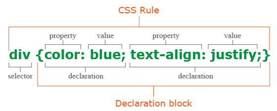
</p>

* The first is always the **selector**, it tells the browser which element or elements of the web page will be styled.
* Next is the **declaration block**, which begins with the opening curly brace { and ends with the closing }, between the curly braces are specified formatting commands (declarations), which are used by the browser to stylize the selected selector element.
* Each **declaration** consists of two parts: the property and its value. The declaration must always end with a semicolon (;). You can omit the ; only at the end of the last declaration before the closing curly brace.
* A **property** is a formatting command that defines a specific style effect for an element. Each property has its own predefined set of values. After the property name, a colon is specified, which separates the property name from the valid value.

<div align="right">
    <b><a href="#">↥ back to top</a></b>
</div>

## Q. What are the possible ways to apply CSS styles to a web page?

There are three ways to apply CSS to HTML: Inline, internal, and external.

**1. Inline CSS:**

Inline CSS is specified directly in the opening tag of the element you want it to apply to. It is entered into the style attribute within HTML. This allows CSS properties on a "per tag" basis.

**Example:**

```html
<p style="font-weight:bold;">Bold Font</p>
```

This CSS type is not really recommended, as each HTML tag needs to be styled individually. However, inline CSS in HTML can be useful in some situations. For example, in cases where you don\'t have access to CSS files or need to apply styles for a single element only.

**2. Internal CSS:**

Internal or Embedded, styles are used for the whole page. Inside the head element, the style tags surround all of the styles for the page.

**Example:**

```html
<!DOCTYPE html>
<html>
  <head>
    <title>Internal CSS Example</title>
  <style>
    p {
        color: red;
    }
    
    a {
        color: blue;
    }
</style>
...
```

This CSS style is an effective method of styling a single page. However, using this style for multiple pages is time-consuming as you need to put CSS rules to every page of your website.

**3. External CSS:**

In external CSS rules are stored in a separate file. To refer to that file from the HTML page, add the link element (and its closing element within XHTML) to the head element. This CSS type is a more efficient method, especially for styling a large website. By editing one **.css** file, you can change your entire site at once.

**style.css:**

```css
  p {
      color: red;
  }
  
  a {
      color: blue;
  }
```

```html
<!DOCTYPE html>
<html>
<head>
    <title>External CSS Example</title>
    <link rel="stylesheet" type="text/css" href="style.css">
...
```

The link element in the example has three attributes. The first, `rel`, tells the browser the type of the target of the link. The second, `type`, tells the browser what type of stylesheet it is. And the third, `href`, tells the browser under which URL to find the stylesheet.

<div align="right">
    <b><a href="#">↥ back to top</a></b>
</div>

## Q. What does the cascading portion of CSS mean?

The **cascading** in CSS refers to the fact that styling rules "cascade" down from several sources. This means that CSS has an inherent hierarchy and styles of a higher precedence will overwrite rules of a lower precedence.

Even the simplest HTML document may have three or more style sheets associated with it including:

* The browser\'s style sheet
* The user\'s style sheet
* The author\'s style sheet

**1. Browser style sheets:**

Browsers apply style sheets to all web documents. Although these style sheets vary from browser to browser, they all have common characteristics such as black text, blue links, purple visited links etc. These are referred to as a "default" browser stylesheet.

As soon as you, the author, apply a style sheet to a document, it will override the browser\'s style sheet. This is because author style sheets will always override browser style sheets.

**2. User style sheets:**

Most modern browsers allow users to set their own style sheets within their browser. These style sheets will override the browsers default style sheets - for that user only.

**3. Author style sheets:**

As soon as you apply a basic style sheet or an inline style to a page, you have added what is referred to as an "author style sheet". Everything you do, from choosing fonts, colours and laying out pages in CSS is done using author style sheets.


<div align="right">
    <b><a href="#">↥ back to top</a></b>
</div>

## Q. How does CSS work under the hood?

The CSS language is designed to be used alongside a "markup" language like HTML. CSS defines how HTML elements are formatted – controlling their layout, colors, fonts, and so on. When a browser displays a document, it must combine the document\'s content with its style information. It processes the document in a number of stages, which we\'ve listed below.

1. The browser loads the HTML (e.g. receives it from the network).
2. It converts the HTML into a DOM (Document Object Model).
3. The browser then fetches most of the resources that are linked to by the HTML document, such as embedded images and videos and linked CSS.
4. The browser parses the fetched CSS, and sorts the different rules by their selector types into different "buckets", e.g. element, class, ID, and so on. Based on the selectors it finds, it works out which rules should be applied to which nodes in the DOM, and attaches style to them as required (this intermediate step is called a render tree).
5. The render tree is laid out in the structure it should appear in after the rules have been applied to it.
6. The visual display of the page is shown on the screen (this stage is called painting).

The following diagram also offers a simple view of the process.

<p align="center">
  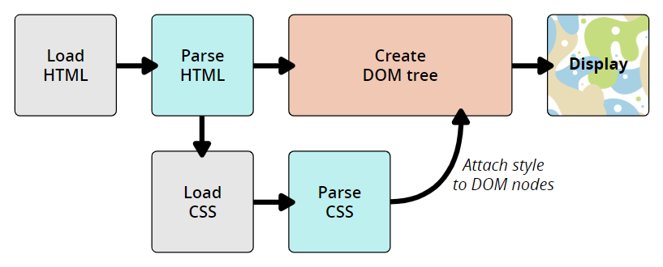
</p>

**The DOM and CSSOM:**

A DOM has a tree-like structure. Each element, attribute, and piece of text in the markup language becomes a DOM node in the tree structure. The nodes are defined by their relationship to other DOM nodes. Some elements are parents of child nodes, and child nodes have siblings. The browser undergo a process that includes conversion, tokenization, lexing, and parsing which ultimately constructs the DOM and CSSOM.

* **Conversion**: Reading raw bytes of HTML and CSS off the disk or network.
* **Tokenization**: Breaking input into chunks (ex: start tags, end tags, attribute names, attribute values), striping irrelevant characters such as whitespace and line breaks.
* **Lexing**: Like the tokenizer, but it also identifies the type of each token (this token is a number, that token is a string literal, this other token is an equality operator).
* **Parsing**: Takes the stream of tokens from the lexer, interprets the tokens using a specific grammar, and turns it into an abstract syntax tree.

**Example:** DOM Representation

```html
<p>
  Let\'s use:
  <span>Cascading</span>
  <span>Style</span>
  <span>Sheets</span>
</p>
````

In the DOM, the node corresponding to our `<p>` element is a parent. Its children are a text node and the three nodes corresponding to our `<span>` elements. The SPAN nodes are also parents, with text nodes as their children:

```html
P
├─ "Let\'s use:"
├─ SPAN
|  └─ "Cascading"
├─ SPAN
|  └─ "Style"
└─ SPAN
   └─ "Sheets"
```

Applying CSS to the DOM

```css
span {
  border: 1px solid black;
  background-color: lime;
}
```

Once both tree structures are created, the rendering engine then attaches the data structures into what\'s called a render tree as part of the layout process. The render tree is a visual representation of the document which enable painting the contents of the page in their correct order. 

Render tree construction follows the following order:

* Starting at the root of the DOM tree, traverse each visible node.
* Omit non visible nodes.
* For each visible node find the appropriate matching CSSOM rules and apply them.
* Emit visible nodes with content and their computed styles.
* Finally, output a render tree that contains both the content and style information of all visible content on the screen.

<div align="right">
    <b><a href="#">↥ back to top</a></b>
</div>

## # 2. BOX MODEL

<br/>

## Q. Explain the CSS "box model" and the layout components that it consists of?

The CSS box model is a rectangular layout paradigm for HTML elements that consists of the following:

* **Content**: The content of the box, where text and images appear
* **Padding**: A transparent area surrounding the content (i.e., the amount of space between the border and the content)
* **Border**: A border surrounding the padding (if any) and content
* **Margin**: A transparent area surrounding the border (i.e., the amount of space between the border and any neighboring elements)

<p align="center">
  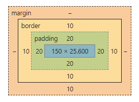
</p>

The size of the box itself is calculated like this:

|Property |Total                                                             |
|---------|------------------------------------------------------------------|
|Width    |width + padding-left + padding-right + border-left + border-right |
|Height   |height + padding-top + padding-bottom + border-top + border-bottom|

**Example:**

```html
<!DOCTYPE html>
<html>
<head>
  <title>CSS Box Model</title>
  <style>
    div {
      background-color: lightgrey;
      width: 300px;
      border: 10px solid rgb(3, 141, 233);
      padding: 50px;
      margin: 20px;
    }
  </style>
</head>
<body>
  <h2>CSS Box Model</h2>

  <p>The CSS box model is essentially a box that wraps around every HTML element. 
    It consists of: borders, padding, margins, and the actual content.</p>

  <div>This text is the content of the box. We have added a 50px padding, 20px margin and a 10px blue 
    border.</div>
</body>
</html>
```

**Live Demo**: [CSS Box Model](https://learning-zone.github.io/css-interview-questions/assets/files/boxmodel.html)

<div align="right">
    <b><a href="#">↥ back to top</a></b>
</div>

## Q. What is the difference between `box-sizing: content-box` and `box-sizing: border-box`?

The `box-sizing` property controls how the total width and height of an element is calculated.

| Property | Width Calculation |
|---|---|
| `content-box` (default) | `width` = content only. Padding and border are **added** on top. |
| `border-box` | `width` = content + padding + border. They are **included** inside the declared width. |

**Example:**

```css
/* content-box (default): total rendered width = 200 + 20 + 20 + 5 + 5 = 250px */
.box-content {
  box-sizing: content-box;
  width: 200px;
  padding: 20px;
  border: 5px solid #333;
}

/* border-box: total rendered width = 200px */
.box-border {
  box-sizing: border-box;
  width: 200px;
  padding: 20px;
  border: 5px solid #333;
}
```

A common best practice is to apply `border-box` globally:

```css
*, *::before, *::after {
  box-sizing: border-box;
}
```

<div align="right">
    <b><a href="#">↥ back to top</a></b>
</div>

## Q. What is margin collapsing in CSS?

**Margin collapsing** occurs when the top and bottom margins of block-level elements combine into a single margin equal to the **larger** of the two values.

**Scenarios where margin collapsing occurs:**

**1. Adjacent siblings:** The bottom margin of one element collapses with the top margin of the next sibling.

```css
.first  { margin-bottom: 20px; }
.second { margin-top: 30px; }
/* Actual gap between them = 30px (not 50px) */
```

**2. Parent and first/last child:** If there is no border, padding, or block formatting context separating a parent\'s top margin from its first child\'s top margin, they collapse.

```css
.parent { margin-top: 20px; }
.child  { margin-top: 40px; }
/* Parent\'s effective top margin = 40px */
```

**3. Empty blocks:** A block with no height, border, or padding collapses its own top and bottom margins.

**How to prevent margin collapsing:**

* Add `padding` or `border` to the parent.
* Use `overflow: hidden` or `overflow: auto` on the parent (creates a Block Formatting Context).
* Use `display: flex` or `display: grid` on the parent.

<div align="right">
    <b><a href="#">↥ back to top</a></b>
</div>

## Q. What is the difference between `padding` and `margin`?

| Feature | Padding | Margin |
|---|---|---|
| Location | Inside the border (between content and border) | Outside the border (between elements) |
| Background | Inherits the element\'s background color | Always transparent |
| Collapsing | Does **not** collapse | Can collapse (vertical margins between blocks) |
| Negative values | Not allowed | Allowed |
| `box-sizing` effect | Included in width with `border-box` | Never included in width calculation |

**Example:**

```css
.box {
  margin: 20px;   /* space outside the element */
  padding: 15px;  /* space inside the element, within the border */
  border: 2px solid #333;
  background-color: lightblue; /* covers padding area, not margin area */
}
```

<div align="right">
    <b><a href="#">↥ back to top</a></b>
</div>

## Q. What is the Block Formatting Context (BFC) and how does it affect the box model?

A **Block Formatting Context (BFC)** is an independent rendering region where block boxes are laid out according to normal flow rules. Elements inside a BFC do not affect the layout of elements outside it.

**A BFC is created by:**

* `overflow` value other than `visible` (e.g., `hidden`, `auto`, `scroll`)
* `display: flow-root`
* `display: flex` or `display: grid` (on the container)
* `position: absolute` or `position: fixed`
* `float: left` or `float: right`

**Use cases:**

1. **Contain floats** – A BFC container grows to wrap its floated children (clearfix alternative).
2. **Prevent margin collapse** – Margins between a BFC element and its children do not collapse.
3. **Avoid float overlap** – A BFC box will not overlap with a sibling float.

```css
/* Creates a BFC to contain floated children */
.container {
  overflow: hidden; /* or display: flow-root */
}

.float-child {
  float: left;
  width: 50%;
}
```

<div align="right">
    <b><a href="#">↥ back to top</a></b>
</div>

## Q. How does the `outline` differ from `border` in the CSS box model?

| Feature | `border` | `outline` |
|---|---|---|
| Affects layout | Yes — takes up space, increases element size (in `content-box`) | **No** — does not affect layout or box size |
| Part of the box model | Yes | No |
| Can be offset | No | Yes — via `outline-offset` |
| Rounded corners | Yes — via `border-radius` | No (in most browsers) |
| Per-side control | Yes (`border-top`, `border-right`, etc.) | No |
| Common use | Visual decoration, card borders | Focus indicators for accessibility |

```css
button {
  border: 2px solid blue;    /* takes up space */
  outline: 3px dashed red;   /* does NOT take up space */
  outline-offset: 4px;       /* gap between element and outline */
}
```

<div align="right">
    <b><a href="#">↥ back to top</a></b>
</div>

## Q. How do you calculate the total width and height of an element?

With the default `box-sizing: content-box`:

$$\text{Total Width} = \text{width} + \text{padding-left} + \text{padding-right} + \text{border-left} + \text{border-right} + \text{margin-left} + \text{margin-right}$$

$$\text{Total Height} = \text{height} + \text{padding-top} + \text{padding-bottom} + \text{border-top} + \text{border-bottom} + \text{margin-top} + \text{margin-bottom}$$

**Example:**

```css
div {
  width: 300px;
  height: 150px;
  padding: 10px;
  border: 5px solid #000;
  margin: 20px;
}
```

* **Rendered width** (space taken in layout without margin): 300 + 10 + 10 + 5 + 5 = **330px**
* **Space occupied** (including margin): 330 + 20 + 20 = **370px**
* **Rendered height** (without margin): 150 + 10 + 10 + 5 + 5 = **180px**

With `box-sizing: border-box`, the rendered width equals the declared `width` (300px), and padding/border are subtracted from the content area.

<div align="right">
    <b><a href="#">↥ back to top</a></b>
</div>

## Q. Does margin-top or margin-bottom have an effect on inline elements?

Top and bottom margins do not affect inline elements because inline elements flow with content on the page. You can set left and right margins/padding on an inline element but not top or bottom because it would disrupt the flow of content. You can set margins on block (or inline-block but it will only look right if you set the vertical align right) because block level elements disrupt the flow of content.

**Example:**

```html
<!DOCTYPE html>
<html>
  <head>
    <title>Separator</title>
  </head>
  <style>
    .separator {
      border: 1px solid #333;
      margin: 10px;
    }
  </style>
  <body>
    <div>
        <span>Hello</span>
        <span class="separator"></span>
        <span>World</span>
    </div>
  </body>
</html>
```

**Live Demo**: [Inline Elements](https://learning-zone.github.io/css-interview-questions/assets/files/separator.html)

<div align="right">
    <b><a href="#">↥ back to top</a></b>
</div>

## Q. How you would tell the browser in CSS to render your layout in different box models?

The **box-sizing** property allows us to include the padding and border in an element\'s total width and height. If you set `box-sizing: border-box;` on an element, padding and border are included in the width and height

**Syntax:**

```css
box-sizing: content-box|border-box|initial|inherit;
```

**Property Values:**

|Value       |Description                              |
|------------|-----------------------------------------|
|content-box |Default. The width and height properties (and min/max properties) includes only the content. Border and padding are not included|
|border-box	 |The width and height properties (and min/max properties) includes content, padding and border|
|initial	   |Sets this property to its default value. Read about initial|
|inherit	   |Inherits this property from its parent element. Read about inherit|

**Example:**

```html
<!DOCTYPE html>
<html>
<head>
  <title>The box-sizing Property</title>
  <style>
    .content-box {
        box-sizing: content-box;
        width: 300px;
        height: 100px;
        padding: 30px;
        border: 10px solid rgb(0, 89, 255);
    }

    .border-box {
        box-sizing: border-box;
        width: 300px;
        height: 100px;
        padding: 30px;
        border: 10px solid rgb(255, 102, 0);
    }
  </style>
</head>
<body>
    <h2>The box-sizing Property</h2>
    <p>Defines how the width and height of an element are calculated: should they include padding 
      and borders, or not.</p>

    <h3>1. box-sizing: content-box (default):</h3>
    <p>Width and height only apply to the content of the element:</p>
    <div class="content-box">This div has a width of 300px. But the full width is 300px + 20px 
      (left and right border) + 60px (left and right padding) = 380px!</div>

    <h3>2. box-sizing: border-box:</h3>
    <p>Width and height apply to all parts of the element: content, padding and borders:</p>
    <div class="border-box">Here, the full width is 300px</div>
</body>
</html>
```

<div align="right">
    <b><a href="#">↥ back to top</a></b>
</div>

## Q. What is the difference between border-box and content-box?

**1. content-box:**

Default box-sizing property. The width and height properties (and min/max properties) includes only the content. Border and padding are not included

**2. border-box:**

The width and height properties (and min/max properties) includes content, padding and border.

<p align="center">
  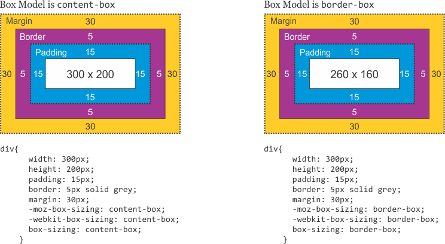
</p>

<div align="right">
    <b><a href="#">↥ back to top</a></b>
</div>

## Q. What is the purpose of the box-sizing property?

<p align="center">
  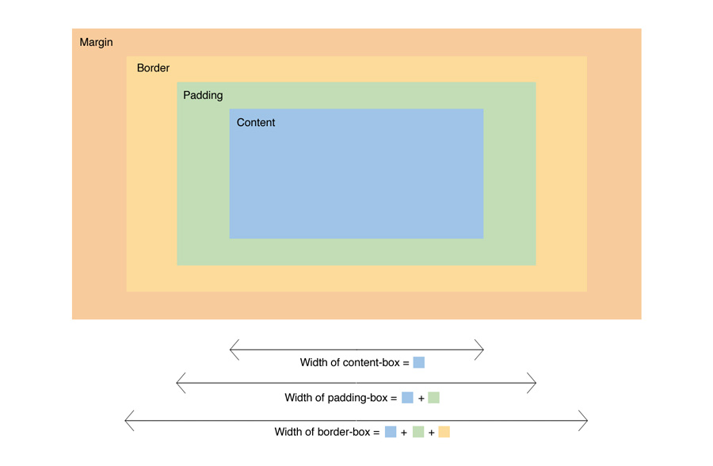
</p>

The box-sizing CSS property sets how the total width and height of an element is calculated.

* **content-box**: the default width and height values apply to the element\'s content only. The padding and border are added to the outside of the box.
* **padding-box**: Width and height values apply to the element\'s content and its padding. The border is added to the outside of the box. Currently, only Firefox supports the padding-box value.
* **border-box**: Width and height values apply to the content, padding, and border.
* **inherit**: inherits the box sizing of the parent element.

**Example:**

```css
box-sizing: content-box;
width: 100%;
border: solid rgb(90,107,204) 10px;
padding: 5px;
```

<div align="right">
    <b><a href="#">↥ back to top</a></b>
</div>

## Q. What does  `* { box-sizing: border-box; }` do? What are its advantages?

* Make every element in the document include the padding and border in the element\'s inner dimensions; 
making it easier to reason about the layout of elements on the page.
* By default, elements have `box-sizing: content-box` applied, and only the content size is being accounted for.
* `box-sizing: border-box` changes how the `width` and `height` of elements are being calculated, `border` and `padding` are also being included in the calculation.
* The `height` of an element is now calculated by the content\'s `height` + vertical `padding` + vertical `border` width.
* The `width` of an element is now calculated by the content\'s `width` + horizontal `padding` + horizontal `border` width.
* Taking into account `padding`s and `border`s as part of our box model resonates better with how designers actually imagine content in grids.

<div align="right">
    <b><a href="#">↥ back to top</a></b>
</div>

## Q. What is the difference between padding and margin?

**1) Margin** is applied to the outside of you element hence effecting how far your element is away from other elements.  
**2) Padding** is applied to the inside of your element hence effecting how far your element\'s content is away from the border.

Also, using margin will not affect your element\'s dimensions whereas padding will make your elements dimensions (set height + padding) so for example if you have a 100x100px div with a 5 px padding, your div will actually be 105x105px

<p align="center">
  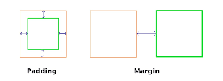
</p>

*Note:* **Top/Bottom margins are collapsible:** if you have a 20px margin at the bottom of an element and a 30px margin at the top of the next element, the margin between the two elements will be 30px rather than 50px. This does not apply to left/right margin or padding.

<div align="right">
    <b><a href="#">↥ back to top</a></b>
</div>

## # 3. SELECTORS & SPECIFICITY

<br/>

## Q. What are the css selectors?

A CSS selector is the part of a CSS rule set that actually selects the content you want to style.

**i) Universal Selector**: The universal selector works like a wild card character, selecting all elements on a page. Every HTML page is built on content placed within HTML tags. Each set of tags represents an element on the page.

```css
* {
   color: green;
   font-size: 20px;
   line-height: 25px;
}
```

**ii) Element Type Selector**: This selector match one or more HTML elements of the same name.

```css
ul {
   list-style: none;
   border: solid 1px #ccc;
}
```

```html
<ul>
  <li>Fish</li>
  <li>Apples</li>
  <li>Cheese</li>
</ul>

<div class="example">
  <p>Example paragraph text.</p>
</div>

<ul>
  <li>Water</li>
  <li>Juice</li>
  <li>Maple Syrup</li>
</ul>
```

**iii) ID Selector**: This selector matches any HTML element that has an ID attribute with the same value as that of the selector.

```css
#container {
   width: 960px;
   margin: 0 auto;
}
```

```html
<div id="container"></div>
```

**iv) Class Selector**: The class selector also matches all elements on the page that have their class attribute set to the same value as the class.

```css
.box {
   padding: 20px;
   margin: 10px;
   width: 240px;
}
```

```html
<div class="box"></div>
```

**v) Descendant Combinator**: The descendant selector or, more accurately, the descendant combinator lets you combine two or more selectors so you can be more specific in your selection method.

```css
#container .box {
   float: left;
   padding-bottom: 15px;
}
```

This declaration block will apply to all elements that have a class of box that are inside an element with an ID of `container`. It\'s worth noting that the `.box` element doesn\'t have to be an immediate child: there could be another element wrapping `.box`, and the styles would still apply.

```html
<div id="container">
  <div class="box"></div>

  <div class="box-2"></div>
</div>

<div class="box"></div>
```

**vi) Child Combinator**: A selector that uses the child combinator is similar to a selector that uses a descendant combinator, except it only targets immediate child elements.

```css
#container > .box {
   float: left;
   padding-bottom: 15px;
}
```

The selector will match all elements that have a class of `box` and that are immediate children of the `#container` element. That means, unlike the descendant combinator, there can\'t be another element wrapping `.box`—it has to be a direct child element.

```html
<div id="container">
  <div class="box"></div>

  <div>
    <div class="box"></div>
  </div>
</div>
```

**vii) General Sibling Combinator**: A selector that uses a general sibling combinator matches elements based on sibling relationships. The selected elements are beside each other in the HTML.

```css
h2 ~ p {
   margin-bottom: 20px;
}
```

In this example, all paragraph elements (`<p>`) will be styled with the specified rules, but only if they are siblings of `<h2>` elements. There could be other elements in between the `<h2>` and `<p>`, and the styles would still apply.

```html
<h2>Title</h2>
<p>Paragraph example.</p>
<p>Paragraph example.</p>
<p>Paragraph example.</p>
<div class="box">
  <p>Paragraph example.</p>
</div>
```

**viii) Adjacent Sibling Combinator**: A selector that uses the adjacent sibling combinator uses the plus symbol (+), and is almost the same as the general sibling selector. The difference is that the targeted element must be an immediate sibling, not just a general sibling.

```css
p + p {
   text-indent: 1.5em;
   margin-bottom: 0;
}
```

In this example will apply the specified styles only to paragraph elements that immediately follow other paragraph elements. This means the first paragraph element on a page would not receive these styles. Also, if another element appeared between two paragraphs, the second paragraph of the two wouldn\'t have the styles applied.

```html
<h2>Title</h2>
<p>Paragraph example.</p>
<p>Paragraph example.</p>
<p>Paragraph example.</p>

<div class="box">
  <p>Paragraph example.</p>
  <p>Paragraph example.</p>
</div>
```

**ix) Attribute Selector**: The attribute selector targets elements based on the presence and/or value of HTML attributes, and is declared using square brackets

```css
input[type="text"] {
   background-color: #444;
   width: 200px;
}
```

```html
<input type="text">
```

The attribute selector can also be declared using just the attribute itself, with no value, like this:

```css
input[type] {
   background-color: #444;
   width: 200px;
}
```

**x) Pseudo-class**: A pseudo-class uses a colon character to identify a pseudo-state that an element might be in—for example, the state of being hovered, or the state of being activated.

```css
a:hover {
   color: red;
}
```

**xi) Pseudo-element**: A CSS pseudo-element is used to style specified parts of an element. For example, it can be used to:

* Style the first letter, or line, of an element
* Insert content before, or after, the content of an element 

```html
<!DOCTYPE html>
<html>
  <head>
    <style>
      p::first-line {
        color: #ff0000;
        font-variant: small-caps;
      }

      p::first-letter {
        color: #ff0000;
        font-size: xx-large;
      }

      h1::before {
        content: url(smiley.gif);
      }

      h1::after {
        content: url(smiley.gif);
      }

      ::selection {
        color: red;
        background: yellow;
      }
    </style>
  </head>
<body>
  <p>Lorem Ipsum is simply dummy text of the printing and typesetting industry.
  Lorem Ipsum has been the industry\'s standard dummy text ever since the 1500s,
  <h1>when an unknown printer took a galley of type and scrambled it to make a
  type specimen book.<h1></p>
</body>
</html>
```

**Live Demo**: [CSS Selectors](https://learning-zone.github.io/css-interview-questions/assets/files/selector.html)

<div align="right">
    <b><a href="#">↥ back to top</a></b>
</div>

## Q. What is contextual selector?

A **contextual selector** targets an element only when it appears within a specific context (ancestor). It\'s a string of selectors separated by whitespace, where only the last element is styled — but only if it matches the specified ancestral path.

**Example:**

```css
table p { color: red; }
```

This styles `<p>` elements only when they are descendants of a `<table>` — not all `<p>` elements on the page.

<div align="right">
    <b><a href="#">↥ back to top</a></b>
</div>

## Q. What is the difference between Pseudo-classes and pseudo-elements?

A pseudo-class is a selector that assists in the selection of something that cannot be expressed by a simple selector, for example `:hover`. A pseudo-element however allows us to create items that do not normally exist in the document tree, for example `::after`.

**Pseudo-classes:**  

Pseudo-classes select regular elements but under certain conditions, like when their position relative to siblings or when they\'re under a particular state. Here is a list of pseudo-classes in CSS3:

**a) Dynamic pseudo-classes:**  

* :link
* :visited
* :hover
* :active
* :focus

**b) UI element states pseudo-classes:**  

* :enabled
* :disabled
* :checked

**c) Structural pseudo-classes:**  

* :first-child
* :nth-child(n)
* :nth-last-child(n)
* :nth-of-type(n)
* :nth-last-of-type(n)
* :last-child
* :first-of-type
* :last-of-type
* :only-child
* :only-of-type
* :root
* :empty

**d) Other pseudo-classes:**  

:not(x)
:target
:lang(language)

**Pseudo-elements:**  

Pseudo-elements effectively create new elements that are not specified in the markup of the document and can be manipulated much like a regular element. 

* ::before
* ::after
* ::first-letter
* ::first-line
* ::selection

<div align="right">
    <b><a href="#">↥ back to top</a></b>
</div>

## Q. What is Combinator selector?

A combinator is the character in a selector that connects two selectors together. There are four types of combinators. 

**a) Descendant Combinator (space)**: The descendant selector matches all elements that are descendants of a specified element.

The following example selects all `<p>` elements inside `<div>` elements:

```css
div p {
  background-color: yellow;
}
```

**b) Child Combinator (>)**: The child selector selects all elements that are the children of a specified element.

The following example selects all `<p>` elements that are children of a `<div>` element:

```css
div > p {
  background-color: yellow;
}
```

**c) Adjacent Sibling Combinator (+)**: The adjacent sibling selector selects all elements that are the adjacent siblings of a specified element.

The following example selects all `<p>` elements that are placed immediately after `<div>` elements:

```css
div + p {
  background-color: yellow;
}
```

**d) General Sibling Combinator (~)**: The general sibling selector selects all elements that are siblings of a specified element.

The following example selects all `<p>` elements that are siblings of `<div>` elements:

```css
div ~ p {
  background-color: yellow;
}
```

<div align="right">
    <b><a href="#">↥ back to top</a></b>
</div>

## Q. What is the difference between class selectors and id selectors?

In the CSS, a class selector is a name preceded by a full stop (".") and an ID selector is a name preceded by a hash character ("#"). The difference between an ID and a class is that an ID can be used to identify one element, whereas a class can be used to identify more than one.

```css
#top {
    background-color: #ccc;
    padding: 20px
}

.intro {
    color: red;
    font-weight: bold;
}
```

```html
<div id="top">
  <h1>Welcome to the CSS3 Tutorial</h1>
  <p class="intro">Select element by class</p>
  <p class="intro">Example for class selector paragraph</p>
</div>
```

<div align="right">
    <b><a href="#">↥ back to top</a></b>
</div>

## Q. What is the difference between the "nth-child()" and "nth-of-type()" selectors?

The `nth-child()` pseudo-class is used to match an element based on a number, which represents the element\'s position amongst it\'s siblings. More specifically, the number represents the number of siblings that exist before the element in the document tree (minus 1).

**Example:**

```css
.example :nth-child(4) { background: #ffdb3a; }
```

```html
<div class="example">
  <p>This is a <em>paragraph</em>.</p>
  <p>This is a <em>paragraph</em>.</p>
  <p>This is a <em>paragraph</em>.</p>
  <div>This is a <em>divider</em>.</div> <!-- Element to select -->
  <div>This is a <em>divider</em>.</div> 
</div>
```

The `nth-of-type()` pseudo-class, like nth-child(), is used to match an element based on a number. This number, however, represents the element\'s position within only those of its siblings that are of the same element type.

This number can also be expressed as a function, or using the keywords even or odd.

```css
.example p:nth-of-type(odd) { background: #ffdb3a; }
```

```html
<div class="example">
  <p>This is a <em>paragraph</em>.</p> <!-- Element to select -->
  <p>This is a <em>paragraph</em>.</p>
  <p>This is a <em>paragraph</em>.</p> <!-- Element to select -->
  <div>This is a <em>divider</em>.</div>
  <div>This is a <em>divider</em>.</div> <!-- Element to select -->
</div>
```

<div align="right">
    <b><a href="#">↥ back to top</a></b>
</div>

## Q. What is specificity?

**Specificity** is the algorithm browsers use to determine which CSS rule takes precedence when multiple rules target the same element.

**Specificity Hierarchy (lowest → highest)**

| Selector Type | Example | Value |
|---------------|---------|-------|
| Universal selector | `*` | 0 |
| Element / pseudo-element | `h1`, `::before` | 0-0-1 |
| Class / attribute / pseudo-class | `.box`, `[type]`, `:hover` | 0-1-0 |
| ID selector | `#header` | 1-0-0 |
| Inline style | `style="..."` | Always wins |
| `!important` | `color: red !important` | Overrides all |

**Key Rules**

- **Higher specificity wins**, regardless of order.
- If specificity is **equal**, the **last rule** declared wins.
- A **class** beats any number of element selectors:

  ```css
  .intro {}              /* wins */
  html body div div p {} /* loses */
  ```
- **ID** beats any number of classes:
  ```css
  #main { color: red; }       /* wins */
  .box.card.active { color: blue; } /* loses */
  ```

**Example**

```css
a#nav-link.active:hover { color: red; }
/* ID=1, Class=2 (active + hover), Element=1 → specificity: 1-2-1 */
```

<div align="right">
    <b><a href="#">↥ back to top</a></b>
</div>

## Q. In CSS3, how would you select?

* Every ```<a>``` element whose href attribute value begins with "https".

```css
  a[href^="https"]
```
    
* Every ```<a>``` element whose href attribute value ends with ".pdf".

```css
  a[href$=".pdf"]
```
    
* Every ```<a>``` element whose href attribute value contains the substring "css".

```css
  a[href*="css"]
```

<div align="right">
    <b><a href="#">↥ back to top</a></b>
</div>

## # 4. POSITIONING

<br/>

## Q. Explain CSS position Property?

<p align="center">
  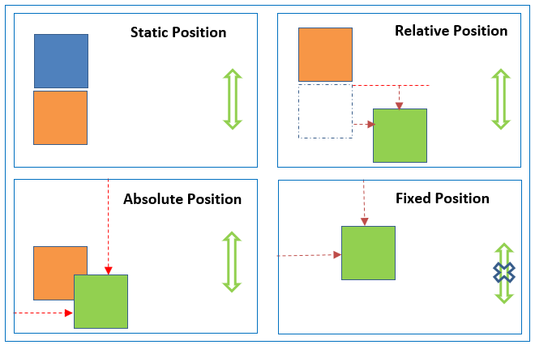
</p>

* **absolute**, place an element exactly where you want to place it. absolute position is actually set relative to the element\'s parent. if no parent available then relatively place to the page itself (it will default all the way back up to the <html> element).

* **relative**, means "relative to itself". Setting position: relative; on an element and no other positioning attributes, it will no effect on it\'s positioning. It allows the use of `z-index` on the element and it limits the scope of absolutely positioned child elements. Any child element will be absolutely positioned within that block.

* **fixed**, element is positioned relative to viewport or the browser window itself. viewport doesn\'t changed if you scroll and hence fixed element will stay right in the same position.

* **static** default for every single page element. The only reason you would ever set an element to position: static is to forcefully-remove some positioning that got applied to an element outside of your control.

* **sticky** - Sticky positioning is a hybrid of relative and fixed positioning. The element is treated as `relative` positioned until it crosses a specified threshold, at which point it is treated as `fixed` positioned.

**Live Demo**: [CSS Position Property](https://learning-zone.github.io/css-interview-questions/assets/files/position-index.html)

<div align="right">
    <b><a href="#">↥ back to top</a></b>
</div>

## Q. What are the differences between relative and absolute in CSS?

**Relative Position**

An element with `position: relative;` is positioned relative to its normal position.

Setting the top, right, bottom, and left properties of a relatively-positioned element will cause it to be adjusted away from its normal position. Other content will not be adjusted to fit into any gap left by the element.

<p align="center">
  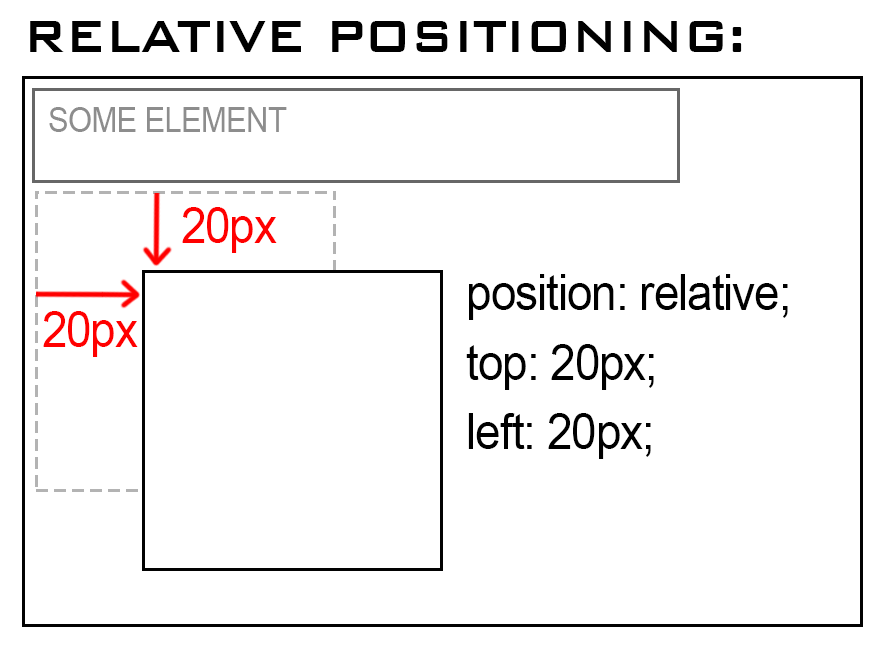
</p>

**Example:**

```html
<!DOCTYPE html>
<html>
<head>
  <title>Relative Position</title>
  <style>
    div.relative {
      position: relative;
      top: 20px;
      left: 20px;
      border: 3px solid #2321ad;
    }
  </style>
</head>
<body>
    <h2>position: relative;</h2>
    <p>An element with position: relative; is positioned relative to its normal position:</p>

    <div class="relative">
        This div element has position: relative;
    </div>
</body>
</html>
```

**Live Demo**: [Relative Position Property](https://learning-zone.github.io/css-interview-questions/assets/files/relative-position.html)

**Absolute Position:**

An element with `position: absolute;` will cause it to adjust its position with respect to its parent. If no parent is present, then it uses the document body as parent.

<p align="center">
  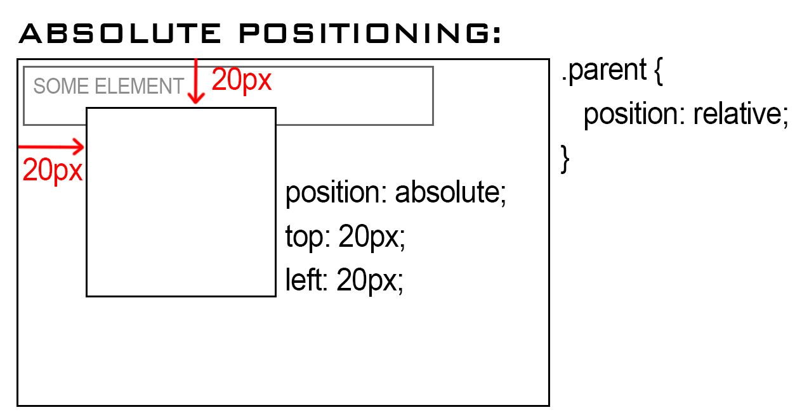
</p>

**Example:**

```html
<!DOCTYPE html>
<html>
<head>
  <title>Absolute Position</title>
  <style>
    div.relative {
      position: relative;
      width: 400px;
      height: 200px;
      border: 3px solid #2321ad;
    }  

    div.absolute {
      position: absolute;
      top: 80px;
      right: 0;
      width: 200px;
      height: 100px;
      border: 3px solid #ee0b0b;
    }
  </style>
</head>
<body>
    <h2>position: absolute;</h2>

    <p>An element with position: absolute; is positioned relative to the nearest positioned ancestor 
      (instead of positioned relative to the viewport, like fixed):</p>

    <div class="relative">This div element has position: relative;
        <div class="absolute">This div element has position: absolute;</div>
    </div>
</body>
</html>
```

**Live Demo**: [Absolute Position Property](https://learning-zone.github.io/css-interview-questions/assets/files/absolute-position.html)

<div align="right">
    <b><a href="#">↥ back to top</a></b>
</div>

## Q. What are the CSS positioning?

|Keyword    | Value  |Description   |
|----------|----------------------|--------------------------|
|position 	|static 				|The default mode, block element is positioned in the flow. Top, left etc. are ignored.|
|position 	|relative 				|The block element is positioned relative to its position in the flow.                 |
|position 	|absolute 				|Block element is positioned relative to its container.                                |
|position 	|fixed 					|Block element is positioned relative to the window and won\'t scroll.                  |
|top 		|Number [px, cm, in…] 	|Positions the block down from the reference point at the specified distance.          |
|bottom 	|Number [px, cm, in…] 	|Positions the block up from the reference point at the specified distance.            |
|left 		|Number [px, cm, in…] 	|Positions the block right from the reference point at the specified distance.         |
|right 		|Number [px, cm, in…] 	|Positions the block left from the reference point at the specified distance.          |

<div align="right">
    <b><a href="#">↥ back to top</a></b>
</div>

## Q. What are all the ways to center an element horizontally and vertically in CSS?

Centering is one of the most common CSS interview tasks. The best approach depends on context.

**1. Flexbox (most common, recommended):**

```css
.parent {
  display: flex;
  justify-content: center; /* horizontal */
  align-items: center;     /* vertical */
}
```

**2. CSS Grid:**

```css
.parent {
  display: grid;
  place-items: center; /* shorthand for align-items + justify-items */
}
```

**3. Absolute positioning + `transform` (does not require knowing dimensions):**

```css
.parent { position: relative; }

.child {
  position: absolute;
  top: 50%;
  left: 50%;
  transform: translate(-50%, -50%);
}
```

**4. Absolute positioning + `inset` + `margin: auto` (modern, clean):**

```css
.parent { position: relative; }

.child {
  position: absolute;
  inset: 0;          /* top: 0; right: 0; bottom: 0; left: 0 */
  margin: auto;
  width: 200px;      /* must have explicit dimensions */
  height: 100px;
}
```

**5. `margin: auto` for horizontal centering of block elements:**

```css
.child {
  width: 300px;
  margin: 0 auto; /* horizontally centers a block element */
}
```

**6. `text-align: center` for inline/inline-block children:**

```css
.parent {
  text-align: center;
}
.child {
  display: inline-block;
}
```

**7. CSS `table-cell` technique (legacy):**

```css
.parent {
  display: table-cell;
  vertical-align: middle;
  text-align: center;
}
```

| Technique | Horizontal | Vertical | Notes |
|-----------|:----------:|:--------:|-------|
| Flexbox | ✅ | ✅ | Best for most cases |
| Grid `place-items` | ✅ | ✅ | Cleaner shorthand |
| Absolute + transform | ✅ | ✅ | Works without known size |
| Absolute + inset + margin | ✅ | ✅ | Needs explicit width/height |
| `margin: auto` | ✅ | ❌ | Block elements only |
| `text-align: center` | ✅ | ❌ | Inline children only |

<div align="right">
    <b><a href="#">↥ back to top</a></b>
</div>

## Q. How does `position: sticky` work and what are its common pitfalls?

`position: sticky` is a hybrid between `relative` and `fixed`. The element is positioned relative to the normal flow until it crosses a specified threshold (e.g., `top: 0`), at which point it "sticks" and behaves like `position: fixed` **within its scroll container**.

```css
.sticky-header {
  position: sticky;
  top: 0;          /* sticks when it reaches the top of the viewport */
  z-index: 100;
  background: white;
}
```

**How it differs from `position: fixed`:**

| Feature | `sticky` | `fixed` |
|---------|----------|---------|
| Stays in document flow | **Yes** — occupies original space | No — removed from flow |
| Constrained to parent | **Yes** — stops sticking when parent scrolls away | No — always relative to viewport |
| Needs offset property | Yes (`top`, `left`, etc.) | Yes |

**Common pitfalls:**

1. **`overflow: hidden` or `overflow: auto` on an ancestor breaks sticky.** The sticky element scrolls with the overflow container, not the viewport.

```css
/* ❌ This breaks sticky */
.parent { overflow: hidden; }
.child  { position: sticky; top: 0; }

/* ✅ Fix: remove overflow from the ancestor or use overflow: clip */
.parent { overflow: clip; } /* clip does not create a scroll container */
```

2. **No explicit offset set** — `position: sticky` with no `top`/`bottom`/`left`/`right` behaves like `relative`.

3. **Parent is not taller than the child** — sticking requires the parent to be scrollable past the child.

4. **Missing `z-index`** — sticky elements may be covered by sibling elements that follow in the DOM.

```css
/* Sticky table headers */
thead th {
  position: sticky;
  top: 0;
  background: #fff;
  z-index: 1;
}
```

<div align="right">
    <b><a href="#">↥ back to top</a></b>
</div>

## # 5. FLEXBOX

<br/>

## Q. What is CSS flexbox?

The Flexible Box Layout Module, makes it easier to design flexible responsive layout structure without using float or positioning. Flexbox makes it simple to align items vertically and horizontally using rows and columns. Items will "flex" to different sizes to fill the space.

Before the Flexbox Layout module, there were four layout modes:

* **Block**, for sections in a webpage
* **Inline**, for text
* **Table**, for two-dimensional table data
* **Positioned**, for explicit position of an element

**Flex Container:**

An area of a document laid out using flexbox is called a **flex container**. To create a flex container, we set the value of the area\'s container\'s `display` property to `flex` or `inline-flex`. As soon as we do this the direct children of that container become **flex items**.

**Flexbox Terminology:**

<p align="center">
  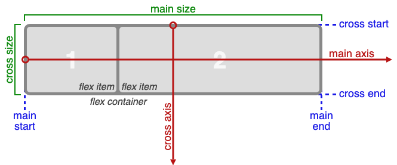
</p>

<div align="right">
    <b><a href="#">↥ back to top</a></b>
</div>

## Q. Write all the properties of the flexbox?

**The CSS Flexbox Container Properties:**

|Property        |Values                                                            |
|----------------|------------------------------------------------------------------|
|display:        |flexbox, inline-flex;|
|flex-direction: |row, row-reverse, column, column-reverse;|
|flex-wrap:      |nowrap, wrap, wrap-reverse;|
|flex-flow:      |<‘flex-direction’>, <‘flex-wrap’>|
|justify-content:|flex-start, flex-end, center, space-between, space-around;|
|align-items:    |flex-start, flex-end, center, baseline, stretch;|
|align-content:  |flex-start, flex-end, center, space-between, space-around, stretch;|

**The CSS Flexbox Properties:**

|Property        |Values                                                  |
|----------------|--------------------------------------------------------|
|order:          |`<integer>`;                        |
|flex-grow:      |`<number>`; /* default 0 */         |
|flex-shrink:    |`<number>`; /* default 1 */         |
|flex-basis:     |`<length>`, auto; /* default auto */|
|flex:           |none, [ <'flex-grow'> <'flex-shrink'>? || <'flex-basis'> ]|
|align-self:     |auto, flex-start, flex-end, center, baseline, stretch;|

**Example:**

```html
<!DOCTYPE html>
<html>
<head>
    <title>The flex-direction Property</title>
    <style>
        .flex-container {
            display: flex;
            flex-direction: column;
            background-color: DodgerBlue;
        }

        .flex-container>div {
            background-color: #f1f1f1;
            width: 100px;
            margin: 10px;
            text-align: center;
            line-height: 75px;
            font-size: 30px;
        }
    </style>
</head>
<body>
    <h1>The flex-direction Property</h1>
    <p>The "flex-direction: column;" stacks the flex items vertically (from top to bottom):</p>

    <div class="flex-container">
        <div>1</div>
        <div>2</div>
        <div>3</div>
    </div>
</body>
</html>
```

**Live Demo**: [flex-direction Property](https://learning-zone.github.io/css-interview-questions/assets/files/flexbox.html)

<div align="right">
    <b><a href="#">↥ back to top</a></b>
</div>

## Q. What is the difference between `flex-grow`, `flex-shrink`, and `flex-basis`?

These three properties control how a flex item sizes itself relative to the available space in the flex container. The `flex` shorthand combines all three.

| Property | Default | Description |
|----------|---------|-------------|
| `flex-grow` | `0` | How much the item **grows** relative to others when extra space is available |
| `flex-shrink` | `1` | How much the item **shrinks** relative to others when space is insufficient |
| `flex-basis` | `auto` | The **initial main size** of the item before growing/shrinking |

**`flex-grow` example:**

```css
.container { display: flex; width: 600px; }

.item-a { flex-grow: 1; }  /* takes 1/3 of extra space */
.item-b { flex-grow: 2; }  /* takes 2/3 of extra space */
.item-c { flex-grow: 0; }  /* does NOT grow (default) */
```

If all items have `flex-grow: 1`, they share the container equally. If one has `flex-grow: 2`, it gets twice as much of the remaining space.

**`flex-shrink` example:**

```css
.container { display: flex; width: 400px; }

.item-a { width: 300px; flex-shrink: 1; } /* shrinks normally */
.item-b { width: 300px; flex-shrink: 3; } /* shrinks 3× as fast */
/* Total content = 600px, container = 400px → 200px overflow to distribute */
```

**`flex-basis` example:**

```css
.item { flex-basis: 200px; }  /* start size is 200px before grow/shrink */
.item { flex-basis: 0; }      /* size starts at 0; all space from grow/shrink */
.item { flex-basis: auto; }   /* use the item\'s width/height (default) */
```

**The `flex` shorthand:**

```css
/* flex: <flex-grow> <flex-shrink> <flex-basis> */
.item { flex: 1 1 auto; }   /* can grow and shrink, starts at auto size */
.item { flex: 1; }          /* shorthand for: 1 1 0 (equal sizing) */
.item { flex: none; }       /* shorthand for: 0 0 auto (no grow, no shrink) */
.item { flex: auto; }       /* shorthand for: 1 1 auto */
```

> **`flex: 1` vs `flex: 1 1 auto`:** `flex: 1` sets `flex-basis: 0`, so items split the container total evenly. `flex: 1 1 auto` uses the item\'s intrinsic size as a starting point.

<div align="right">
    <b><a href="#">↥ back to top</a></b>
</div>

## Q. What is the difference between `align-items`, `align-content`, `align-self`, and `justify-content` in Flexbox?

These properties control alignment along the **cross axis** (align-*) and **main axis** (justify-*).

| Property | Applies to | Axis | What it aligns |
|----------|-----------|------|----------------|
| `justify-content` | Container | Main axis | All items as a group |
| `align-items` | Container | Cross axis | Items in a **single** line |
| `align-content` | Container | Cross axis | **Multiple lines** (only when `flex-wrap` is active) |
| `align-self` | Individual item | Cross axis | Overrides `align-items` for that one item |
| `justify-self` | Individual item | Main axis | Not supported in Flexbox (use `margin: auto`) |

**`align-items` vs `align-content`:**

```css
/* align-items: controls how items align within their row */
.container {
  display: flex;
  flex-wrap: wrap;
  align-items: center;    /* centres items vertically within each row */
}

/* align-content: controls how rows align within the container */
.container {
  display: flex;
  flex-wrap: wrap;
  height: 400px;
  align-content: space-between; /* distributes rows vertically with space */
}
```

**`align-self` overriding `align-items`:**

```css
.container {
  display: flex;
  align-items: flex-start; /* default for all children */
}

.special {
  align-self: flex-end;    /* this one item overrides to bottom */
}
```

**Centering with `margin: auto` (justify-self workaround):**

```css
.container { display: flex; }

/* Push last item to the far right (main-axis auto margin) */
.push-right { margin-left: auto; }
```

<div align="right">
    <b><a href="#">↥ back to top</a></b>
</div>

## # 6. CSS GRID

<br/>

## Q. Explain CSS grid layout with example?

CSS Grid Layout excels at dividing a page into major regions or defining the relationship in terms of size, position, and layer, between parts of a control built from HTML primitives. Like tables, grid layout enables us to align elements into columns and rows.

**Basic Terminology:**

<p align="center">
  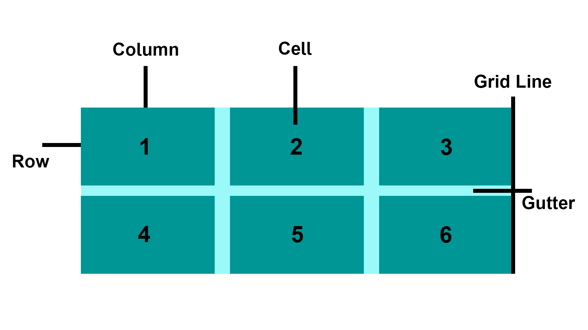
</p>

* **Grid Item**: The grid container contains the grid items.
* **Grid Line**: The grid line is either a vertical or horizontal grid line that makes up the structure of the grid.
* **Grid Cell**: The smallest unit on a grid is referred to as a Grid cell. It is the space between the two adjacent rows and columns.
* **Rows**: The grid row is the horizontal track of the grid.
* **Columns**: The grid column is the vertical track of the grid.
* **Gutter**: A gutter is a space between the rows and columns in the grid.

**CSS Grid Properties:**

|Property         |Description                       |
|-----------------|----------------------------------|
|column-gap	      |Specifies the gap between the columns|
|gap	            |A shorthand property for the row-gap and the column-gap properties|
|grid	            |A shorthand property for the grid-template-rows, grid-template-columns, grid-template-areas, grid-auto-rows, grid-auto-columns, and the grid-auto-flow properties|
|grid-area	      |Either specifies a name for the grid item, or this property is a shorthand property for the grid-row-start, grid-column-start, grid-row-end, and grid-column-end properties|
|grid-auto-columns|Specifies a default column size|
|grid-auto-flow	  |Specifies how auto-placed items are inserted in the grid|
|grid-auto-rows	  |Specifies a default row size|
|grid-column	    |A shorthand property for the grid-column-start and the grid-column-end properties|
|grid-column-end	|Specifies where to end the grid item|
|grid-column-gap	|Specifies the size of the gap between columns|
|grid-column-start|Specifies where to start the grid item|
|grid-gap	        |A shorthand property for the grid-row-gap and grid-column-gap properties|
|grid-row	        |A shorthand property for the grid-row-start and the grid-row-end properties|
|grid-row-end	    |Specifies where to end the grid item|
|grid-row-gap	    |Specifies the size of the gap between rows|
|grid-row-start	  |Specifies where to start the grid item|
|grid-template	  |A shorthand property for the grid-template-rows, grid-template-columns and grid-areas properties|
|grid-template-areas|Specifies how to display columns and rows, using named grid items|
|grid-template-columns	|Specifies the size of the columns, and how many columns in a grid layout|
|grid-template-rows	    |Specifies the size of the rows in a grid layout|
|row-gap	         |Specifies the gap between the grid rows|

**Example:**

```html
<!DOCTYPE html>
<html>
<head>
  <title>Grid Layout</title>
  <style>
    .item1 {
        grid-area: header;
    }

    .item2 {
        grid-area: menu;
    }

    .item3 {
        grid-area: main;
    }

    .item4 {
        grid-area: right;
    }

    .item5 {
        grid-area: footer;
    }

    .grid-container {
        display: grid;
        grid-template-areas:
            'header header header header header header'
            'menu main main main right right'
            'menu footer footer footer footer footer';
        grid-gap: 10px;
        background-color: rgba(155, 249, 249);
        padding: 10px;
    }

    .grid-container>div {
        background-color: rgba(0, 150, 149);
        text-align: center;
        padding: 20px 0;
        font-size: 30px;
    }
  </style>
  </head>
<body>
  <h1>Grid Layout</h1>
  <p>This grid layout contains six columns and three rows:</p>

  <div class="grid-container">
    <div class="item1">Header</div>
    <div class="item2">Menu</div>
    <div class="item3">main</div>
    <div class="item4">Right</div>
    <div class="item5">Footer</div>
  </div>
</body>
</html>
```

**Live Demo**: [Grid Layout](https://learning-zone.github.io/css-interview-questions/assets/files/grid-layout.html)

<div align="right">
    <b><a href="#">↥ back to top</a></b>
</div>

## Q. When to use css grid and flexbox?

* CSS Grid Layout is a **two-dimensional** system, meaning it can handle both columns and rows, unlike flexbox which is largely a **one-dimensional** system (either in a column or a row).
* A core difference between CSS Grid and Flexbox is that — CSS Grid\'s approach is **layout-first** while Flexbox’ approach is **content-first**. If you are well aware of your content before making layout, then blindly opt for Flexbox and if not, opt for CSS Grid.
* Flexbox layout is most appropriate to the components of an application (as most of them are fundamentally linear), and **small-scale** layouts, while the Grid layout is intended for **larger-scale** layouts which aren\'t linear in their design.
* If you only need to define a layout as a row or a column, then you probably need flexbox. If you want to define a grid and fit content into it in two dimensions — you need the grid.

<p align="center">
  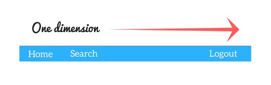
  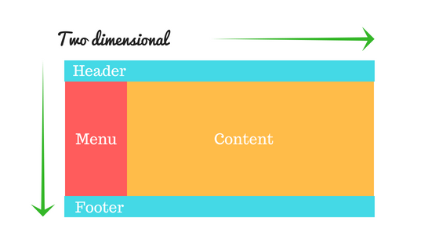
</p>

**Example:**

```html
<!DOCTYPE html>
<html>
  <head>
    <title>Grid vs Flexbox Layout</title>
  </head>
  <style>
    /* Grid layout */
    .row {
        display: grid;
        grid-template-columns: auto auto auto;
        background-color: #2196f3;
        padding: 5px;
    }

    .col-item {
        background-color: rgba(255, 255, 255, 0.8);
        border: 1px solid rgba(0, 0, 0, 0.8);
        padding: 10px;
        font-size: 30px;
        text-align: center;
    }

    /* Flexbox layout */
    .wrapper {
        border: 2px solid #f76707;
        border-radius: 5px;
        background-color: #fff4e6;
    }

    .wrapper > div {
        border: 2px solid #ffa94d;
        border-radius: 5px;
        background-color: #ffd8a8;
        padding: 1em;
        color: #d9480f;
    }

    .wrapper {
        display: flex;
        width: 500px;
        flex-wrap: wrap;
    }

    .wrapper > div {
        flex: 1 1 150px;
    }
  </style>
  <body>
    <p><h1>Grid Layout Example<hr/></h1></p>
    <div class="row">
        <div class="col-item">Column - 1</div>
        <div class="col-item">Column - 2</div>
        <div class="col-item">Column - 3</div>
        <div class="col-item">Column - 1</div>
        <div class="col-item">Column - 2</div>
        <div class="col-item">Column - 3</div>
        <div class="col-item">Column - 1</div>
        <div class="col-item">Column - 2</div>
        <div class="col-item">Column - 3</div>
    </div>

    <p><h1><br/>Flexbox Layout Example<hr/></h1></p>
    <div class="wrapper">
        <div>One</div>
        <div>Two</div>
        <div>Three</div>
        <div>Four</div>
        <div>Five</div>
    </div>
  </body>
</html>
```

**Live Demo**: [CSS Grid and flexbox](https://learning-zone.github.io/css-interview-questions/assets/files/grid-flexbox-layout.html)

<div align="right">
    <b><a href="#">↥ back to top</a></b>
</div>

## Q. What is the difference between `auto-fill` and `auto-fit` in CSS Grid?

Both are used with `repeat()` and `minmax()` to create **intrinsically responsive grids** without media queries. The difference lies in how they handle empty tracks.

| Feature | `auto-fill` | `auto-fit` |
|---------|-------------|------------|
| Empty columns | Kept — adds extra empty tracks to fill the row | **Collapsed** to 0 width |
| Items stretch to fill row | No | **Yes** — existing items expand |
| Best for | Fixed-size item grids | Fluid grids where items should fill available space |

**`auto-fill` example:**

```css
.grid {
  display: grid;
  grid-template-columns: repeat(auto-fill, minmax(200px, 1fr));
  gap: 1rem;
}
/* With 2 items in a 700px container: creates 3 columns — 2 filled, 1 empty */
```

**`auto-fit` example:**

```css
.grid {
  display: grid;
  grid-template-columns: repeat(auto-fit, minmax(200px, 1fr));
  gap: 1rem;
}
/* With 2 items in a 700px container: 2 columns that stretch to fill the space */
```

**The `minmax()` function:**

`minmax(min, max)` defines a size range for a grid track. Tracks are at least `min` and at most `max`.

```css
/* Columns are at least 150px, grow to fill available space equally */
grid-template-columns: repeat(3, minmax(150px, 1fr));

/* A fully responsive grid — columns are at least 250px, never more than 1 equal fraction */
grid-template-columns: repeat(auto-fit, minmax(250px, 1fr));
```

**Real-world responsive card grid (no media queries needed):**

```css
.card-grid {
  display: grid;
  grid-template-columns: repeat(auto-fit, minmax(min(280px, 100%), 1fr));
  gap: 1.5rem;
}
```

> `min(280px, 100%)` prevents overflow on viewports narrower than 280px by capping the minimum at `100%`.

<div align="right">
    <b><a href="#">↥ back to top</a></b>
</div>

## Q. What is CSS Subgrid and what problem does it solve?

**Subgrid** (CSS Grid Level 2) allows a grid item that is itself a grid container to **inherit the track sizing of its parent grid** rather than define its own independent tracks. This solves the long-standing problem of aligning content across nested grid items.

**The problem without subgrid:**

```html
<div class="cards">        <!-- 3-column grid -->
  <div class="card">       <!-- each card is its own flex/grid, unaligned -->
    <h2>Title One</h2>
    <p>Short description</p>
    <button>Action</button>
  </div>
  <div class="card">
    <h2>Title Two With a Longer Name</h2>
    <p>A much longer description that wraps multiple lines and pushes the button down.</p>
    <button>Action</button>  <!-- buttons are misaligned across cards -->
  </div>
</div>
```

**Solution with subgrid:**

```css
/* Parent defines 3 columns */
.cards {
  display: grid;
  grid-template-columns: repeat(3, 1fr);
  gap: 1.5rem;
}

/* Each card spans all 3 rows of the parent grid\'s row tracks */
.card {
  display: grid;
  grid-row: span 3;               /* span 3 rows */
  grid-template-rows: subgrid;    /* inherit parent\'s row sizing */
  /* Now: title/description/button rows align perfectly across all cards */
}

.card h2      { align-self: start; }
.card p       { align-self: start; }
.card button  { align-self: end; margin-top: auto; }
```

**Browser support:** Chrome 117+, Firefox 71+, Safari 16+.

<div align="right">
    <b><a href="#">↥ back to top</a></b>
</div>

## Q. What is the `gap` property in CSS and how does it work in Flexbox and Grid?

`gap` (formerly `grid-gap`) sets the spacing between rows and columns in Grid and Flexbox containers. It does **not** add space on the outer edges.

**Syntax:**

```css
gap: <row-gap> <column-gap>;
gap: <both>;          /* same for row and column */
row-gap: 1rem;        /* vertical gaps */
column-gap: 2rem;     /* horizontal gaps */
```

**Grid:**

```css
.grid {
  display: grid;
  grid-template-columns: repeat(3, 1fr);
  gap: 1.5rem;           /* 1.5rem between rows AND columns */
  gap: 1rem 2rem;        /* 1rem row-gap, 2rem column-gap */
}
```

**Flexbox:**

```css
.flex {
  display: flex;
  flex-wrap: wrap;
  gap: 1rem;   /* space between flex items — much cleaner than margin hacks */
}
```

> **Key point:** `gap` works in both `flex` and `grid`. Before `gap` support in Flex (Chrome 84+, Firefox 63+), developers used `margin` on items, which required negative margins on the container to remove outer spacing. `gap` eliminates that hack.

<div align="right">
    <b><a href="#">↥ back to top</a></b>
</div>

## Q. Explain the usage of "table-layout" property?

The **table-layout** CSS property sets the algorithm used to lay out `<table>` cells, rows, and columns. 

**Syntax**

```css
table-layout: auto|fixed|initial|inherit;
```

**Property Values**

|Value          |Description          |
|---------------|---------------------|
|auto:          |It is used to set the automatic table layout on the browser. This property set the column width by unbreakable content in the cells.|
|fixed:         |It is used to set a fixed table layout. The table and column widths are set by the widths of table and col or by the width of the first row of cells. Cells in other rows do not affect column widths. If no widths are present on the first row, the column widths are divided equally across the table according to content of table.|
|initial:       |It is used to set its default value.|
|inherit:       |It is used to inherit the property from its parent.|

**Example:**

```html
<!DOCTYPE html>
<html>
  <head>
      <title>table-layout Property</title>
    <style>
      table {
        width: 100%; 
        table-layout: fixed;       
        border-collapse: collapse;
      } 

      th, td {
        padding: 8px;
        border: 1px solid #dee2e6;
      }

      th {
        height: 40px;
        text-align: left;
      }
    </style>
  </head>
<body>
<h2>table-layout Property</h2>
<table>
    <thead>
        <tr>
            <th>Row</th>
            <th>First Name</th>
            <th>Last Name</th>
            <th>Email</th>
        </tr>
    </thead>
    <tbody>
        <tr>
            <td>1</td>
            <td>Clark</td>
            <td>Kent</td>
            <td>clarkkent@mail.com</td>
        </tr>
        <tr>
            <td>2</td>
            <td>John</td>
            <td>Carter</td>
            <td>johncarter@mail.com</td>
        </tr>
        <tr>
            <td>3</td>
            <td>Peter</td>
            <td>Parker</td>
            <td>peterparker@mail.com</td>
        </tr>            
    </tbody>
</table>
</body>
</html>
```

**Live Demo**: [Table-layout Property](https://learning-zone.github.io/css-interview-questions/assets/files/table-layout.html)

*Note: The main benefit of `table-layout: fixed;` is that the table renders much faster. On large tables, users will not see any part of the table until the browser has rendered the whole table. So, if you use `table-layout: fixed`, users will see the top of the table while the browser loads and renders rest of the table. This gives the impression that the page loads a lot quicker!*

<div align="right">
    <b><a href="#">↥ back to top</a></b>
</div>

## # 7. PSEUDO-CLASSES & PSEUDO-ELEMENTS

<br/>

## Q. What is pseudo element and pseudo class?

**1. Pseudo Element**: A CSS pseudo-element is used to style specified parts of an element.

For example, it can be used to:

* Style the first letter, or line, of an element
* Insert content before, or after, the content of an element

**CSS Pseudo Elements:**  

|Sl.No|Selector	      |Example	        |description|
|-----|---------------|-----------------|-------------|
| 01. |::after	      |p::after	        |Insert something after the content of each <p> element|
| 02. |::before	      |p::before	      |Insert something before the content of each <p> element|
| 03. |::first-letter	|p::first-letter	|Selects the first letter of each <p> element|
| 04. |::first-line	  |p::first-line	  |Selects the first line of each <p> element|
| 05. |::selection	  |p::selection	    |Selects the portion of an element that is selected by a user|


**2. Pseudo-classes**: A pseudo-class is used to define a special state of an element.

For example, it can be used to:

* Style an element when a user mouses over it
* Style visited and unvisited links differently
* Style an element when it gets focus

**CSS Pseudo Classes:**  

| Sl.No |Selector	         | Example	              |description|
|-------|------------------|------------------------|-----------|
| 01.  |:active	           |a:active	              |Selects the active link|
| 02.  |:checked	         |input:checked	          |Selects every checked `<input>` element|
| 03.  |:disabled	         |input:disabled	        |Selects every disabled `<input>` element|
| 04.  |:empty	           |p:empty	                |Selects every `<p>` element that has no children|
| 05.  |:enabled	         |input:enabled	          |Selects every enabled `<input>` element|
| 06.  |:first-child	     |p:first-child	          |Selects every `<p>` elements that is the first child of its parent|
| 07.  |:first-of-type	   |p:first-of-type	        |Selects every `<p>` element that is the first `<p>` element of its parent|
| 08.  |:focus	           |input:focus	            |Selects the `<input>` element that has focus|
| 09.  |:hover	           |a:hover	                |Selects links on mouse over|
| 10.  |:in-range	         |input:in-range	        |Selects `<input>` elements with a value within a specified range|
| 11.  |:invalid	         |input:invalid	          |Selects all `<input>` elements with an invalid value|
| 12.  |:lang(language)	   |p:lang(it)	            |Selects every `<p>` element with a lang attribute value starting with "it"|
| 13.  |:last-child	       |p:last-child	          |Selects every `<p>` elements that is the last child of its parent|
| 14.  |:last-of-type	     |p:last-of-type	        |Selects every `<p>` element that is the last `<p>` element of its parent|
| 15.  |:link	             |a:link	                |Selects all unvisited links|
| 16.  |:not(selector)	   |:not(p)	                |Selects every element that is not a `<p>` element|
| 17.  |:nth-child(n)	     |p:nth-child(2)	        |Selects every `<p>` element that is the second child of its parent|
| 18.  |:nth-last-child(n) |p:nth-last-child(2)	    |Selects every `<p>` element that is the second child of its parent, |counting from the last child|
| 19.  |:nth-last-of-type(n) |p:nth-last-of-type(2)	|Selects every `<p>` element that is the second `<p>` element of its parent, counting from the last child|
| 20.  |:nth-of-type(n)	    |p:nth-of-type(2)	      |Selects every `<p>` element that is the second `<p>` element of its parent|
| 21.  |:only-of-type	      |p:only-of-type	        |Selects every `<p>` element that is the only `<p>` element of its parent|
| 22.  |:only-child	        |p:only-child	          |Selects every `<p>` element that is the only child of its parent|
| 23.  |:optional	          |input:optional	        |Selects `<input>` elements with no "required" attribute|
| 24.  |:out-of-range	      |input:out-of-range	    |Selects `<input>` elements with a value outside a specified range|
| 25.  |:read-only	        |input:read-only	      |Selects `<input>` elements with a "readonly" attribute specified|
| 26.  |:read-write	        |input:read-write	      |Selects `<input>` elements with no "readonly" attribute|
| 27.  |:required	          |input:required	        |Selects `<input>` elements with a "required" attribute specified|
| 28.  |:root	root	        |                       |Selects the document\'s root element|
| 29.  |:target	            |#news:target	          |Selects the current active #news element (clicked on a URL containing that anchor name)|
| 30.  |:valid	            |input:valid	          |Selects all `<input>` elements with a valid value|
| 31.  |:visited	          |a:visited	            |Selects all visited links|

<div align="right">
    <b><a href="#">↥ back to top</a></b>
</div>

## Q. How does the `::before` and `::after` pseudo-element work?

`::before` and `::after` are pseudo-elements that insert generated content **before** or **after** an element\'s actual content. They require the `content` property to render (even `content: ""` for decorative use).

**Key characteristics:**

* They are inline by default but can be made block or flex.
* They do **not** appear in the DOM (cannot be selected via JavaScript).
* They inherit styles from their parent element.
* They can use any CSS properties including `position`, `transform`, and `animation`.

**Example:**

```css
/* Add decorative quotes around a blockquote */
blockquote::before {
  content: "\201C"; /* left double quotation mark */
  font-size: 2em;
  color: #aaa;
}

blockquote::after {
  content: "\201D"; /* right double quotation mark */
  font-size: 2em;
  color: #aaa;
}

/* Clearfix using ::after */
.clearfix::after {
  content: "";
  display: block;
  clear: both;
}

/* Decorative underline effect */
.link-effect {
  position: relative;
  display: inline-block;
}

.link-effect::after {
  content: "";
  position: absolute;
  left: 0;
  bottom: -2px;
  width: 0;
  height: 2px;
  background: #3498db;
  transition: width 0.3s ease;
}

.link-effect:hover::after {
  width: 100%;
}
```

<div align="right">
    <b><a href="#">↥ back to top</a></b>
</div>

## Q. What is the `:root` pseudo-class and how is it different from the `html` selector?

`:root` targets the root element of the document tree, which in HTML is the `<html>` element. Despite targeting the same element, `:root` has **higher specificity** than the `html` type selector.

| Feature | `:root` | `html` |
|---------|---------|--------|
| What it selects | Root element of the document | The `<html>` element |
| Specificity | 0-1-0 (class-level) | 0-0-1 (type-level) |
| Works in SVG/XML | Yes | No |
| Common use | Declaring CSS custom properties | General HTML styling |

**Example:**

```css
/* Commonly used to declare CSS custom properties globally */
:root {
  --primary-color: #3498db;
  --font-size-base: 16px;
  --spacing-unit: 8px;
}

body {
  font-size: var(--font-size-base);
  color: var(--primary-color);
}
```

<div align="right">
    <b><a href="#">↥ back to top</a></b>
</div>

## Q. What is the `:is()` pseudo-class and how does it simplify selectors?

`:is()` (also known as the "matches" pseudo-class) accepts a selector list and matches any element that can be matched by one of the selectors in the list. It reduces repetition and simplifies complex selector groups.

**Specificity:** `:is()` takes the specificity of its **most specific** argument.

**Example:**

```css
/* Without :is() — repetitive */
header h1, header h2, header h3,
main h1,   main h2,   main h3,
footer h1, footer h2, footer h3 {
  color: #333;
}

/* With :is() — concise */
:is(header, main, footer) :is(h1, h2, h3) {
  color: #333;
}

/* Combining with other selectors */
:is(ul, ol) > li {
  margin-bottom: 0.5em;
}
```

<div align="right">
    <b><a href="#">↥ back to top</a></b>
</div>

## Q. What is the `:where()` pseudo-class and how does it differ from `:is()`?

`:where()` works identically to `:is()` in terms of matching elements, but it always has **zero specificity**. This makes it useful for applying base or default styles that are easy to override.

| Feature | `:is()` | `:where()` |
|---------|---------|------------|
| Selector matching | Same | Same |
| Specificity | Highest of its arguments | Always **0** |
| Use case | Normal selector shorthand | Low-specificity base styles |

**Example:**

```css
/* :where() — zero specificity, easy to override */
:where(h1, h2, h3, h4, h5, h6) {
  font-family: sans-serif;
  line-height: 1.2;
}

/* This simple class selector will override :where() styles */
.custom-heading {
  font-family: Georgia, serif;
}

/* :is() — inherits specificity of its most specific argument */
:is(#main h1, .content h1) {
  color: navy; /* specificity of #main h1 = 1-0-1 */
}
```

<div align="right">
    <b><a href="#">↥ back to top</a></b>
</div>

## Q. What is the `:has()` pseudo-class (the CSS parent selector)?

`:has()` is a relational pseudo-class that selects an element **if any of the selectors passed as arguments match at least one element relative to it**. It is effectively a "parent selector" or "conditional selector".

**Example:**

```css
/* Select a <figure> that contains an  */
figure:has(img) {
  border: 2px solid #ccc;
  padding: 1rem;
}

/* Select a <label> that is immediately followed by an invalid input */
label:has(+ input:invalid) {
  color: red;
}

/* Select a <div> that contains a <p> */
div:has(> p) {
  background-color: #f0f8ff;
}

/* Style a card differently if it contains a featured badge */
.card:has(.badge--featured) {
  outline: 2px solid gold;
}
```

> **Note:** `:has()` is supported in all modern browsers (Chrome 105+, Safari 15.4+, Firefox 121+).

<div align="right">
    <b><a href="#">↥ back to top</a></b>
</div>

## Q. What is the `:not()` pseudo-class?

`:not()` is a negation pseudo-class that selects every element that does **not** match the given selector. In CSS3 it accepted only a single simple selector; from CSS4 it accepts a full selector list.

**Example:**

```css
/* Select all <p> elements that do NOT have the class .special */
p:not(.special) {
  color: #555;
}

/* Select all input elements that are not of type submit */
input:not([type="submit"]) {
  border: 1px solid #ccc;
}

/* CSS4: multiple selectors in :not() */
li:not(:first-child):not(:last-child) {
  border-top: 1px solid #eee;
}

/* Equivalent using selector list (CSS4) */
li:not(:first-child, :last-child) {
  border-top: 1px solid #eee;
}
```

**Specificity:** `:not()` itself adds no specificity; the argument\'s specificity is added to the overall selector\'s specificity.

<div align="right">
    <b><a href="#">↥ back to top</a></b>
</div>

## Q. What are structural pseudo-classes and how do `:nth-child()` expressions work?

Structural pseudo-classes match elements based on their position in the document tree. The most flexible are `:nth-child(An+B)` and `:nth-of-type(An+B)`, which accept a formula where:

* **A** is the cycle size (step)
* **n** is a counter starting at 0
* **B** is an offset

| Expression | Matches |
|------------|---------|
| `:nth-child(odd)` or `:nth-child(2n+1)` | 1st, 3rd, 5th, … |
| `:nth-child(even)` or `:nth-child(2n)` | 2nd, 4th, 6th, … |
| `:nth-child(3n)` | 3rd, 6th, 9th, … |
| `:nth-child(3n+1)` | 1st, 4th, 7th, … |
| `:nth-child(-n+3)` | First 3 elements |
| `:nth-last-child(2)` | Second from the end |

**Example:**

```css
/* Zebra-stripe a table */
tr:nth-child(even) {
  background-color: #f2f2f2;
}

/* Highlight the first 3 items in a list */
li:nth-child(-n+3) {
  font-weight: bold;
  color: #3498db;
}

/* Every third paragraph */
p:nth-of-type(3n) {
  margin-bottom: 2em;
}
```

<div align="right">
    <b><a href="#">↥ back to top</a></b>
</div>

## Q. What are UI state pseudo-classes used for form elements?

UI state pseudo-classes reflect the current interactive state of form controls, enabling contextual styling without JavaScript.

| Pseudo-class | Description |
|---|---|
| `:checked` | Checkbox, radio, or `<option>` that is selected |
| `:enabled` | Form element that is enabled |
| `:disabled` | Form element with the `disabled` attribute |
| `:focus` | Element that currently has keyboard/mouse focus |
| `:focus-within` | Element that contains a focused descendant |
| `:focus-visible` | Element focused via keyboard (not mouse click) |
| `:valid` | Input whose value passes its validation constraint |
| `:invalid` | Input whose value fails its validation constraint |
| `:required` | Input with the `required` attribute |
| `:optional` | Input without the `required` attribute |
| `:in-range` | Input whose value is within `min`/`max` bounds |
| `:out-of-range` | Input whose value exceeds `min`/`max` bounds |
| `:placeholder-shown` | Input currently displaying its placeholder text |
| `:read-only` | Element with the `readonly` attribute |
| `:read-write` | Element that is editable |
| `:indeterminate` | Checkbox or radio in an indeterminate state |

**Example:**

```css
/* Style valid and invalid inputs */
input:valid {
  border-color: #2ecc71;
}

input:invalid {
  border-color: #e74c3c;
}

/* Show error message only when input is invalid and not empty */
input:not(:placeholder-shown):invalid + .error-msg {
  display: block;
}

/* Focus styling that doesn\'t show on mouse click */
button:focus-visible {
  outline: 3px solid #3498db;
  outline-offset: 2px;
}

/* Dim disabled inputs */
input:disabled {
  opacity: 0.5;
  cursor: not-allowed;
}
```

<div align="right">
    <b><a href="#">↥ back to top</a></b>
</div>

## Q. What is the `::selection` pseudo-element?

`::selection` applies styles to the portion of a document that has been highlighted (selected) by the user, such as by clicking and dragging over text.

**Supported CSS properties** (only a subset is allowed):
* `color`
* `background-color`
* `text-shadow`
* `text-decoration` (in some browsers)

**Example:**

```css
/* Custom selection color for the whole page */
::selection {
  background-color: #3498db;
  color: #ffffff;
}

/* Different selection color inside a specific element */
.highlight-section::selection {
  background-color: #f39c12;
  color: #000;
}
```

> **Note:** The `::-moz-selection` vendor prefix was required for Firefox in older versions but is no longer needed in modern browsers.

<div align="right">
    <b><a href="#">↥ back to top</a></b>
</div>

## Q. What is the `::placeholder` pseudo-element?

`::placeholder` styles the placeholder text of an `<input>` or `<textarea>` element — the hint text shown when the field has no value.

**Example:**

```css
input::placeholder {
  color: #aaa;
  font-style: italic;
  font-size: 0.9em;
}

/* Style placeholder on focus */
input:focus::placeholder {
  opacity: 0.4;
}
```

> **Note:** Only a subset of CSS properties reliably apply to `::placeholder` (color, font, opacity). Avoid using it to replace a proper `<label>` element for accessibility reasons.

<div align="right">
    <b><a href="#">↥ back to top</a></b>
</div>

## Q. What is the difference between `:focus` and `:focus-visible`?

| Feature | `:focus` | `:focus-visible` |
|---------|---------|-----------------|
| When applied | Any time an element receives focus | Only when the browser determines a focus indicator should be shown (typically keyboard navigation) |
| Mouse click | Yes — focus ring shown even on mouse click | No — suppresses focus ring on mouse click |
| Keyboard navigation | Yes | Yes |
| Accessibility | Can confuse mouse users with unexpected outlines | Balances visual cleanliness and keyboard accessibility |

**Example:**

```css
/* Remove the default outline for mouse users only */
button:focus:not(:focus-visible) {
  outline: none;
}

/* Show a clear outline for keyboard users */
button:focus-visible {
  outline: 3px solid #3498db;
  outline-offset: 2px;
}
```

<div align="right">
    <b><a href="#">↥ back to top</a></b>
</div>

## # 8. TRANSITIONS & ANIMATIONS

<br/>

## Q. What do you know about CSS Transitions?

**CSS Transitions** allows to add an effect while changing from one style to another. You can set the which property you want to transition, duration, how you want to transit (linear, ease, ease-in, ease-out, cubic-bezier) and delay when transition will start.

**CSS Transition Properties**  

|Sl.No| Property                  | Description                       |
|-----|---------------------------|-----------------------------------|
| 01. |transition	                |A shorthand property for setting the four transition properties into a single property|
| 02. |transition-delay	          |Specifies a delay (in seconds) for the transition effect|
| 03. |transition-duration	      |Specifies how many seconds or milliseconds a transition effect takes to complete|
| 04. |transition-property	      |Specifies the name of the CSS property the transition effect is for|
| 05. |transition-timing-function	|Specifies the speed curve of the transition effect|

**Example: 01**

```css
div {
  width: 100px;
  height: 100px;
  background: red;
  -webkit-transition: width 2s; /* Safari prior 6.1 */
  transition: width 2s;
}
```

**Live Demo**: [CSS Transitions](https://learning-zone.github.io/css-interview-questions/assets/files/transitions-index.html) 

<div align="right">
    <b><a href="#">↥ back to top</a></b>
</div>

## Q. What is the difference between `transition` and `animation` in CSS?

| Feature                | CSS Transition                              | CSS Animation                                      |
|------------------------|---------------------------------------------|----------------------------------------------------|
| Trigger                | Requires a state change (e.g., `:hover`)    | Can run automatically on page load                 |
| Keyframes              | Not supported                               | Defined with `@keyframes`                          |
| Intermediate steps     | Only start and end states                   | Multiple intermediate keyframe steps               |
| Looping                | Cannot loop                                 | Can loop with `animation-iteration-count`          |
| Direction              | Always plays forward                        | Can play in reverse or alternate with `animation-direction` |
| JavaScript required    | No (CSS-only trigger via pseudo-class)      | No                                                 |
| Complexity             | Simple A → B transitions                    | Complex multi-step sequences                       |

**Example:**

```css
/* Transition */
.box {
  background: blue;
  transition: background 0.4s ease;
}
.box:hover {
  background: red;
}

/* Animation */
@keyframes colorChange {
  0%   { background: blue; }
  50%  { background: green; }
  100% { background: red; }
}
.box-animated {
  animation: colorChange 2s ease infinite;
}
```

<div align="right">
    <b><a href="#">↥ back to top</a></b>
</div>

## Q. What are CSS `@keyframes` and how do they work?

`@keyframes` is an at-rule that defines the intermediate steps (waypoints) of a CSS animation sequence. Each keyframe describes how the animated element should render at a given point during the animation.

**Syntax:**

```css
@keyframes animation-name {
  from { /* starting styles */ }
  to   { /* ending styles */   }
}

/* OR using percentages for multiple steps */
@keyframes slide-in {
  0%   { transform: translateX(-100%); opacity: 0; }
  60%  { transform: translateX(10px);  opacity: 1; }
  100% { transform: translateX(0);     opacity: 1; }
}
```

**Applying the animation:**

```css
.element {
  animation-name: slide-in;
  animation-duration: 0.6s;
  animation-timing-function: ease-out;
  animation-fill-mode: forwards;
}
```

<div align="right">
    <b><a href="#">↥ back to top</a></b>
</div>

## Q. What are the CSS animation properties?

| Property                    | Description                                                                 |
|-----------------------------|-----------------------------------------------------------------------------|
| `animation`                 | Shorthand for all animation properties                                      |
| `animation-name`            | Name of the `@keyframes` rule to apply                                      |
| `animation-duration`        | How long one cycle of the animation takes (e.g., `1s`, `500ms`)            |
| `animation-timing-function` | Speed curve of the animation (`ease`, `linear`, `ease-in`, `ease-out`, `cubic-bezier(...)`) |
| `animation-delay`           | Delay before the animation starts                                           |
| `animation-iteration-count` | Number of times the animation repeats (`1`, `infinite`, etc.)               |
| `animation-direction`       | Whether animation plays forward, backward, or alternates (`normal`, `reverse`, `alternate`, `alternate-reverse`) |
| `animation-fill-mode`       | Styles applied before/after the animation runs (`none`, `forwards`, `backwards`, `both`) |
| `animation-play-state`      | Whether animation is running or paused (`running`, `paused`)                |

**Example:**

```css
.bouncing-ball {
  animation: bounce 1s ease-in-out infinite alternate;
}

@keyframes bounce {
  from { transform: translateY(0); }
  to   { transform: translateY(-60px); }
}
```

<div align="right">
    <b><a href="#">↥ back to top</a></b>
</div>

## Q. What is `animation-fill-mode` and what are its values?

`animation-fill-mode` controls what styles are applied to an element before the animation starts and after it ends.

| Value        | Description                                                                 |
|--------------|-----------------------------------------------------------------------------|
| `none`       | Default. No styles are applied outside the animation\'s active period        |
| `forwards`   | Element retains the styles of the **last** keyframe after the animation ends |
| `backwards`  | Element applies the styles of the **first** keyframe during the delay period |
| `both`       | Applies both `forwards` and `backwards` behaviour                           |

**Example:**

```css
.element {
  animation: fadeIn 1s ease 0.5s forwards;
}

@keyframes fadeIn {
  from { opacity: 0; }
  to   { opacity: 1; }
}
/* Without 'forwards', the element would snap back to opacity: 0 after the animation */
```

<div align="right">
    <b><a href="#">↥ back to top</a></b>
</div>

## Q. What is the `transition-timing-function` property and what values does it accept?

`transition-timing-function` specifies the speed curve of a transition effect — how the intermediate values are calculated over time.

| Value              | Description                                                    |
|--------------------|----------------------------------------------------------------|
| `ease`             | Slow start, fast middle, slow end (default)                    |
| `linear`           | Constant speed from start to end                               |
| `ease-in`          | Slow start, then speeds up                                     |
| `ease-out`         | Fast start, then slows down                                    |
| `ease-in-out`      | Slow start and end, fast middle                                |
| `cubic-bezier(n,n,n,n)` | Custom curve defined by four control points              |
| `steps(n, start\|end)` | Jumps through `n` equal steps instead of a smooth curve   |

**Example:**

```css
.box {
  transition: transform 0.5s cubic-bezier(0.68, -0.55, 0.27, 1.55);
}
.box:hover {
  transform: scale(1.2);
}
```

<div align="right">
    <b><a href="#">↥ back to top</a></b>
</div>

## Q. How do you pause and resume a CSS animation using JavaScript?

You can toggle the `animation-play-state` CSS property between `running` and `paused`.

```css
.spinner {
  animation: spin 1s linear infinite;
}

@keyframes spin {
  to { transform: rotate(360deg); }
}
```

```javascript
const el = document.querySelector('.spinner');

// Pause
el.style.animationPlayState = 'paused';

// Resume
el.style.animationPlayState = 'running';
```

Alternatively, use a CSS class toggle:

```css
.spinner.paused {
  animation-play-state: paused;
}
```

```javascript
document.querySelector('.spinner').classList.toggle('paused');
```

<div align="right">
    <b><a href="#">↥ back to top</a></b>
</div>

## Q. What is the `will-change` property and when should you use it?

`will-change` is a CSS property that hints to the browser which properties of an element are likely to change, allowing the browser to set up optimisations (such as promoting the element to its own compositor layer) before the change actually occurs.

```css
.animated-element {
  will-change: transform, opacity;
}
```

**When to use:**
- Only apply it to elements that will **definitely** animate (not as a blanket performance fix).
- Remove it after the animation is complete (via JavaScript) to free GPU memory.

**Common values:** `auto`, `transform`, `opacity`, `scroll-position`, or any other animatable CSS property.

> **Warning:** Overusing `will-change` can harm performance by consuming excessive memory. Apply it sparingly.

<div align="right">
    <b><a href="#">↥ back to top</a></b>
</div>

## Q. How do you create a CSS loading spinner animation?

```css
.spinner {
  width: 48px;
  height: 48px;
  border: 5px solid #e0e0e0;
  border-top-color: #3498db;
  border-radius: 50%;
  animation: spin 0.8s linear infinite;
}

@keyframes spin {
  to { transform: rotate(360deg); }
}
```

```html
<div class="spinner"></div>
```

Key points:
- `border-radius: 50%` makes the element a circle.
- Only the `border-top-color` is visually distinct, creating the spinner effect.
- `animation-iteration-count: infinite` keeps it running continuously.

<div align="right">
    <b><a href="#">↥ back to top</a></b>
</div>

## # 9. TRANSFORMS

<br/>

## Q. What is the CSS `transform` property and what are its common functions?

The CSS `transform` property lets you rotate, scale, skew, or translate an element in 2D or 3D space without affecting the document flow. It accepts one or more transform functions as values.

**2D Transform Functions:**

| Function | Description |
|----------|-------------|
| `translate(x, y)` | Moves an element along the X and Y axes |
| `translateX(n)` | Moves an element along the X axis |
| `translateY(n)` | Moves an element along the Y axis |
| `rotate(angle)` | Rotates an element clockwise by the given angle |
| `scale(x, y)` | Scales an element by the given factors on X and Y axes |
| `scaleX(n)` | Scales an element along the X axis |
| `scaleY(n)` | Scales an element along the Y axis |
| `skew(x-angle, y-angle)` | Skews an element along the X and Y axes |
| `skewX(angle)` | Skews an element along the X axis |
| `skewY(angle)` | Skews an element along the Y axis |
| `matrix(n,n,n,n,n,n)` | Defines a 2D transformation using a 6-value matrix |

**3D Transform Functions:**

| Function | Description |
|----------|-------------|
| `translate3d(x, y, z)` | Moves an element in 3D space |
| `translateZ(n)` | Moves an element along the Z axis |
| `rotate3d(x, y, z, angle)` | Rotates an element in 3D space |
| `rotateX(angle)` | Rotates an element around the X axis |
| `rotateY(angle)` | Rotates an element around the Y axis |
| `rotateZ(angle)` | Rotates an element around the Z axis |
| `scale3d(x, y, z)` | Scales an element in 3D space |
| `scaleZ(n)` | Scales an element along the Z axis |
| `perspective(n)` | Defines a perspective view for a 3D transformed element |
| `matrix3d(...)` | Defines a 3D transformation using a 16-value 4×4 matrix |

**Example:**

```css
/* 2D Transforms */
.rotate {
  transform: rotate(45deg);
}

.scale {
  transform: scale(1.5, 1.5);
}

.translate {
  transform: translate(50px, 100px);
}

.skew {
  transform: skew(20deg, 10deg);
}

/* Combining multiple transforms */
.combined {
  transform: rotate(45deg) scale(1.2) translate(20px, 0);
}

/* 3D Transform */
.rotate3d {
  transform: rotateY(45deg);
  perspective: 500px;
}
```

**Live Demo**: [CSS Transform](https://learning-zone.github.io/css-interview-questions/assets/files/transform.html)

<div align="right">
    <b><a href="#">↥ back to top</a></b>
</div>

## Q. What is `transform-origin` and how does it affect transformations?

The `transform-origin` property specifies the point around which a transformation is applied. By default it is set to `50% 50%` (the center of the element).

**Syntax:**

```css
transform-origin: x-axis y-axis z-axis;
```

**Values:**

| Value | Description |
|-------|-------------|
| `x-axis` | `left`, `center`, `right`, a length, or a percentage |
| `y-axis` | `top`, `center`, `bottom`, a length, or a percentage |
| `z-axis` | A length value (used for 3D transforms) |

**Example:**

```css
/* Rotate around the top-left corner */
.rotate-top-left {
  transform-origin: top left;
  transform: rotate(45deg);
}

/* Rotate around a custom point */
.rotate-custom {
  transform-origin: 20px 80%;
  transform: rotate(45deg);
}

/* Default: rotate around center */
.rotate-center {
  transform-origin: 50% 50%; /* default */
  transform: rotate(45deg);
}
```

<div align="right">
    <b><a href="#">↥ back to top</a></b>
</div>

## Q. What is the difference between `translate()` and `position` offset for moving elements?

Both `translate()` and CSS positioning (`top`, `left`, etc.) can visually move an element, but they differ significantly in behavior and performance.

| Feature | `transform: translate()` | `position` offset (`top`/`left`) |
|---------|--------------------------|----------------------------------|
| Document flow | Does **not** affect layout; other elements are unaffected | Affects layout (relative) or removes from flow (absolute/fixed) |
| Performance | GPU-accelerated; triggers **composite** only | May trigger **layout** and **paint** recalculations |
| Animation | Preferred for smooth animations | Can cause layout thrashing when animated |
| Stacking context | Creates a new stacking context | Depends on `z-index` and positioning context |
| Sub-pixel rendering | More precise fractional pixel positioning | Browser-dependent rounding |

**Example:**

```css
/* Using translate — preferred for animations */
.box-translate {
  transform: translateX(100px);
}

/* Using position offset */
.box-position {
  position: relative;
  left: 100px;
}
```

> **Best practice:** Use `translate()` for animations and visual-only shifts; use `position` offsets for layout purposes.

<div align="right">
    <b><a href="#">↥ back to top</a></b>
</div>

## Q. What is the `perspective` property in CSS 3D transforms?

The `perspective` property gives a 3D-positioned element some perspective by defining the distance between the viewer (z=0 plane) and the element. A smaller value creates a more dramatic 3D effect; a larger value makes it subtler.

It can be applied in two ways:

1. **On the parent** using `perspective` property — affects all 3D-transformed children.
2. **On the element itself** using `transform: perspective()` function — affects only that element.

**Example:**

```css
/* Applied on parent — shared perspective for all children */
.scene {
  perspective: 500px;
}

.box {
  transform: rotateY(45deg);
}

/* Applied on element itself */
.box-self {
  transform: perspective(500px) rotateY(45deg);
}
```

**Difference:**

```css
/* Parent perspective: children share a common vanishing point */
.container {
  perspective: 800px;
}
.child-1 { transform: rotateY(30deg); }
.child-2 { transform: rotateY(-30deg); }

/* Element perspective: each element has its own vanishing point */
.child-1 { transform: perspective(800px) rotateY(30deg); }
.child-2 { transform: perspective(800px) rotateY(-30deg); }
```

<div align="right">
    <b><a href="#">↥ back to top</a></b>
</div>

## Q. What is `transform-style` and `backface-visibility` in CSS?

**`transform-style`**

Defines whether child elements are rendered in 3D space or flattened in the plane of the parent.

| Value | Description |
|-------|-------------|
| `flat` (default) | Children are rendered flat in the parent\'s plane |
| `preserve-3d` | Children maintain their own 3D position |

**`backface-visibility`**

Controls whether the back face of an element is visible when rotated away from the viewer.

| Value | Description |
|-------|-------------|
| `visible` (default) | Back face is visible when turned toward the viewer |
| `hidden` | Back face is hidden; useful for card-flip effects |

**Example — Card Flip:**

```css
.card-container {
  perspective: 1000px;
}

.card {
  position: relative;
  width: 200px;
  height: 200px;
  transform-style: preserve-3d;
  transition: transform 0.6s;
}

.card:hover {
  transform: rotateY(180deg);
}

.card-front,
.card-back {
  position: absolute;
  backface-visibility: hidden;
}

.card-back {
  transform: rotateY(180deg);
}
```

<div align="right">
    <b><a href="#">↥ back to top</a></b>
</div>

## Q. How do CSS transforms affect stacking context and document flow?

CSS `transform` (with any value other than `none`) creates a new **stacking context** and a new **containing block** for fixed-position descendants.

**Key effects:**

1. **Stacking context:** A transformed element and its children are stacked independently from surrounding elements. `z-index` applies among siblings within the same stacking context.

2. **Document flow:** Transforms do **not** affect the element\'s layout footprint. The space the element occupies in the flow remains based on its original position and size; only the visual rendering changes.

3. **Containing block for `position: fixed`:** A `position: fixed` child of a transformed element is positioned relative to the transformed ancestor, **not** the viewport.

**Example:**

```css
/* The .box occupies its original space in flow,
   but visually appears shifted/rotated */
.box {
  transform: translateX(50px) rotate(15deg);
  /* Document flow: unchanged */
  /* Visual position: shifted */
}

/* position: fixed inside a transformed parent */
.transformed-parent {
  transform: translateZ(0); /* creates containing block */
}
.fixed-child {
  position: fixed; /* now relative to .transformed-parent, not viewport */
  top: 0;
  left: 0;
}
```

<div align="right">
    <b><a href="#">↥ back to top</a></b>
</div>

## Q. What is the `matrix()` transform function?

The `matrix()` function is a shorthand that combines all 2D transform operations (`translate`, `rotate`, `scale`, `skew`) into a single 6-value transformation matrix.

**Syntax:**

```css
transform: matrix(a, b, c, d, tx, ty);
```

| Parameter | Description |
|-----------|-------------|
| `a` | Scales horizontally (scaleX) |
| `b` | Skews vertically |
| `c` | Skews horizontally |
| `d` | Scales vertically (scaleY) |
| `tx` | Translates horizontally |
| `ty` | Translates vertically |

**Equivalent transformations:**

```css
/* These are equivalent */
transform: translate(10px, 20px) rotate(30deg) scale(1.5);

transform: matrix(
  1.299, 0.75,   /* a, b */
 -0.75,  1.299,  /* c, d */
  10,    20      /* tx, ty */
);
```

> **Note:** `matrix()` is mostly used internally by browsers and animation libraries. Prefer individual transform functions for readability.

<div align="right">
    <b><a href="#">↥ back to top</a></b>
</div>

## Q. How do you style and animate SVG elements with CSS?

Inline SVG can be targeted directly by CSS selectors. SVG loaded via `` or `background-image` cannot be styled from an external stylesheet — use inline `<svg>` for full CSS control.

**SVG-specific CSS properties:**

| Property | Description |
|----------|-------------|
| `fill` | Interior color of a shape (like `background-color`) |
| `stroke` | Outline color of a shape |
| `stroke-width` | Thickness of the stroke |
| `stroke-linecap` | Shape of open-path ends: `butt`, `round`, `square` |
| `stroke-dasharray` | Pattern of dashes and gaps in a stroke |
| `stroke-dashoffset` | Offset of the dash pattern — used for path-drawing animations |

**Styling SVG with CSS:**

```css
/* Target SVG shapes with standard CSS selectors */
svg circle {
  fill: steelblue;
  stroke: #1a1a1a;
  stroke-width: 2;
  transition: fill 0.3s ease;
}

svg circle:hover {
  fill: coral;
}

/* Sync icon color with surrounding text using currentColor */
.icon svg {
  fill: currentColor;
  width: 1.25em;
  height: 1.25em;
  vertical-align: middle;
}
```

**SVG path-drawing animation (`stroke-dashoffset` technique):**

```css
.path-draw {
  stroke: #3498db;
  stroke-width: 3;
  fill: none;
  stroke-dasharray: 500;    /* total path length */
  stroke-dashoffset: 500;   /* start fully hidden */
  animation: draw 2s ease forwards;
}

@keyframes draw {
  to {
    stroke-dashoffset: 0;   /* fully drawn */
  }
}
```

```html
<svg viewBox="0 0 200 100" xmlns="http://www.w3.org/2000/svg">
  <path class="path-draw" d="M 10 80 C 40 10, 65 10, 95 80 S 150 150, 190 80" />
</svg>
```

**Animating SVG attributes with `@keyframes`:**

```css
/* Rotate a group of SVG elements around its center */
.spinner-arc {
  transform-origin: 50% 50%;
  animation: spin 1.2s linear infinite;
}

@keyframes spin {
  to { transform: rotate(360deg); }
}

/* Pulse a shape using fill color */
@keyframes pulse-fill {
  0%, 100% { fill: #3498db; }
  50%       { fill: #e74c3c; }
}

.pulsing-circle {
  animation: pulse-fill 2s ease-in-out infinite;
}
```

> **Note:** The SVG `d` property can be animated in Chrome 88+. For wider cross-browser support of complex morphing animations, use JavaScript libraries such as GSAP or anime.js.

<div align="right">
    <b><a href="#">↥ back to top</a></b>
</div>

<br/>

## # 10. MEDIA QUERIES & RESPONSIVE DESIGN 

<br/>

## Q. What are media queries? How could you apply css rules specific to a media?

Media queries are useful when you want to modify your site or app depending on a device\'s general type (such as print vs. screen) or specific characteristics and parameters (such as screen resolution or browser viewport width). It uses the @media rule to include a block of CSS properties only if a certain condition is true.

**Media Types:**

|Sl.No| Value | Description          |
|------|-------|---------------------|
|  01. |all	   |Default. Used for all media type devices|
|  02. |print	 |Used for printers|
|  03. |screen |Used for computer screens, tablets, smart-phones etc.|
|  04. |speech |Used for screenreaders that "reads" the page out loud|

**Media Features:**  

|Sl.No | Value           | Description          |
|------|-----------------|----------------------|  
| 01.  |any-hover	       | Does any available input mechanism allow the user to hover over elements? |
| 02.  |any-pointer	     | Is any available input mechanism a pointing device, and if so, how accurate is it? |
| 03.  |aspect-ratio	   | The ratio between the width and the height of the viewport|
| 04.  |color	           | The number of bits per color component for the output device|
| 05.  |color-gamut	     | The approximate range of colors that are supported by the user agent and output device|
| 06.  |color-index	     | The number of colors the device can display|
| 07.  |grid	           | Whether the device is a grid or bitmap|
| 08.  |height	         | The viewport height|
| 09.  |hover	           | Does the primary input mechanism allow the user to hover over elements? |
| 10.  |inverted-colors	 | Is the browser or underlying OS inverting colors? |
| 11.  |light-level	     | Current ambient light level |
| 12.  |max-aspect-ratio |	The maximum ratio between the width and the height of the display area|
| 13.  |max-color	       | The maximum number of bits per color component for the output device|
| 14.  |max-color-index	 | The maximum number of colors the device can display|
| 15.  |max-height	     | The maximum height of the display area, such as a browser window|
| 16.  |max-monochrome	 | The maximum number of bits per "color" on a monochrome (greyscale) device|
| 17.  |max-resolution	 | The maximum resolution of the device, using dpi or dpcm|
| 18.  |max-width	       | The maximum width of the display area, such as a browser window|
| 19.  |min-aspect-ratio |	The minimum ratio between the width and the height of the display area|
| 20.  |min-color	       | The minimum number of bits per color component for the output device|
| 21.  |min-color-index	 | The minimum number of colors the device can display|
| 22.  |min-height	     | The minimum height of the display area, such as a browser window|
| 23.  |min-monochrome	 | The minimum number of bits per "color" on a monochrome (greyscale) device|
| 24.  |min-resolution	 | The minimum resolution of the device, using dpi or dpcm|
| 25.  |min-width	       | The minimum width of the display area, such as a browser window|
| 26.  |monochrome	     | The number of bits per "color" on a monochrome (greyscale) device|
| 27.  |orientation	     | The orientation of the viewport (landscape or portrait mode)|
| 28.  |overflow-block	 | How does the output device handle content that overflows the viewport along the block axis| 
| 29.  |overflow-inline	 | Can content that overflows the viewport along the inline axis be scrolled |
| 30.  |pointer	         | Is the primary input mechanism a pointing device, and if so, how accurate is it? |
| 31.  |resolution	     | The resolution of the output device, using dpi or dpcm|
| 32.  |scan	           | The scanning process of the output device|
| 33.  |scripting	       | Is scripting (e.g. JavaScript) available? |
| 34.  |update	         | How quickly can the output device modify the appearance of the content |
| 35.  |width	           | The viewport width |


**Example:**

```css
@media print {
  body { font-size: 10pt; }
}

@media screen {
  body { font-size: 13px; }
}

@media only screen and (max-width: 600px) {
  body {
    background-color: lightblue;
  }
}

/* Nested within another conditional at-rule */
@supports (display: flex) {
  @media screen and (min-width: 900px) {
    article {
      display: flex;
    }
  }
}

/* Extra small devices (phones, 600px and down) */
@media only screen and (max-width: 600px) { }

/* Small devices (portrait tablets and large phones, 600px and up) */
@media only screen and (min-width: 600px) { }

/* Medium devices (landscape tablets, 768px and up) */
@media only screen and (min-width: 768px) { }

/* Large devices (laptops/desktops, 992px and up) */
@media only screen and (min-width: 992px) { }

/* Extra large devices (large laptops and desktops, 1200px and up) */
@media only screen and (min-width: 1200px) { }
```

<div align="right">
    <b><a href="#">↥ back to top</a></b>
</div>

## Q. How a browser determines what elements match a CSS selector?

Browsers match selectors from rightmost (key selector) to left. Browsers filter out elements in the DOM according to the key selector and traverse up its parent elements to determine matches. The shorter the length of the selector chain, the faster the browser can determine if that element matches the selector.

For example with this selector `p span`, browsers firstly find all the `<span>` elements and traverse up its parent all the way up to the root to find the `<p>` element. For a particular `<span>`, as soon as it finds a `<p>`, it knows that the `<span>` matches and can stop its matching.

<div align="right">
    <b><a href="#">↥ back to top</a></b>
</div>

## Q. How is responsive design different from adaptive design? 

**1) Responsive design** uses `CSS media queries` to change styles based on the target device such as display type, width, height, etc., and only one of these is necessary for the site to adapt to different screens.

Responsive doesn\'t offer as much control as adaptive, but takes much less work to both build and maintain. Responsive layouts are also fluid and whilst adaptive can and do use percentages to give a more fluid feel when scaling, these can again cause a jump when a window is resized. 

**2) Adaptive design** uses static layouts based on breakpoints which don\'t respond once they\’re initially loaded. Adaptive works to detect the screen size and load the appropriate layout for it.
Generally adaptive site uses six common screen widths:

* 320 px
* 480 px
* 760 px
* 960 px
* 1200 px
* 1600 px

Adaptive is useful for retrofitting an existing site in order to make it more mobile-friendly. This allows you to take control of the design and develop for specific, multiple viewports. 

<div align="right">
    <b><a href="#">↥ back to top</a></b>
</div>

## Q. What is the `viewport` meta tag and why is it important for responsive design?

The `<meta name="viewport">` tag instructs the browser on how to control the page\'s dimensions and scaling on mobile devices. Without it, mobile browsers render the page at a desktop width and then scale it down, making content tiny.

**Syntax:**

```html
<meta name="viewport" content="width=device-width, initial-scale=1.0">
```

**Common attributes:**

| Attribute       | Description                                                              |
|-----------------|--------------------------------------------------------------------------|
| `width`         | Sets the viewport width. `device-width` equals the device\'s screen width |
| `initial-scale` | Sets the initial zoom level (1.0 = no zoom)                             |
| `minimum-scale` | Minimum zoom level the user can set                                      |
| `maximum-scale` | Maximum zoom level the user can set                                      |
| `user-scalable` | Whether the user can zoom (`yes` or `no`)                                |

**Example:**

```html
<!DOCTYPE html>
<html>
<head>
  <!-- Recommended viewport for responsive design -->
  <meta name="viewport" content="width=device-width, initial-scale=1.0">
  <style>
    body {
      font-size: 16px;
      padding: 1rem;
    }

    @media (max-width: 600px) {
      body {
        font-size: 14px;
      }
    }
  </style>
</head>
<body>
  <h1>Responsive Page</h1>
</body>
</html>
```

> **Note:** Avoid using `user-scalable=no` or `maximum-scale=1` as it harms accessibility for users who rely on zoom.

<div align="right">
    <b><a href="#">↥ back to top</a></b>
</div>

## Q. What is the difference between `min-width` and `max-width` in media queries?

| Feature        | `min-width`                                 | `max-width`                                  |
|----------------|---------------------------------------------|----------------------------------------------|
| Meaning        | Applies styles when viewport is **at least** the given width | Applies styles when viewport is **at most** the given width |
| Design approach | **Mobile-first** — base styles for small screens, override upward | **Desktop-first** — base styles for large screens, override downward |
| Breakpoint direction | Styles cascade upward (small → large) | Styles cascade downward (large → small) |

**Mobile-first (recommended):**

```css
/* Base: mobile styles */
.container {
  padding: 1rem;
  flex-direction: column;
}

/* Tablet and up */
@media (min-width: 768px) {
  .container {
    flex-direction: row;
    padding: 2rem;
  }
}

/* Desktop and up */
@media (min-width: 1200px) {
  .container {
    max-width: 1100px;
    margin: 0 auto;
  }
}
```

**Desktop-first:**

```css
/* Base: desktop styles */
.container {
  max-width: 1100px;
  margin: 0 auto;
}

/* Tablet and below */
@media (max-width: 1199px) {
  .container {
    padding: 2rem;
  }
}

/* Mobile and below */
@media (max-width: 767px) {
  .container {
    padding: 1rem;
    flex-direction: column;
  }
}
```

> **Best practice:** Prefer `min-width` (mobile-first) — it results in cleaner, simpler CSS and better performance on mobile devices.

<div align="right">
    <b><a href="#">↥ back to top</a></b>
</div>

## Q. What are common responsive breakpoints used in CSS?

Breakpoints define the viewport widths at which your layout changes. Common breakpoints are loosely aligned with device categories, but should be based on your content rather than specific devices.

**Bootstrap 5 breakpoints (widely used reference):**

| Breakpoint | Class prefix | Min-width |
|------------|--------------|-----------|
| Extra small | `xs`  | `< 576px`  |
| Small       | `sm`  | `≥ 576px`  |
| Medium      | `md`  | `≥ 768px`  |
| Large       | `lg`  | `≥ 992px`  |
| Extra large | `xl`  | `≥ 1200px` |
| XXL         | `xxl` | `≥ 1400px` |

**Example:**

```css
/* Extra small — default (mobile-first) */
.grid {
  display: block;
}

/* Small (≥ 576px) */
@media (min-width: 576px) {
  .grid {
    display: grid;
    grid-template-columns: 1fr 1fr;
  }
}

/* Medium (≥ 768px) */
@media (min-width: 768px) {
  .grid {
    grid-template-columns: repeat(3, 1fr);
  }
}

/* Large (≥ 992px) */
@media (min-width: 992px) {
  .grid {
    grid-template-columns: repeat(4, 1fr);
    gap: 2rem;
  }
}
```

<div align="right">
    <b><a href="#">↥ back to top</a></b>
</div>

## Q. How do you use media queries to target orientation (portrait vs. landscape)?

The `orientation` media feature detects whether the viewport is taller than it is wide (`portrait`) or wider than it is tall (`landscape`).

```css
/* Portrait mode */
@media (orientation: portrait) {
  .hero-image {
    height: 50vh;
    width: 100%;
  }

  .sidebar {
    display: none;
  }
}

/* Landscape mode */
@media (orientation: landscape) {
  .hero-image {
    height: 100vh;
    width: 50%;
    float: left;
  }

  .sidebar {
    display: block;
    width: 25%;
  }
}

/* Combine with width for precision */
@media (max-width: 767px) and (orientation: landscape) {
  /* Small screens in landscape (e.g., phone rotated) */
  nav {
    height: 40px;
  }
}
```

<div align="right">
    <b><a href="#">↥ back to top</a></b>
</div>

## Q. How do you create a responsive navigation menu with CSS media queries?

**Example — hamburger menu that switches to a full nav on larger screens:**

```html
<!DOCTYPE html>
<html>
<head>
  <meta name="viewport" content="width=device-width, initial-scale=1.0">
  <style>
    /* Mobile-first: hide nav links by default */
    .nav-links {
      display: none;
      flex-direction: column;
      list-style: none;
      margin: 0;
      padding: 0;
    }

    .nav-links.open {
      display: flex;
    }

    .nav-links li a {
      display: block;
      padding: 0.75rem 1rem;
      text-decoration: none;
      color: #333;
    }

    .hamburger {
      display: block;
      cursor: pointer;
      font-size: 1.5rem;
      background: none;
      border: none;
    }

    /* Desktop: show nav links, hide hamburger */
    @media (min-width: 768px) {
      .nav-links {
        display: flex;
        flex-direction: row;
      }

      .hamburger {
        display: none;
      }
    }
  </style>
</head>
<body>
  <nav>
    <button class="hamburger" onclick="this.nextElementSibling.classList.toggle('open')">&#9776;</button>
    <ul class="nav-links">
      <li><a href="#">Home</a></li>
      <li><a href="#">About</a></li>
      <li><a href="#">Services</a></li>
      <li><a href="#">Contact</a></li>
    </ul>
  </nav>
</body>
</html>
```

<div align="right">
    <b><a href="#">↥ back to top</a></b>
</div>

## Q. What are the `and`, `not`, and `only` operators in media queries?

Media query logical operators let you compose complex conditions.

| Operator | Description |
|----------|-------------|
| `and`    | Combines multiple conditions — all must be true |
| `not`    | Negates the entire media query |
| `only`   | Prevents older browsers from applying the style; invisible to modern browsers |
| `,` (comma) | Acts like `or` — applies if any condition is true |

**Examples:**

```css
/* AND: screen AND min-width */
@media screen and (min-width: 768px) {
  body { font-size: 18px; }
}

/* AND: min-width AND max-width (range) */
@media (min-width: 600px) and (max-width: 1199px) {
  .container { padding: 1.5rem; }
}

/* Comma (OR): applies on very small OR very large screens */
@media (max-width: 480px), (min-width: 1600px) {
  .hero { font-size: 2rem; }
}

/* NOT: everything except print */
@media not print {
  .no-print-banner { display: block; }
}

/* ONLY: same as 'screen' but hidden from legacy parsers */
@media only screen and (min-width: 768px) {
  nav { display: flex; }
}
```

<div align="right">
    <b><a href="#">↥ back to top</a></b>
</div>

## Q. What is the `@media (prefers-color-scheme)` feature and how do you use it?

`prefers-color-scheme` detects whether the user has requested a light or dark color theme in their OS or browser settings. It enables CSS-only dark mode support.

| Value   | Description                              |
|---------|------------------------------------------|
| `light` | User prefers a light theme (default)     |
| `dark`  | User prefers a dark theme                |

**Example:**

```css
/* Default (light) theme */
:root {
  --bg-color: #ffffff;
  --text-color: #333333;
  --card-bg: #f5f5f5;
  --link-color: #0066cc;
}

/* Dark theme via media query */
@media (prefers-color-scheme: dark) {
  :root {
    --bg-color: #1a1a1a;
    --text-color: #e0e0e0;
    --card-bg: #2a2a2a;
    --link-color: #66aaff;
  }
}

body {
  background-color: var(--bg-color);
  color: var(--text-color);
  transition: background-color 0.3s, color 0.3s;
}

.card {
  background-color: var(--card-bg);
  padding: 1rem;
  border-radius: 8px;
}

a {
  color: var(--link-color);
}
```

<div align="right">
    <b><a href="#">↥ back to top</a></b>
</div>

## Q. What is the `@media (prefers-reduced-motion)` feature?

`prefers-reduced-motion` detects whether the user has requested that the OS minimise the amount of non-essential motion (e.g., for users with vestibular disorders or motion sensitivity). It is important for accessibility.

| Value      | Description                                  |
|------------|----------------------------------------------|
| `no-preference` | No preference set by the user          |
| `reduce`   | User has requested reduced motion            |

**Example:**

```css
/* Default: animations enabled */
.animated-button {
  transition: transform 0.3s ease, box-shadow 0.3s ease;
}

.animated-button:hover {
  transform: translateY(-4px);
  box-shadow: 0 8px 20px rgba(0, 0, 0, 0.2);
}

@keyframes fadeSlideIn {
  from { opacity: 0; transform: translateY(20px); }
  to   { opacity: 1; transform: translateY(0); }
}

.hero-content {
  animation: fadeSlideIn 0.6s ease forwards;
}

/* Reduced motion: remove or simplify animations */
@media (prefers-reduced-motion: reduce) {
  .animated-button {
    transition: none;
  }

  .animated-button:hover {
    transform: none;
    box-shadow: none;
  }

  .hero-content {
    animation: none;
    opacity: 1;
  }

  /* Global reset for all animations */
  *,
  *::before,
  *::after {
    animation-duration: 0.01ms !important;
    transition-duration: 0.01ms !important;
  }
}
```

<div align="right">
    <b><a href="#">↥ back to top</a></b>
</div>

## Q. What is the `@media (hover)` and `@media (pointer)` feature?

These media features detect the primary input mechanism of the device, enabling different interaction styles for touch vs. mouse.

**`hover` feature:**

| Value    | Description                                         |
|----------|-----------------------------------------------------|
| `hover`  | Primary input can hover (e.g., mouse)               |
| `none`   | Primary input cannot hover (e.g., touchscreen)      |

**`pointer` feature:**

| Value    | Description                                         |
|----------|-----------------------------------------------------|
| `fine`   | Precise pointer (mouse, stylus)                     |
| `coarse` | Imprecise pointer (touchscreen, Kinect)             |
| `none`   | No pointing device                                  |

**Example:**

```css
/* Show hover effects only when device supports hover */
@media (hover: hover) {
  .card:hover {
    transform: translateY(-4px);
    box-shadow: 0 8px 24px rgba(0, 0, 0, 0.15);
  }
}

/* Larger tap targets for touch devices */
@media (pointer: coarse) {
  button,
  .nav-link {
    min-height: 44px;
    min-width: 44px;
    padding: 0.75rem 1.25rem;
  }
}

/* Fine-tuned styling for mouse users */
@media (pointer: fine) {
  button {
    padding: 0.5rem 1rem;
  }
}
```

<div align="right">
    <b><a href="#">↥ back to top</a></b>
</div>

## Q. What is the `@media print` query and how do you optimise a page for printing?

`@media print` applies styles only when the page is being printed (or saved as PDF). It lets you hide non-essential UI elements, adjust typography, and ensure clean print output.

**Example:**

```css
/* Hide navigation, footer, and interactive elements */
@media print {
  nav,
  footer,
  .sidebar,
  .cookie-banner,
  button,
  .no-print {
    display: none !important;
  }

  /* Reset colors to black on white for legibility */
  body {
    color: #000;
    background: #fff;
    font-size: 12pt;
    line-height: 1.5;
  }

  /* Expand links to show full URL */
  a[href]::after {
    content: " (" attr(href) ")";
    font-size: 0.8em;
    color: #555;
  }

  /* Avoid page breaks inside important elements */
  h1, h2, h3,
  figure,
  table {
    page-break-inside: avoid;
  }

  /* Force page break before each section */
  .page-break {
    page-break-before: always;
  }

  /* Use full page width */
  .container {
    max-width: 100%;
    padding: 0;
  }
}
```

<div align="right">
    <b><a href="#">↥ back to top</a></b>
</div>

## Q. What are fluid images and how do you implement them in responsive design?

Fluid images scale with their parent container rather than having fixed dimensions, preventing images from overflowing on smaller screens.

**Basic fluid image:**

```css
img {
  max-width: 100%;      /* Never exceed container width */
  height: auto;         /* Maintain aspect ratio */
  display: block;       /* Remove inline spacing below image */
}
```

**Responsive images with `srcset` and `sizes`:**

```html

```

**Art direction with `<picture>`:**

```html
<picture>
  <!-- Mobile: square crop -->
  <source media="(max-width: 767px)" srcset="image-square.jpg">
  <!-- Desktop: wide crop -->
  <source media="(min-width: 768px)" srcset="image-wide.jpg">
  <!-- Fallback -->
  
</picture>
```

**CSS `object-fit` for fixed-size containers:**

```css
.thumbnail {
  width: 300px;
  height: 200px;
}

.thumbnail img {
  width: 100%;
  height: 100%;
  object-fit: cover;       /* Crop to fill container */
  object-position: center; /* Centre the image */
}
```

<div align="right">
    <b><a href="#">↥ back to top</a></b>
</div>

## Q. What are CSS container queries and how are they different from media queries?

**Container queries** (`@container`) allow you to apply styles to an element based on the **size of its parent container**, rather than the viewport size. This enables truly component-driven responsive design.

| Feature          | Media Queries                            | Container Queries                           |
|------------------|------------------------------------------|---------------------------------------------|
| Based on         | Viewport width/height                    | Parent container width/height               |
| Use case         | Page-level layout changes                | Component-level layout changes              |
| Reusability      | Component styles tied to viewport        | Component adapts wherever it is placed      |
| Browser support  | All browsers                             | Chrome 105+, Firefox 110+, Safari 16+       |

**Example:**

```css
/* 1. Define the container */
.card-wrapper {
  container-type: inline-size;
  container-name: card; /* optional name */
}

/* 2. Style the component based on its container width */
.card {
  display: block;
  padding: 1rem;
}

@container card (min-width: 400px) {
  .card {
    display: flex;
    gap: 1rem;
  }

  .card-image {
    width: 120px;
    flex-shrink: 0;
  }
}

@container card (min-width: 600px) {
  .card {
    padding: 2rem;
  }

  .card-title {
    font-size: 1.5rem;
  }
}
```

The same `.card` component now adapts to any container it is placed in — a narrow sidebar or a wide main column — without needing separate media queries for each context.

<div align="right">
    <b><a href="#">↥ back to top</a></b>
</div>

## Q. What is the `clamp()` function and how does it help with responsive typography?

`clamp(min, preferred, max)` restricts a value to a range between a minimum and maximum. It eliminates many media query breakpoints for typography by making font sizes and spacing fluidly responsive.

**Syntax:**

```css
property: clamp(minimum, preferred, maximum);
```

| Parameter   | Description                                                    |
|-------------|----------------------------------------------------------------|
| `minimum`   | Smallest value (used when `preferred` would be smaller)        |
| `preferred` | Ideal value — usually a `vw`-based expression                  |
| `maximum`   | Largest value (used when `preferred` would be larger)          |

**Example:**

```css
/* Responsive heading: scales between 1.5rem and 3rem */
h1 {
  font-size: clamp(1.5rem, 4vw, 3rem);
}

/* Responsive body text */
p {
  font-size: clamp(1rem, 1.5vw, 1.25rem);
}

/* Responsive padding */
.section {
  padding: clamp(1.5rem, 5vw, 4rem);
}

/* Responsive max-width */
.container {
  width: clamp(320px, 90%, 1200px);
  margin: 0 auto;
}
```

`clamp()` works with any CSS length; the preferred value is typically expressed in viewport units (`vw`, `vh`) or a `calc()` expression to create the fluid scaling effect.

<div align="right">
    <b><a href="#">↥ back to top</a></b>
</div>

## Q. What are the CSS units `vw`, `vh`, `vmin`, and `vmax`?

Viewport units are relative to the browser\'s viewport dimensions, making them inherently responsive.

| Unit   | Equals                                                             |
|--------|--------------------------------------------------------------------|
| `vw`   | 1% of the viewport **width**                                       |
| `vh`   | 1% of the viewport **height**                                      |
| `vmin` | 1% of the **smaller** viewport dimension (min of width or height)  |
| `vmax` | 1% of the **larger** viewport dimension (max of width or height)   |
| `svh`  | 1% of the **small viewport height** (excludes browser UI on mobile)|
| `dvh`  | 1% of the **dynamic viewport height** (updates as UI shows/hides)  |

**Example:**

```css
/* Full-screen hero section */
.hero {
  width: 100vw;
  height: 100vh;
  display: flex;
  align-items: center;
  justify-content: center;
}

/* Use dvh on mobile to account for dynamic browser chrome */
.mobile-full-screen {
  min-height: 100dvh;
}

/* Fluid font size based on viewport width */
h1 {
  font-size: 5vw;
}

/* Square that is always the largest it can be without overflow */
.square {
  width: 80vmin;
  height: 80vmin;
}
```

<div align="right">
    <b><a href="#">↥ back to top</a></b>
</div>

## Q. What is mobile-first design and why is it recommended?

**Mobile-first design** means writing base CSS for the smallest screen first and then progressively enhancing the layout for larger screens using `min-width` media queries.

**Why it is recommended:**

1. **Performance**: Mobile devices receive only the base styles; larger screens load additional styles on top. Unused CSS is minimised for the most bandwidth-constrained devices.
2. **Progressive enhancement**: Forces you to prioritise core content and functionality before adding enhancements.
3. **Simpler CSS**: Overriding simple mobile styles upward is usually less complex than overriding complex desktop styles downward.
4. **SEO & Google**: Google uses mobile-first indexing, so mobile-friendly pages rank better.

**Example — mobile-first layout:**

```css
/* Base (mobile): single-column layout */
.layout {
  display: grid;
  grid-template-columns: 1fr;
  gap: 1rem;
  padding: 1rem;
}

.sidebar {
  order: 2; /* Sidebar below content on mobile */
}

/* Tablet (≥ 768px): two-column layout */
@media (min-width: 768px) {
  .layout {
    grid-template-columns: 1fr 2fr;
    padding: 2rem;
  }

  .sidebar {
    order: 0; /* Restore natural order */
  }
}

/* Desktop (≥ 1200px): three-column layout */
@media (min-width: 1200px) {
  .layout {
    grid-template-columns: 250px 1fr 200px;
    gap: 2rem;
    max-width: 1400px;
    margin: 0 auto;
  }
}
```

<div align="right">
    <b><a href="#">↥ back to top</a></b>
</div>

## Q. What are CSS frameworks and how do component-based and utility-first frameworks differ?

A CSS framework provides pre-written styles, components, and layout utilities to accelerate UI development and enforce consistency.

**Two primary approaches:**

| Approach | Examples | Description |
|----------|----------|-------------|
| **Component-based** | Bootstrap, Foundation, Bulma | Pre-built UI components (cards, navbars, modals) with an opinionated design. |
| **Utility-first** | Tailwind CSS, Tachyons | Atomic single-purpose utility classes applied directly in HTML; no pre-built look. |

**Bootstrap (component-based) example:**

```html
<div class="container">
  <div class="row g-3">
    <div class="col-md-6">
      <div class="card shadow-sm">
        <div class="card-body">
          <h5 class="card-title">Card Title</h5>
          <p class="card-text">Some content here.</p>
          <a href="#" class="btn btn-primary">Action</a>
        </div>
      </div>
    </div>
  </div>
</div>
```

**Tailwind CSS (utility-first) example:**

```html
<div class="max-w-5xl mx-auto px-4">
  <div class="grid grid-cols-1 md:grid-cols-2 gap-3">
    <div class="bg-white rounded-lg shadow-sm p-6">
      <h5 class="text-lg font-semibold mb-2">Card Title</h5>
      <p class="text-gray-600 mb-4">Some content here.</p>
      <a href="#" class="inline-block px-4 py-2 bg-blue-600 text-white rounded hover:bg-blue-700">
        Action
      </a>
    </div>
  </div>
</div>
```

**Comparison:**

| Feature | Bootstrap | Tailwind CSS |
|---------|-----------|--------------|
| Philosophy | Pre-built components | Utility classes |
| CSS bundle (no purging) | ~170 KB | ~3 MB |
| CSS bundle (with purging/JIT) | ~20–30 KB | ~5–20 KB |
| Opinionated design | Yes | No |
| Customisation | Sass variable overrides | `tailwind.config.js` |
| Responsive prefix | `.col-md-*`, `.d-md-flex` | `md:grid-cols-2`, `md:flex` |
| Learning curve | Low | Medium |

> **When to choose:** Use Bootstrap for rapid prototyping or projects that need consistent built-in components. Use Tailwind when you need full design control and want to avoid writing custom CSS.

<div align="right">
    <b><a href="#">↥ back to top</a></b>
</div>

## # 11. CSS VARIABLES

<br/>

## Q. What do CSS Custom properties variables mean?

Custom properties (sometimes referred to as **CSS variables** or **cascading variables**) are entities defined by CSS authors that contain specific values to be reused throughout a document. They are set using custom property notation (e.g., `--main-color: black;`) and are accessed using the `var()` function (e.g., `color: var(--main-color);`).

Property names that are prefixed with `--`, like `--example-name`, represent custom properties that contain a value that can be used in other declarations using the `var()` function.

**Syntax**

```css
--somekeyword: left;
--somecolor: #0000ff;
--somecomplexvalue: 3px 6px rgb(20, 32, 54);
```

**Example:**

```css
:root {
  --first-color: #16f;
  --second-color: #ff7;
}

#firstParagraph {
  background-color: var(--first-color);
  color: var(--second-color);
}

#secondParagraph {
  background-color: var(--second-color);
  color: var(--first-color);
}

#container {
  --first-color: #290;
}

#thirdParagraph {
  background-color: var(--first-color);
  color: var(--second-color);
}
```

```html
<p id="firstParagraph">This paragraph should have a blue background and yellow text.</p>
<p id="secondParagraph">This paragraph should have a yellow background and blue text.</p>
<div id="container">
  <p id="thirdParagraph">This paragraph should have a green background and yellow text.</p>
</div>
```

**Live Demo**: [Custom Properties Variables](https://learning-zone.github.io/css-interview-questions/assets/files/custom-properties.html)

<div align="right">
    <b><a href="#">↥ back to top</a></b>
</div>

## Q. What is the difference between CSS variables and preprocessor(SASS, LESS, Stylus) variables?

SASS variables are replaced with their values as the preprocessor produces its CSS output long before the browser interprets the code, while CSS custom properties are evaluated by the browser at runtime.

**Example:** Preprocessor Variable

```css
$brandColor: #F06D06;

.main-header {
  color: $brandColor;
}
.main-footer {
  background-color: $brandColor;
}
```

The above code would do nothing in a browser. The browser wouldn\'t understand the declarations and toss them out. Preprocessors need to compile into CSS to be used. This code would compile to:

```css
.main-header {
  color: #F06D06;
}
.main-footer {
  background-color: #F06D06;
}
```

This is now valid CSS. The variable was part of the preprocessor language, not CSS itself. Once the code compiles, the variables are gone.

**Example:** CSS Custom Property

The native CSS has started supporting CSS variables, or "CSS Custom Properties". It allows you to work with variables directly in CSS. There is no compiling.

```css
:root {
  --main-color: #F06D06;
}

.main-header {
  color: var(--main-color);
}
.main-footer {
  background-color: var(--main-color);
}
```

<div align="right">
    <b><a href="#">↥ back to top</a></b>
</div>

## Q. How do you define and use CSS custom properties (variables)?

CSS custom properties are defined using a `--` prefix and accessed via the `var()` function.

**Syntax:**

```css
/* Define */
selector {
  --property-name: value;
}

/* Use */
selector {
  property: var(--property-name);
  property: var(--property-name, fallback-value); /* with fallback */
}
```

**Example:**

```css
:root {
  --color-primary: #3498db;
  --color-secondary: #2ecc71;
  --spacing-sm: 0.5rem;
  --spacing-md: 1rem;
  --spacing-lg: 2rem;
  --border-radius: 6px;
  --font-size-base: 16px;
}

.button {
  background-color: var(--color-primary);
  padding: var(--spacing-sm) var(--spacing-md);
  border-radius: var(--border-radius);
  font-size: var(--font-size-base);
  color: #fff;
  border: none;
}

.button--secondary {
  background-color: var(--color-secondary);
}

/* Fallback value when variable is not defined */
.card {
  border: 1px solid var(--color-border, #ddd);
  padding: var(--spacing-md);
}
```

<div align="right">
    <b><a href="#">↥ back to top</a></b>
</div>

## Q. What is the scope of CSS custom properties?

CSS custom properties follow the **cascade** and are scoped to the element they are declared on and its descendants. Variables declared on `:root` are global; those declared on a specific selector are local.

**Example:**

```css
/* Global scope — available everywhere */
:root {
  --color-primary: #3498db;
  --font-size: 16px;
}

/* Component scope — only available inside .card */
.card {
  --card-padding: 1.5rem;
  --card-bg: #f9f9f9;
  background-color: var(--card-bg);
  padding: var(--card-padding);
}

/* .card__title can access both :root vars and .card vars */
.card__title {
  font-size: var(--font-size);         /* from :root */
  padding-bottom: var(--card-padding); /* from .card */
  color: var(--color-primary);         /* from :root */
}

/* .other-element cannot access .card\'s local variables */
.other-element {
  padding: var(--card-padding, 1rem); /* fallback used — variable not in scope */
}
```

**Inheritance:** Custom properties are inherited by default. A child element can use a variable defined on any ancestor.

<div align="right">
    <b><a href="#">↥ back to top</a></b>
</div>

## Q. How do CSS custom properties enable dynamic theming?

Because CSS variables are resolved by the browser at runtime, they can be updated via JavaScript or by toggling a class, enabling live theme switching without reloading the page.

**Example — light/dark theme toggle:**

```css
/* Light theme (default) */
:root {
  --bg: #ffffff;
  --text: #222222;
  --surface: #f5f5f5;
  --accent: #3498db;
}

/* Dark theme — override variables on the root */
[data-theme="dark"] {
  --bg: #1a1a1a;
  --text: #e0e0e0;
  --surface: #2a2a2a;
  --accent: #66aaff;
}

body {
  background-color: var(--bg);
  color: var(--text);
  transition: background-color 0.3s, color 0.3s;
}

.card {
  background-color: var(--surface);
}

a {
  color: var(--accent);
}
```

```javascript
// Toggle theme
const toggle = document.querySelector('#theme-toggle');
toggle.addEventListener('click', () => {
  const current = document.documentElement.dataset.theme;
  document.documentElement.dataset.theme = current === 'dark' ? '' : 'dark';
});
```

**Updating variables via JavaScript:**

```javascript
// Set a variable
document.documentElement.style.setProperty('--accent', '#e74c3c');

// Read a variable
const value = getComputedStyle(document.documentElement)
  .getPropertyValue('--accent').trim(); // '#e74c3c'

// Remove a variable (revert to inherited/default)
document.documentElement.style.removeProperty('--accent');
```

<div align="right">
    <b><a href="#">↥ back to top</a></b>
</div>

## Q. What is the `var()` fallback and how does it work?

The `var()` function accepts an optional second argument as a **fallback value**, used when the referenced custom property is not defined or is invalid.

**Syntax:**

```css
var(--property-name, fallback-value)
```

Fallbacks can themselves be `var()` calls, allowing chained fallbacks.

**Example:**

```css
:root {
  --color-primary: #3498db;
}

.button {
  /* Uses --color-btn if defined, otherwise #3498db */
  background-color: var(--color-btn, var(--color-primary, #0066cc));
}

/* The fallback can be any valid CSS value */
.card {
  border-color: var(--border-color, transparent);
  font-size: var(--font-size-card, 1rem);
  padding: var(--spacing, 16px 24px);
}
```

> **Note:** The fallback is **not** used when the variable is defined but has an **invalid value**. In that case the property reverts to its initial or inherited value. This is called the "guaranteed-invalid" value.

<div align="right">
    <b><a href="#">↥ back to top</a></b>
</div>

## Q. Can CSS custom properties be used inside `calc()`?

Yes. CSS custom properties can be used anywhere a value is expected, including inside `calc()`, `min()`, `max()`, and `clamp()`.

**Example:**

```css
:root {
  --base-spacing: 8px;
  --columns: 12;
  --gap: 16px;
  --header-height: 60px;
}

.element {
  /* Arithmetic with custom properties */
  margin: calc(var(--base-spacing) * 2);           /* 16px */
  padding: calc(var(--base-spacing) * 1.5);        /* 12px */
}

.grid-item {
  /* Column width accounting for gaps */
  width: calc((100% - (var(--columns) - 1) * var(--gap)) / var(--columns));
}

.main-content {
  /* Offset for fixed header */
  min-height: calc(100vh - var(--header-height));
}

/* Works with clamp() too */
h1 {
  --min-size: 1.5rem;
  --max-size: 3rem;
  font-size: clamp(var(--min-size), 4vw, var(--max-size));
}
```

> **Important:** CSS has no type safety for custom properties. Passing a unitless number where a length is expected (`calc(var(--count) * 1px)`) is a common pattern to add units.

<div align="right">
    <b><a href="#">↥ back to top</a></b>
</div>

## Q. How do CSS custom properties work with media queries for responsive design?

CSS variables cannot be used inside media query conditions, but their **values** can be changed inside media queries. This allows a single set of component rules to adapt across breakpoints by only updating the variables.

**Example:**

```css
:root {
  --font-size-h1: 2rem;
  --container-padding: 1rem;
  --grid-columns: 1;
  --gap: 1rem;
}

@media (min-width: 768px) {
  :root {
    --font-size-h1: 2.5rem;
    --container-padding: 2rem;
    --grid-columns: 2;
  }
}

@media (min-width: 1200px) {
  :root {
    --font-size-h1: 3rem;
    --container-padding: 3rem;
    --grid-columns: 4;
    --gap: 1.5rem;
  }
}

/* Components use the variables — no breakpoints needed here */
h1 {
  font-size: var(--font-size-h1);
}

.container {
  padding: var(--container-padding);
}

.grid {
  display: grid;
  grid-template-columns: repeat(var(--grid-columns), 1fr);
  gap: var(--gap);
}
```

This pattern keeps component styles clean and centralises all responsive logic in variable declarations.

<div align="right">
    <b><a href="#">↥ back to top</a></b>
</div>

## Q. What are the limitations of CSS custom properties?

| Limitation | Description |
|------------|-------------|
| **Cannot be used in media query conditions** | `@media (min-width: var(--bp))` is invalid |
| **No type safety** | Any value can be assigned; invalid values silently fall back |
| **No math operators** | Must use `calc()` for arithmetic |
| **Not supported in property names** | `var(--prop): value` is invalid — only in values |
| **Not accessible in `@keyframes` at-rules in some contexts** | Variables inside keyframes must be defined on the element, not just `:root` |
| **No built-in list/array support** | Workarounds use space-separated values and `calc()` index tricks |
| **Internet Explorer** | Not supported at all (IE 11 and below) |

**Example of a common mistake:**

```css
/* INVALID — cannot use variable as property name */
:root { --side: margin-left; }
.element { var(--side): 10px; } /* ❌ */

/* INVALID — cannot use variable in media query condition */
:root { --breakpoint: 768px; }
@media (min-width: var(--breakpoint)) { } /* ❌ */

/* VALID — variable as part of a value */
:root { --offset: 10px; }
.element { margin-left: var(--offset); } /* ✅ */
```

<div align="right">
    <b><a href="#">↥ back to top</a></b>
</div>

## Q. How do you use CSS custom properties for a design token system?

Design tokens are named values that represent the smallest design decisions (colours, spacing, typography). CSS custom properties map directly to this concept.

**Example — structured design token system:**

```css
/* =====================
   Primitive tokens
   ===================== */
:root {
  /* Color palette */
  --blue-100: #dbeafe;
  --blue-500: #3b82f6;
  --blue-900: #1e3a8a;
  --gray-100: #f3f4f6;
  --gray-500: #6b7280;
  --gray-900: #111827;
  --red-500:  #ef4444;
  --green-500: #22c55e;

  /* Spacing scale */
  --space-1: 0.25rem;
  --space-2: 0.5rem;
  --space-4: 1rem;
  --space-8: 2rem;
  --space-16: 4rem;

  /* Border radius */
  --radius-sm: 4px;
  --radius-md: 8px;
  --radius-full: 9999px;

  /* Typography */
  --font-sans: 'Inter', system-ui, sans-serif;
  --text-sm: 0.875rem;
  --text-base: 1rem;
  --text-lg: 1.125rem;
  --text-xl: 1.25rem;
  --text-2xl: 1.5rem;
}

/* =====================
   Semantic tokens
   ===================== */
:root {
  --color-bg: var(--gray-100);
  --color-text: var(--gray-900);
  --color-text-muted: var(--gray-500);
  --color-accent: var(--blue-500);
  --color-danger: var(--red-500);
  --color-success: var(--green-500);
}

/* Dark mode overrides semantic tokens only */
[data-theme="dark"] {
  --color-bg: var(--gray-900);
  --color-text: var(--gray-100);
  --color-text-muted: var(--gray-500);
  --color-accent: var(--blue-100);
}

/* =====================
   Component usage
   ===================== */
body {
  background-color: var(--color-bg);
  color: var(--color-text);
  font-family: var(--font-sans);
  font-size: var(--text-base);
}

.badge {
  background-color: var(--color-accent);
  color: #fff;
  padding: var(--space-1) var(--space-2);
  border-radius: var(--radius-full);
  font-size: var(--text-sm);
}
```

<div align="right">
    <b><a href="#">↥ back to top</a></b>
</div>

## # 12. TYPOGRAPHY & TEXT

<br/>

## Q. What is the difference between `serif` and `sans-serif` fonts?

| Feature       | Serif                              | Sans-serif                        |
|---------------|------------------------------------|-----------------------------------|
| Definition    | Fonts with small decorative strokes (serifs) at the ends of letters | Fonts without those decorative strokes |
| Examples      | Times New Roman, Georgia, Garamond | Arial, Helvetica, Roboto          |
| Readability   | Better in print for body text      | Better on screens at small sizes  |
| Tone          | Traditional, formal                | Modern, clean                     |

```css
/* Serif font */
body {
  font-family: Georgia, "Times New Roman", serif;
}

/* Sans-serif font */
h1 {
  font-family: Arial, Helvetica, sans-serif;
}
```

<div align="right">
    <b><a href="#">↥ back to top</a></b>
</div>

## Q. What is the difference between `em` and `rem` units in typography?

- **`em`**: Relative to the font size of the **parent element**. Stacks multiplicatively in nested elements.
- **`rem`** (root em): Relative to the font size of the **root element** (`<html>`). Consistent across nesting.

```css
html {
  font-size: 16px; /* 1rem = 16px */
}

.parent {
  font-size: 20px;
}

.parent .child-em {
  font-size: 1.5em;  /* 1.5 × 20px = 30px */
}

.parent .child-rem {
  font-size: 1.5rem; /* 1.5 × 16px = 24px */
}
```

**Best practice**: Use `rem` for font sizes to ensure consistency and easier scaling.

<div align="right">
    <b><a href="#">↥ back to top</a></b>
</div>

## Q. What are web-safe fonts?

Web-safe fonts are fonts that are pre-installed across most operating systems and browsers, ensuring consistent rendering without requiring an external font file.

**Common web-safe fonts:**

| Category    | Fonts                                          |
|-------------|------------------------------------------------|
| Serif       | Times New Roman, Georgia, Palatino             |
| Sans-serif  | Arial, Helvetica, Verdana, Tahoma, Trebuchet MS |
| Monospace   | Courier New, Lucida Console                    |

```css
p {
  font-family: Arial, Helvetica, sans-serif; /* fallback chain */
}
```

Always provide a **generic family** (`serif`, `sans-serif`, `monospace`) as the last fallback.

<div align="right">
    <b><a href="#">↥ back to top</a></b>
</div>

## Q. How do you use Google Fonts (or custom fonts) with `@font-face`?

**Using Google Fonts (via `<link>`):**
```html
<link href="https://fonts.googleapis.com/css2?family=Roboto:wght@400;700&display=swap" rel="stylesheet">
```
```css
body {
  font-family: 'Roboto', sans-serif;
}
```

**Using `@font-face` for self-hosted fonts:**
```css
@font-face {
  font-family: 'MyFont';
  src: url('fonts/myfont.woff2') format('woff2'),
       url('fonts/myfont.woff')  format('woff');
  font-weight: normal;
  font-style: normal;
  font-display: swap; /* prevent invisible text during load */
}

body {
  font-family: 'MyFont', sans-serif;
}
```

`font-display: swap` shows a fallback font while the custom font loads, improving perceived performance.

<div align="right">
    <b><a href="#">↥ back to top</a></b>
</div>

## Q. What is `line-height` and how does it affect text?

`line-height` controls the height of a line box, which affects the vertical spacing between lines of text. It can be set as a unitless number, percentage, length, or keyword.

```css
/* Unitless (recommended): multiplied by the element\'s own font-size */
p {
  font-size: 16px;
  line-height: 1.5; /* 16px × 1.5 = 24px line height */
}

/* Fixed length */
h1 {
  line-height: 40px;
}

/* Percentage */
h2 {
  line-height: 150%;
}
```

**Recommended values**: `1.4`–`1.6` for body text for readability.  
Unitless values are preferred because child elements inherit the multiplier, not the computed value.

<div align="right">
    <b><a href="#">↥ back to top</a></b>
</div>

## Q. What are the `font-weight` values and what do they mean?

`font-weight` sets how thick or thin characters are displayed.

| Value       | Meaning                    |
|-------------|----------------------------|
| `100`       | Thin                       |
| `200`       | Extra Light                |
| `300`       | Light                      |
`400` / `normal` | Normal (default)        |
| `500`       | Medium                     |
| `600`       | Semi Bold                  |
| `700` / `bold` | Bold                    |
| `800`       | Extra Bold                 |
| `900`       | Black (Heavy)              |
| `bolder`    | One step heavier than parent |
| `lighter`   | One step lighter than parent |

```css
h1 { font-weight: 700; }   /* Bold */
p  { font-weight: 400; }   /* Normal */
small { font-weight: 300; } /* Light */
```

<div align="right">
    <b><a href="#">↥ back to top</a></b>
</div>

## Q. What is `text-transform` and what values does it support?

`text-transform` controls the capitalization of text without changing the underlying HTML.

| Value        | Description                                |
|--------------|--------------------------------------------|
| `uppercase`  | Converts all characters to uppercase       |
| `lowercase`  | Converts all characters to lowercase       |
| `capitalize` | Capitalizes the first letter of each word  |
| `none`       | No transformation (default)                |

```css
h1 { text-transform: uppercase; }   /* "hello world" → "HELLO WORLD" */
p  { text-transform: capitalize; }  /* "hello world" → "Hello World" */
span { text-transform: lowercase; } /* "HELLO" → "hello" */
```

<div align="right">
    <b><a href="#">↥ back to top</a></b>
</div>

## Q. What is the difference between `text-align` values: `left`, `right`, `center`, and `justify`?

`text-align` sets the horizontal alignment of inline content within a block container.

| Value     | Description                                             |
|-----------|---------------------------------------------------------|
| `left`    | Aligns text to the left edge (default in LTR languages) |
| `right`   | Aligns text to the right edge                           |
| `center`  | Centers text horizontally                               |
| `justify` | Stretches lines so that each line has equal width, with spacing adjusted between words |

```css
.left    { text-align: left; }
.right   { text-align: right; }
.center  { text-align: center; }
.justify { text-align: justify; }
```

**Note**: `justify` can create uneven word spacing on short lines; use `hyphens: auto` to mitigate.

<div align="right">
    <b><a href="#">↥ back to top</a></b>
</div>

## Q. What is `letter-spacing` and `word-spacing`?

- **`letter-spacing`**: Controls the space between individual characters (tracking).
- **`word-spacing`**: Controls the space between words.

Both accept length values (`px`, `em`, `rem`) and can be negative.

```css
h1 {
  letter-spacing: 0.1em;  /* Slightly expanded tracking */
}

p {
  letter-spacing: -0.02em; /* Tighter tracking */
  word-spacing: 0.2em;     /* More space between words */
}
```

**Use cases**: `letter-spacing` is often used for ALL-CAPS headings or logo text; `word-spacing` for justified text adjustments.

<div align="right">
    <b><a href="#">↥ back to top</a></b>
</div>

## Q. What is the `text-decoration` property?

`text-decoration` is a shorthand for adding decorative lines to text.

**Sub-properties:**
| Property                  | Description                               |
|---------------------------|-------------------------------------------|
| `text-decoration-line`    | `underline`, `overline`, `line-through`, `none` |
| `text-decoration-color`   | Color of the decoration line              |
| `text-decoration-style`   | `solid`, `double`, `dotted`, `dashed`, `wavy` |
| `text-decoration-thickness` | Thickness of the decoration line        |

```css
/* Shorthand */
a {
  text-decoration: underline dotted red 2px;
}

/* Remove underline from links */
a {
  text-decoration: none;
}

/* Wavy underline (e.g., spell-check style) */
.error {
  text-decoration: underline wavy red;
}
```

<div align="right">
    <b><a href="#">↥ back to top</a></b>
</div>

## Q. What is `text-overflow` and how does it work?

`text-overflow` specifies how overflowed text content is signalled to the user when it is clipped. It requires `overflow: hidden` (or `scroll`) and `white-space: nowrap` to take effect.

| Value      | Description                                                |
|------------|------------------------------------------------------------|
| `clip`     | Clips the text at the overflow edge (default)              |
| `ellipsis` | Renders `…` to represent clipped text                      |

```css
.truncate {
  white-space: nowrap;
  overflow: hidden;
  text-overflow: ellipsis;
  max-width: 200px;
}
```

**Multi-line ellipsis** (WebKit-based browsers):
```css
.clamp {
  display: -webkit-box;
  -webkit-line-clamp: 3;
  -webkit-box-orient: vertical;
  overflow: hidden;
}
```

<div align="right">
    <b><a href="#">↥ back to top</a></b>
</div>

## Q. What is `white-space` property in CSS?

`white-space` controls how white space inside an element is handled.

| Value      | Spaces collapsed | Newlines | Wrapping |
|------------|:----------------:|:--------:|:--------:|
| `normal`   | Yes              | Collapsed | Yes      |
| `nowrap`   | Yes              | Collapsed | No       |
| `pre`      | No               | Preserved | No       |
| `pre-wrap` | No               | Preserved | Yes      |
| `pre-line` | Yes              | Preserved | Yes      |

```css
/* Prevent text from wrapping */
.badge {
  white-space: nowrap;
}

/* Preserve code formatting */
code {
  white-space: pre;
}
```

<div align="right">
    <b><a href="#">↥ back to top</a></b>
</div>

## Q. What is `word-break` and `overflow-wrap` in CSS?

Both properties control how long words or URLs break across lines, but with subtle differences.

**`word-break`**: Controls where line breaks occur within a word.

| Value       | Behavior                                                      |
|-------------|---------------------------------------------------------------|
| `normal`    | Default; breaks at allowed break points                       |
| `break-all` | Breaks at any character (even mid-word) to prevent overflow   |
| `keep-all`  | No mid-word breaks (used for CJK text)                        |

**`overflow-wrap`** (formerly `word-wrap`): Only breaks a word if it would overflow the container.

| Value          | Behavior                                                   |
|----------------|------------------------------------------------------------|
| `normal`       | Default; does not break words                              |
| `break-word`   | Breaks long words only when necessary to prevent overflow  |
| `anywhere`     | Like `break-word` but also considered for min-content size |

```css
/* Prevent long URLs from breaking layout */
p {
  overflow-wrap: break-word;
}

/* Force break at any character */
.code-block {
  word-break: break-all;
}
```

<div align="right">
    <b><a href="#">↥ back to top</a></b>
</div>

## Q. What is the `font` shorthand property?

The `font` shorthand sets multiple font-related properties in a single declaration.

**Syntax:**
```css
font: [font-style] [font-variant] [font-weight] [font-stretch] font-size[/line-height] font-family;
```

`font-size` and `font-family` are **required**; all others are optional.

```css
/* font-style | font-weight | font-size/line-height | font-family */
p {
  font: italic 700 16px/1.5 'Roboto', sans-serif;
}

/* font-size | font-family (minimal required) */
h1 {
  font: 2rem Georgia, serif;
}
```

**Note**: Using the `font` shorthand resets omitted sub-properties to their initial values.

<div align="right">
    <b><a href="#">↥ back to top</a></b>
</div>

## Q. What is variable font and how is it used in CSS?

A **variable font** is a single font file that contains multiple variations (weight, width, slant, etc.) along a continuous axis, replacing the need for multiple separate font files.

**CSS axes:**
| Axis         | CSS Property         | Range (typical)  |
|--------------|----------------------|------------------|
| Weight       | `font-weight`        | 100–900          |
| Width        | `font-stretch`       | 50%–200%         |
| Italic/Slant | `font-style`         | `oblique 0–20deg`|
| Optical Size | `font-optical-sizing`| `auto`           |

```css
@font-face {
  font-family: 'InterVariable';
  src: url('Inter.var.woff2') format('woff2-variations');
  font-weight: 100 900;  /* declare supported range */
}

h1 {
  font-family: 'InterVariable', sans-serif;
  font-weight: 650;       /* any value within range */
  font-stretch: 75%;
}

/* Custom axis via font-variation-settings */
p {
  font-variation-settings: 'wght' 450, 'wdth' 85;
}
```

Variable fonts reduce HTTP requests and allow fine-grained typographic control.

<div align="right">
    <b><a href="#">↥ back to top</a></b>
</div>

## # 13. COLORS & GRADIENTS

<br/>

## Q. What are gradients in CSS?

CSS gradients are represented by the `<gradient>` data type, a special type of `<image>` made of a progressive transition between two or more colors. There are three types of gradients: 
* linear (created with the `linear-gradient()` function), 
* radial (created with `radial-gradient()`), and 
* conic (created with the `conic-gradient()` function).  

We can also create repeating gradients with the `repeating-linear-gradient()`, `repeating-radial-gradient()`, and `repeating-conic-gradient()` functions.
```css
/* Example - 01: A basic linear gradient */
.simple-linear {
  background: linear-gradient(blue, pink);
}

/* Example - 02: Changing the direction */
.horizontal-gradient {
  background: linear-gradient(to right, blue, pink);
}

/* Example - 03: Diagonal gradients */
.diagonal-gradient {
  background: linear-gradient(to bottom right, blue, pink);
}

/* Example - 04: Using angles */
.angled-gradient {
  background: linear-gradient(70deg, blue, pink);
}

/* Example - 05: Creating hard lines */
.striped { 
   background: linear-gradient(to bottom left, cyan 50%, palegoldenrod 50%); 
}
```
<div align="right">
    <b><a href="#">↥ back to top</a></b>
</div>

## Q. What are the different ways to specify colors in CSS?

CSS supports multiple color formats:

| Format | Example | Description |
|--------|---------|-------------|
| Named colors | `red`, `blue`, `transparent` | 140+ predefined color keywords |
| HEX | `#ff0000`, `#f00` | RGB as hexadecimal (3 or 6 digits) |
| HEX with alpha | `#ff000080` | 4 or 8 digit hex with opacity |
| `rgb()` | `rgb(255, 0, 0)` | Red, Green, Blue (0–255 each) |
| `rgba()` | `rgba(255, 0, 0, 0.5)` | RGB with alpha (0–1) |
| `hsl()` | `hsl(0, 100%, 50%)` | Hue (0–360), Saturation %, Lightness % |
| `hsla()` | `hsla(0, 100%, 50%, 0.5)` | HSL with alpha (0–1) |
| `hwb()` | `hwb(0 0% 0%)` | Hue, Whiteness, Blackness (CSS Color 4) |
| `oklch()` | `oklch(0.63 0.26 30)` | Perceptually uniform lightness/chroma/hue |
| `currentColor` | `border-color: currentColor` | Inherits the element\'s `color` value |

```css
.box {
  color: #333;
  background-color: rgba(0, 128, 255, 0.3);
  border: 2px solid hsl(210, 80%, 50%);
  outline-color: currentColor; /* matches the text color */
}
```

<div align="right">
    <b><a href="#">↥ back to top</a></b>
</div>

## Q. What is the difference between `rgb()` and `hsl()` color models?

| Feature | `rgb()` | `hsl()` |
|---------|---------|---------|
| Channels | Red, Green, Blue (0–255) | Hue (0–360°), Saturation (0–100%), Lightness (0–100%) |
| Intuitiveness | Hard to reason about visually | Easy to adjust — change lightness/saturation independently |
| Creating variations | Requires adjusting multiple channels | Change only `L` or `S` for tints/shades |
| Browser support | Universal | Universal |

```css
/* Same red in both models */
.rgb-red  { color: rgb(220, 50, 50); }
.hsl-red  { color: hsl(0, 70%, 53%); }

/* Creating tints with hsl — only change Lightness */
.light-red { color: hsl(0, 70%, 80%); }
.dark-red  { color: hsl(0, 70%, 30%); }
```

**Best practice**: Use `hsl()` when building design systems or theming, as it makes color relationships (lighter/darker variants) easier to reason about.

<div align="right">
    <b><a href="#">↥ back to top</a></b>
</div>

## Q. What is `currentColor` in CSS?

`currentColor` is a keyword that represents the computed value of the element\'s `color` property. It allows other properties to inherit the text color automatically.

```css
.icon {
  color: steelblue;
  border: 2px solid currentColor; /* same as steelblue */
  box-shadow: 0 0 4px currentColor;
  fill: currentColor; /* useful for SVG icons */
}

/* When color changes (e.g., on hover), all currentColor values update */
.icon:hover {
  color: crimson;
  /* border, box-shadow, fill all become crimson automatically */
}
```

**Use cases**: SVG icon coloring, consistent borders/shadows, theming components with a single `color` change.

<div align="right">
    <b><a href="#">↥ back to top</a></b>
</div>

## Q. What is the difference between `linear-gradient()` and `radial-gradient()`?

| Feature | `linear-gradient()` | `radial-gradient()` |
|---------|---------------------|---------------------|
| Shape | Transitions along a straight line | Transitions outward from a center point |
| Direction | Angle or keyword (`to right`, `45deg`) | Shape (`circle` or `ellipse`) + position |
| Common use | Backgrounds, buttons, overlays | Spotlight effects, circular glows |

```css
/* Linear: left to right */
.linear {
  background: linear-gradient(to right, #3498db, #9b59b6);
}

/* Linear: diagonal with multiple stops */
.multi-stop {
  background: linear-gradient(135deg, #f06, #048, #0f6);
}

/* Radial: from center */
.radial {
  background: radial-gradient(circle, #f9f9f9, #333);
}

/* Radial: positioned */
.radial-positioned {
  background: radial-gradient(ellipse at top left, #ffeb3b, transparent);
}
```

<div align="right">
    <b><a href="#">↥ back to top</a></b>
</div>

## Q. What is `conic-gradient()` in CSS?

A `conic-gradient()` produces a gradient where color transitions are rotated around a center point (like a color wheel or pie chart), rather than radiating outward or running linearly.

**Syntax:**
```css
background: conic-gradient([from angle] [at position], color-stop, ...);
```

```css
/* Pie chart effect */
.pie {
  width: 200px;
  height: 200px;
  border-radius: 50%;
  background: conic-gradient(
    #e74c3c 0% 30%,    /* 30% red */
    #3498db 30% 60%,   /* 30% blue */
    #2ecc71 60% 100%   /* 40% green */
  );
}

/* Color wheel */
.wheel {
  background: conic-gradient(red, yellow, lime, aqua, blue, magenta, red);
  border-radius: 50%;
}

/* Starting from a specific angle */
.rotated {
  background: conic-gradient(from 45deg, navy, cornflowerblue);
}
```

<div align="right">
    <b><a href="#">↥ back to top</a></b>
</div>

## Q. What are repeating gradients in CSS?

Repeating gradient functions tile gradient patterns across an element, useful for striped backgrounds and patterns.

| Function | Description |
|----------|-------------|
| `repeating-linear-gradient()` | Repeats a linear gradient |
| `repeating-radial-gradient()` | Repeats a radial gradient |
| `repeating-conic-gradient()` | Repeats a conic gradient |

```css
/* Diagonal stripes */
.stripes {
  background: repeating-linear-gradient(
    45deg,
    #606dbc,
    #606dbc 10px,
    #465298 10px,
    #465298 20px
  );
}

/* Concentric rings */
.rings {
  background: repeating-radial-gradient(
    circle at center,
    #fff 0px,
    #fff 10px,
    #ccc 10px,
    #ccc 20px
  );
}

/* Checkerboard-like conic pattern */
.checkerboard {
  background: repeating-conic-gradient(#fff 0deg 90deg, #000 90deg 180deg);
  background-size: 40px 40px;
}
```

<div align="right">
    <b><a href="#">↥ back to top</a></b>
</div>

## Q. What is `opacity` in CSS and how does it differ from `rgba()` transparency?

Both control transparency, but they differ in scope:

| Feature | `opacity` | `rgba()` / `hsla()` |
|---------|-----------|---------------------|
| Affects | The **entire element** and all its children | Only the **specific property** it is applied to |
| Children | Children inherit the transparency and cannot override it | Children are unaffected |
| Stacking context | Creates a new stacking context | Does not create a stacking context |
| Values | `0` (invisible) to `1` (fully visible) | Alpha channel `0`–`1` in color functions |

```css
/* opacity: affects element + all children */
.card {
  opacity: 0.5; /* text, images, borders inside also become 50% transparent */
}

/* rgba: only the background is transparent */
.overlay {
  background-color: rgba(0, 0, 0, 0.5); /* semi-transparent black */
  color: white; /* text remains fully opaque */
}
```

**Best practice**: Use `rgba()` or `hsla()` when you only want the background to be semi-transparent while keeping the content fully visible.

<div align="right">
    <b><a href="#">↥ back to top</a></b>
</div>

## Q. What is the CSS `color-mix()` function?

`color-mix()` (CSS Color Level 5) mixes two colors together in a given color space at a specified percentage, without needing JavaScript or preprocessors.

**Syntax:**
```css
color-mix(in <color-space>, <color1> [<percentage>], <color2> [<percentage>])
```

```css
:root {
  --brand: #3498db;
  /* 30% white mixed into brand color → tint */
  --brand-light: color-mix(in srgb, var(--brand) 70%, white);
  /* 30% black mixed in → shade */
  --brand-dark:  color-mix(in srgb, var(--brand) 70%, black);
}

button {
  background: color-mix(in hsl, blue 50%, red); /* purple */
}
```

**Browser support**: Widely supported in modern browsers (Chrome 111+, Firefox 113+, Safari 16.2+).

<div align="right">
    <b><a href="#">↥ back to top</a></b>
</div>

## Q. How do you create a multi-color gradient with specific color stops?

Color stops define where each color begins and ends along the gradient. You can use lengths, percentages, or keywords.

```css
/* Percentage stops */
.sunset {
  background: linear-gradient(
    to bottom,
    #ff6b6b 0%,
    #feca57 30%,
    #ff9ff3 60%,
    #54a0ff 100%
  );
}

/* Hard stops (no blending between colors) — creates a sharp stripe effect */
.hard-stops {
  background: linear-gradient(
    to right,
    red   0%  33%,
    white 33%  66%,
    blue  66% 100%
  );
}

/* Hint: control the midpoint of a transition */
.with-hint {
  background: linear-gradient(
    to right,
    #e74c3c,
    20%,         /* color hint: transition midpoint at 20% */
    #3498db
  );
}
```

<div align="right">
    <b><a href="#">↥ back to top</a></b>
</div>

## Q. What is the difference between RGBa, HEX and HSLa?

* **RGB** (Red/Green/Blue) is a color model.

```css
p {
  color: rgba(37, 84, 127, 1);
}
```

* **HEX (Hexadecimal color values)**

```css
p {
  color: #25547f;
}
```

* **HSLa (Hue Saturation Lightness alpha)**

```css
p {
  color: hsla(209, 55%, 32%, 1);
}
```

<div align="right">
    <b><a href="#">↥ back to top</a></b>
</div>

## Q. What is `object-fit` and `object-position` in CSS?

`object-fit` controls how a **replaced element** (``, `<video>`) fills its container, similar to how `background-size` works for background images.

| Value | Description |
|-------|-------------|
| `fill` | Default — stretches to fill the box, may distort aspect ratio |
| `contain` | Scales to fit **inside** the box, preserving aspect ratio (letterbox) |
| `cover` | Scales to **cover** the box, preserving aspect ratio (may crop) |
| `none` | Keeps the image at its natural size |
| `scale-down` | Behaves as `none` or `contain`, whichever is smaller |

**Example:**

```css
/* Card thumbnail that fills the box without distortion */
.card-image {
  width: 300px;
  height: 200px;
  object-fit: cover;          /* crop to fill — most common for thumbnails */
  object-position: center top; /* anchor the crop to the top-center */
}

/* Profile avatar — always shows the full image */
.avatar {
  width: 80px;
  height: 80px;
  border-radius: 50%;
  object-fit: cover;
}

/* Logo — preserve full image, letterbox if needed */
.logo {
  width: 200px;
  height: 80px;
  object-fit: contain;
}
```

**`object-position`** accepts the same values as `background-position` and defines the focal point of the crop:

```css
img {
  object-fit: cover;
  object-position: 50% 20%;   /* centre horizontally, 20% from top */
  object-position: right top; /* crop toward the top-right corner */
}
```

<div align="right">
    <b><a href="#">↥ back to top</a></b>
</div>

## Q. What is the `aspect-ratio` property and why is it important?

`aspect-ratio` sets a **preferred aspect ratio** for an element. The browser uses this to calculate one dimension automatically when only the other is specified, and to reserve layout space before the element\'s content loads (preventing Cumulative Layout Shift, CLS).

**Syntax:**

```css
aspect-ratio: <width> / <height>;
aspect-ratio: 16 / 9;
aspect-ratio: 1;       /* square: 1 / 1 */
aspect-ratio: auto;    /* default: use intrinsic ratio */
```

**Common use cases:**

```css
/* Responsive video embed — always 16:9 */
.video-wrapper {
  width: 100%;
  aspect-ratio: 16 / 9;
}

.video-wrapper iframe {
  width: 100%;
  height: 100%;
}

/* Square avatar that scales with width */
.avatar {
  width: 80px;
  aspect-ratio: 1;    /* height calculated automatically as 80px */
  border-radius: 50%;
  object-fit: cover;
}

/* Reserve space for image before it loads (prevents CLS) */
img.hero {
  width: 100%;
  aspect-ratio: 3 / 1;
  object-fit: cover;
}
```

**Before `aspect-ratio` (the padding-top hack):**

```css
/* Legacy: 16:9 using padding-top percentage */
.video-container {
  position: relative;
  padding-top: 56.25%; /* 9 / 16 = 56.25% */
}
.video-container iframe {
  position: absolute;
  inset: 0;
  width: 100%;
  height: 100%;
}
```

`aspect-ratio` replaces this hack with a single readable property.

<div align="right">
    <b><a href="#">↥ back to top</a></b>
</div>

## Q. What is `backdrop-filter` and how does it differ from `filter`?

`backdrop-filter` applies graphical effects (blur, brightness, etc.) to the area **behind** an element, creating frosted-glass and overlay effects. `filter` applies effects to the **element itself and its children**.

| Feature | `filter` | `backdrop-filter` |
|---------|----------|-------------------|
| Applies to | The element + its children | Everything **behind** the element |
| Common use | Image effects, grayscale, brightness | Frosted glass, blurred overlays |
| Requires transparency | No | **Yes** — background must be semi-transparent to see the effect |
| Performance | Compositing | Compositing (same cost) |

**Example — frosted glass card:**

```css
.glass-card {
  background: rgba(255, 255, 255, 0.15); /* semi-transparent — required! */
  backdrop-filter: blur(12px) saturate(180%);
  -webkit-backdrop-filter: blur(12px) saturate(180%); /* Safari */
  border: 1px solid rgba(255, 255, 255, 0.3);
  border-radius: 12px;
  padding: 2rem;
}

/* Sticky navigation with blur effect */
.nav {
  position: sticky;
  top: 0;
  background: rgba(255, 255, 255, 0.7);
  backdrop-filter: blur(8px);
  -webkit-backdrop-filter: blur(8px);
}
```

**Supported filter functions (both properties):**

`blur()`, `brightness()`, `contrast()`, `grayscale()`, `hue-rotate()`, `invert()`, `opacity()`, `saturate()`, `sepia()`, `drop-shadow()`

> **Note:** `backdrop-filter` requires the element or an ancestor to create a stacking context. It is supported in Chrome 76+, Safari 9+ (with prefix), Firefox 103+.

<div align="right">
    <b><a href="#">↥ back to top</a></b>
</div>

## Q. What is `mix-blend-mode` in CSS and when would you use it?

`mix-blend-mode` defines how an element\'s content blends with the content **behind it** (its backdrop and parent\'s background). It works like Photoshop blending modes applied in CSS.

**Common values:**

| Value | Effect |
|-------|--------|
| `normal` | Default — no blending |
| `multiply` | Darkens — multiplies color channels (like overlaying transparencies) |
| `screen` | Lightens — inverse of multiply |
| `overlay` | Combines multiply and screen — high contrast |
| `difference` | Inverts based on difference between layers |
| `luminosity` | Uses the luminance of the top layer with hue/saturation of the back |
| `color` | Applies hue + saturation of the top layer |
| `hard-light` | Like overlay but perspective shifted |

**Example — text blending over an image:**

```css
/* Knockout text effect: text appears to cut through a colored overlay */
.hero {
  position: relative;
  background: url('hero.jpg') center/cover;
}

.hero-overlay {
  background: #e74c3c;
  mix-blend-mode: multiply;  /* darkens by multiplying with the image */
}

.hero-title {
  color: white;
  mix-blend-mode: screen;    /* title appears lighter, creating a glow effect */
  font-size: 4rem;
}
```

**`background-blend-mode`** — blends a background image with the background color:

```css
.element {
  background-image: url('texture.jpg');
  background-color: #3498db;
  background-blend-mode: overlay; /* blends the image with the color */
}
```

> **Tip:** Use `isolation: isolate` on a container to prevent `mix-blend-mode` effects from bleeding outside the component boundary.

<div align="right">
    <b><a href="#">↥ back to top</a></b>
</div>

## # 14. Z-INDEX & STACKING CONTEXT

<br/>

## Q. What is the purpose of the `z-index` and how a stacking context is formed?

The `z-index` helps specify the stack order of positioned elements that may overlap one another. The `z-index` default value is zero, and can take on either a positive or negative number. An element with a higher `z-index` is always stacked above than a lower index.

`z-index` can take the following values:

  * **Auto**: Sets the stack order equal to its parents.
  * **Number**: Orders the stack order.
  * **Initial**: Sets this property to its default value (0).
  * **Inherit**: Inherits this property from its parent element.

**Example:**

```html
<!DOCTYPE html>
<html>
  <head>
    <title>CSS z-index Property</title>
    <style>
      img {
        position: absolute;
        left: 0px;
        top: 0px;
        padding: 5px 2px;
        margin: 5px 1px 2px;
        z-index: -1;
      }

      p {
        color: red;
        font-size: 20px;
        font-family: 'Segoe UI', Tahoma, Geneva, Verdana, sans-serif;
      }
    </style>
  </head>
  <body>
    <h1>The z-index Property</h1>
    
    <p>Because the image has a z-index of -1, it will be placed behind the heading.</p>
  </body>
</html>
```

**Live Demo**: [Z-Index](https://learning-zone.github.io/css-interview-questions/assets/files/z-index.html)

<div align="right">
    <b><a href="#">↥ back to top</a></b>
</div>

## Q. What is a stacking context in CSS and how is it created?

A **stacking context** is a three-dimensional conceptual layer in which HTML elements are grouped along the Z axis relative to the user facing the screen. Elements within the same stacking context are painted as a group before elements in other stacking contexts.

**A new stacking context is created when an element has:**

| Condition | Example |
|-----------|---------|
| `position: absolute` or `relative` with a `z-index` other than `auto` | `position: relative; z-index: 1;` |
| `position: fixed` or `sticky` | `position: fixed;` |
| `opacity` less than 1 | `opacity: 0.9;` |
| `transform`, `filter`, `perspective`, `clip-path` | `transform: rotate(5deg);` |
| `isolation: isolate` | `isolation: isolate;` |
| `will-change` with certain properties | `will-change: transform;` |
| `mix-blend-mode` other than `normal` | `mix-blend-mode: multiply;` |

**Example:**

```html
<!DOCTYPE html>
<html>
  <head>
    <title>Stacking Context</title>
    <style>
      .parent {
        position: relative;
        z-index: 1;       /* creates a new stacking context */
        background: lightblue;
        width: 200px;
        height: 100px;
      }

      .child {
        position: absolute;
        z-index: 999;     /* only stacks within .parent\'s context */
        background: coral;
        width: 100px;
        height: 50px;
        top: 10px;
        left: 10px;
      }

      .outside {
        position: relative;
        z-index: 2;       /* higher than .parent, so paints above entire .parent group */
        background: lightgreen;
        width: 150px;
        height: 80px;
        margin-top: -40px;
      }
    </style>
  </head>
  <body>
    <div class="parent">
      Parent (z-index: 1)
      <div class="child">Child (z-index: 999)</div>
    </div>
    <div class="outside">Outside (z-index: 2)</div>
  </body>
</html>
```

> **Key Insight:** `.child` has `z-index: 999` but cannot appear above `.outside` (z-index: 2) because its stacking is constrained to its parent\'s stacking context.

<div align="right">
    <b><a href="#">↥ back to top</a></b>
</div>

## Q. What is the difference between `z-index: 0` and `z-index: auto`?

| Feature | `z-index: auto` | `z-index: 0` |
|---------|----------------|--------------|
| Stacking context created? | **No** | **Yes** |
| Stack order | Same as parent | Same level as `z-index: 0` peers |
| Default value? | Yes | No |

* `z-index: auto` — the element does **not** establish a new stacking context. It participates in the parent\'s stacking context at the same level as other `auto` elements.
* `z-index: 0` — the element **does** establish a new stacking context even though its stack order equals `auto` visually.

**Example:**

```css
/* Does NOT create a stacking context */
.no-context {
  position: relative;
  z-index: auto;
}

/* DOES create a stacking context */
.new-context {
  position: relative;
  z-index: 0;
}
```

<div align="right">
    <b><a href="#">↥ back to top</a></b>
</div>

## Q. How does `z-index` work with non-positioned elements?

`z-index` has **no effect** on elements with `position: static` (the default). For `z-index` to work, the element must have a `position` value of `relative`, `absolute`, `fixed`, or `sticky`.

**Example:**

```css
/* z-index is IGNORED — element is static */
.static-element {
  position: static;   /* default */
  z-index: 100;       /* has no effect */
}

/* z-index WORKS — element is positioned */
.positioned-element {
  position: relative;
  z-index: 100;       /* works correctly */
}
```

**Natural stacking order without z-index (back to front):**

1. Background and borders of root element
2. Block-level descendants (non-positioned)
3. Floating descendants
4. Inline descendants (non-positioned)
5. Positioned descendants (`z-index: auto` or `z-index: 0`)
6. Positioned descendants with positive `z-index`

<div align="right">
    <b><a href="#">↥ back to top</a></b>
</div>

## Q. What CSS properties trigger a new stacking context without using `z-index`?

Several CSS properties implicitly create a stacking context without needing `z-index`:

```css
/* opacity less than 1 */
.el { opacity: 0.5; }

/* any transform */
.el { transform: translateX(0); }

/* filter */
.el { filter: blur(0); }

/* isolation */
.el { isolation: isolate; }

/* will-change */
.el { will-change: transform; }

/* mix-blend-mode (non-normal) */
.el { mix-blend-mode: multiply; }

/* contain with layout or paint */
.el { contain: layout; }

/* position fixed or sticky (regardless of z-index) */
.el { position: fixed; }
.el { position: sticky; }
```

**Practical impact:** Even `transform: translateZ(0)` (a common GPU-acceleration hack) creates a stacking context, which can cause child elements with high `z-index` to be clipped within that context unexpectedly.

<div align="right">
    <b><a href="#">↥ back to top</a></b>
</div>

## Q. How do you use `isolation: isolate` to control stacking?

`isolation: isolate` explicitly creates a stacking context without changing visual appearance — useful when you want to contain `mix-blend-mode` effects or `z-index` stacking to a specific component.

**Example:**

```html
<!DOCTYPE html>
<html>
  <head>
    <title>isolation: isolate</title>
    <style>
      .modal-backdrop {
        position: fixed;
        inset: 0;
        background: rgba(0, 0, 0, 0.5);
        z-index: 100;
      }

      /* Without isolation, blend-mode leaks outside this component */
      .card {
        isolation: isolate;   /* contains child blend-modes */
        position: relative;
        width: 200px;
        padding: 20px;
        background: white;
      }

      .card__overlay {
        mix-blend-mode: multiply;   /* confined to .card\'s stacking context */
        background: rgba(255, 0, 0, 0.3);
        position: absolute;
        inset: 0;
      }
    </style>
  </head>
  <body>
    <div class="card">
      <p>Card content</p>
      <div class="card__overlay"></div>
    </div>
  </body>
</html>
```

<div align="right">
    <b><a href="#">↥ back to top</a></b>
</div>

## Q. How do you debug z-index issues in CSS?

**Common causes of z-index not working:**

1. **Element is not positioned** — add `position: relative/absolute/fixed/sticky`
2. **Parent creates a stacking context** — a parent with `opacity < 1`, `transform`, or a non-auto `z-index` traps children
3. **Comparing elements in different stacking contexts** — z-index only competes within the same context
4. **Forgot to set z-index as an integer** — `z-index: 1px` is invalid

**Debugging techniques:**

```css
/* Outline all elements to see stacking */
* { outline: 1px solid red; }

/* Temporarily boost z-index to isolate the issue */
.suspected-element {
  position: relative;
  z-index: 9999;
}

/* Check for accidental stacking context creators */
.parent {
  opacity: 1;          /* ensure it\'s exactly 1 */
  transform: none;     /* remove transforms if not needed */
  will-change: auto;   /* reset will-change */
}
```

**Browser DevTools tip:** In Chrome DevTools, the **Layers** panel visualizes stacking contexts as separate composited layers, making it easy to see which elements form context boundaries.

<div align="right">
    <b><a href="#">↥ back to top</a></b>
</div>

## # 15. OVERFLOW & CLIPPING

<br/>

## Q. What is the overflow property in CSS used for?

The CSS overflow property specifies how to handle the content when it overflows its block level container.

**Syntax**

```css
overflow: visible|hidden|scroll|auto|initial|inherit;
```

**Property Values**

|Value	   |Description	|
|--------- |--------------------------------|
|visible	 |The overflow is not clipped. It renders outside the element\'s box.                |	
|hidden	   |The overflow is clipped, and the rest of the content will be invisible	            |
|scroll	   |The overflow is clipped, but a scroll-bar is added to see the rest of the content	|
|auto	     |If overflow is clipped, a scroll-bar should be added to see the rest of the content|	
|initial	 |Sets this property to its default value. 	|
|inherit	 |Inherits this property from its parent element. |
|overflow-x|Specifies what to do with the left/right edges of the content if it overflows the element\'s content area|
|overflow-y|Specifies what to do with the top/bottom edges of the content if it overflows the element\'s content area|

**Example:**

```html
<!DOCTYPE html>
<html>
  <head>
    <title>CSS Overflow Property</title>
    <style>
      div {
        background-color: #eee;
        width: 200px;
        height: 100px;
        border: 1px dotted black;
        overflow: scroll;
        padding: 10px;
      }
    </style>
  </head>
<body>
  <h2>CSS Overflow Property</h2>
  <p>Setting the overflow value to scroll, the overflow is clipped and a scrollbar
     is added to scroll inside the box.
  </p>

  <div>You can use the overflow property when you want to have better control of 
    the layout. The overflow property specifies what happens if content overflows 
    an element\'s box.
  </div>
</body>
</html>
```

<div align="right">
    <b><a href="#">↥ back to top</a></b>
</div>

## Q. What is word-wrapping in CSS?

The word-wrap property in CSS is used to break long word and wrap into the next line. It defines whether to break words when the content exceeds the boundaries of its container.

**Syntax**

```css
word-wrap: normal|break-word|initial|inherit;
```

**Property Values**

|Value	      |Description                       |
|-------------|----------------------------------|
|normal	      |Break words only at allowed break points|
|break-word	  |Allows unbreakable words to be broken|
|initial	    |Sets this property to its default value. |
|inherit	    |Inherits this property from its parent element.|

**Example:**

```html
<!DOCTYPE html>
<html>
<head>
    <title>The word-wrap Property</title>
    <style>
        div {
            width: 150px;
            border: 1px solid #333;
        }

        div.a {
            word-wrap: normal;
        }

        div.b {
            word-wrap: break-word;
        }
    </style>
</head>
<body>
    <h1>The word-wrap Property</h1>

    <h2>word-wrap: normal (default):</h2>
    <div class="a"> This div contains a very long word: thisisaveryveryveryveryveryverylongword. 
      The long word will break and wrap to the next line.</div>

    <h2>word-wrap: break-word:</h2>
    <div class="b"> This div contains a very long word: thisisaveryveryveryveryveryverylongword. 
      The long word will break and wrap to the next line.</div>
</body>
</html>
```

**Live Demo**: [The word-wrap Property](https://learning-zone.github.io/css-interview-questions/assets/files/word-wrap.html)

<div align="right">
    <b><a href="#">↥ back to top</a></b>
</div>

## Q. What is the difference between `overflow: scroll` and `overflow: auto`?

Both values add scrollbars when content overflows, but they behave differently:

| Feature | `overflow: scroll` | `overflow: auto` |
|---|---|---|
| Scrollbars shown | **Always** (even if not needed) | **Only when content overflows** |
| Layout space for scrollbar | Always reserved | Reserved only when required |
| Use case | Consistent layout, avoid reflow | Cleaner UI, scrollbar appears on demand |

**Example:**

```css
/* Scrollbars always visible — reserves space even for short content */
.always-scroll {
  width: 200px;
  height: 100px;
  overflow: scroll;
}

/* Scrollbars appear only when content overflows */
.smart-scroll {
  width: 200px;
  height: 100px;
  overflow: auto;
}
```

> **Tip:** Prefer `overflow: auto` in most UI scenarios to avoid unnecessary scrollbars. Use `overflow: scroll` when you want a stable, predictable layout that does not shift when content length changes.

<div align="right">
    <b><a href="#">↥ back to top</a></b>
</div>

## Q. How do `overflow-x` and `overflow-y` work independently?

`overflow-x` controls horizontal overflow; `overflow-y` controls vertical overflow. They can be set to different values to get precise control over each axis.

**Example:**

```css
.container {
  width: 300px;
  height: 150px;
  overflow-x: scroll;   /* horizontal scrollbar */
  overflow-y: hidden;   /* clip vertical overflow */
}
```

**Important constraints:**

* If one axis is set to `visible` and the other is set to `hidden`, `scroll`, or `auto`, the `visible` value is automatically treated as `auto` by the browser.
* Setting `overflow-x: hidden` does **not** prevent absolutely positioned children from overflowing — use `overflow: hidden` on a positioned ancestor for that.

```css
/* This forces overflow-x to behave as "auto", not "visible" */
.el {
  overflow-x: visible;  /* computed as auto */
  overflow-y: hidden;
}
```

<div align="right">
    <b><a href="#">↥ back to top</a></b>
</div>

## Q. How does `overflow: hidden` create a Block Formatting Context (BFC)?

When `overflow` is set to any value other than `visible` (e.g. `hidden`, `scroll`, `auto`), the element establishes a **Block Formatting Context (BFC)**. This has several useful side effects:

1. **Clears floats** — the BFC container expands to contain floated children.
2. **Prevents margin collapse** — margins of children do not collapse with the parent\'s margins.
3. **Isolates layout** — the element\'s internal layout does not affect or interact with outside elements.

**Example — clearing floats without a clearfix:**

```html
<!DOCTYPE html>
<html>
  <head>
    <style>
      .container {
        overflow: hidden;     /* creates BFC → contains floated children */
        background: lightblue;
        padding: 10px;
      }

      .float-child {
        float: left;
        width: 100px;
        height: 80px;
        background: coral;
        margin: 5px;
      }
    </style>
  </head>
  <body>
    <div class="container">
      <div class="float-child">Float 1</div>
      <div class="float-child">Float 2</div>
      <!-- container stretches to wrap floated children because of overflow: hidden -->
    </div>
  </body>
</html>
```

<div align="right">
    <b><a href="#">↥ back to top</a></b>
</div>

## Q. How do you create a single-line text truncation with an ellipsis?

Use the combination of three CSS properties together — all three are required:

```css
.truncate {
  white-space: nowrap;      /* prevent text from wrapping to next line */
  overflow: hidden;         /* hide the overflowing text */
  text-overflow: ellipsis;  /* show "…" at the cut-off point */
  max-width: 200px;         /* a width constraint is required */
}
```

**Multi-line truncation (WebKit):**

```css
.multiline-truncate {
  display: -webkit-box;
  -webkit-box-orient: vertical;
  -webkit-line-clamp: 3;    /* show 3 lines, then ellipsis */
  overflow: hidden;
}
```

**`text-overflow` values:**

| Value | Description |
|---|---|
| `clip` | Clips text at the container edge (default) |
| `ellipsis` | Displays `…` at the point of truncation |
| `"…"` | Custom string (limited browser support) |

> **Note:** `text-overflow` only applies to **block** or **inline-block** elements with `overflow` set to a value other than `visible`.

<div align="right">
    <b><a href="#">↥ back to top</a></b>
</div>

## Q. What is `overflow: clip` and how does it differ from `overflow: hidden`?

`overflow: clip` (introduced in CSS Overflow Level 3) clips overflow at the element\'s **overflow clip edge** — similar to `hidden` but with one key difference: it does **not** create a Block Formatting Context (BFC).

| Feature | `overflow: hidden` | `overflow: clip` |
|---|---|---|
| Clips overflow content | Yes | Yes |
| Creates BFC | **Yes** | **No** |
| `overflow-clip-margin` support | No | **Yes** |
| Scrolling mechanism | No | No |

**Example:**

```css
/* Clips overflow without creating a BFC */
.clip-only {
  overflow: clip;
}

/* Allow content to paint slightly outside the clip edge */
.clip-with-margin {
  overflow: clip;
  overflow-clip-margin: 10px;   /* content can bleed 10px before being clipped */
}
```

> **Use case:** `overflow: clip` is useful when you want to clip visually but do not want the side effects of BFC (e.g., float containment or margin-collapse prevention) that `overflow: hidden` brings.

<div align="right">
    <b><a href="#">↥ back to top</a></b>
</div>

## Q. What is `clip-path` in CSS and how is it used for clipping elements?

`clip-path` defines a clipping region; only the part of the element inside the region is visible. Unlike `overflow: hidden` (which clips to a rectangle), `clip-path` supports arbitrary shapes.

**Syntax:**

```css
clip-path: <clip-source> | <basic-shape> | none;
```

**Basic shape examples:**

```css
/* Circle centered at 50% 50% with radius 50% */
.circle {
  clip-path: circle(50%);
}

/* Ellipse */
.ellipse {
  clip-path: ellipse(60% 40% at 50% 50%);
}

/* Polygon (triangle) */
.triangle {
  clip-path: polygon(50% 0%, 0% 100%, 100% 100%);
}

/* Inset rectangle with optional rounded corners */
.inset {
  clip-path: inset(10px 20px 10px 20px round 8px);
}

/* SVG path */
.svg-clip {
  clip-path: path("M 0 0 L 100 0 L 50 100 Z");
}
```

**Animated clip-path example:**

```css
.reveal {
  clip-path: inset(0 100% 0 0);   /* fully hidden */
  transition: clip-path 0.6s ease;
}

.reveal:hover {
  clip-path: inset(0 0% 0 0);     /* fully revealed */
}
```

> **Key difference from `overflow: hidden`:** `clip-path` does not affect layout — the element still occupies its original space even though parts of it are invisible.

<div align="right">
    <b><a href="#">↥ back to top</a></b>
</div>

## Q. How does overflow behave with absolutely positioned elements?

Absolutely positioned elements are **removed from the normal flow**, so `overflow: hidden` on a parent only clips them if the parent is also a **positioned ancestor** (`position` is not `static`).

**Example:**

```html
<!DOCTYPE html>
<html>
  <head>
    <style>
      /* Case 1: overflow: hidden alone does NOT clip abs-positioned child */
      .no-clip {
        overflow: hidden;
        /* position is static (default) — abs child escapes */
        width: 150px;
        height: 80px;
        background: lightblue;
      }

      /* Case 2: overflow: hidden + position clips abs-positioned child */
      .clips {
        overflow: hidden;
        position: relative;   /* makes this the containing block */
        width: 150px;
        height: 80px;
        background: lightgreen;
      }

      .abs-child {
        position: absolute;
        top: 20px;
        left: 200px;   /* intentionally placed outside */
        width: 80px;
        height: 40px;
        background: coral;
      }
    </style>
  </head>
  <body>
    <div class="no-clip">
      <div class="abs-child">Escapes!</div>
    </div>

    <div class="clips">
      <div class="abs-child">Clipped!</div>
    </div>
  </body>
</html>
```

> **Rule:** To clip absolutely positioned descendants, the container must have both `overflow: hidden` (or `scroll`/`auto`) **and** a non-static `position`.

<div align="right">
    <b><a href="#">↥ back to top</a></b>
</div>

## Q. What is CSS masking and how does it differ from `clip-path`?

CSS masking uses an image, gradient, or SVG element as a **mask layer**. Only the parts of the element where the mask is opaque (alpha masking) or bright (luminance masking) are visible — enabling **soft edges** and partial transparency that `clip-path` cannot produce.

| Feature | `mask` | `clip-path` |
|---------|--------|-------------|
| Mask source | Image, gradient, SVG element | Geometric shape or SVG `path()` |
| Soft edges | **Yes** — gradient masks fade smoothly | No — hard binary edges |
| Partial transparency | **Yes** — semi-transparent mask = semi-visible element | No |
| Performance | Slightly heavier (compositing layer) | Lighter |
| Browser prefix | Requires `-webkit-mask-*` for Safari | No prefix needed |

**Example — gradient fade-out:**

```css
/* Fade element to transparent at the bottom */
.fade-out {
  mask-image: linear-gradient(to bottom, black 60%, transparent 100%);
  -webkit-mask-image: linear-gradient(to bottom, black 60%, transparent 100%);
}

/* Soft circular mask */
.soft-vignette {
  mask-image: radial-gradient(circle, black 50%, transparent 80%);
  -webkit-mask-image: radial-gradient(circle, black 50%, transparent 80%);
}

/* Shape mask from an SVG file */
.masked-image {
  width: 300px;
  height: 300px;
  mask-image: url('star-mask.svg');
  mask-size: cover;
  mask-repeat: no-repeat;
  mask-position: center;
  -webkit-mask-image: url('star-mask.svg');
  -webkit-mask-size: cover;
  -webkit-mask-repeat: no-repeat;
}
```

**CSS mask sub-properties:**

| Property | Description |
|----------|-------------|
| `mask-image` | Image, gradient, or SVG used as the mask layer |
| `mask-mode` | `alpha` (transparency channel) or `luminance` (brightness as opacity) |
| `mask-repeat` | Whether the mask tiles (`no-repeat`, `repeat`, `repeat-x`, `repeat-y`) |
| `mask-position` | Starting position of the mask |
| `mask-size` | Size of the mask (`cover`, `contain`, explicit values) |
| `mask-clip` | The area affected by the mask (`content-box`, `border-box`, etc.) |
| `mask-origin` | Reference box for mask positioning |
| `mask-composite` | How multiple mask layers are composited (`add`, `subtract`, `intersect`, `exclude`) |

**Difference in output:**

```css
/* clip-path: hard-edged triangle — no soft edges possible */
.clip {
  clip-path: polygon(50% 0%, 0% 100%, 100% 100%);
}

/* mask: gradient-edged triangle — smooth fade at edges */
.mask {
  mask-image: url('triangle-soft.svg');
  mask-size: cover;
  -webkit-mask-image: url('triangle-soft.svg');
}
```

<div align="right">
    <b><a href="#">↥ back to top</a></b>
</div>

## # 16. DISPLAY & VISIBILITY

<br/>

## Q. What are the different ways to visually hide content (and make it available only for screen readers)?

These techniques are related to accessibility (a11y).

* `visibility: hidden`: However, the element is still in the flow of the page, and still takes up space.
* `width: 0; height: 0`: Make the element not take up any space on the screen at all, resulting in not showing it.
* `position: absolute; left: -99999px`: Position it outside of the screen.
* `text-indent: -9999px`: This only works on text within the `block` elements.
* **Metadata**: For example by using Schema.org, RDF, and JSON-LD.
* **WAI-ARIA**: A W3C technical specification that specifies how to increase the accessibility of web pages.

<div align="right">
    <b><a href="#">↥ back to top</a></b>
</div>

## Q. What is CSS BEM?

The BEM (**Block Element Modifier**) methodology is a naming convention for CSS classes in order to keep CSS more maintainable by defining namespaces to solve scoping issues. A Block is a standalone component that is reusable across projects and acts as a "namespace" for sub components (Elements). Modifiers are used as flags when a Block or Element is in a certain state or is different in structure or style.

```css
/* block component */
.block {
}

/* element */
.block__element {
}

/* modifier */
.block__element--modifier {
}
```

**Example:**

```css
.button {
	display: inline-block;
	border-radius: 3px;
	padding: 7px 12px;
	border: 1px solid #D5D5D5;
	background-image: linear-gradient(#EEE, #DDD);
	font: 700 13px/18px Helvetica, arial;
}
.button--state-success {
	color: #FFF;
	background: #569E3D linear-gradient(#79D858, #569E3D) repeat-x;
	border-color: #4A993E;
}
.button--state-danger {
	color: #900;
}
```

```html
<button class="button">
	Normal button
</button>
<button class="button button--state-success">
	Success button
</button>
<button class="button button--state-danger">
	Danger button
</button>
```

**Benefits:**  

* **Modularity**: Block styles are never dependent on other elements on a page, so you will never experience problems from cascading.
* **Reusability**: Composing independent blocks in different ways, and reusing them intelligently, reduces the amount of CSS code that you will have to maintain.
* **Structure**: BEM methodology gives your CSS code a solid structure that remains simple and easy to understand.

<div align="right">
    <b><a href="#">↥ back to top</a></b>
</div>

## Q. What is tweening in css?

The pose-to-pose option is to create a few keyframes throughout the sequence, and then fill in the gaps later. Filling in these gaps is known as **tweening**. It is the process of generating intermediate frames between two images. It gives the impression that the first image has smoothly evolved into the second one. In CSS3, Transforms (matrix, translate, rotate, scale etc.) module can be used to achieve tweening.

**Example:**

```css
p {
  animation-duration: 3s;
  animation-name: slidein;
}

@keyframes slidein {
  from {
    margin-left: 100%;
    width: 300%; 
  }

  to {
    margin-left: 0%;
    width: 100%;
  }
}
```

<div align="right">
    <b><a href="#">↥ back to top</a></b>
</div>

## Q. Explain the difference between `visibility: hidden;` and `display: none;`? What are the pros and cons of using `display:none`?

* **visibility: hidden** simply hides the element but it will occupy space and affect the layout of the document.  
* **display: none** removes the element from the normal layout flow (causes DOM reflow). It will not affect the layout of the document nor occupy space.

<div align="right">
    <b><a href="#">↥ back to top</a></b>
</div>

## Q. The difference between block, inline and inline-block element?

**a) Block Elements**  
The block elements always start on a new line. They will also take space of an entire row or width. List of block elements are `<p>`, `<h1>`, `<div>`, `<header>`.

**Example:**

```html
<p>
  Lorem ipsum dolor sit amet consectetur adipisicing elit. Unde autem,
  consequatur deleniti nobis beatae quo dolore nemo corporis. Ad delectus
  dignissimos pariatur illum eveniet dolor rem eius laborum sed iure!
</p>

<p>
  Lorem ipsum dolor sit amet consectetur adipisicing elit. Unde autem,
  consequatur deleniti nobis beatae quo dolore nemo corporis. Ad delectus
  dignissimos pariatur illum eveniet dolor rem eius laborum sed iure!
</p>
```

**b) Inline Elements**  
Inline elements don\'t start on a new line, they appear on the same line as the content and tags beside them. Some examples of inline elements are `<a>`, `<span>` , `<strong>`, and `` tags.

When it comes to margins and padding, browsers treat inline elements differently. You can add space to the left and right on an inline element, but you cannot add height to the top or bottom padding or margin of an inline element.

**Example:**

```html
<a href="#">Link</a>

<span>Span</span>
<strong>Strong Player</strong>
```

**c) Inline-Block Elements**  
Inline-block elements are similar to inline elements, except they can have padding and margins added on all four sides.
One common use for using inline-block is for creating navigation links horizontally. Some examples of inline-block elements are `<input>`, `<button>`, `<select>`, `<textarea>` etc.

```css
input {
  width: 300px;
  height: 50px;
}

button {
  width: 100px;
  height: 50px;
  margin-top: 20px;
}
```

```html
<input type="text" /> <button>Submit</button>
```

**Live Demo**: [Display Property](https://learning-zone.github.io/css-interview-questions/assets/files/display-properties.html)

<div align="right">
    <b><a href="#">↥ back to top</a></b>
</div>

## Q. What is CSS opacity?

<p align="center">
  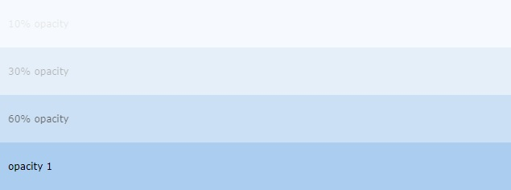
</p>

The `opacity` CSS property sets the opacity of an element. Opacity is the degree to which content behind an element is hidden, and is the opposite of transparency.

```css
div { background-color: lightblue; }
.light {
  opacity: 30%; /* Barely see the text over the background */
}
.medium {
  opacity: 60%; /* See the text more clearly over the background */
}
.heavy {
  opacity: 100%; /* See the text very clearly over the background */
}
```

```html
<div class="light">You can barely see this.</div>
<div class="medium">This is easier to see.</div>
<div class="heavy">This is very easy to see.</div>
```

<div align="right">
    <b><a href="#">↥ back to top</a></b>
</div>

## Q. What is `display: contents` and what does it do?

`display: contents` makes an element act as if it is **not there** for layout purposes — it disappears from the box tree, but its children remain and participate in the parent\'s layout as if they were direct children.

**Use case — unwrapping a semantic element for layout:**

```html
<ul class="grid-list">
  <li class="group">       <!-- this wrapper breaks grid layout -->
    <a href="#">Item 1</a>
    <a href="#">Item 2</a>
    <a href="#">Item 3</a>
  </li>
</ul>
```

```css
/* Without display: contents — the <li> is a grid item, not the <a> elements */
.grid-list {
  display: grid;
  grid-template-columns: repeat(3, 1fr);
}

/* With display: contents — <li> box is removed, <a> elements become grid items */
.group {
  display: contents;
}
```

**Important caveats:**

* The element itself becomes invisible to layout — `padding`, `border`, `background`, and `margin` on it have **no visual effect**.
* The element is still in the DOM and accessible to JavaScript.
* **Accessibility warning:** Applying `display: contents` to certain semantic elements (`<button>`, `<a>`, `<summary>`) can strip their ARIA roles in some browsers, breaking accessibility.

```css
/* Safe use: purely structural wrapper with no semantic role */
.layout-wrapper { display: contents; }

/* Unsafe use: strips button role in some browsers */
button { display: contents; } /* ❌ avoid */
```

<div align="right">
    <b><a href="#">↥ back to top</a></b>
</div>

## # 17. MISCELLANEOUS

<br/>

## Q. What are counters in CSS3?

CSS counters let you adjust the appearance of content based on its location in a document. To use a CSS counter, it must first be initialized to a value with the `counter-reset` property (0 by default). The same property can also be used to change its value to any specific number. Once initialized, a counter\'s value can be increased or decreased with counter-increment. The counter\'s name must not be "none", "inherit", or "initial"; otherwise the declaration is ignored.

```css
body {
  counter-reset: section;   /* Set a counter named 'section', and its initial value is 0. */
}

h3::before {
  counter-increment: section;   /* Increment the value of section counter by 1 */
  content: "Section " counter(section) ": ";  /* Display the word 'Section ', the value of 
                                                 section counter, and a colon before the content
                                                 of each h3 */
}
```

```html
<h3>Introduction</h3>
<h3>Body</h3>
<h3>Conclusion</h3>
```

**CSS Counter Properties:**

|Property	        |Description  |
|-----------------|---------------|
|content	        |Used with the ::before and ::after pseudo-elements, to insert generated content|
|counter-increment|Increments one or more counter values|
|counter-reset	  |Creates or resets one or more counters|

**Example:**

```html
<!DOCTYPE html>
<html>
<head>
  <style>
    body {
      counter-reset: section;   /* Set a counter named 'section', and its initial value is 0. */
    }

    h3::before {
      counter-increment: section;   /* Increment the value of section counter by 1 */
      content: "Section " counter(section) ": ";  /* Display the word 'Section ', the value of 
                                                 section counter, and a colon before the content
                                                 of each h3 */
    }   
  </style>
</head>
<body>
  <h3>Introduction</h3>
  <h3>Body</h3>
  <h3>Conclusion</h3>
</body>
</html>
```

**Live Demo**: [CSS Counters](https://learning-zone.github.io/css-interview-questions/assets/files/counters.html)

<div align="right">
    <b><a href="#">↥ back to top</a></b>
</div>

## Q. How do you specify units in the CSS?

There are various units in CSS to express the measurement and length. A CSS unit is used to determine the property size, which we set for an element or its content. The units in CSS are required to define the measurement such as margin: 20px; in which the px (or pixel) is the CSS unit. They are used to set margin, padding, lengths, and so on.

The length unit in CSS is of two types:

* Absolute length units.
* Relative length units.

**Absolute length units:**

The following are all absolute length units — they are not relative to anything else, and are generally considered to always be the same size.

|Unit	        |Name	                |Equivalent to        |
|-------------|---------------------|---------------------|
|cm	          |Centimeters	        |1cm = 38px = 25/64in|
|mm	          |Millimeters	        |1mm = 1/10th of 1cm|
|Q	          |Quarter-millimeters	|1Q = 1/40th of 1cm|
|in	          |Inches	              |1in = 2.54cm = 96px|
|pc	          |Picas	              |1pc = 1/6th of 1in|
|pt	          |Points	              |1pt = 1/72th of 1in|
|px	          |Pixels	              |1px = 1/96th of 1in|

**Relative length units:**

Relative length units specify a length relative to another length property. Relative length units scale better between different rendering medium.

|Unit	           |Relative to                                   |
|----------------|----------------------------------------------|
|em	             |Font size of the parent, in the case of typographical properties like font-size, and font size of the element itself, in the case of other properties like width.|
|ex	             |x-height of the element\'s font.|
|ch	             |The advance measure (width) of the glyph "0" of the element\'s font.|
|rem	           |Font size of the root element.|
|lh	             |Line height of the element.|
|vw	             |1% of the viewport\'s width.|
|vh	             |1% of the viewport\'s height.|
|vmin	           |1% of the viewport\'s smaller dimension.|
|vmax	           |1% of the viewport\'s larger dimension.|

**Example:**

```html
<!DOCTYPE html>
<html>
  <head>
      <title>CSS Units</title>
    <style>
      .wrapper {
        font-size: 1em;
      }
      
      .px {
        width: 200px;
      }
      
      .vw {
        width: 10vw;
      }
      
      .em {
        width: 10em;
      }
    </style>
  </head>
<body>
  <div class="wrapper">
    <div class="box px">I am 200px wide</div>
    <div class="box vw">I am 10vw wide</div>
    <div class="box em">I am 10em wide</div>
  </div>
</body>
</html>
```

**Live Demo**: [CSS Units](https://learning-zone.github.io/css-interview-questions/assets/files/css-units.html)

<div align="right">
    <b><a href="#">↥ back to top</a></b>
</div>

## Q. Which one would you prefer among px, em % or pt and why?

* ```px``` gives fine grained control and maintains alignment because 1 px or multiple of 1 px is guaranteed to look sharp. px is not cascade, this means if parent font-size is 20px and child 16px. child would be 16px.

* ```em``` maintains relative size. you can have responsive fonts. em is the width of the letter 'm' in the selected typeface. However, this concept is tricky. 1em is equal to the current font-size of the element or the browser default. if u sent font-size to 16px then 1em = 16px. The common practice is to set default body font-size to 62.5% (equal to 10px). em is cascade

* ```%``` sets font-size relative to the font size of the body. Hence, you have to set font-size of the body to a reasonable size. this is easy to use and does cascade. for example, if parent font-size is 20px and child font-size is 50%. child would be 10px.

* ```pt```(points) are traditionally used in print. 1pt = 1/72 inch and it is fixed-size unit.

<div align="right">
    <b><a href="#">↥ back to top</a></b>
</div>

## Q. Explain the meaning of each of these CSS units for expressing length?

* ```cm``` centimeters
* ```em``` elements (i.e., relative to the font-size of the element; e.g., 2 em means 2 times the current font size)
* ```in``` inches
* ```mm``` millimeters
* ```pc``` picas (1 pc = 12 pt = 1/6th of an inch)
* ```pt``` points (1 pt = 1/72nd of an inch)
* ```px``` pixels (1 px = 1/96th of an inch)

<div align="right">
    <b><a href="#">↥ back to top</a></b>
</div>

## Q. What is CSS preprocessor?

Pre-processors extend CSS with variables, operators, interpolations, functions, mixins and many more other usable assets. After development, these specific files are compiled into regular CSS that any browser can understand. Pre-processor help writing reusable, easily maintainable and extensible codes in CSS. 

**CSS preprocessors:**

  * SASS (SCSS)
  * LESS
  * Stylus
  * PostCSS

**Advantages:**

* CSS is made more maintainable.
* Easy to write nested selectors.
* Variables for consistent theming. Can share theme files across different projects.
* Mixins to generate repeated CSS.
* Splitting your code into multiple files. CSS files can be split up too but doing so will require an HTTP request to download each CSS file.

<div align="right">
    <b><a href="#">↥ back to top</a></b>
</div>

## Q. What is the difference between "resetting" and "normalizing" CSS?

**1. Resetting**: CSS resets aim to remove all built-in browser styling. For example margins, paddings, font-sizes of all elements are reset to be the same. You will have to redeclare styling for common typographic elements.

**Example:**

```css
html, body, div, span, applet, object, iframe, h1, h2, h3, h4, h5, h6, p, blockquote, pre, a, abbr, 
acronym, address, big, cite, code, del, dfn, em, img, ins, kbd, q, s, samp, small, strike, strong, 
sub, sup, tt, var, b, u, i, center, dl, dt, dd, ol, ul, li, fieldset, form, label, legend, table, 
caption, tbody, tfoot, thead, tr, th, td, article, aside, canvas, details, embed,  figure, figcaption, 
footer, header, hgroup,  menu, nav, output, ruby, section, summary, time, mark, audio, video {  
   margin: 0;  
   padding: 0;  
   border: 0;  
   font-size: 100%;  
   font: inherit;  
   vertical-align: baseline; 
}
```

**2. Normalizing**: Normalize CSS aims to make built-in browser styling consistent across browsers. It also corrects bugs for common browser dependencies.

**Example:**

```css
/* 
  Correct the font size and margin on `h1` elements within `section`  
  and `article` contexts in Chrome, Firefox, and Safari.
*/
 h1 {  font-size: 2em;  margin: 0.67em 0;}
 ```

<div align="right">
    <b><a href="#">↥ back to top</a></b>
</div>

## Q. Explain CSS Block Formatting Context?

Floats, absolutely positioned elements, block containers (such as inline-blocks, table-cells, and table-captions) that are not block boxes, and block boxes with 'overflow' other than 'visible' (except when that value has been propagated to the viewport) establish new block formatting contexts for their contents.

In a block formatting context, each box\'s left outer edge touches the left edge of the containing block (for right-to-left formatting, right edges touch)

A BFC is an HTML box that satisfies at least one of the following conditions:

* The value of `float` is not `none`.
* The value of `position` is neither `static` nor `relative`.
* The value of `display` is `table-cell`, `table-caption`, `inline-block`, `flex`, or `inline-flex`.
* The value of `overflow` is not `visible`.

In a BFC, each box\'s left outer edge touches the left edge of the containing block (for right-to-left formatting, right edges touch). Vertical margins between adjacent block-level boxes in a BFC collapse. 

**Example:**

```html
<!DOCTYPE html>
<html lang="en">
  <head>
    <title>CSS Block Formatting Context</title>
    <meta charset="utf-8" />
    <meta name="viewport" content="width=device-width, initial-scale=1" />
  </head>
  <style type="text/css">
    * {
      box-sizing: border-box;
    }

    body {
      margin: 40px;
      background-color: #fff;
      color: #444;
      font: 1.4em Arial, sans-serif;
    }

    .outer {
      background-color: #ccc;
      margin: 0 0 40px 0;
    }

    p {
      padding: 0;
      margin: 20px 0 20px 0;
      background-color: rgb(233, 78, 119);
      color: #fff;
    }

    .overflow {
      overflow: auto;
    }
  </style>
  <body>
    <h2>no BFC</h2>
    <div class="outer">
      <p>I am paragraph one and I have a margin top and bottom of 20px;</p>
      <p>I am paragraph two and I have a margin top and bottom of 20px;</p>
    </div>

    <h2>With a BFC</h2>

    <div class="outer overflow">
      <p>I am paragraph one and I have a margin top and bottom of 20px;</p>
      <p>I am paragraph two and I have a margin top and bottom of 20px;</p>
    </div>
  </body>
</html>
```

**Live Demo**: [CSS Block Formatting](https://learning-zone.github.io/css-interview-questions/assets/files/block-formatting-context.html)

<div align="right">
    <b><a href="#">↥ back to top</a></b>
</div>

## Q. What is the float property and what float do?

The float CSS property places an element on the left or right side of its container, allowing text and inline elements to wrap around it. 

**Syntax:**

```css
/* Keyword values */
float: left;
float: right;
float: none;
float: inline-start;
float: inline-end;

/* Global values */
float: inherit;
float: initial;
float: unset;
```

**Property Values:**

|Sl.No| Value  | Description| 
|-----|--------|------------|
| 01. |none	   |The element does not float, (will be displayed just where it occurs in the text).|	
| 02. |left	   |The element floats to the left of its container	|
| 03. |right	 |The element floats the right of its container	|
| 04. |initial |Sets this property to its default value.    	|
| 05. |inherit |Inherits this property from its parent element. |

**Example:**:

```css
section {
  border: 1px solid blue;
  width: 100%;
  float: left;
}

div {
  margin: 5px;
  width: 50px;
  height: 150px;
}

.left {
  float: left;
  background: pink;
}

.right {
  float: right;
  background: cyan;
}
```

```html
<section>
  <div class="left">1</div>
  <div class="left">2</div>
  <div class="right">3</div>
  <p>Lorem ipsum dolor sit amet, consectetur adipiscing elit.
     Morbi tristique sapien ac erat tincidunt, sit amet dignissim
     lectus vulputate. Donec id iaculis velit. Aliquam vel
     malesuada erat. Praesent non magna ac massa aliquet tincidunt
     vel in massa. Phasellus feugiat est vel leo finibus congue.</p>
</section>
```

<div align="right">
    <b><a href="#">↥ back to top</a></b>
</div>

## Q. Describe clear Property in css?

The clear property specifies what elements can float beside the cleared element and on which side.

|Sl.No| Properties     | Description  |
|-----|----------------|--------------|
| 01. |clear: none     |Allows floating elements on both sides. This is default|
| 02. |clear: left     |No floating elements allowed on the left side|
| 03. |clear: right    |No floating elements allowed on the right side|
| 04. |clear: both     |No floating elements allowed on either the left or the right side|
| 05. |clear: inherit  |The element inherits the clear value of its parent|

**Example:**

```css
div {
  clear: left;
}
```

<div align="right">
    <b><a href="#">↥ back to top</a></b>
</div>

## Q. Explain the purpose of clearing floats in CSS?

The **clear** property is directly related to the float property. It specifies if an element should be next to the floated elements or if it should move below them. This property applies to both floated and non-floated elements.

**CSS Syntax:**

```css
clear: none|left|right|both|inherit|inline-start|inline-end;
```

**Property Values:**

|Value       |Description	                                       |
|------------|---------------------------------------------------|
|none	       |The element is not moved down to clear past floats.|
|left	       |The element is moved down to clear past left floats.|
|right	     |The element is moved down to clear past right floats.|
|Both 	     |The element is moved down to clear past both left and right floats.|

**Example:**

```html
<!DOCTYPE html>
<html>
<head>
  <title>CSS clear Property</title>
  <style>
    .div1 {
      float: left;
      width: 100px;
      height: 50px;
      margin: 10px;
      border: 3px solid #73AD21;
    }

    .div2 {
      border: 1px solid red;
      height: 100px;
    }

    .div3 {
      float: left;
      width: 100px;
      height: 50px;
      margin: 10px;
      border: 3px solid #73AD21;
    }

    .div4 {
      border: 1px solid red;
      height: 100px;
      clear: left;
    }
  </style>
</head>
<body>
    <h2>Without clear</h2>
    <div class="div1">div1</div>
    <div class="div2">div2 - Notice that the div2 element is after div1, in the HTML code. 
      However, since div1 is floated to the left, this happens: the text in div2 is floated 
      around div1, and div2 surrounds the whole thing.
    </div><br/>

    <h2>Using clear</h2>
    <div class="div3">div3</div>
    <div class="div4">div4 - Using clear moves div4 down below the floated div3. The value 
      "left" clears elements floated to the left. You can also clear "right" and "both".</div>
</body>
</html>
```

**Live Demo**: [CSS clear Property](https://learning-zone.github.io/css-interview-questions/assets/files/clear-float.html) 

<div align="right">
    <b><a href="#">↥ back to top</a></b>
</div>

## Q. What is a clearfix in CSS?

A **clearfix** is a way for an element to clear its child elements automatically without any additional markup. The clearfix property is generally used in float layouts where elements are floated to be stacked horizontally.

The clearfix property allows a container to wrap its floated children. Without a clearfix, a container will not wrap around its floated children and will collapse, just as if its floated children had been positioned absolutely.

<p align="center">
  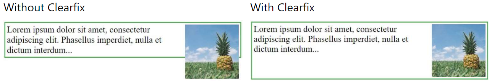
</p>

**Syntax:**

```css
.clearfix {
  properties
}
```

**Example:**

```html

<!DOCTYPE html>
<html>
<head>
  <title>CSS Clearfix property</title>
  <style>
    div {
      border: 3px solid #4CAF50;
      padding: 5px;
    }

    .clearfix {
      overflow: auto;
    }
    
    .img {
      float: right;
    }
  </style>
</head>
<body>
  <div class="clearfix">
    
        Running Horse
  </div>
</body>
</html>
```

**Live Demo**: [CSS Clearfix](https://learning-zone.github.io/css-interview-questions/assets/files/clearfix.html)

<div align="right">
    <b><a href="#">↥ back to top</a></b>
</div>

## Q. Does `overflow: hidden` create a new block formatting context?

Yes. overflow property deals with the content if content size exceeds the allocated size for the content. You can make extra content visible, hidden, scroll or auto (viewport default behavior).

<div align="right">
    <b><a href="#">↥ back to top</a></b>
</div>

## Q. How can you load css resources conditionally?

**@import**:  allows to load stylesheet by using a path (uri) representing the location of the file.

```css
/* By default, include the "light" color theme for syntax highlighting */
@import "cdn.com/atom-one-light.min.css";
/* And if you’re in dark mode, have those rules superseded via a different stylesheet */
@media (prefers-color-scheme: dark) {
  @import "cdn.com/atom-one-dark.min.css";
}
```

**matchMedia()**: Using matchMedia lets you execute blocks of JavaScript only when a certain media query condition is met. This means you can just write out the CSS when and if the query is true:

```javascript
if (window.matchMedia('screen and (min-width: 600px)')) {
  document.write('<link rel="stylesheet" href="css/small.css">');
}
```

<div align="right">
    <b><a href="#">↥ back to top</a></b>
</div>

## Q. List display property in CSS?

The display property specifies the display behavior (the type of rendering box) of an element.  

**Example:**

```css
p.ex1 {display: none;}
p.ex2 {display: inline;}
p.ex3 {display: block;}
p.ex4 {display: inline-block;}
```

**Property Values:**

|Sl.No|Value	   |Description	
|-----|---------------|------------------
| 01. |inline	|Displays an element as an inline element (like `<span>`). Any height and width properties will have no effect|	
| 02. |block	|Displays an element as a block element (like `<p>`). It starts on a new line, and takes up the whole width	|
| 03. |contents|Makes the container disappear, making the child elements children of the element the next level up in the DOM	|
| 04. |flex	          |Displays an element as a block-level flex container	|
| 05. |grid	          |Displays an element as a block-level grid container	|
| 06. |inline-block   |Displays an element as an inline-level block container. The element itself is formatted as an inline element, but you can apply height and width values|	
| 07. |inline-flex	   |Displays an element as an inline-level flex container	|
| 08. |inline-grid	   |Displays an element as an inline-level grid container	|
| 09. |inline-table    |The element is displayed as an inline-level table	|
| 10. |list-item	     |Let the element behave like a `<li>` element	|
| 11. |run-in	         |Displays an element as either block or inline, depending on context	|
| 12. |table	         |Let the element behave like a `<table>` element	|
| 13. |table-caption	 |Let the element behave like a `<caption>` element	|
| 14. |table-column-group	|Let the element behave like a `<colgroup>` element	|
| 15. |table-header-group	|Let the element behave like a `<thead>` element	|
| 16. |table-footer-group	|Let the element behave like a `<tfoot>` element	|
| 17. |table-row-group	  |Let the element behave like a `<tbody>` element	|
| 18. |table-cell	        |Let the element behave like a `<td>` element	|
| 19. |table-column	      |Let the element behave like a `<col>` element	|
| 20. |table-row	        |Let the element behave like a `<tr>` element	|
| 21. |none	              |The element is completely removed	|
| 22. |initial	          |Sets this property to its default value. Read about initial	|
| 23. |inherit	          |Inherits this property from its parent element. Read about inherit|

<div align="right">
    <b><a href="#">↥ back to top</a></b>
</div>

## Q. What is retina graphics? What kind of techniques do you use to handle images for retina screens?

In order to have crisp, good-looking graphics that make the best of retina displays we need to use high resolution images whenever possible. However using always the highest resolution images will have an impact on performance as more bytes will need to be sent over the wire.

To overcome this problem, we can use responsive images, as specified in HTML5. It requires making available different resolution files of the same image to the browser and let it decide which image is best, using the html attribute `srcset` and optionally `sizes`, for instance:

```html
<div responsive-background-image>  
  
</div>

<!-- It enable the browser to use a medium and large image based on 
     the sizes of the image in the viewport
-->

```

The browsers which does not support HTML5\'s `srcset` (i.e. IE11) will ignore it and uses `src` instead. If we really need to support IE11 and we want to provide this feature for performance reasons, we can use a JavaScript `polyfill`.

**HTML5 picture Element:**

```html
<picture>
   <source media="(min-width: 1024px)" srcset="foo-large.jpg  1024w, foo-medium.jpg 640w" sizes="50vw" />
   <source srcset="foo@2x.jpg 2x, foo.jpg 1x" />
   
</picture>
```

**Retina Display Media Query:**

```css
/* 1.25 dpr */
@media (-webkit-min-device-pixel-ratio: 1.25), (min-resolution: 120dpi) { 
    /* Retina-specific stuff here */
}

/* 1.3 dpr */
@media (-webkit-min-device-pixel-ratio: 1.3), (min-resolution: 124.8dpi) { 
    /* Retina-specific stuff here */
}

/* 1.5 dpr */
@media (-webkit-min-device-pixel-ratio: 1.5), (min-resolution: 144dpi) { 
    /* Retina-specific stuff here */
}
```

<div align="right">
    <b><a href="#">↥ back to top</a></b>
</div>

## Q. Is there any reason you\'d want to use translate() instead of absolute positioning, or vice-versa? 

`translate()` is a value of CSS `transform`. Changing `transform` or `opacity` does not trigger browser reflow or repaint but does trigger compositions; whereas changing the absolute positioning triggers `reflow`. `transform` causes the browser to create a GPU layer for the element but changing absolute positioning properties uses the CPU. Hence `translate()` is more efficient and will result in shorter paint times for smoother animations.

When using `translate()`, the element still occupies its original space (sort of like `position: relative`), unlike in changing the absolute positioning.

**Example:**

If we combine `position:relative` with one of the offset properties `top`, `bottom`, `left` or `right` the element will be moved from its original place in the layout whilst preserving the space in the document it once occupied. The element will be moved on to a new layer and its "layer order" or its stacking order can then be controlled with the `z-index` property.

```css
.thing {
  position: relative;
  top: 100px;
  left: 50px;
}
```

In the above example the element will be moved 100px away from the top and 50px away from the left of its original position.

When using `transform:translate(x,y)` we get a very similar visual result to using relative position. The same result as above could be achieved with the following snippet:

```css
.thing {
  transform: translate(50px, 100px);
}
```

In this case, we are translating the coordinates of the element by `50px` along the x-axis and `100px` along the y-axis. The end result is visually the same as the previous `position` example.

<div align="right">
    <b><a href="#">↥ back to top</a></b>
</div>

## Q. Tell what each of these tags do, if there are alternatives, which are preferable, why?

**`<em>`**: The HTML `<em>` tag represents stress emphasis of its contents.

```html
<em>Emphasized content...</em>
```

**`<b>`**: The `<b>` tag specifies bold text without any extra importance.

```html
<p>This is normal text - <b>and this is bold text</b>.</p>
```

**`<abbr>`**: The HTML Abbreviation element (`<abbr>`) represents an abbreviation or acronym; the optional title attribute can provide an expansion or description for the abbreviation.

```html
The <abbr title="World Health Organization">WHO</abbr> was founded in 1948.
```

**`<nav>`**: The `<nav>` tag defines a set of navigation links.

```html
<nav>
  <a href="/html/">HTML</a> |
  <a href="/css/">CSS</a> |
  <a href="/js/">JavaScript</a> |
  <a href="/jquery/">jQuery</a>
</nav>
```

**`<i>`**: The content of the `<i>` tag is usually displayed in italic.

```html
<p>I looked at it and thought <i>This can\'t be real!</i></p>
```

**`<link>`**: The HTML `<link>` tag is used for defining a link to an external resource. It is placed in in the `<head>` section of the HTML document.

```html
<head>
  <link rel="stylesheet" type="text/css" href="theme.css">
</head>
```

**`<strong>`**: The `<strong>` element is used to identify text that is of greater importance than the surrounding text. By default, all browsers render `<strong>` text in a bold typeface.

```html
<strong>Strong text</strong>
```

**`<article>`**: The `<article>` tag specifies independent, self-contained content.

```html
<article>
  <h1>Google Chrome</h1>
  <p>Google Chrome is a free, open-source web browser developed by Google, released in 2008.</p>
</article>
```

<div align="right">
    <b><a href="#">↥ back to top</a></b>
</div>

## Q. What is At-Rule?

At-rules are `CSS statements` that instructs CSS how to behave. They begin with an at sign, `@` followed by an identifier and includes everything up to the next semicolon, `;` or the next CSS block, whichever comes first.

```css
/* General structure */
@IDENTIFIER (RULE);

/* Example: tells browser to use UTF-8 character set */
@charset "utf-8";
```

|Sl.No| at-rules  | Description |
|-----|-----------|-------------|
| 01. |@charset   |Defines the character set used by the style sheet.|
| 02. |@import    |Tells the CSS engine to include an external style sheet.|
| 03. |@namespace |Tells the CSS engine that all its content must be considered prefixed with an XML namespace.|
| 04. |@media     |A conditional group rule that will apply its content if the device meets the criteria of the condition defined using a media query.|
| 05. |@supports  |A conditional group rule that will apply its content if the browser meets the criteria of the given condition.|
| 06. |@page      |Describes the aspect of layout changes that will be applied when printing the document.|
| 07. |@font-face |Describes the aspect of an external font to be downloaded.|
| 08. |@keyframes |Describes the aspect of intermediate steps in a CSS animation sequence.|

<div align="right">
    <b><a href="#">↥ back to top</a></b>
</div>

## Q. How can the gap under the image be removed?

As images being inline elements are treated same as texts, so there is a gap left, which can be removed by:

```html
<figure>
  
</figure>
```

<div align="right">
    <b><a href="#">↥ back to top</a></b>
</div>

## Q. What is progressive rendering?

Progressive rendering is the name given to techniques used to improve the performance of a webpage (in particular, improve perceived load time) to render content for display as quickly as possible.

**Examples:**

* **Lazy loading of images** - Images on the page are not loaded all at once. JavaScript will be used to load an image when the user scrolls into the part of the page that displays the image.
* **Prioritizing visible content (or above-the-fold rendering)** - Include only the minimum CSS/content/scripts necessary for the amount of page that would be rendered in the users browser first to display as quickly as possible, you can then use deferred scripts or listen for the DOMContentLoaded/load event to load in other resources and content.
* **Async HTML fragments** - Flushing parts of the HTML to the browser as the page is constructed on the back end.

<div align="right">
    <b><a href="#">↥ back to top</a></b>
</div>

## Q. What is mobile-first? Can you explain the difference between coding a website to be responsive versus using a mobile-first strategy?

Making a website responsive means the some elements will respond by adapting its size or other functionality according to the device\'s screen size, typically the viewport width, through CSS media queries, for example, making the font size smaller on smaller devices.

```css
@media (min-width: 601px) {
  .my-class {
    font-size: 24px;
  }
}
@media (max-width: 600px) {
  .my-class {
    font-size: 12px;
  }
}
```

A mobile-first strategy is also responsive, however it agrees we should default and define all the styles for mobile devices, and only add specific responsive rules to other devices later. Following the previous example:

```css
.my-class {
  font-size: 12px;
}

@media (min-width: 600px) {
  .my-class {
    font-size: 24px;
  }
}
```

A mobile-first strategy has 2 main advantages:

* It\'s more performant on mobile devices, since all the rules applied for them don\'t have to be validated against any media queries.
* It forces to write cleaner code in respect to responsive CSS rules.

**Example:**

```html
<!DOCTYPE html>
<html>
  <head>
  <meta name="viewport" content="width=device-width, initial-scale=1.0">
  <title>CSS Media Query</title>
  <style>
    body {
        background-color: lightgreen;
    }

    @media only screen and (max-width: 800px) {
        body {
            background-color: rgb(233, 50, 18);
        }
    }
  </style>
  </head>
<body>
    <h1>Resize the browser window</h1>
    <h2>When the width of this document is 800px or less, the background-color is "green", 
      otherwise it is "Red".</h2>
</body>
</html>
```

**Live Demo**: [Media Query](https://learning-zone.github.io/css-interview-questions/assets/files/media-query.html) 

<div align="right">
    <b><a href="#">↥ back to top</a></b>
</div>

## Q. What are the different css filters you can use?

The filter CSS property applies graphical effects like blur or color shift to an element. Filters are commonly used to adjust the rendering of images, backgrounds, and borders.

**Example:**

```css
img {
  -webkit-filter: brightness(200%); /* Safari 6.0 - 9.0 */
  filter: brightness(200%);
}
```
**Filter Functions**  

|Sl.No|Filter        | Description                       |
|-----|--------------|-----------------------------------|
| 01. |none	         |Default value. Specifies no effects|
| 02. |blur(px)	     |Applies a blur effect to the image. A larger value will create more blur.|
| 03. |brightness(%) |Adjusts the brightness of the image.|
| 04. |contrast(%)	 |Adjusts the contrast of the image.	|
| 05. |drop-shadow(h-shadow v-shadow blur spread color)|Applies a drop shadow effect to the image.|
| 06. |grayscale(%)	 |Converts the image to grayscale.|
| 07. |hue-rotate(deg)|	Applies a hue rotation on the image. The value defines the number of degrees around the color circle| the image samples will be adjusted. 0deg is default, and represents the original image.|
| 08. |invert(%)	   |Inverts the samples in the image.|
| 09. |opacity(%)	   |Sets the opacity level for the image. The opacity-level describes the transparency-level|
| 10. |saturate(%)	 |Saturates the image.|
| 11. |sepia(%)	     |Converts the image to sepia.|
| 12. |url()	       |The url() function takes the location of an XML file that specifies an SVG filter, and may include an anchor to a specific filter element. for example `filter: url(svg-url#element-id)`	|
| 13. |initial	     |Sets this property to its default value.|
| 14. |inherit	     |Inherits this property from its parent element.|

<div align="right">
    <b><a href="#">↥ back to top</a></b>
</div>

## Q. Enlist the various fonts properties?

|Property	             |Description                |
|----------------------|---------------------------|
|font-style	           | Specifies the font style. |
|font-variant	         | Specifies the font variant. |
|font-weight	         | Specifies the font weight. |
|font-size/line-height | Specifies the font size and the line-height. |
|font-family	         | Specifies the font family. Default value depends on the browser|
|caption	             | Uses the font that are used by captioned controls (like buttons, drop-downs, etc.)|
|icon	                 | Uses the font that are used by icon labels|
|menu	                 | Uses the fonts that are used by dropdown menus|
|message-box	         | Uses the fonts that are used by dialog boxes|
|small-caption	       | A smaller version of the caption font|
|status-bar	           | Uses the fonts that are used by the status bar|
|initial	             | Sets this property to its default value.|
|inherit	             | Inherits this property from its parent element.|

<div align="right">
    <b><a href="#">↥ back to top</a></b>
</div>

## Q. Enlist the various background properties css?


|  Property             | Description                               |
|-----------------------|-------------------------------------------|
|background-color	      |Specifies the background color to be used	|
|background-image	      |Specifies ONE or MORE background images to be used	|
|background-position	  |Specifies the position of the background images	|
|background-size	      |Specifies the size of the background images	|
|background-repeat	    |Specifies how to repeat the background images	|
|background-origin	    |Specifies the positioning area of the background images|
|background-clip	      |Specifies the painting area of the background images|
|background-attachment	|Specifies whether the background images are fixed or scrolls with the rest of the page|
|initial	              |Sets this property to its default value.|
|inherit	              |Inherits this property from its parent element|

<div align="right">
    <b><a href="#">↥ back to top</a></b>
</div>

## Q. What is the difference between `em` and `rem` units?

Both em and rem units are based on the font-size CSS property. The only difference is where they inherit their values from.
* `em` units inherit their value from the font-size of the parent element

```css
.parent {
  font-size: 18px;
}
.child {
  font-size: 1.5em;
}
```

```html
<div class="parent">
  I'm 15px
  <div class="child">
  I'm 30px, as expected
    <div class="child">
    I'm 60px, trouble starts!
      <div class="child">
      I'm 120px, now we're really in trouble!
      </div>
    </div>
  </div>
</div>
```

* `rem` units inherit their value from the font-size of the root element (html)

```css
.html {
  font-size: 16px;
}
.parent {
  font-size: 15px;
}
.child-rem {
  font-size: 2rem;
}
```

```html
<div class="parent">
  I'm 15px
  <div class="child-rem">
  I'm 32px, as expected
    <div class="child-rem">
    I'm 32px, yep!
      <div class="child-rem">
      I'm 32px, like clockwork!
      </div>
    </div>
  </div>
</div>
```

*Note: In most browsers, the font-size of the root element is set to 16px by default.*

<div align="right">
    <b><a href="#">↥ back to top</a></b>
</div>

## Q. What does !important mean in CSS?

It overrides the cascade and gives the style rule the highest precedence.

```css
p {
    color: red !important;
}
#thing {
    color: green;
}
```
```html
<p id="thing">Will be RED.</p>
```
<div align="right">
    <b><a href="#">↥ back to top</a></b>
</div>

## Q. Does style2.css have to be downloaded and parsed before Paragraph 1 is rendered on the page?

```html
<head>
    <link href="style1.css" rel="stylesheet">
</head>
<body>
    <p>Paragraph 1</p>
    <p>Paragraph 2</p>
    <link href="style2.css" rel="stylesheet">
</body>
```
* Yes

<div align="right">
    <b><a href="#">↥ back to top</a></b>
</div>

## Q. Does style1.css have to be downloaded and parsed before style2.css can be fetched?

```html
<head>
    <link href="style1.css" rel="stylesheet">
    <link href="style2.css" rel="stylesheet">
</head>
```
* No

<div align="right">
    <b><a href="#">↥ back to top</a></b>
</div>

## Q. How is the concept of inheritance applied in CSS?

Inheritance is a concept in which the child class will inherit the properties of its parent class. It is used in CSS to define the hierarchy from the top level to the bottom level. Inherited properties can be overridden by the children class if the child uses the same name.

**Example:**

```css
span {
  color: blue;
  border: 1px solid black;
}
.extra span {
  color: inherit;
}
```

<div align="right">
    <b><a href="#">↥ back to top</a></b>
</div>

## Q. What are the CSS-wide value keywords `inherit`, `initial`, `unset`, and `revert`?

These keywords can be applied to **any** CSS property and control how the property\'s value is resolved in the cascade.

| Keyword | Description |
|---------|-------------|
| `inherit` | Forces the property to use the **same computed value as its parent element**, even for properties that are not normally inherited |
| `initial` | Resets the property to its **CSS specification default** (not the browser stylesheet default) |
| `unset` | Behaves as `inherit` for inherited properties; behaves as `initial` for non-inherited properties |
| `revert` | Resets to the **user-agent (browser) stylesheet** value — restores browser default styling |

**Example:**

```css
/* inherit: force a non-inherited property to use the parent\'s value */
.child {
  border-color: inherit;   /* border-color is NOT normally inherited */
}

/* initial: CSS spec default — may differ from browser default */
h1 {
  font-weight: initial;   /* 'normal' per spec; browser default is 'bold' */
  display: initial;       /* 'inline' per spec; browser default is 'block' */
}

/* unset: smart inherit-or-reset */
.reset {
  color: unset;     /* inherits (color is an inherited property) */
  display: unset;   /* becomes 'initial' (display is NOT inherited) */
}

/* revert: restore browser default styling */
button {
  all: revert;  /* strips all author styles, restores native button appearance */
}
```

**The `all` shorthand property:**

`all` applies one of the above keywords to every CSS property simultaneously (except `unicode-bidi` and `direction`), making it useful for fully resetting or isolating a component.

```css
/* Strip all author + inherited styles from a component */
.isolated-widget {
  all: unset;
}

/* Restore browser default styles (useful inside shadow DOM or CSS resets) */
.unstyled {
  all: revert;
}
```

<div align="right">
    <b><a href="#">↥ back to top</a></b>
</div>

## Q. How do you handle browser differences in your user base?

The `@supports` query in CSS can be very useful to scan if the user\'s current browser has a certain feature. The `@supports` CSS at-rule lets you specify declarations that depend on a browser\'s support for one or more specific CSS features. This is called a feature query. The rule may be placed at the top level of your code or nested inside any other conditional group at-rule.

```css
@supports (display: grid) {
  div {
    display: grid;
  }
}

@supports not (display: grid) {
  div {
    float: right;
  }
}
```

<div align="right">
    <b><a href="#">↥ back to top</a></b>
</div>

## Q. What is Cascade?

Cascade is a method of defining the weight (importance) of individual styling rules thus allowing conflicting rules to be sorted out should such rules apply to the same selector.

```css
P {color: white ! important} /* increased weight */
P {color: black} /* normal weight */
```

<div align="right">
    <b><a href="#">↥ back to top</a></b>
</div>


## Q. What is DOM (Document Object Model) and how is it linked to CSS?

The Document Object Model (DOM) is a programming interface for HTML and XML(Extensible markup language) documents. It defines the logical structure of documents and the way a document is accessed and manipulated. This document enables Javascript to access and manipulate the elements and styles of a website. The model is built in a tree structure of objects and defines:

* The HTML elements as objects
* The properties of all HTML elements
* The methods to access all HTML elements
* The events for all HTML elements

<p align="center">
  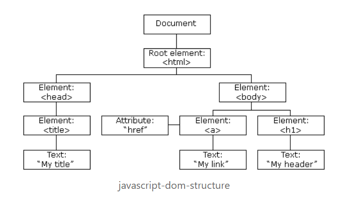
</p>

**DOM Document**

The DOM Document is the owner of all other objects in your webpage. That means if you want to access any object on your webpage you always have to start with the document. It also contains many important properties and methods that enable us to access and modify our website.

**Finding HTML Elements**

|Methods           |Description |
|------------------|-----------------|
|getElementById()  |This method is used to get a single element by its id.|
|getElementsByClassName() |This method returns an array of elements.      |
|getElementsByTagName()   |This method is used to get a single element by its tag name|
|querySelector()          |This method returns the first element that matches a specified CSS selector. It can get elements by id, class, tag and all other valid CSS selectors. |
|querySelectorAll()       |This method is completely the same as the querySelector() except that it returns all elements that fit the CSS Selector.|

**Changing HTML Elements**

The innerHTML property can be used to change the content of an HTML element. In this example we get the element with an id of header and set the inner content to "Hello World!".

```js
// Example: Using text
document.getElementById("#header").innerHTML = "Hello World!";

// Example: Using text with tag
document.getElementsByTagName("div").innerHTML = "<h1>Hello World!</h1>"
```

**Changing a value of an attribute**

We can also change the value of an attribute using the DOM.

```js
document.getElementsByTag("img").src = "image.jpg";
```

**Changing the style**

To change the style of an HTML element we need to change the style property of our elements. The CSS properties need to be written in camelcase instead of the normal css property name.

```js
document.getElementsByTag("h1").style.borderBottom = "solid 3px #000";
```

**Adding and deleting elements**

**Adding elements**

create a div element using the `createElement()` method which takes a tagname as a parameter and saves it into a variable. After that we just need to give it some content and then insert it into our DOM document.

```js
var div = document.createElement("div");

var newContent = document.createTextNode("Hello World!"); 
div.appendChild(newContent);
document.body.insertBefore(div, currentDiv);
```

Here we create content using the `createTextNode()` method which takes a String as a parameter and then we insert our new div element before a div that already exists in our document.

**Deleting elements**

Here we get an element and delete it using the `removeChild()` method.

```js
var elem = document.querySelector('#header');
elem.parentNode.removeChild(elem);
```

**Replace elements**

```js
var div = document.querySelector('#div');
var newDiv = document.createElement('div');

newDiv.innerHTML = "Hello World2";
div.parentNode.replaceChild(newDiv, div);
```

Here we replace an element using the `replaceChild()` method. The first argument is the new element and the second argument is the element which we want to replace.

**Writing directly into the HTML output stream**

We can also write HTML expressions and JavaScript directly into the HTML output stream using the `write()` method. The `write()` method can also take multiple arguments that will be appended to the document in order of their occurrence.

```js
// HTML Content
document.write("<h1>Hello World!</h1><p>This is a paragraph!</p>");

// date object
document.write(Date());
```

**Event Handlers**

The HTML DOM also allows Javascript to react to HTML events. for example, mouse click, page load, mouse move, input field change etc.

**Assign Events**

You can define events directly in your js code. Here is an example of an onclick event:

```js
document.getElementById("btn").onclick = changeText();
```

**Assign Events Listeners**

Here we just assigned a clickevent that calls the runEvent method when our btn element is clicked.

```js
document.getElementById("btn").addEventListener('click', runEvent);
```

**Node Relationships**

The nodes in the DOM Document have a hierarchical relationship to each other. This means that the nodes are structured like a tree. We use the terms parent, sibling and child to describe the relationship between nodes.

The top node is called the root and is the only node that has no parent. The root in a normal HTML document is the `<html/>` tag because it has no parent and is the top tag of the document.

**Navigating Between Nodes**

We can navigate between nodes using these properties:

* parentNode
* childNodes
* firstChild
* lastChild
* nextSibling

**Example:**

```js
var parent = document.getElementById("heading").parentNode
```

<div align="right">
    <b><a href="#">↥ back to top</a></b>
</div>

## Q. How does Calc() work?

The `calc()` function can be used to perform addition, subtraction, multiplication, and division calculations with numeric property values. Specifically, it can be used with `<length>`, `<frequency>`, `<angle>`, `<time>`, `<number>`, or `<integer>` data types.

**Example:**

```css
/* Example - 1 */
.main-content {
  width: calc(100vh - 10px); /* Subtract 10px from 100vh */
}

/* Example - 2 */
.container {
  padding: calc(1vw + 1em);
  width: calc(var(--variable-width) + 200px);
  transform: rotate( calc(1turn + 28deg) );
  background: hsl(100, calc(3 * 20%), 40%);
  font-size: calc(50vw / 3);
  border-radius: 15px calc(15px / 3) 4px 2px;
}
```

<div align="right">
    <b><a href="#">↥ back to top</a></b>
</div>

## Q. What are Vendor-Prefixes?

CSS vendor prefixes, also sometimes known as or CSS browser prefixes, are a way for browser makers to add support for new CSS features before those features are fully supported in all browsers.

**Example:** `transition` property

```css
.myClass {
	-webkit-transition: all 1s linear;
	-moz-transition: all 1s linear;
	-ms-transition: all 1s linear;
	-o-transition: all 1s linear;
	transition: all 1s linear;
}
```

**CSS prefixes**

The major browsers use the following prefixes:

* `-webkit-` (Chrome, Safari, newer versions of Opera, almost all iOS browsers including Firefox for iOS; basically, any WebKit based browser)
* `-moz-` (Firefox)
* `-o-` (old pre-WebKit versions of Opera)
* `-ms-` (Internet Explorer and Microsoft Edge)

<div align="right">
    <b><a href="#">↥ back to top</a></b>
</div>

## Q. What is the property that is used for controlling image-scroll?

The **background-attachment** property in CSS is used to specify the kind of attachment of the background image with respect to its container. It can be set to scroll or remain fixed. It can be applied to all HTML elements.

**Syntax**

```css
background-attachment: scroll|fixed|local|initial|inherit;
```

**Property Values**

|Value	      |Description|
|-------------|-------------------------------------------------------|
|scroll	      |The background image will scroll with the page. This is default|
|fixed	      |The background image will not scroll with the page|
|local	      |The background image will scroll with the element\'s contents|
|initial	    |Sets this property to its default value. Read about initial|
|inherit	    |Inherits this property from its parent element. Read about inherit|

**Example:**

```html
<!DOCTYPE html>
<html>
  <head>
    <style>
      body {
        background-image: url("../images/img_tree.gif");
        background-repeat: no-repeat;
        background-attachment: fixed;
      }
    </style>
  </head>
<body>
  <h1>The background-attachment Property</h1>

  <p>The background-image is fixed. Try to scroll down the page.</p>
    ...
  <p>If you do not see any scrollbars, try to resize the browser window.</p>
</body>
</html>
```

**Live Demo**: [CSS background-attachment](https://learning-zone.github.io/css-interview-questions/assets/files/background-attachment.html)

<div align="right">
    <b><a href="#">↥ back to top</a></b>
</div>

## Q. What is Accessibility (a11y) in a web application?

Accessibility refers to how software or hardware combinations are designed to make a system accessible to persons with disabilities, such as:

* Visual impairment
* Hearing loss
* Limited dexterity

For example, a website developed with accessibility in mind might have text-to-speech capabilities or output for special braille hardware geared toward individuals with visual impairments.

<div align="right">
    <b><a href="#">↥ back to top</a></b>
</div>

## Q. What is UI/UX?

**1) UI or User Interface**:  is how a product or website is laid out and how you interact with it: Where the buttons are, how big the fonts are, and how menus are organized are all elements of UI.

**2) UX or User Experience**: is how you feel about using a product or a website. So, your love for the way the new Apple Watch looks or your excitement that there\'s finally a tablet-sized iPhone to watch those Corgi videos you’re obsessed with are reflections of UX.
So the new look of the Facebook news feed involves a change to UI, and the way you navigate that new page is the UX. 

<div align="right">
    <b><a href="#">↥ back to top</a></b>
</div>

## Q. How do you serve your pages for feature-constrained browsers? What techniques do you use?

* **Graceful degradation**: The practice of building an application for modern browsers while ensuring it remains functional in older browsers.
* **Progressive enhancement**: The practice of building an application for a base level of user experience, but adding functional enhancements when a browser supports it.
* **[caniuse](https://caniuse.com/)**: to check for feature support.
* **[Autoprefixer](https://autoprefixer.github.io/)**: for automatic vendor prefix insertion.
* **Feature detection**: using [Modernizr](https://modernizr.com/).
* **CSS Feature queries**: using [@support](https://developer.mozilla.org/en-US/docs/Web/CSS/@supports)

<div align="right">
    <b><a href="#">↥ back to top</a></b>
</div>

## Q. What is file splitting? When is it used?

A monolithic file is fine for solo developers or very small projects. For large projects—sites with multiple layouts and content types, or multiple brands under the same design umbrella—it\'s smarter to use a modular approach and split your CSS across multiple files.

* **reset.css**: reset and normalization styles; minimal color, border, or font-related declarations
* **typography.css**: font faces, weights, line heights, sizes, and styles for headings and body text
* **layouts.css**: styles that manage page layouts and segments, including grids
* **forms.css**: styles for form controls and labels
* **lists.css**: list-specific styles
* **tables.css**: table-specific styles
* **carousel.css**: styles required for carousel components
* **accordion.css**: styles for accordion components

CSS frameworks such as Foundation and Bootstrap use this approach. Both become quite granular with separate files for progress bars, range inputs, close buttons, and tooltips. This allows developers to include only the components that they need for a project.

<div align="right">
    <b><a href="#">↥ back to top</a></b>
</div>

## Q. What is DOM reflow?

Reflow is the name of the web browser process for re-calculating the positions and geometries of elements in the document, for the purpose of re-rendering part or all of the document.

**Reflow occurs when**

  * insert, remove or update an element in the DOM
  * modify content on the page, e.g. the text in an input box
  * move a DOM element
  * animate a DOM element
  * take measurements of an element such as offsetHeight or getComputedStyle
  * change a CSS style
  * change the className of an element
  * add or remove a stylesheet
  * resize the window
  * scroll

**Minimizing browser reflow**  

* Reduce unnecessary DOM depth. Changes at one level in the DOM tree can cause changes at every level of the tree - all the way up to the root, and all the way down into the children of the modified node. This leads to more time being spent performing reflow.
* Minimize CSS rules, and remove unused CSS rules.
* If you make complex rendering changes such as animations, do so out of the flow. Use position-absolute or position-fixed to accomplish this.
* Avoid unnecessary complex CSS selectors - descendant selectors in particular - which require more CPU power to do selector matching.

<div align="right">
    <b><a href="#">↥ back to top</a></b>
</div>

## Q. What is CSS-in-JS and what are its advantages and disadvantages?

**CSS-in-JS** is a pattern where component styles are written inside JavaScript files using libraries such as **styled-components**, **Emotion**, or handled at build time via **CSS Modules**. Styles are scoped automatically to the component, eliminating global class collisions.

**Example — styled-components:**

```javascript
import styled from 'styled-components';

const Button = styled.button`
  background-color: ${props => props.primary ? '#3498db' : 'transparent'};
  color: ${props => props.primary ? '#fff' : '#3498db'};
  padding: 0.5rem 1rem;
  border: 2px solid #3498db;
  border-radius: 4px;
  cursor: pointer;

  &:hover {
    opacity: 0.85;
  }
`;

// Usage
<Button primary>Primary</Button>
<Button>Secondary</Button>
```

**Example — CSS Modules (build-time, zero runtime):**

```css
/* Button.module.css */
.button   { padding: 0.5rem 1rem; border-radius: 4px; }
.primary  { background-color: #3498db; color: #fff; }
```

```javascript
import styles from './Button.module.css';

<button className={`${styles.button} ${styles.primary}`}>Click me</button>
```

**Comparison:**

| | styled-components / Emotion | CSS Modules |
|---|---|---|
| Scoping | Automatic (hashed class names) | Automatic (hashed class names) |
| Dynamic styles | Easy — uses JS props/state | Requires `clsx` or conditional class toggling |
| Runtime overhead | Yes — generates CSS at runtime | None — compiled at build time |
| Server-side rendering | Supported with extra setup | Works out of the box |
| Co-location | Styles live inside the component file | Separate `.module.css` file |
| TypeScript support | First-class | First-class |

**Pros and cons:**

| Pros | Cons |
|------|------|
| Automatic local scope — no class collisions | Runtime overhead (styled-components injects CSS at runtime) |
| Dynamic styling via JS props | CSS tooling (linters, browser DevTools) may be less ergonomic |
| Co-location of component + styles | Styles not shareable via the cascade |
| Tree-shaking — unused component styles are eliminated | Learning curve for CSS-first developers |

<div align="right">
    <b><a href="#">↥ back to top</a></b>
</div>

## Q. What is PostCSS and how does it differ from CSS preprocessors like Sass?

**PostCSS** is a tool that processes CSS using JavaScript plugins. Unlike Sass/Less — which introduce their own syntax and compile it to CSS — PostCSS works on **standard CSS** and transforms it via a plugin pipeline.

| Feature | Sass / Less / Stylus | PostCSS |
|---------|----------------------|---------|
| Input syntax | Custom (`.scss`, `.less`) | Standard CSS |
| Processing model | Compilation (custom syntax → CSS) | Plugin-based transformation |
| Extensibility | Built-in features only | Any custom plugin |
| Speed | Slower (full parse + transpile) | Very fast |
| Usage | Pre-processing | Post-processing (or both with `postcss-preset-env`) |

**Common PostCSS plugins:**

| Plugin | Purpose |
|--------|---------|
| `autoprefixer` | Adds vendor prefixes automatically based on Browserslist |
| `postcss-preset-env` | Converts modern CSS (nesting, custom media, etc.) to older syntax |
| `cssnano` | Minifies CSS for production |
| `postcss-custom-properties` | Polyfills CSS custom properties for older browsers |

**Example — PostCSS config:**

```javascript
// postcss.config.js
module.exports = {
  plugins: [
    require('autoprefixer'),
    require('cssnano')({ preset: 'default' })
  ]
};
```

```css
/* Input CSS */
.element {
  display: grid;
  transition: all 0.3s;
  user-select: none;
}

/* Output after Autoprefixer */
.element {
  display: grid;
  -webkit-transition: all 0.3s;
          transition: all 0.3s;
  -webkit-user-select: none;
     -moz-user-select: none;
          user-select: none;
}
```

> **Tip:** PostCSS and Sass are complementary, not mutually exclusive. Many projects compile Sass first and then run PostCSS on the output for autoprefixing and minification.

<div align="right">
    <b><a href="#">↥ back to top</a></b>
</div>

## Q. What is lazy loading and how is it applied in CSS contexts?

**Lazy loading** defers loading of non-critical resources until they are needed — typically when they enter or approach the viewport. This reduces initial page weight and improves Time to Interactive (TTI).

**1. Native image lazy loading (HTML attribute):**

```html
<!-- Browser defers network request until image is near the viewport -->

<iframe src="embed.html" loading="lazy"></iframe>
```

> Always specify `width` and `height` on lazy images to prevent layout shift (CLS).

**2. CSS background image lazy loading (via JavaScript + class toggle):**

CSS `background-image` has no native `loading` attribute. Use the **Intersection Observer API** to add a class when the element enters the viewport:

```css
/* Default: no background loaded */
.lazy-bg {
  background-color: #f0f0f0;  /* placeholder color */
  min-height: 400px;
}

/* Class applied when element is near viewport */
.lazy-bg.is-loaded {
  background-image: url('hero-large.jpg');
  background-size: cover;
  background-position: center;
}
```

```javascript
const observer = new IntersectionObserver((entries) => {
  entries.forEach(entry => {
    if (entry.isIntersecting) {
      entry.target.classList.add('is-loaded');
      observer.unobserve(entry.target);
    }
  });
}, { rootMargin: '200px' }); // load 200px before entering viewport

document.querySelectorAll('.lazy-bg').forEach(el => observer.observe(el));
```

**3. Lazy loading non-critical CSS:**

```html
<!-- Preload the stylesheet but don\'t block rendering -->
<link rel="preload" href="non-critical.css" as="style"
      onload="this.onload=null;this.rel='stylesheet'">
<noscript><link rel="stylesheet" href="non-critical.css"></noscript>
```

**4. Font lazy loading with `font-display`:**

```css
@font-face {
  font-family: 'MyFont';
  src: url('font.woff2') format('woff2');
  font-display: swap;   /* show fallback font instantly; swap when custom font loads */
}
```

| `font-display` value | Behaviour |
|----------------------|-----------|
| `auto` | Browser default |
| `block` | Short invisible period, then swap |
| `swap` | Immediate fallback font, swap when loaded |
| `fallback` | Short invisible period, then fallback; no late swap |
| `optional` | Use only if immediately available (cached) |

<div align="right">
    <b><a href="#">↥ back to top</a></b>
</div>

## Q. What is critical CSS and why is it important for performance?

**Critical CSS** is the minimum CSS required to render the **above-the-fold** (initially visible) content of a page without any render-blocking network requests. Inlining it in the `<head>` eliminates the round-trip delay of an external stylesheet fetch, significantly improving **First Contentful Paint (FCP)**.

**The problem:**

Every `<link rel="stylesheet">` in the `<head>` is **render-blocking** — the browser will not paint anything until the full stylesheet has been downloaded and parsed.

**The solution — inline critical, load the rest async:**

```html
<!DOCTYPE html>
<html>
<head>
  <!-- Critical CSS inlined: no network request required to paint above the fold -->
  <style>
    *, *::before, *::after { box-sizing: border-box; }
    body  { margin: 0; font-family: system-ui, sans-serif; }
    nav   { display: flex; align-items: center; padding: 1rem 2rem; background: #fff; }
    .hero { height: 100vh; background: #3498db; display: flex; align-items: center;
            justify-content: center; }
    .hero h1 { color: #fff; font-size: clamp(2rem, 5vw, 4rem); margin: 0; }
  </style>

  <!-- Non-critical CSS loaded asynchronously — does NOT block rendering -->
  <link rel="preload" href="styles.css" as="style"
        onload="this.onload=null;this.rel='stylesheet'">
  <noscript><link rel="stylesheet" href="styles.css"></noscript>
</head>
<body>
  <nav>...</nav>
  <section class="hero"><h1>Welcome</h1></section>
  <!-- rest of page... -->
</body>
</html>
```

**What to include in critical CSS:**
- CSS resets / box-sizing
- Font declarations (`@font-face`) used above the fold
- Layout styles for the navigation and hero section
- Typography for any visible headings

**Tools to extract critical CSS automatically:**

| Tool | Description |
|------|-------------|
| **[Critical](https://github.com/addyosmani/critical)** | Node.js CLI by Addy Osmani; integrates with Gulp/Webpack |
| **[Penthouse](https://github.com/pocketjoso/penthouse)** | Generates critical CSS from a live URL |
| **Next.js / Vite** | Built-in critical CSS extraction in production builds |

> **Performance impact:** Inlining critical CSS typically reduces FCP by 200–600 ms on slow 3G connections, directly improving Core Web Vitals scores.

<div align="right">
    <b><a href="#">↥ back to top</a></b>
</div>

## Q. What is CSS `scroll-snap` and how do you implement it?

CSS Scroll Snap lets you define **snap points** along a scroll container so that scrolling snaps precisely to specified positions — creating smooth, paged, or carousel-style experiences without JavaScript.

**Container properties:**

| Property | Description |
|----------|-------------|
| `scroll-snap-type` | Enables snapping: axis (`x`, `y`, `both`) + strictness (`mandatory`, `proximity`) |
| `scroll-padding` | Offset from the container edge at which snap points are calculated |

**Item properties:**

| Property | Description |
|----------|-------------|
| `scroll-snap-align` | Where on the item the snap point is: `start`, `center`, `end` |
| `scroll-snap-stop` | `normal` (default) or `always` — forces stop at every snap point even during fast scrolling |
| `scroll-margin` | Offset between the snap point and the item\'s edge |

**Example — horizontal carousel:**

```css
.carousel {
  display: flex;
  overflow-x: scroll;
  scroll-snap-type: x mandatory;  /* snap on x-axis, always snaps */
  scroll-behavior: smooth;
  gap: 1rem;
  padding: 0 1rem;

  /* Hide scrollbar (optional) */
  scrollbar-width: none; /* Firefox */
}
.carousel::-webkit-scrollbar { display: none; }

.carousel-item {
  flex: 0 0 100%;          /* each item is full width */
  scroll-snap-align: start; /* snap to the start of each item */
}
```

**Example — vertical full-page scroll:**

```css
html {
  scroll-snap-type: y mandatory;
}

section {
  height: 100vh;
  scroll-snap-align: start;
}
```

**`mandatory` vs `proximity`:**

| Value | Behaviour |
|-------|-----------|
| `mandatory` | Always snaps to a snap point after scrolling ends |
| `proximity` | Snaps only when the scroll position is close to a snap point |

<div align="right">
    <b><a href="#">↥ back to top</a></b>
</div>

## Q. What is the `pointer-events` property in CSS?

`pointer-events` controls whether and how an element responds to mouse/touch/pointer interactions.

| Value | Description |
|-------|-------------|
| `auto` | Default — normal pointer interaction |
| `none` | Element ignores **all** pointer events (clicks, hover, cursor) — events pass through to elements below |
| `visiblePainted`, `visibleFill`, etc. | SVG-specific values |

**Common use cases:**

```css
/* Disable clicking on a button during loading */
.button--loading {
  pointer-events: none;
  opacity: 0.6;
  cursor: not-allowed;
}

/* Make an overlay transparent to mouse events (click-through overlay) */
.tooltip-overlay {
  position: fixed;
  inset: 0;
  pointer-events: none; /* clicks pass through to elements beneath */
}

/* Re-enable on a specific child inside a pointer-events:none parent */
.parent { pointer-events: none; }
.parent .clickable-child { pointer-events: auto; }

/* Disable hover effects on an icon inside a button */
button .icon {
  pointer-events: none; /* prevents icon from being the event target */
}
```

> **Important:** `pointer-events: none` only affects CSS and DOM pointer events. The element is still in the DOM, still participates in layout, and is still focusable via keyboard — so it is **not** equivalent to `disabled` for accessibility purposes.

<div align="right">
    <b><a href="#">↥ back to top</a></b>
</div>

## Q. What is the CSS `@layer` rule and why is it useful?

`@layer` (CSS Cascade Layers, introduced in CSS 2022) lets you explicitly control the order of specificity between groups of styles. Layers defined earlier have **lower priority** than layers defined later, regardless of selector specificity within them.

**Problem it solves:** In large codebases or when combining third-party styles with your own, specificity conflicts are hard to manage. `@layer` provides an ordered structure.

**Syntax:**

```css
/* 1. Declare layer order (lowest → highest priority) */
@layer reset, base, components, utilities;

/* 2. Assign styles to layers */
@layer reset {
  *, *::before, *::after { box-sizing: border-box; }
  body { margin: 0; }
}

@layer base {
  h1 { font-size: 2rem; color: #333; }
  a  { color: blue; }
}

@layer components {
  .card { border-radius: 8px; padding: 1.5rem; box-shadow: 0 2px 8px rgba(0,0,0,.1); }
  .btn  { padding: 0.5rem 1rem; border-radius: 4px; cursor: pointer; }
}

@layer utilities {
  .text-center { text-align: center; }
  .mt-4        { margin-top: 1rem; }
}
```

**Key rules:**

- Unlayered styles always win over layered styles, regardless of specificity.
- Within a layer, normal specificity and source order rules apply.
- Layers can be imported: `@import url('base.css') layer(base);`

**Practical example — overriding third-party CSS:**

```css
/* Put third-party styles in a low-priority layer */
@layer vendor {
  @import url('bootstrap.css');
}

/* Your styles are unlayered — they always win */
.btn { background: #3498db; color: white; } /* overrides Bootstrap without !important */
```

<div align="right">
    <b><a href="#">↥ back to top</a></b>
</div>

## Q. What are CSS Logical Properties and why are they important?

CSS Logical Properties map physical directions (`top`, `right`, `bottom`, `left`) to **logical flow-relative** equivalents that adapt automatically to text direction (`ltr` / `rtl`) and writing mode (horizontal / vertical).

**Physical → Logical mapping (for horizontal `ltr` writing):**

| Physical property | Logical equivalent | Meaning |
|-------------------|--------------------|---------|
| `margin-top` | `margin-block-start` | Margin at the start of the block axis |
| `margin-bottom` | `margin-block-end` | Margin at the end of the block axis |
| `margin-left` | `margin-inline-start` | Margin at the start of the inline axis |
| `margin-right` | `margin-inline-end` | Margin at the end of the inline axis |
| `width` | `inline-size` | Size along the inline axis |
| `height` | `block-size` | Size along the block axis |
| `top` | `inset-block-start` | Offset at block start |
| `left` | `inset-inline-start` | Offset at inline start |

**Shorthand logical properties:**

```css
.element {
  margin-block: 1rem 2rem;    /* margin-block-start: 1rem; margin-block-end: 2rem */
  margin-inline: auto;        /* center horizontally in both ltr and rtl */
  padding-block: 0.5rem;
  padding-inline: 1rem;
  border-block-end: 1px solid #ccc;  /* bottom border in ltr, top in btm-to-top */
  inset-inline-start: 0;      /* left: 0 in ltr; right: 0 in rtl */
}
```

**Why they matter for internationalization:**

```css
/* Physical — breaks in RTL languages */
.sidebar { margin-left: 2rem; }

/* Logical — automatically flips to margin-right in RTL */
.sidebar { margin-inline-start: 2rem; }
```

With `direction: rtl` or `writing-mode: vertical-rl`, logical properties reorient automatically.

<div align="right">
    <b><a href="#">↥ back to top</a></b>
</div>

## Q. What is `content-visibility` and how does it improve CSS rendering performance?

`content-visibility` is a CSS property that allows the browser to **skip rendering** (layout, paint, compositing) of an element\'s subtree until it is near the viewport. This can dramatically improve initial page load and scroll performance for long pages.

| Value | Description |
|-------|-------------|
| `visible` | Default — element is always rendered |
| `hidden` | Like `display: none` for rendering, but the subtree is maintained in memory (instant reveal) |
| `auto` | Browser skips off-screen rendering; renders when near the viewport |

**`content-visibility: auto` — the performance property:**

```css
.article-section {
  content-visibility: auto;
  contain-intrinsic-size: auto 500px; /* estimated height for layout placeholder */
}
```

The browser skips rendering `.article-section` elements that are off-screen. When the user scrolls near them, they are rendered on demand. `contain-intrinsic-size` tells the browser how much space to reserve for the un-rendered element so the scrollbar doesn\'t jump.

**Real-world results:** Google reports up to **7× rendering time improvement** on long article pages.

**`content-visibility: hidden` — for off-screen panels:**

```css
.tab-panel:not(.active) {
  content-visibility: hidden; /* skips render, but preserves state */
}
.tab-panel.active {
  content-visibility: visible; /* instant restore from memory */
}
```

Unlike `display: none`, elements with `content-visibility: hidden` maintain their layout state and can be revealed instantly.

> **Browser support:** Chrome 85+, Edge 85+. Not yet in Firefox or Safari (falls back to `visible` — safe to use progressively).

<div align="right">
    <b><a href="#">↥ back to top</a></b>
</div>

## Q. How do you calculate CSS specificity with a worked example?

Specificity is calculated as a three-part value **(A, B, C)** where **A > B > C** — a higher value in A always beats a higher value in C, regardless of count.

| Selector type | A (IDs) | B (Classes, attributes, pseudo-classes) | C (Elements, pseudo-elements) |
|---------------|:-------:|:---------------------------------------:|:-----------------------------:|
| Inline `style=""` | — | — | — | *(always wins over selectors)* |
| `#id` | +1 | | |
| `.class`, `[attr]`, `:hover` | | +1 | |
| `div`, `p`, `::before` | | | +1 |
| `*`, `:is()`, `:not()`, `:has()` | 0 | 0 | 0 *(but their arguments count)* |
| `!important` | Overrides all | | |

**Worked examples:**

```css
/* Specificity: (0, 0, 1) — one element */
p { color: black; }

/* Specificity: (0, 1, 0) — one class */
.intro { color: blue; }

/* Specificity: (0, 1, 1) — one class + one element */
p.intro { color: green; }

/* Specificity: (1, 0, 0) — one ID */
#hero { color: red; }

/* Specificity: (1, 1, 1) — ID + class + element */
#hero .intro p { color: purple; }

/* Specificity: (0, 2, 1) — two classes + one element */
div.card.featured { color: orange; }

/* Specificity: (0, 1, 2) — one pseudo-class + two elements */
a:hover span { color: pink; }

/* :is() — takes specificity of most specific argument */
:is(#hero, .box) p { } /* → (1, 0, 1) because #hero is most specific */

/* :where() — always 0 specificity */
:where(.card, #hero) p { } /* → (0, 0, 1) */
```

**Quiz — which rule wins?**

```css
/* Rule 1: (0, 2, 1) */
.nav .link a { color: blue; }

/* Rule 2: (1, 0, 0) */
#main { color: red; }

/* Rule 3: (0, 1, 1) — applies last in source */
nav a { color: green; }
```

For `<a>` inside `<nav class="nav">` inside `<div id="main">`:
- Rule 1 wins because it directly targets the `<a>` element with (0, 2, 1) vs (1, 0, 0) from Rule 2 — **wait**, ID wins over classes. Rule 2 is (1, 0, 0) but it doesn\'t target `<a>`. Rule 1 targets `<a>` with (0, 2, 1), so **Rule 1 wins** for the anchor\'s color.

> **Tip:** Use DevTools → Elements → Computed tab to inspect the winning rule and see all competing declarations crossed out.

<div align="right">
    <b><a href="#">↥ back to top</a></b>
</div>

## # 18. TECHNICAL LEAD ROLE

<br/>

## Q. How do you establish and enforce CSS coding standards across a team?

Standards reduce inconsistency, prevent specificity wars, and make stylesheets maintainable as the codebase grows. They must be **automated, documented, and agreed upon** — not enforced only through code review.

**Tooling layer (automated enforcement):**

```json
// package.json devDependencies
{
  "stylelint": "...",
  "stylelint-config-standard": "...",
  "stylelint-order": "...",          // enforce property ordering
  "prettier": "...",
  "lint-staged": "...",
  "husky": "..."
}
```

```json
// .stylelintrc.json
{
  "extends": ["stylelint-config-standard"],
  "plugins": ["stylelint-order"],
  "rules": {
    "order/properties-alphabetical-order": true,
    "color-named": "never",           // no `color: red` — use variables
    "declaration-no-important": true, // ban !important
    "selector-max-id": 0,             // no ID selectors
    "max-nesting-depth": 3
  }
}
```

Configure `husky` + `lint-staged` to run Stylelint and Prettier on every commit. Block merges in CI if linting fails.

**Documentation layer:**

* Maintain a **Style Guide** (`docs/css-guide.md`) covering naming convention (BEM, utility-first, etc.), file organization, when to use custom properties vs. hard-coded values, and how to handle z-index.
* Record significant architecture decisions (e.g., "We use CSS Modules instead of global stylesheets") in ADR files.
* Keep a shared token/variable reference so all developers use the same color, spacing, and typography values.

**Social layer:**

* Agree on rules as a team — standards imposed top-down are ignored.
* Run a **quarterly CSS retrospective** to remove outdated rules, adopt new best practices, and clean up legacy patterns.
* Use real examples from your own codebase in documentation, not abstract guidelines.

<div align="right">
    <b><a href="#">↥ back to top</a></b>
</div>

## Q. How do you manage CSS architecture for large-scale projects?

A scalable CSS architecture prevents specificity conflicts, eliminates dead code, and makes styles predictable as the team grows.

**Architecture approaches:**

| Approach | Best For | Key Idea |
|---|---|---|
| **BEM** | Component libraries, no build tool | Block\_\_Element--Modifier naming prevents collisions |
| **CSS Modules** | React/Vue/Svelte projects | Locally scoped class names generated at build time |
| **CSS-in-JS** (Styled Components, Emotion) | Dynamic theming, co-located styles | Styles live next to component logic |
| **Utility-first** (Tailwind CSS) | Rapid prototyping, design system teams | Compose from small utility classes, minimal custom CSS |
| **ITCSS** | Large, team-based projects | Layer-based specificity order: Settings → Tools → Generic → Elements → Objects → Components → Utilities |

**Key decisions for a lead:**

* **Choose one approach and enforce it.** Mixed architectures (some BEM, some utility classes, some inline styles) create the worst outcome.
* **Define a token layer.** All colors, spacing, font sizes, and breakpoints must live in CSS custom properties or a design token file — never duplicated as magic numbers.
* **Enforce a naming convention.** Document it, enforce it in Stylelint, and use real components in your codebase as examples.
* **Prevent dead CSS.** Use tools like PurgeCSS or Tailwind\'s built-in purging to remove unused rules before production builds.
* **Split stylesheets** by feature or component — not by one monolithic `styles.css`. This enables parallel development and reduces merge conflicts.

**File structure example (CSS Modules + feature-based):**

```
src/
├── styles/
│   ├── tokens.css          ← custom properties (colors, spacing, type)
│   ├── reset.css           ← normalize browser defaults
│   └── global.css          ← body, root-level styles only
├── features/
│   ├── auth/
│   │   └── LoginForm.module.css
│   └── dashboard/
│       └── Dashboard.module.css
└── shared/
    └── components/
        └── Button.module.css
```

<div align="right">
    <b><a href="#">↥ back to top</a></b>
</div>

## Q. How do you conduct effective CSS code reviews?

Code reviews for CSS focus on **long-term maintainability, performance, and consistency**, not just whether styles look correct in a browser.

**What to check in a CSS PR:**

* **Specificity**: Are selectors as simple as possible? Are ID selectors or `!important` avoided?
* **Magic numbers**: Are hard-coded values (e.g., `margin-top: 37px`) replaced with design tokens or custom properties?
* **Responsiveness**: Does every new layout change include media query coverage? Are breakpoints consistent with the shared breakpoint scale?
* **Accessibility**: Does color contrast meet WCAG AA (4.5:1 for normal text)? Are focus styles visible and not suppressed (`outline: none` without a replacement)?
* **Performance**: Are expensive properties (`box-shadow`, `filter`, `backdrop-filter`) applied inside animations where `will-change` or `transform`/`opacity`-only animations should be used instead?
* **Browser compatibility**: Are new CSS features (`:has()`, `container queries`, `@layer`) guarded with `@supports` or tracked in the browser support matrix?
* **Dead code**: Are unused selectors, variables, or overrides being added?

**Process practices for a lead:**

* **Automate the trivial** — Stylelint and Prettier handle formatting and property ordering so human review focuses on architecture and intent.
* **Give specific, actionable feedback** — not "this is messy" but "this `z-index: 9999` belongs in the `z-index` scale defined in `tokens.css`. Let\'s add a `--z-modal` variable."
* **Distinguish blocking vs. non-blocking comments** — prefix optional suggestions with `[nit]`.
* **Approve and merge promptly** — stale PRs cause merge conflicts in shared stylesheets.

<div align="right">
    <b><a href="#">↥ back to top</a></b>
</div>

## Q. How do you handle CSS performance optimization as a tech lead?

**Step 1 — Measure, don\'t guess.** Profile with real data before optimizing.

* **Chrome DevTools Performance tab**: Identify long style recalculation and layout/paint tasks.
* **Lighthouse / Web Vitals**: Track CLS (Cumulative Layout Shift), LCP (Largest Contentful Paint), and INP.
* **Coverage tab (DevTools)**: Reveals what percentage of loaded CSS is actually used on the page.
* **CSS Stats** (`cssstats.com`): Analyzes specificity distribution, rule count, and color/font usage.

**Step 2 — Fix the highest-impact issues first.**

| Issue | Symptom | Fix |
|---|---|---|
| Large CSS bundle | Slow FCP/LCP | PurgeCSS, CSS Modules scoping, remove dead code |
| Render-blocking stylesheets | Delayed page render | Inline critical CSS; load non-critical async with `media="print"` trick |
| Layout thrash | Janky scroll, high CLS | Avoid reading and writing layout properties in the same JS frame; reserve space for dynamic content |
| Expensive animations | Dropped frames / low FPS | Animate only `transform` and `opacity`; use `will-change` sparingly on animated elements |
| Unused custom properties | Unnecessary variable resolution | Audit and remove variables not referenced in any selector |

**Step 3 — Prevent regressions.** Integrate bundle size checks in CI. Set a CSS budget (e.g., ≤ 50 KB gzipped for critical CSS) and fail builds that exceed it.

**Critical CSS strategy:**

```html
<!-- Inline critical CSS for above-the-fold content -->
<style>
  /* minimal styles for header, hero, first viewport */
</style>

<!-- Load full stylesheet asynchronously -->
<link rel="stylesheet" href="/styles.css" media="print" onload="this.media='all'">
<noscript><link rel="stylesheet" href="/styles.css"></noscript>
```

<div align="right">
    <b><a href="#">↥ back to top</a></b>
</div>

## Q. How do you manage cross-browser CSS compatibility in a team?

Browser compatibility is a shared team responsibility. Managed poorly, it leads to ad-hoc hacks and inconsistent experiences.

**Establish a browser support matrix:**

Define and document which browsers and versions the project officially supports (e.g., last 2 versions of Chrome, Firefox, Edge, Safari; no IE). Store this in `.browserslistrc` and share it with the team.

```
# .browserslistrc
last 2 Chrome versions
last 2 Firefox versions
last 2 Edge versions
last 2 Safari versions
> 0.5%
not dead
```

**Tooling layer:**

* **Autoprefixer** — automatically adds vendor prefixes based on the browserslist target. Integrate via PostCSS.
* **`@supports`** — use feature queries to progressively enhance with modern CSS (container queries, `:has()`, `subgrid`) while maintaining a fallback.
* **Browserslist** — shared config drives Autoprefixer, ESLint, Babel, and other tools consistently.

**Tech lead decision guide:**

| Scenario | Action |
|---|---|
| Feature not in support matrix | Use `@supports` with fallback or polyfill |
| Feature widely supported | Use directly, no prefix needed |
| Feature in partial support | Test manually in affected browsers; add to CI E2E test matrix |
| Browser drops below threshold | Drop from support matrix, remove workarounds |

**Key tools for a lead\'s compatibility workflow:**

* **Can I Use** (`caniuse.com`) — check support tables before using new CSS.
* **BrowserStack / LambdaTest** — cross-browser visual testing in CI.
* **PostCSS** — extensible CSS processing pipeline (Autoprefixer, nesting, custom media).

<div align="right">
    <b><a href="#">↥ back to top</a></b>
</div>

## Q. How do you define a CSS testing strategy?

CSS is notoriously difficult to test automatically. A layered strategy catches regressions before they reach production.

| Layer | Tool | What it catches |
|---|---|---|
| **Linting** | Stylelint | Style violations, bad patterns, ordering issues |
| **Visual regression** | Percy, Chromatic, BackstopJS | Unintended UI changes across components |
| **Accessibility** | axe-core, Lighthouse | Color contrast failures, missing focus styles |
| **E2E layout** | Playwright, Cypress | Layout breakage at specific viewports |
| **Unit (design tokens)** | Jest / Vitest | Token values, CSS custom property existence |

**Lead guidelines:**

* **Prioritize visual regression testing** — it catches the CSS regressions that unit tests cannot. Even a small Storybook + Chromatic setup provides enormous value.
* **Run visual tests on every PR**, not just on main — catching regressions early is far cheaper than fixing them in production.
* **Test at multiple viewports** — at least mobile (375 px), tablet (768 px), and desktop (1440 px).
* **Accessibility testing is non-optional** — integrate axe-core into your Playwright/Cypress test suite and fail the pipeline on new violations.
* **Smoke-test critical pages in CI** with Lighthouse and enforce a minimum performance/accessibility score (e.g., ≥ 90).

<div align="right">
    <b><a href="#">↥ back to top</a></b>
</div>

## Q. How do you mentor junior developers on CSS best practices?

Mentoring on CSS is particularly valuable because CSS mistakes (specificity creep, magic numbers, ad-hoc overrides) compound quickly and are hard to reverse.

**Structured practices:**

* **Pair on real components**: Work alongside junior developers on actual feature work — not toy examples. Let them write the CSS while you ask guiding questions: *"Why this `margin-top` value? Can we express this with the existing spacing token?"*
* **Deliberate PR feedback**: Instead of rewriting their CSS, leave specific educational comments. *"This `z-index: 999` will work today, but it\'s not part of our stacking scale. Let\'s use `var(--z-dropdown)` from `tokens.css` so it stays consistent across the app."*
* **Assign growth-oriented tasks**: Move junior developers from simple layout work → responsive components → complex animations/interactions, progressing at each stage.
* **Inspect DevTools together**: Nothing accelerates CSS learning faster than live DevTools sessions — toggling properties, tracing specificity, and debugging reflow issues in real time.

**Common anti-patterns to coach out early:**

| Anti-pattern | Better approach |
|---|---|
| `!important` to fix cascading issues | Reduce specificity of conflicting selector |
| Magic numbers (`margin-top: 43px`) | Use spacing tokens (`var(--space-3)`) |
| Deeply nested selectors (`.nav .list .item a span`) | Flatten to one or two levels; use BEM or Modules |
| Duplicating color values | Define and reference custom properties |
| `position: absolute` for every layout challenge | Learn Flexbox/Grid for the right tool |

**Feedback approach:**

* Give feedback **frequently and specifically**, not just in annual reviews.
* Acknowledge growth explicitly — CSS is notoriously unintuitive, and improvements deserve recognition.
* Encourage developers to present a CSS topic to the team (e.g., "How container queries work") — teaching is the most effective way to consolidate knowledge.

<div align="right">
    <b><a href="#">↥ back to top</a></b>
</div>

## Q. How do you communicate CSS technical debt to non-technical stakeholders?

CSS debt is invisible to stakeholders until it causes a visible problem. Your job is to make it tangible in terms of **speed, risk, and cost**.

**Strategies:**

**1. Translate to business impact**

Don\'t say: *"Our specificity graph looks like a skyscraper and we have 47 uses of `!important`."*
Say: *"Updating the button style currently takes half a day because conflicting rules override each other unpredictably. Cleaning up the stylesheet for the checkout flow would reduce that to 15 minutes."*

**2. Maintain a visible CSS debt backlog**

Track debt items in the same issue tracker as features. Tag them with impact (speed, reliability, brand consistency) and estimated effort. This makes it easy to prioritize alongside product work.

**3. Show the data**

Run CSS Stats or a bundle size audit and present concrete numbers:
- *"Our main stylesheet has grown from 80 KB to 340 KB in 18 months. 60% of rules are unused on the homepage."*
- *"We have 312 unique color values when the design system specifies 12."*

Numbers make the problem real and give stakeholders a baseline to measure improvement.

**4. Propose the 20% rule**

Negotiate to dedicate ~20% of each sprint to CSS refactoring and design system alignment. Frame it as: *"This prevents the cost of fixing CSS debt from compounding and keeps the team able to ship UI changes quickly."*

**5. Tie debt to brand and quality**

Unlike backend debt, CSS debt is often visible to users — misaligned spacing, inconsistent typography, broken layouts on some screen sizes. Frame visual consistency as a brand and quality issue, not just a developer preference.

<div align="right">
    <b><a href="#">↥ back to top</a></b>
</div>

## Q. How do you design and maintain a CSS design system for a team?

A design system is more than a component library — it is the **single source of truth** for visual language, shared between design and engineering.

**Core layers of a CSS design system:**

```
Design Tokens  ←  Primitive values (colors, spacing, type scale, shadows)
      ↓
Component Styles  ←  Button, Card, Input, Modal — built from tokens
      ↓
Page Layouts  ←  Grid systems, page templates — built from components
      ↓
Application  ←  Feature-specific compositions
```

**Token structure (CSS custom properties):**

```css
/* tokens.css */
:root {
  /* Color primitives */
  --color-blue-500: #2563eb;
  --color-gray-900: #111827;

  /* Semantic aliases */
  --color-primary: var(--color-blue-500);
  --color-text: var(--color-gray-900);

  /* Spacing scale (4px base) */
  --space-1: 4px;
  --space-2: 8px;
  --space-3: 12px;
  --space-4: 16px;
  --space-6: 24px;
  --space-8: 32px;

  /* Typography */
  --font-size-sm: 0.875rem;
  --font-size-base: 1rem;
  --font-size-lg: 1.125rem;
  --font-size-xl: 1.25rem;

  /* Z-index scale */
  --z-base: 0;
  --z-dropdown: 100;
  --z-modal: 200;
  --z-toast: 300;
}
```

**Lead responsibilities for a design system:**

* **Partner with designers** — tokens must map 1:1 with Figma variables. Use a single source (Figma Tokens, Style Dictionary) that exports to both design and CSS formats.
* **Enforce token usage** — Stylelint rules should ban raw color values and magic spacing numbers, forcing developers to use tokens.
* **Version the design system** — treat it like a package; use semantic versioning and a changelog so consuming teams can upgrade safely.
* **Document component usage** — provide a living Storybook (or equivalent) with code examples, prop tables, and accessibility notes.
* **Establish a contribution process** — define how new tokens or components are proposed, reviewed, and added; otherwise the system grows inconsistently.

<div align="right">
    <b><a href="#">↥ back to top</a></b>
</div>
