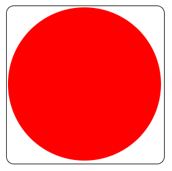
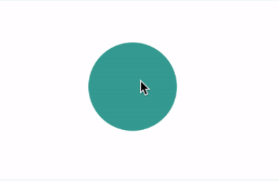

# CSS Coding Practice

<br/>

## Q. Draw a circle inside square using single DIV in css?

**Example:**

<p align="center">
  
</p>

<details><summary><b>Answer</b></summary>

```html
<!DOCTYPE html>
<html>
  <head>
    <title>Circle inside Square</title>
  </head>
  <style>
    .rectangle {
        border-radius: 10px;
        display: inline-block;
        width: 205px;
        height: 205px;
        border: 1px solid #000;
        background-color: white;
    }
    .rectangle::before {
        display: block;
        position: absolute;
        left: 10px;
        top: 10px;
        content: '';
        width: 200px;
        height: 200px;
        border-radius: 50%;
        background-color: red;
    }
    </style>
    <body>
        <div class="rectangle"></div>
    </body>
</html>
```

**&#9885; [Try this example on CodeSandbox](https://codesandbox.io/s/css-circle-inside-square-xqfsuj?file=/index.html)**

</details>

<div align="right">
    <b><a href="#">↥ back to top</a></b>
</div>

## Q. How to center a div within another div?

<details><summary><b>Answer</b></summary>

**Solution 01:**

```html
<style>
  .container {
    width: 500px;
    height: 500px;
    background-color: red;
    position: absolute;
    top:0;
    bottom: 0;
    left: 0;
    right: 0;
    margin: auto;
  }
</style>

<div class="container"></div>
```

**Solution 02:** Text-Align Method

```html
<style>
.text-align-container {
  text-align: center;
}

.text-align {
  background-color: #0074d9;
  width: 100px;
  height: 100px;
  display: inline-block;
}
</style>

<div class="text-align-container">
  <div class="text-align"></div>
</div>
```

**Solution 03:** Margin Auto Method

```html
<style>
  .margin-auto {
    background-color: #ffdc00;
    width: 100px;
    height: 100px;
    margin: 0 auto;
  }
</style>

<div class="margin-auto"></div>
```

**Solution 04:** Absolute Positioning Method

```html
<style>
  .absolute-positioning {
    background-color: #3d9970;
    width: 100px;
    height: 100px;
    position: absolute;
    left: 50%;
    margin-left: -50px;
  }
</style>

<div class="absolute-positioning"></div>
```

**&#9885; [Try this example on CodeSandbox](https://codesandbox.io/s/css-centering-div-80iz0w?file=/src/styles.css)**

</details>

<div align="right">
    <b><a href="#">↥ back to top</a></b>
</div>

## Q. How to create a zebra striped table with CSS?

To create a zebra-striped table, use the nth-child() selector and add a background-color to all even (or odd) table rows:

```css
tr:nth-child(even) {
    background-color: #f2f2f2
}
```

**Live Demo**: [Zebra Striped](https://codepen.io/learning-zone/pen/zYwoxbM)

<div align="right">
    <b><a href="#">↥ back to top</a></b>
</div>

## Q. What elements will match each of the following CSS selectors?

* div, ```p``` Selects all ```<div>``` elements and all <p> elements
* div ```p``` Selects all ```<p>``` elements that are anywhere inside a <div> element
* div > ```p``` Selects all ```<p>``` elements where the immediate parent is a <div> element
* div + ```p``` Selects all ```<p>``` elements that are placed immediately after a <div> element
* div ~ ```p``` Selects all ```<p>``` elements that are anywhere preceded by a <div> element

<div align="right">
    <b><a href="#">↥ back to top</a></b>
</div>

## Q. How to align image vertically in a division that spans vertically on the whole webpage?

You can align an image vertically center inside a `<div>` by using the **CSS vertical-align** property in combination with the `display: table-cell;` on the containing div element.

Additionally, since CSS margin property is not applicable to `display: table-cell;` elements, so we\'ve wrapped the containing DIV with another DIV (`.outer-wrapper`) and applied margin on it. This solution will work even for images with greater height than containing DIV.

**Example**

```html
<!DOCTYPE html>
<html lang="en">
  <head>
  <meta charset="utf-8">
  <title>Vertically Center the IMG in a DIV with CSS</title>
  <style>
    .outer-wrapper {
      display: inline-block; 
      margin: 20px;
    }

    .frame {  
      width: 250px;
      height: 200px;
      border: 1px solid black;
      vertical-align: middle;
      text-align: center;
      display: table-cell;
    } 

    img {
      max-width: 100%;
      max-height: 100%;
      display: block;
      margin: 0 auto;
    }
  </style>
  </head>
<body>
    <h2>Vertically Center the IMG in a DIV with CSS</h2>
    <!-- Alignment of undersized image -->
    <div class="outer-wrapper">
        <div class="frame">
            
        </div>
    </div>
</body>
</html>
```

**Live Demo**: [CSS vertical-align Property](https://learning-zone.github.io/css-interview-questions/assets/files/vertical-align.html)

<div align="right">
    <b><a href="#">↥ back to top</a></b>
</div>

## Q. How to style every element which has an adjacent item right before it?

```html
<!DOCTYPE html>
<html>
  <head>
    <title>CSS Combinator</title>
    <style>
        div + p {
            background-color: yellow;
        }
    </style>
  </head>
<body>
    <div>
        <h2>My name is Donald</h2>
        <p>I live in Duckburg.</p>
    </div>

    <p>My best friend is Mickey.</p>
    <p>I will not be styled.</p>
</body>
</html>
```

**Live Demo**: [CSS Combinator](https://learning-zone.github.io/css-interview-questions/assets/files/combinator.html)

<div align="right">
    <b><a href="#">↥ back to top</a></b>
</div>

## Q. Write down a selector that will match any links end in .zip, .ZIP, .Zip etc.

`[att$=val]` Represents an element with the att attribute whose value ends with the suffix “val”. If “val” is the empty string then the selector does not represent anything.

```css
a[href$=".zip" i]:after {
  content: '↓'
}
```

<div align="right">
    <b><a href="#">↥ back to top</a></b>
</div>

## Q. Place a div to corner top-right of the page?

```html
<!DOCTYPE html>
<html>
  <head>
    <title>CSS Position</title>
    <style>
      .topheader {
        position: relative;
        height: 20px;
      }

      .message {
        position: absolute;
        top: 0;
        right: 0;
        border: 1px solid;
      }
    </style>
  </head>
<body>
    <div class="topheader">
      <div class="message">Hello World!</div>
    </div>
</body>
</html>
```

**Live Demo**: [CSS Position](https://codepen.io/learning-zone/pen/wvdoBVd)

<div align="right">
    <b><a href="#">↥ back to top</a></b>
</div>

## Q. You have 3 div\'s. You have to align first div in right side and other 2 div’s in left side. Write CSS to achieve this?

### **using flexbox**

```css
.example {
    display: flex;
    flex-direction: row;
}

.example > .a {order: 3; } /* Will be displayed third  */
.example > .b {order: 1; } /* Will be displayed second */
.example > .c {order: 2; } /* Will be displayed first  */
```

```html
<div class="example">
    <div class="a">First</div>
    <div class="b">Second</div>
    <div class="c">Third</div>
</div>
```

**Live Demo**: [Flexbox Example](https://codepen.io/learning-zone/pen/poPNJzL)

<div align="right">
    <b><a href="#">↥ back to top</a></b>
</div>

## Q. CSS Media Query Example

```css
@media screen and (min-width: 769px) {
    /* STYLES HERE */
}

@media screen and (min-device-width: 481px) and (max-device-width: 768px) { 
    /* STYLES HERE */
}

@media only screen and (max-device-width: 480px) {
    /* STYLES HERE */
}
```

```css
@media only screen and (max-width: 1080px) {
  /* place here CSS for when the screen is less than 1080px wide */
  .card {
    width: 100%;
  }
}
```

**Live Demo**: [CSS Media Query](https://codepen.io/learning-zone/pen/poPNJjV)

<div align="right">
    <b><a href="#">↥ back to top</a></b>
</div>

## Q. CSS background-color gray opacity css code example

```css
.transparent {
    background-color: rgba(255, 255, 255, 0.5);
}
.transparent {
    opacity: 0.5;
}
```

**Live Demo**: [CSS Opacity](https://codepen.io/learning-zone/pen/OJmbVNm)

<div align="right">
    <b><a href="#">↥ back to top</a></b>
</div>

## Q. Place header at bottom of div

```css
#header {
  position: relative;
  min-height: 150px;
}

#header-content {
  position: absolute;
  bottom: 0;
  left: 0;
}

#header, #header * {
  background: rgba(40, 40, 100, 0.25);
}
```

<div align="right">
    <b><a href="#">↥ back to top</a></b>
</div>

## Q. CSS Gradient Example

```css
/*From bottom to top*/

.container {
  width: 500px;
  padding: 4px;
  background: linear-gradient(to top, red, yellow); 
}
```

**Live Demo**: [CSS Gradient](https://codepen.io/learning-zone/pen/mdmOJWR)

<div align="right">
    <b><a href="#">↥ back to top</a></b>
</div>

## Q. How to make fixed background image in css

```css
body {
  background-image: url("../images/horse.jpg");
  background-position: center;
  background-repeat: no-repeat;
  background-attachment: fixed;
  background-size: cover;
}
```

**Live Demo**: [CSS fixed-background](https://codepen.io/learning-zone/pen/GRmNgbZ)

<div align="right">
    <b><a href="#">↥ back to top</a></b>
</div>

## Q. Add space between flex items

```css
.flex-gap {
  display: inline-flex;
  flex-wrap: wrap;
}

.flex-gap > div {
  margin: 6px; /* HERE WE ADD THE SPACE */
}
```

**Live Demo**: [Flexbox Space](https://codepen.io/learning-zone/pen/ZEKBGoZ)

<div align="right">
    <b><a href="#">↥ back to top</a></b>
</div>

## Q. How to disable arrows from input type number?

```css
/* Chrome, Safari, Edge, Opera */
input::-webkit-outer-spin-button,
input::-webkit-inner-spin-button {
  -webkit-appearance: none;
  margin: 0;
}

/* Firefox */
input[type=number] {
  -moz-appearance: textfield;
}
```

**Live Demo**: [Number Input Field](https://codepen.io/learning-zone/pen/vYmyOax)

<div align="right">
    <b><a href="#">↥ back to top</a></b>
</div>

## Q. How to get text to start a new line?

```css
.break-word {
  word-wrap: break-word;
}
```

**Live Demo**: [CSS word-wrap](https://codepen.io/learning-zone/pen/GRmNJwM)

<div align="right">
    <b><a href="#">↥ back to top</a></b>
</div>

## Q. How to select child element in css?

```css
.parent > .immediate-child {
  color: red;
}
```

**Live Demo**: [CSS select child element](https://codepen.io/learning-zone/pen/abWBOXv)

<div align="right">
    <b><a href="#">↥ back to top</a></b>
</div>

## Q. minmax with repeat css grid

```css
/* To achieve wrapping, we can use the auto-fit or auto-fill keywords. */

grid-template-columns: repeat( auto-fit, minmax(250px, 1fr) );
```

**Live Demo**: [CSS grid-template-columns](https://codepen.io/learning-zone/pen/mdmOJYq)

<div align="right">
    <b><a href="#">↥ back to top</a></b>
</div>

## Q. How to make text not selectable in css?

```css
.noselect {
  -webkit-touch-callout: none; /* iOS Safari */
    -webkit-user-select: none; /* Safari */
     -khtml-user-select: none; /* Konqueror HTML */
       -moz-user-select: none; /* Old versions of Firefox */
        -ms-user-select: none; /* Internet Explorer/Edge */
            user-select: none; /* Non-prefixed version, currently
                                  supported by Chrome, Opera and Firefox */
}
```

**Live Demo**: [Not Selectable Text](https://codepen.io/learning-zone/pen/gOWLaLj)

<div align="right">
    <b><a href="#">↥ back to top</a></b>
</div>

## Q.Center wrapped flex children?

```css
.container {
  display: flex;
  
  justify-content: space-around;
  /* OR */
  justify-content: space-evenly;
}
```

**Live Demo**: [flex children](https://codepen.io/learning-zone/pen/oNWYjWG)

<div align="right">
    <b><a href="#">↥ back to top</a></b>
</div>

## Q. Create a rounded corner button using css?

```css
.btn {
  background-color: #f44336;
  border: none;
  color: white;
  padding: 20px;
  text-align: center;
  text-decoration: none;
  display: inline-block;
  font-size: 16px;
  margin: 4px 2px;
  cursor: pointer;
  border-radius: 10px;
}
```

**Live Demo**: [Rounded Corner Button](https://codepen.io/learning-zone/pen/NWjbGaV)

<div align="right">
    <b><a href="#">↥ back to top</a></b>
</div>

## Q. How apply blur in background-image

```css
.background-image {
  position: fixed;
  left: 0;
  right: 0;
  z-index: 1;
  display: block;
  background-image: url('../images/lL6tQfy.png');
  width: 1200px;
  height: 800px;
  -webkit-filter: blur(5px);
  -moz-filter: blur(5px);
  -o-filter: blur(5px);
  -ms-filter: blur(5px);
  filter: blur(5px);
}
```

**Live Demo**: [blur in background-image](https://codepen.io/learning-zone/pen/poPNqoy)

<div align="right">
    <b><a href="#">↥ back to top</a></b>
</div>

## Q. CSS text-overflow ellipsis multiple lines

```css
p {
  width: 200px;
  white-space: nowrap;
  overflow: hidden;
  display: inline-block;
  text-overflow: ellipsis;
  border: 1px solid #ddd;
  margin: 0;
}
```

**Live Demo**: [CSS text-overflow ellipsis](https://codepen.io/learning-zone/pen/NWjbeqW)

<div align="right">
    <b><a href="#">↥ back to top</a></b>
</div>

## Q. How to place a fixed button at bottom right of the screen in html

```css
.feedback {
  background-color : #31B0D5;
  color: white;
  padding: 10px 20px;
  border-radius: 4px;
  border-color: #46b8da;
}

#mybutton {
  position: fixed;
  bottom: -4px;
  right: 10px;
}
```

```html
<div id="mybutton">
  <button class="feedback">Feedback</button>
</div>
```

**Live Demo**: [fixed button](https://codepen.io/learning-zone/pen/ExmNGVw)

<div align="right">
    <b><a href="#">↥ back to top</a></b>
</div>

## Q. How to place a div in center and middle of the page?

```css
.centered {
  position: fixed;
  top: 50%;
  left: 50%;
  transform: translate(-50%, -50%);
}
```

**Live Demo**: [center div](https://codepen.io/learning-zone/pen/dyWOwpq)

<div align="right">
    <b><a href="#">↥ back to top</a></b>
</div>

## Q. Sass @extend and Inheritance

```css
.button-basic  {
  border: none;
  padding: 15px 30px;
  text-align: center;
  font-size: 16px;
  cursor: pointer;
}

.button-report  {
  @extend .button-basic;
  background-color: red;
}

.button-submit  {
  @extend .button-basic;
  background-color: green;
  color: white;
}
```

**Live Demo**: [Sass @extend](https://codepen.io/learning-zone/pen/MWmbZvm)

<div align="right">
    <b><a href="#">↥ back to top</a></b>
</div>

## Q. How to create css fade in?

```css
.fade-in-image {
  animation: fadeIn 5s;
}
@keyframes fadeIn {
  0% {opacity:0;}
  100% {opacity:1;}
}
```

**Live Demo**: [CSS fade-in](https://codepen.io/learning-zone/pen/MWmJEaQ)

<div align="right">
    <b><a href="#">↥ back to top</a></b>
</div>

## Q. How to read property with data attribute?

```html
<div data-content="data-attribute example in css"></div>
```

```css
[data-content]:before {
  content: attr(data-content);
}
```

**Live Demo**: [CSS data-attribute](https://codepen.io/learning-zone/pen/eYWgGxx)

<div align="right">
    <b><a href="#">↥ back to top</a></b>
</div>

## Q. How to remove button highlight when click using CSS?

```css
button:focus { outline: 0; }
```

**Live Demo**: [CSS outline](https://codepen.io/learning-zone/pen/oNWBGrb)

<div align="right">
    <b><a href="#">↥ back to top</a></b>
</div>

## Q. How to select last nth child

```html
<p>The first paragraph.</p>
<p>The second paragraph.</p>
<p>The third paragraph.</p>
<p>The fourth paragraph.</p>
<p>The fifth paragraph.</p>
```

```css
p:nth-last-child(3) {
  background-color: yellow;
}
```

**Live Demo**: [CSS nth-last-child()](https://codepen.io/learning-zone/pen/poPRdoQ)

<div align="right">
    <b><a href="#">↥ back to top</a></b>
</div>

## Q. Can i call mixin in html?

```css
/* sass mixin */

@mixin transform($property) {
  -webkit-transform: $property;
  -ms-transform: $property;
  transform: $property;
}
.box { @include transform(rotate(45deg)); }
```

**Live Demo**: [SASS @mixin()](https://codepen.io/learning-zone/pen/OJmWOVz)

<div align="right">
    <b><a href="#">↥ back to top</a></b>
</div>

## Q. How to rotate text using CSS?

```css
/* Answer to: "css rotate text" */

.rotate {

  transform: rotate(-90deg);

  /* Legacy vendor prefixes that you probably don't need... */
  /* Safari */
  -webkit-transform: rotate(-90deg);
  /* Firefox */
  -moz-transform: rotate(-90deg);
  /* IE */
  -ms-transform: rotate(-90deg);
  /* Opera */
  -o-transform: rotate(-90deg);
  /* Internet Explorer */
  filter: progid:DXImageTransform.Microsoft.BasicImage(rotation=3);
}
```

**Live Demo**: [CSS rotate()](https://codepen.io/learning-zone/pen/LYyxOjx)

<div align="right">
    <b><a href="#">↥ back to top</a></b>
</div>

## Q. How to make text blink using css?**

```css
.blink {
  animation: blinker 1s linear infinite;
}

@keyframes blinker {
  50% {
    opacity: 0;
  }
}
```

```html
<div class="blink">Blink Text Example!</div>
```

**Live Demo**: [CSS Animation](https://codepen.io/learning-zone/pen/NWjdwwE)

<div align="right">
    <b><a href="#">↥ back to top</a></b>
</div>

## Q. How to fix nav bar to top using CSS?

```css
.navigation {
   /* fixed keyword is fine too */
   position: sticky;
   top: 0;
   z-index: 100;
   /* z-index works pretty much like a layer:
   the higher the z-index value, the greater
   it will allow the navigation tag to stay on top
   of other tags */
}
```

**Live Demo**: [Sticky/Affix Navbar](https://codepen.io/learning-zone/pen/gOWgXzK)

<div align="right">
    <b><a href="#">↥ back to top</a></b>
</div>

## Q. How to change input border color when selected?

```css
input:focus {
	outline: none;
  	border: 1px solid red;
}
```

**Live Demo**: [CSS focus](https://codepen.io/learning-zone/pen/eYWgePp)

<div align="right">
    <b><a href="#">↥ back to top</a></b>
</div>

## Q. How to import otf font in CSS?

```css
@font-face {
    font-family: GraublauWeb;
    src: url("path/GraublauWeb.otf") format("opentype");
}
```

**Live Demo**: [CSS @font-face](https://codepen.io/learning-zone/pen/YzVNEge)

<div align="right">
    <b><a href="#">↥ back to top</a></b>
</div>

## Q. Create image shadow using CSS?

```css
div.polaroid {
  width: 250px;
  box-shadow: 0 4px 8px 0 rgba(0, 0, 0, 0.2), 0 6px 20px 0 rgba(0, 0, 0, 0.19);
  text-align: center;
}
```

**Live Demo**: [CSS box-shadow](https://codepen.io/learning-zone/pen/eYWgewZ)

<div align="right">
    <b><a href="#">↥ back to top</a></b>
</div>

## Q. How to create an if-else clause in SASS?

```css
/** How to create an if-else clause in sass

* First create a mixin, which is like a function in javaScript
* And pass in an optional parameter to the mixin to hold the value
* js ==> if, else if, else, while sass is ==> @if, @else if, @else
* No brackets surrounding each condition in sass
* Then pass in your block of styles to optionally load.
* @mixin variable-name(optional parameter(s))
*
**/

  @mixin border-stroke($val){
    @if $val == light {
      border: 1px solid black;
    }
    @else if $val == medium {
      border: 3px solid black;
    }
    @else if $val == heavy {
      border: 6px solid black;
    }
    @else{
      border: none;
    }
  }

  // Usage
  // Call a mixin using the @include followed by the mixin name

  h2{
    @include border-stroke(medium)
  }
```

```css
/**
* scss conditional style
* 
**/

$p: 3;

@while $p < 5 {
  .item-#{$p} {
        color: red;   
        $p : $p + 1;
    }
}
```

<div align="right">
    <b><a href="#">↥ back to top</a></b>
</div>

## Q. How to disable mouseover in css?

```css
.noHover{
    pointer-events: none;
}
```

```html
<a href='' class='btn noHover'>You cant touch ME !</a>
```

**Live Demo**: [CSS pointer-events](https://codepen.io/learning-zone/pen/ExmZoxW)

<div align="right">
    <b><a href="#">↥ back to top</a></b>
</div>

## Q. CSS Animation

Which of the following would create the below animation? Moving the mouse over the div should double its size, and the animation should happen over 500s.

```html
<style>
  div {
    height: 50px;
    width: 50px;
    background: #3ba59b;
    border-radius: 50%;
  }
</style>
<div class="greyBall"></div>
```

<p align="left">
  
</p>

Pick ONE OR MORE options

```css
1. .greyBall:hover {transform: scale(2); animate: 500ms;}

2. .greyBall:hover {transform: scale(2); transition:500ms transform;}

3. .greyBall:hover {transform: scale(2); transition: 0.5s;}

4. .greyBall:hover {transform: scale(2); animate: 0.5S;}
```

<details><summary><b>Answer</b></summary>

```css
.greyBall:hover {
  transform: scale(2);
  transition: 500ms transform;
}
```

```css
.greyBall:hover {
  transform: scale(2);
  transition: 0.5s;
}
```

**&#9885; [Try this example on CodeSandbox](https://codesandbox.io/s/css-animation-j0l6yb?file=/src/styles.css)**

</details>

<div align="right">
    <b><a href="#">↥ back to top</a></b>
</div>

## Q. CSS object-fit

Which of the following are true about the CSSproperty 'object-fit'?

Pick ONE OR MORE options

```css
1. 'object-fit: contain;' does not preserve the aspect ratio of the image; it stretches the image to cover the entire width and height of the container.

2. 'object-fit: contain;' preserves the aspect ratio of the image and makes sure no clipping happens to the whole image.

3. object-fit: cover;' avoids the image getting squeezed, but it could end up clipping the image.

4. object-fit: cover;' avoids clipping the image by sacrificing the aspect ratio.
```

<details><summary><b>Answer</b></summary>

```css
2. 'object-fit: contain;' preserves the aspect ratio of the image and makes sure no clipping happens to the whole image.

3. object-fit: cover;' avoids the image getting squeezed, but it could end up clipping the image.
```

**&#9885; [Try this example on CodeSandbox](https://codesandbox.io/s/css-object-fit-l9y2iu?file=/index.html)**

</details>

<div align="right">
    <b><a href="#">↥ back to top</a></b>
</div>

## Q. CSS Ellipsis

If an element extends beyond the allocated width, how do you truncate the sentence with an ellipsis (...) using CSS?

For example, "Hello! I am an element, and my width is larger than the container..."

Pick ONE OR MORE options

```css
1. { white-space: pre-wrap; overflow: ellipsis; }

2. { text-overflow: ellipsis: white-space: wrap; visibility: hidden; }

3. { white-space: nowrap; overflow: hidden; text-overflow: ellipsis; }

4. None of the above 
```

<details><summary><b>Answer</b></summary>

```css
.container {
  white-space: nowrap;
  overflow: hidden;
  text-overflow: ellipsis;
}
```

**&#9885; [Try this example on CodeSandbox](https://codesandbox.io/s/css-ellipsis-xycj5r?file=/src/styles.css)**

</details>

<div align="right">
    <b><a href="#">↥ back to top</a></b>
</div>

## Q. CSS Text Coloring

Which of the following renders the text red?

```html
<p id="tagld">Please color me red</p>
```

Pick ONE OR MORE options

```css
1. :root{ --text-color: red; } p { color: --text-color; }

2. :root{ --text-color: red; } p { color: var(--text-color); }

3. #tagId { color: red; } p { color: blue; }

4. p { color: red !important; } #tagId { color: blue; }
```

<details><summary><b>Answer</b></summary>

```css
:root {
  --text-color: red;
}
p {
  color: var(--text-color);
}
```

```css
p {
  color: red !important;
}
#tagId {
  color: blue;
}
```

**&#9885; [Try this example on CodeSandbox](https://codesandbox.io/s/css-text-coloring-4qyf4d?file=/src/styles.css)**

</details>

<div align="right">
    <b><a href="#">↥ back to top</a></b>
</div>

## Q. CSS Selection

How do you prevent the user from selecting the text rendered inside the following element?

```html
<p>I should not be selectable</p>
```

Pick ONE OR MORE options

```css
1. p { cursor-event: none; }

2. p { pointer-event: none; }

3. p { user-select: none; }

4. None of the above
```

<details><summary><b>Answer</b></summary>

```css
p {
  user-select: none;
}
```

**&#9885; [Try this example on CodeSandbox](https://codesandbox.io/s/css-selection-kvuzpr?file=/src/styles.css)**

</details>

<div align="right">
    <b><a href="#">↥ back to top</a></b>
</div>

## Q. CSS Input Placeholder

How do you hide the "placeholder" text of an `<input>` field?

Pick ONE OR MORE options

```css
1. input::placeholder { visibility: clip; }

2. input::placeholder { color: transparent; }

3. input::placeholder { display: none; }

4. input::placeholder { visibility: hidden; }
```

<details><summary><b>Answer</b></summary>

```css
input::placeholder {
  color: transparent;
}
```

```css
input::placeholder {
  visibility: hidden;
}
```

**&#9885; [Try this example on CodeSandbox](https://codesandbox.io/s/css-input-placeholder-bdpwyi?file=/src/styles.css)**

</details>

<div align="right">
    <b><a href="#">↥ back to top</a></b>
</div>

## Q. CSS Centering

Which of the following options can position the div with the class name "child" exactly at the center of the page?

```html
<div class="parent" style="width: 100vw; height: 100vh;">
  <div class="child" style="height: 100px; width: 100px; background: black"></div>
</div>
```

Pick ONE OR MORE options

```css
1. .parent { display: flex; justify-content: center; align-items: center; }

2. .parent { display: flex; justify-content: center; align-self: center; }

3. .parent { position: relative; } .child { position: absolute; top: 50%; left: 50%; }

4. .parent { position: relative; } .child { position: absolute; top: 50%; left: 50%; transform: translate(-50%, -50%); }
```

<details><summary><b>Answer</b></summary>

```css
.parent {
  display: flex;
  justify-content: center;
  align-items: center;
}
```

```css
.parent {
  position: relative;
}
.child {
  position: absolute;
  top: 50%;
  left: 50%;
  transform: translate(-50%, -50%);
}
```

**&#9885; [Try this example on CodeSandbox](https://codesandbox.io/s/css-centering-xdj4lg?file=/src/styles.css)**

</details>

<div align="right">
    <b><a href="#">↥ back to top</a></b>
</div>

## Q. CSS verticle-align

Which of the following are true about the CSS property 'vertical-align'?

```html
<p>
  Let's
  <span class="heroWord">Hack</span>
  
</p>
```

Pick ONE OR MORE options

```css
1. .heroWord { verical-align: 25px; } moves the word "Hack" to the bottom, 25px lower than the <p> tag.

2. .heroWord { verical-align: 25px; } moves the word "Hack" to the top, 25px heigher than the <p> tag.

3. p img { vertical-align: text-bottom; } moves the image to the bottom with respect to the <p> tag.

4. p img { vertical-align: text-bottom; } has no effect on the  tag.
```

<details><summary><b>Answer</b></summary>

```css
4. p img { vertical-align: text-bottom; } has no effect on the  tag.
```

**&#9885; [Try this example on CodeSandbox](https://codesandbox.io/s/css-verticle-align-hfbnym?file=/src/styles.css)**

</details>

<div align="right">
    <b><a href="#">↥ back to top</a></b>
</div>
