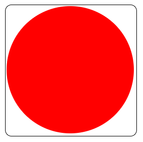
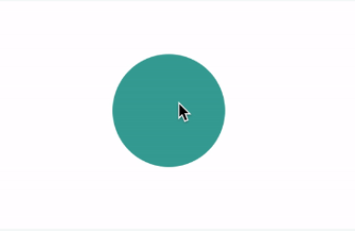

# CSS Coding Practice

<br/>

## Q. Draw a circle inside square using single DIV in css?

**Example:**

<p align="center">
  
</p>

<details><summary><b>Answer</b></summary>

```html
<!DOCTYPE html>
<html>
  <head>
    <title>Circle inside Square</title>
  </head>
  <style>
    .rectangle {
        border-radius: 10px;
        display: inline-block;
        width: 205px;
        height: 205px;
        border: 1px solid #000;
        background-color: white;
    }
    .rectangle::before {
        display: block;
        position: absolute;
        left: 10px;
        top: 10px;
        content: '';
        width: 200px;
        height: 200px;
        border-radius: 50%;
        background-color: red;
    }
    </style>
    <body>
        <div class="rectangle"></div>
    </body>
</html>
```

**&#9885; [Try this example on CodeSandbox](https://codesandbox.io/s/css-circle-inside-square-xqfsuj?file=/index.html)**

</details>

<div align="right">
    <b><a href="#">↥ back to top</a></b>
</div>

## Q. How to center a div within another div?

<details><summary><b>Answer</b></summary>

**Solution 01:**

```html
<style>
  .container {
    width: 500px;
    height: 500px;
    background-color: red;
    position: absolute;
    top:0;
    bottom: 0;
    left: 0;
    right: 0;
    margin: auto;
  }
</style>

<div class="container"></div>
```

**Solution 02:** Text-Align Method

```html
<style>
.text-align-container {
  text-align: center;
}

.text-align {
  background-color: #0074d9;
  width: 100px;
  height: 100px;
  display: inline-block;
}
</style>

<div class="text-align-container">
  <div class="text-align"></div>
</div>
```

**Solution 03:** Margin Auto Method

```html
<style>
  .margin-auto {
    background-color: #ffdc00;
    width: 100px;
    height: 100px;
    margin: 0 auto;
  }
</style>

<div class="margin-auto"></div>
```

**Solution 04:** Absolute Positioning Method

```html
<style>
  .absolute-positioning {
    background-color: #3d9970;
    width: 100px;
    height: 100px;
    position: absolute;
    left: 50%;
    margin-left: -50px;
  }
</style>

<div class="absolute-positioning"></div>
```

**&#9885; [Try this example on CodeSandbox](https://codesandbox.io/s/css-centering-div-80iz0w?file=/src/styles.css)**

</details>

<div align="right">
    <b><a href="#">↥ back to top</a></b>
</div>

## Q. How to create a zebra striped table with CSS?

To create a zebra-striped table, use the nth-child() selector and add a background-color to all even (or odd) table rows:

```css
tr:nth-child(even) {
    background-color: #f2f2f2
}
```

**Live Demo**: [Zebra Striped](https://codepen.io/learning-zone/pen/zYwoxbM)

<div align="right">
    <b><a href="#">↥ back to top</a></b>
</div>

## Q. What elements will match each of the following CSS selectors?

* div, ```p``` Selects all ```<div>``` elements and all <p> elements
* div ```p``` Selects all ```<p>``` elements that are anywhere inside a <div> element
* div > ```p``` Selects all ```<p>``` elements where the immediate parent is a <div> element
* div + ```p``` Selects all ```<p>``` elements that are placed immediately after a <div> element
* div ~ ```p``` Selects all ```<p>``` elements that are anywhere preceded by a <div> element

<div align="right">
    <b><a href="#">↥ back to top</a></b>
</div>

## Q. How to align image vertically in a division that spans vertically on the whole webpage?

You can align an image vertically center inside a `<div>` by using the **CSS vertical-align** property in combination with the `display: table-cell;` on the containing div element.

Additionally, since CSS margin property is not applicable to `display: table-cell;` elements, so we\'ve wrapped the containing DIV with another DIV (`.outer-wrapper`) and applied margin on it. This solution will work even for images with greater height than containing DIV.

**Example**

```html
<!DOCTYPE html>
<html lang="en">
  <head>
  <meta charset="utf-8">
  <title>Vertically Center the IMG in a DIV with CSS</title>
  <style>
    .outer-wrapper {
      display: inline-block; 
      margin: 20px;
    }

    .frame {  
      width: 250px;
      height: 200px;
      border: 1px solid black;
      vertical-align: middle;
      text-align: center;
      display: table-cell;
    } 

    img {
      max-width: 100%;
      max-height: 100%;
      display: block;
      margin: 0 auto;
    }
  </style>
  </head>
<body>
    <h2>Vertically Center the IMG in a DIV with CSS</h2>
    <!-- Alignment of undersized image -->
    <div class="outer-wrapper">
        <div class="frame">
            
        </div>
    </div>
</body>
</html>
```

**Live Demo**: [CSS vertical-align Property](https://learning-zone.github.io/css-interview-questions/assets/files/vertical-align.html)

<div align="right">
    <b><a href="#">↥ back to top</a></b>
</div>

## Q. How to style every element which has an adjacent item right before it?

```html
<!DOCTYPE html>
<html>
  <head>
    <title>CSS Combinator</title>
    <style>
        div + p {
            background-color: yellow;
        }
    </style>
  </head>
<body>
    <div>
        <h2>My name is Donald</h2>
        <p>I live in Duckburg.</p>
    </div>

    <p>My best friend is Mickey.</p>
    <p>I will not be styled.</p>
</body>
</html>
```

**Live Demo**: [CSS Combinator](https://learning-zone.github.io/css-interview-questions/assets/files/combinator.html)

<div align="right">
    <b><a href="#">↥ back to top</a></b>
</div>

## Q. Write down a selector that will match any links end in .zip, .ZIP, .Zip etc.

`[att$=val]` Represents an element with the att attribute whose value ends with the suffix “val”. If “val” is the empty string then the selector does not represent anything.

```css
a[href$=".zip" i]:after {
  content: '↓'
}
```

<div align="right">
    <b><a href="#">↥ back to top</a></b>
</div>

## Q. Place a div to corner top-right of the page?

```html
<!DOCTYPE html>
<html>
  <head>
    <title>CSS Position</title>
    <style>
      .topheader {
        position: relative;
        height: 20px;
      }

      .message {
        position: absolute;
        top: 0;
        right: 0;
        border: 1px solid;
      }
    </style>
  </head>
<body>
    <div class="topheader">
      <div class="message">Hello World!</div>
    </div>
</body>
</html>
```

**Live Demo**: [CSS Position](https://codepen.io/learning-zone/pen/wvdoBVd)

<div align="right">
    <b><a href="#">↥ back to top</a></b>
</div>

## Q. You have 3 div\'s. You have to align first div in right side and other 2 div’s in left side. Write CSS to achieve this?

### **using flexbox**

```css
.example {
    display: flex;
    flex-direction: row;
}

.example > .a {order: 3; } /* Will be displayed third  */
.example > .b {order: 1; } /* Will be displayed second */
.example > .c {order: 2; } /* Will be displayed first  */
```

```html
<div class="example">
    <div class="a">First</div>
    <div class="b">Second</div>
    <div class="c">Third</div>
</div>
```

**Live Demo**: [Flexbox Example](https://codepen.io/learning-zone/pen/poPNJzL)

<div align="right">
    <b><a href="#">↥ back to top</a></b>
</div>

## Q. CSS Media Query Example

```css
@media screen and (min-width: 769px) {
    /* STYLES HERE */
}

@media screen and (min-device-width: 481px) and (max-device-width: 768px) { 
    /* STYLES HERE */
}

@media only screen and (max-device-width: 480px) {
    /* STYLES HERE */
}
```

```css
@media only screen and (max-width: 1080px) {
  /* place here CSS for when the screen is less than 1080px wide */
  .card {
    width: 100%;
  }
}
```

**Live Demo**: [CSS Media Query](https://codepen.io/learning-zone/pen/poPNJjV)

<div align="right">
    <b><a href="#">↥ back to top</a></b>
</div>

## Q. CSS background-color gray opacity css code example

```css
.transparent {
    background-color: rgba(255, 255, 255, 0.5);
}
.transparent {
    opacity: 0.5;
}
```

**Live Demo**: [CSS Opacity](https://codepen.io/learning-zone/pen/OJmbVNm)

<div align="right">
    <b><a href="#">↥ back to top</a></b>
</div>

## Q. Place header at bottom of div

```css
#header {
  position: relative;
  min-height: 150px;
}

#header-content {
  position: absolute;
  bottom: 0;
  left: 0;
}

#header, #header * {
  background: rgba(40, 40, 100, 0.25);
}
```

<div align="right">
    <b><a href="#">↥ back to top</a></b>
</div>

## Q. CSS Gradient Example

```css
/*From bottom to top*/

.container {
  width: 500px;
  padding: 4px;
  background: linear-gradient(to top, red, yellow); 
}
```

**Live Demo**: [CSS Gradient](https://codepen.io/learning-zone/pen/mdmOJWR)

<div align="right">
    <b><a href="#">↥ back to top</a></b>
</div>

## Q. How to make fixed background image in css

```css
body {
  background-image: url("../images/horse.jpg");
  background-position: center;
  background-repeat: no-repeat;
  background-attachment: fixed;
  background-size: cover;
}
```

**Live Demo**: [CSS fixed-background](https://codepen.io/learning-zone/pen/GRmNgbZ)

<div align="right">
    <b><a href="#">↥ back to top</a></b>
</div>

## Q. Add space between flex items

```css
.flex-gap {
  display: inline-flex;
  flex-wrap: wrap;
}

.flex-gap > div {
  margin: 6px; /* HERE WE ADD THE SPACE */
}
```

**Live Demo**: [Flexbox Space](https://codepen.io/learning-zone/pen/ZEKBGoZ)

<div align="right">
    <b><a href="#">↥ back to top</a></b>
</div>

## Q. How to disable arrows from input type number?

```css
/* Chrome, Safari, Edge, Opera */
input::-webkit-outer-spin-button,
input::-webkit-inner-spin-button {
  -webkit-appearance: none;
  margin: 0;
}

/* Firefox */
input[type=number] {
  -moz-appearance: textfield;
}
```

**Live Demo**: [Number Input Field](https://codepen.io/learning-zone/pen/vYmyOax)

<div align="right">
    <b><a href="#">↥ back to top</a></b>
</div>

## Q. How to get text to start a new line?

```css
.break-word {
  word-wrap: break-word;
}
```

**Live Demo**: [CSS word-wrap](https://codepen.io/learning-zone/pen/GRmNJwM)

<div align="right">
    <b><a href="#">↥ back to top</a></b>
</div>

## Q. How to select child element in css?

```css
.parent > .immediate-child {
  color: red;
}
```

**Live Demo**: [CSS select child element](https://codepen.io/learning-zone/pen/abWBOXv)

<div align="right">
    <b><a href="#">↥ back to top</a></b>
</div>

## Q. minmax with repeat css grid

```css
/* To achieve wrapping, we can use the auto-fit or auto-fill keywords. */

grid-template-columns: repeat( auto-fit, minmax(250px, 1fr) );
```

**Live Demo**: [CSS grid-template-columns](https://codepen.io/learning-zone/pen/mdmOJYq)

<div align="right">
    <b><a href="#">↥ back to top</a></b>
</div>

## Q. How to make text not selectable in css?

```css
.noselect {
  -webkit-touch-callout: none; /* iOS Safari */
    -webkit-user-select: none; /* Safari */
     -khtml-user-select: none; /* Konqueror HTML */
       -moz-user-select: none; /* Old versions of Firefox */
        -ms-user-select: none; /* Internet Explorer/Edge */
            user-select: none; /* Non-prefixed version, currently
                                  supported by Chrome, Opera and Firefox */
}
```

**Live Demo**: [Not Selectable Text](https://codepen.io/learning-zone/pen/gOWLaLj)

<div align="right">
    <b><a href="#">↥ back to top</a></b>
</div>

## Q.Center wrapped flex children?

```css
.container {
  display: flex;
  
  justify-content: space-around;
  /* OR */
  justify-content: space-evenly;
}
```

**Live Demo**: [flex children](https://codepen.io/learning-zone/pen/oNWYjWG)

<div align="right">
    <b><a href="#">↥ back to top</a></b>
</div>

## Q. Create a rounded corner button using css?

```css
.btn {
  background-color: #f44336;
  border: none;
  color: white;
  padding: 20px;
  text-align: center;
  text-decoration: none;
  display: inline-block;
  font-size: 16px;
  margin: 4px 2px;
  cursor: pointer;
  border-radius: 10px;
}
```

**Live Demo**: [Rounded Corner Button](https://codepen.io/learning-zone/pen/NWjbGaV)

<div align="right">
    <b><a href="#">↥ back to top</a></b>
</div>

## Q. How apply blur in background-image

```css
.background-image {
  position: fixed;
  left: 0;
  right: 0;
  z-index: 1;
  display: block;
  background-image: url('../images/lL6tQfy.png');
  width: 1200px;
  height: 800px;
  -webkit-filter: blur(5px);
  -moz-filter: blur(5px);
  -o-filter: blur(5px);
  -ms-filter: blur(5px);
  filter: blur(5px);
}
```

**Live Demo**: [blur in background-image](https://codepen.io/learning-zone/pen/poPNqoy)

<div align="right">
    <b><a href="#">↥ back to top</a></b>
</div>

## Q. CSS text-overflow ellipsis multiple lines

```css
p {
  width: 200px;
  white-space: nowrap;
  overflow: hidden;
  display: inline-block;
  text-overflow: ellipsis;
  border: 1px solid #ddd;
  margin: 0;
}
```

**Live Demo**: [CSS text-overflow ellipsis](https://codepen.io/learning-zone/pen/NWjbeqW)

<div align="right">
    <b><a href="#">↥ back to top</a></b>
</div>

## Q. How to place a fixed button at bottom right of the screen in html

```css
.feedback {
  background-color : #31B0D5;
  color: white;
  padding: 10px 20px;
  border-radius: 4px;
  border-color: #46b8da;
}

#mybutton {
  position: fixed;
  bottom: -4px;
  right: 10px;
}
```

```html
<div id="mybutton">
  <button class="feedback">Feedback</button>
</div>
```

**Live Demo**: [fixed button](https://codepen.io/learning-zone/pen/ExmNGVw)

<div align="right">
    <b><a href="#">↥ back to top</a></b>
</div>

## Q. How to place a div in center and middle of the page?

```css
.centered {
  position: fixed;
  top: 50%;
  left: 50%;
  transform: translate(-50%, -50%);
}
```

**Live Demo**: [center div](https://codepen.io/learning-zone/pen/dyWOwpq)

<div align="right">
    <b><a href="#">↥ back to top</a></b>
</div>

## Q. Sass @extend and Inheritance

```css
.button-basic  {
  border: none;
  padding: 15px 30px;
  text-align: center;
  font-size: 16px;
  cursor: pointer;
}

.button-report  {
  @extend .button-basic;
  background-color: red;
}

.button-submit  {
  @extend .button-basic;
  background-color: green;
  color: white;
}
```

**Live Demo**: [Sass @extend](https://codepen.io/learning-zone/pen/MWmbZvm)

<div align="right">
    <b><a href="#">↥ back to top</a></b>
</div>

## Q. How to create css fade in?

```css
.fade-in-image {
  animation: fadeIn 5s;
}
@keyframes fadeIn {
  0% {opacity:0;}
  100% {opacity:1;}
}
```

**Live Demo**: [CSS fade-in](https://codepen.io/learning-zone/pen/MWmJEaQ)

<div align="right">
    <b><a href="#">↥ back to top</a></b>
</div>

## Q. How to read property with data attribute?

```html
<div data-content="data-attribute example in css"></div>
```

```css
[data-content]:before {
  content: attr(data-content);
}
```

**Live Demo**: [CSS data-attribute](https://codepen.io/learning-zone/pen/eYWgGxx)

<div align="right">
    <b><a href="#">↥ back to top</a></b>
</div>

## Q. How to remove button highlight when click using CSS?

```css
button:focus { outline: 0; }
```

**Live Demo**: [CSS outline](https://codepen.io/learning-zone/pen/oNWBGrb)

<div align="right">
    <b><a href="#">↥ back to top</a></b>
</div>

## Q. How to select last nth child

```html
<p>The first paragraph.</p>
<p>The second paragraph.</p>
<p>The third paragraph.</p>
<p>The fourth paragraph.</p>
<p>The fifth paragraph.</p>
```

```css
p:nth-last-child(3) {
  background-color: yellow;
}
```

**Live Demo**: [CSS nth-last-child()](https://codepen.io/learning-zone/pen/poPRdoQ)

<div align="right">
    <b><a href="#">↥ back to top</a></b>
</div>

## Q. Can i call mixin in html?

```css
/* sass mixin */

@mixin transform($property) {
  -webkit-transform: $property;
  -ms-transform: $property;
  transform: $property;
}
.box { @include transform(rotate(45deg)); }
```

**Live Demo**: [SASS @mixin()](https://codepen.io/learning-zone/pen/OJmWOVz)

<div align="right">
    <b><a href="#">↥ back to top</a></b>
</div>

## Q. How to rotate text using CSS?

```css
/* Answer to: "css rotate text" */

.rotate {

  transform: rotate(-90deg);
}
```

**Live Demo**: [CSS rotate()](https://codepen.io/learning-zone/pen/LYyxOjx)

<div align="right">
    <b><a href="#">↥ back to top</a></b>
</div>

## Q. How to make text blink using css?**

```css
.blink {
  animation: blinker 1s linear infinite;
}

@keyframes blinker {
  50% {
    opacity: 0;
  }
}
```

```html
<div class="blink">Blink Text Example!</div>
```

**Live Demo**: [CSS Animation](https://codepen.io/learning-zone/pen/NWjdwwE)

<div align="right">
    <b><a href="#">↥ back to top</a></b>
</div>

## Q. How to fix nav bar to top using CSS?

```css
.navigation {
   /* fixed keyword is fine too */
   position: sticky;
   top: 0;
   z-index: 100;
   /* z-index works pretty much like a layer:
   the higher the z-index value, the greater
   it will allow the navigation tag to stay on top
   of other tags */
}
```

**Live Demo**: [Sticky/Affix Navbar](https://codepen.io/learning-zone/pen/gOWgXzK)

<div align="right">
    <b><a href="#">↥ back to top</a></b>
</div>

## Q. How to change input border color when selected?

```css
input:focus {
	outline: none;
  	border: 1px solid red;
}
```

**Live Demo**: [CSS focus](https://codepen.io/learning-zone/pen/eYWgePp)

<div align="right">
    <b><a href="#">↥ back to top</a></b>
</div>

## Q. How to import otf font in CSS?

```css
@font-face {
    font-family: GraublauWeb;
    src: url("path/GraublauWeb.otf") format("opentype");
}
```

**Live Demo**: [CSS @font-face](https://codepen.io/learning-zone/pen/YzVNEge)

<div align="right">
    <b><a href="#">↥ back to top</a></b>
</div>

## Q. Create image shadow using CSS?

```css
div.polaroid {
  width: 250px;
  box-shadow: 0 4px 8px 0 rgba(0, 0, 0, 0.2), 0 6px 20px 0 rgba(0, 0, 0, 0.19);
  text-align: center;
}
```

**Live Demo**: [CSS box-shadow](https://codepen.io/learning-zone/pen/eYWgewZ)

<div align="right">
    <b><a href="#">↥ back to top</a></b>
</div>

## Q. How to create an if-else clause in SASS?

```css
/** How to create an if-else clause in sass

* First create a mixin, which is like a function in javaScript
* And pass in an optional parameter to the mixin to hold the value
* js ==> if, else if, else, while sass is ==> @if, @else if, @else
* No brackets surrounding each condition in sass
* Then pass in your block of styles to optionally load.
* @mixin variable-name(optional parameter(s))
*
**/

  @mixin border-stroke($val){
    @if $val == light {
      border: 1px solid black;
    }
    @else if $val == medium {
      border: 3px solid black;
    }
    @else if $val == heavy {
      border: 6px solid black;
    }
    @else{
      border: none;
    }
  }

  // Usage
  // Call a mixin using the @include followed by the mixin name

  h2{
    @include border-stroke(medium)
  }
```

```css
/**
* scss conditional style
* 
**/

$p: 3;

@while $p < 5 {
  .item-#{$p} {
        color: red;   
        $p : $p + 1;
    }
}
```

<div align="right">
    <b><a href="#">↥ back to top</a></b>
</div>

## Q. How to disable mouseover in css?

```css
.noHover{
    pointer-events: none;
}
```

```html
<a href='' class='btn noHover'>You cant touch ME !</a>
```

**Live Demo**: [CSS pointer-events](https://codepen.io/learning-zone/pen/ExmZoxW)

<div align="right">
    <b><a href="#">↥ back to top</a></b>
</div>

## Q. CSS Animation

Which of the following would create the below animation? Moving the mouse over the div should double its size, and the animation should happen over 500s.

```html
<style>
  div {
    height: 50px;
    width: 50px;
    background: #3ba59b;
    border-radius: 50%;
  }
</style>
<div class="greyBall"></div>
```

<p align="left">
  
</p>

Pick ONE OR MORE options

```css
1. .greyBall:hover {transform: scale(2); animate: 500ms;}

2. .greyBall:hover {transform: scale(2); transition:500ms transform;}

3. .greyBall:hover {transform: scale(2); transition: 0.5s;}

4. .greyBall:hover {transform: scale(2); animate: 0.5S;}
```

<details><summary><b>Answer</b></summary>

```css
.greyBall:hover {
  transform: scale(2);
  transition: 500ms transform;
}
```

```css
.greyBall:hover {
  transform: scale(2);
  transition: 0.5s;
}
```

**&#9885; [Try this example on CodeSandbox](https://codesandbox.io/s/css-animation-j0l6yb?file=/src/styles.css)**

</details>

<div align="right">
    <b><a href="#">↥ back to top</a></b>
</div>

## Q. CSS object-fit

Which of the following are true about the CSSproperty 'object-fit'?

Pick ONE OR MORE options

```css
1. 'object-fit: contain;' does not preserve the aspect ratio of the image; it stretches the image to cover the entire width and height of the container.

2. 'object-fit: contain;' preserves the aspect ratio of the image and makes sure no clipping happens to the whole image.

3. object-fit: cover;' avoids the image getting squeezed, but it could end up clipping the image.

4. object-fit: cover;' avoids clipping the image by sacrificing the aspect ratio.
```

<details><summary><b>Answer</b></summary>

```css
2. 'object-fit: contain;' preserves the aspect ratio of the image and makes sure no clipping happens to the whole image.

3. object-fit: cover;' avoids the image getting squeezed, but it could end up clipping the image.
```

**&#9885; [Try this example on CodeSandbox](https://codesandbox.io/s/css-object-fit-l9y2iu?file=/index.html)**

</details>

<div align="right">
    <b><a href="#">↥ back to top</a></b>
</div>

## Q. CSS Ellipsis

If an element extends beyond the allocated width, how do you truncate the sentence with an ellipsis (...) using CSS?

For example, "Hello! I am an element, and my width is larger than the container..."

Pick ONE OR MORE options

```css
1. { white-space: pre-wrap; overflow: ellipsis; }

2. { text-overflow: ellipsis: white-space: wrap; visibility: hidden; }

3. { white-space: nowrap; overflow: hidden; text-overflow: ellipsis; }

4. None of the above 
```

<details><summary><b>Answer</b></summary>

```css
.container {
  white-space: nowrap;
  overflow: hidden;
  text-overflow: ellipsis;
}
```

**&#9885; [Try this example on CodeSandbox](https://codesandbox.io/s/css-ellipsis-xycj5r?file=/src/styles.css)**

</details>

<div align="right">
    <b><a href="#">↥ back to top</a></b>
</div>

## Q. CSS Text Coloring

Which of the following renders the text red?

```html
<p id="tagld">Please color me red</p>
```

Pick ONE OR MORE options

```css
1. :root{ --text-color: red; } p { color: --text-color; }

2. :root{ --text-color: red; } p { color: var(--text-color); }

3. #tagId { color: red; } p { color: blue; }

4. p { color: red !important; } #tagId { color: blue; }
```

<details><summary><b>Answer</b></summary>

```css
:root {
  --text-color: red;
}
p {
  color: var(--text-color);
}
```

```css
p {
  color: red !important;
}
#tagId {
  color: blue;
}
```

**&#9885; [Try this example on CodeSandbox](https://codesandbox.io/s/css-text-coloring-4qyf4d?file=/src/styles.css)**

</details>

<div align="right">
    <b><a href="#">↥ back to top</a></b>
</div>

## Q. CSS Selection

How do you prevent the user from selecting the text rendered inside the following element?

```html
<p>I should not be selectable</p>
```

Pick ONE OR MORE options

```css
1. p { cursor-event: none; }

2. p { pointer-event: none; }

3. p { user-select: none; }

4. None of the above
```

<details><summary><b>Answer</b></summary>

```css
p {
  user-select: none;
}
```

**&#9885; [Try this example on CodeSandbox](https://codesandbox.io/s/css-selection-kvuzpr?file=/src/styles.css)**

</details>

<div align="right">
    <b><a href="#">↥ back to top</a></b>
</div>

## Q. CSS Input Placeholder

How do you hide the "placeholder" text of an `<input>` field?

Pick ONE OR MORE options

```css
1. input::placeholder { visibility: clip; }

2. input::placeholder { color: transparent; }

3. input::placeholder { display: none; }

4. input::placeholder { visibility: hidden; }
```

<details><summary><b>Answer</b></summary>

```css
input::placeholder {
  color: transparent;
}
```

```css
input::placeholder {
  visibility: hidden;
}
```

**&#9885; [Try this example on CodeSandbox](https://codesandbox.io/s/css-input-placeholder-bdpwyi?file=/src/styles.css)**

</details>

<div align="right">
    <b><a href="#">↥ back to top</a></b>
</div>

## Q. CSS Centering

Which of the following options can position the div with the class name "child" exactly at the center of the page?

```html
<div class="parent" style="width: 100vw; height: 100vh;">
  <div class="child" style="height: 100px; width: 100px; background: black"></div>
</div>
```

Pick ONE OR MORE options

```css
1. .parent { display: flex; justify-content: center; align-items: center; }

2. .parent { display: flex; justify-content: center; align-self: center; }

3. .parent { position: relative; } .child { position: absolute; top: 50%; left: 50%; }

4. .parent { position: relative; } .child { position: absolute; top: 50%; left: 50%; transform: translate(-50%, -50%); }
```

<details><summary><b>Answer</b></summary>

```css
.parent {
  display: flex;
  justify-content: center;
  align-items: center;
}
```

```css
.parent {
  position: relative;
}
.child {
  position: absolute;
  top: 50%;
  left: 50%;
  transform: translate(-50%, -50%);
}
```

**&#9885; [Try this example on CodeSandbox](https://codesandbox.io/s/css-centering-xdj4lg?file=/src/styles.css)**

</details>

<div align="right">
    <b><a href="#">↥ back to top</a></b>
</div>

## Q. CSS verticle-align

Which of the following are true about the CSS property 'vertical-align'?

```html
<p>
  Let\'s
  <span class="heroWord">Hack</span>
  
</p>
```

Pick ONE OR MORE options

```css
1. .heroWord { verical-align: 25px; } moves the word "Hack" to the bottom, 25px lower than the <p> tag.

2. .heroWord { verical-align: 25px; } moves the word "Hack" to the top, 25px heigher than the <p> tag.

3. p img { vertical-align: text-bottom; } moves the image to the bottom with respect to the <p> tag.

4. p img { vertical-align: text-bottom; } has no effect on the  tag.
```

<details><summary><b>Answer</b></summary>

```css
4. p img { vertical-align: text-bottom; } has no effect on the  tag.
```

**&#9885; [Try this example on CodeSandbox](https://codesandbox.io/s/css-verticle-align-hfbnym?file=/src/styles.css)**

</details>

<div align="right">
    <b><a href="#">↥ back to top</a></b>
</div>

## Q. How to create a CSS-only triangle pointing downward?

<details><summary><b>Answer</b></summary>

CSS triangles exploit the way borders meet at corners when the element has zero width and height.

```css
.triangle-down {
  width: 0;
  height: 0;
  border-left: 30px solid transparent;
  border-right: 30px solid transparent;
  border-top: 50px solid #e74c3c;
}
```

```html
<div class="triangle-down"></div>
```

> Set the left and right borders to transparent and give a color only to the top border; the result is a downward-pointing triangle. Adjust the sizes to control proportions.

</details>

<div align="right">
    <b><a href="#">↥ back to top</a></b>
</div>

## Q. How to implement a sticky footer that always sits at the bottom of the viewport when content is short?

<details><summary><b>Answer</b></summary>

**Solution 01:** Flexbox approach (recommended)

```html
<!DOCTYPE html>
<html lang="en">
<head>
  <meta charset="UTF-8">
  <title>Sticky Footer</title>
  <style>
    html, body {
      height: 100%;
      margin: 0;
    }
    .page-wrapper {
      display: flex;
      flex-direction: column;
      min-height: 100vh;
    }
    main {
      flex: 1; /* grows to fill available space */
    }
    footer {
      background: #333;
      color: #fff;
      padding: 1rem;
      text-align: center;
    }
  </style>
</head>
<body>
  <div class="page-wrapper">
    <main>
      <p>Page content here.</p>
    </main>
    <footer>Sticky Footer</footer>
  </div>
</body>
</html>
```

**Solution 02:** CSS Grid approach

```css
.page-wrapper {
  display: grid;
  grid-template-rows: 1fr auto;
  min-height: 100vh;
}
```

> Both approaches keep the footer at the bottom when content is short, while allowing it to be pushed down naturally when content is tall.

</details>

<div align="right">
    <b><a href="#">↥ back to top</a></b>
</div>

## Q. How to create a full-page overlay/modal backdrop using CSS?

<details><summary><b>Answer</b></summary>

```css
.overlay {
  position: fixed;
  inset: 0;               /* shorthand for top/right/bottom/left: 0 */
  background-color: rgba(0, 0, 0, 0.6);
  z-index: 1000;
  display: flex;
  justify-content: center;
  align-items: center;
}

.modal {
  background: #fff;
  padding: 2rem;
  border-radius: 8px;
  max-width: 500px;
  width: 90%;
}
```

```html
<div class="overlay">
  <div class="modal">
    <h2>Modal Title</h2>
    <p>Modal content here.</p>
  </div>
</div>
```

> `position: fixed` with `inset: 0` covers the entire viewport regardless of scroll position. A semi-transparent `background-color` provides the dimming effect.

</details>

<div align="right">
    <b><a href="#">↥ back to top</a></b>
</div>

## Q. How to create fluid typography that scales between a minimum and maximum font size without media queries?

<details><summary><b>Answer</b></summary>

```css
:root {
  /* Scales from 1rem (16px) at narrow viewports to 1.5rem (24px) at wide viewports */
  font-size: clamp(1rem, 1rem + 0.5vw, 1.5rem);
}

h1 {
  font-size: clamp(1.75rem, 4vw, 3rem);
}

p {
  font-size: clamp(1rem, 2vw, 1.25rem);
}
```

> `clamp(MIN, PREFERRED, MAX)` chooses the middle `PREFERRED` value when it falls between the bounds. This creates a smooth, continuous scale between the min and max without needing `@media` breakpoints.

</details>

<div align="right">
    <b><a href="#">↥ back to top</a></b>
</div>

## Q. How to style a custom checkbox using only CSS (without JavaScript)?

<details><summary><b>Answer</b></summary>

```html
<!DOCTYPE html>
<html lang="en">
<head>
  <meta charset="UTF-8">
  <title>Custom Checkbox</title>
  <style>
    /* Hide the native checkbox */
    .custom-checkbox input[type="checkbox"] {
      position: absolute;
      opacity: 0;
      width: 0;
      height: 0;
    }

    /* Style the label as the visible control */
    .custom-checkbox label {
      display: inline-flex;
      align-items: center;
      cursor: pointer;
      gap: 0.5rem;
    }

    /* Custom box */
    .custom-checkbox label::before {
      content: '';
      width: 18px;
      height: 18px;
      border: 2px solid #555;
      border-radius: 3px;
      background: #fff;
      flex-shrink: 0;
      transition: background 0.2s, border-color 0.2s;
    }

    /* Checked state */
    .custom-checkbox input[type="checkbox"]:checked + label::before {
      background: #3498db;
      border-color: #3498db;
    }

    /* Checkmark via clip-path */
    .custom-checkbox input[type="checkbox"]:checked + label::after {
      content: '';
      position: absolute;
      left: 5px;
      top: 2px;
      width: 6px;
      height: 11px;
      border: 2px solid white;
      border-top: none;
      border-left: none;
      transform: rotate(45deg);
    }
  </style>
</head>
<body>
  <div class="custom-checkbox" style="position:relative;">
    <input type="checkbox" id="agree">
    <label for="agree">I agree to the terms</label>
  </div>
</body>
</html>
```

> The native `<input>` is visually hidden (opacity 0, zero size) while remaining accessible and keyboard-operable. The `::before` pseudo-element on the `<label>` serves as the visible box; the adjacent sibling selector (`+`) targets the label when the input is `:checked`.

</details>

<div align="right">
    <b><a href="#">↥ back to top</a></b>
</div>

## Q. How to create a CSS-only tooltip that appears on hover?

<details><summary><b>Answer</b></summary>

```html
<!DOCTYPE html>
<html lang="en">
<head>
  <meta charset="UTF-8">
  <title>CSS Tooltip</title>
  <style>
    .tooltip {
      position: relative;
      display: inline-block;
      cursor: pointer;
      border-bottom: 1px dotted #555;
    }

    /* Tooltip text */
    .tooltip::after {
      content: attr(data-tooltip);
      position: absolute;
      bottom: 125%;
      left: 50%;
      transform: translateX(-50%);
      background-color: #333;
      color: #fff;
      padding: 4px 10px;
      border-radius: 4px;
      white-space: nowrap;
      font-size: 0.85rem;
      pointer-events: none;
      /* Hidden by default */
      opacity: 0;
      visibility: hidden;
      transition: opacity 0.2s;
    }

    /* Arrow */
    .tooltip::before {
      content: '';
      position: absolute;
      bottom: 100%;
      left: 50%;
      transform: translateX(-50%);
      border: 6px solid transparent;
      border-top-color: #333;
      pointer-events: none;
      opacity: 0;
      visibility: hidden;
      transition: opacity 0.2s;
    }

    .tooltip:hover::after,
    .tooltip:hover::before {
      opacity: 1;
      visibility: visible;
    }
  </style>
</head>
<body>
  <p>
    Hover over the
    <span class="tooltip" data-tooltip="This is a CSS tooltip!">word here</span>
    to see the tooltip.
  </p>
</body>
</html>
```

> The tooltip text is stored in a `data-tooltip` attribute and injected via `content: attr(data-tooltip)`. It is hidden with `opacity: 0; visibility: hidden` and revealed smoothly on `:hover` using a CSS transition.

</details>

<div align="right">
    <b><a href="#">↥ back to top</a></b>
</div>

## Q. How to create a CSS-only loading spinner animation?

<details><summary><b>Answer</b></summary>

```html
<!DOCTYPE html>
<html lang="en">
<head>
  <meta charset="UTF-8">
  <title>CSS Spinner</title>
  <style>
    .spinner {
      width: 48px;
      height: 48px;
      border: 5px solid #e0e0e0;
      border-top-color: #3498db;
      border-radius: 50%;
      animation: spin 0.8s linear infinite;
    }

    @keyframes spin {
      to { transform: rotate(360deg); }
    }
  </style>
</head>
<body>
  <div class="spinner"></div>
</body>
</html>
```

> A `border-radius: 50%` turns the `div` into a circle. Only one side of the border is colored (`border-top-color`); rotating it continuously with `@keyframes` creates the spinning illusion.

</details>

<div align="right">
    <b><a href="#">↥ back to top</a></b>
</div>

## Q. How to create a CSS 3D card flip effect?

<details><summary><b>Answer</b></summary>

```html
<!DOCTYPE html>
<html lang="en">
<head>
  <meta charset="UTF-8">
  <title>Card Flip</title>
  <style>
    .card-container {
      width: 200px;
      height: 280px;
      perspective: 1000px;
    }

    .card {
      width: 100%;
      height: 100%;
      position: relative;
      transform-style: preserve-3d;
      transition: transform 0.6s ease;
    }

    .card-container:hover .card {
      transform: rotateY(180deg);
    }

    .card-front,
    .card-back {
      position: absolute;
      inset: 0;
      backface-visibility: hidden;
      border-radius: 12px;
      display: flex;
      justify-content: center;
      align-items: center;
      font-size: 1.2rem;
      font-weight: bold;
    }

    .card-front {
      background: #3498db;
      color: #fff;
    }

    .card-back {
      background: #2ecc71;
      color: #fff;
      transform: rotateY(180deg);
    }
  </style>
</head>
<body>
  <div class="card-container">
    <div class="card">
      <div class="card-front">Front</div>
      <div class="card-back">Back</div>
    </div>
  </div>
</body>
</html>
```

> `perspective` on the parent gives the 3D depth illusion. `transform-style: preserve-3d` keeps children in 3D space. `backface-visibility: hidden` hides each face when it is rotated away from the viewer. On hover, the card rotates 180° to reveal the back face.

</details>

<div align="right">
    <b><a href="#">↥ back to top</a></b>
</div>

## Q. How to create a responsive CSS Grid card layout?

<details><summary><b>Answer</b></summary>

```html
<!DOCTYPE html>
<html lang="en">
<head>
  <meta charset="UTF-8">
  <title>Responsive Card Grid</title>
  <style>
    .card-grid {
      display: grid;
      grid-template-columns: repeat(auto-fill, minmax(220px, 1fr));
      gap: 1.5rem;
      padding: 1.5rem;
    }

    .card {
      background: #fff;
      border: 1px solid #ddd;
      border-radius: 8px;
      padding: 1.25rem;
      box-shadow: 0 2px 6px rgba(0, 0, 0, 0.08);
      transition: box-shadow 0.2s;
    }

    .card:hover {
      box-shadow: 0 6px 18px rgba(0, 0, 0, 0.14);
    }

    .card h3 { margin: 0 0 0.5rem; }
    .card p  { margin: 0; color: #666; font-size: 0.9rem; }
  </style>
</head>
<body>
  <div class="card-grid">
    <div class="card"><h3>Card 1</h3><p>Description text here.</p></div>
    <div class="card"><h3>Card 2</h3><p>Description text here.</p></div>
    <div class="card"><h3>Card 3</h3><p>Description text here.</p></div>
    <div class="card"><h3>Card 4</h3><p>Description text here.</p></div>
  </div>
</body>
</html>
```

> `repeat(auto-fill, minmax(220px, 1fr))` automatically creates as many columns as fit, each at least 220 px wide, filling leftover space equally. No media queries are needed for the responsive reflow.

</details>

<div align="right">
    <b><a href="#">↥ back to top</a></b>
</div>

## Q. How to create a CSS animated progress bar?

<details><summary><b>Answer</b></summary>

```html
<!DOCTYPE html>
<html lang="en">
<head>
  <meta charset="UTF-8">
  <title>Progress Bar</title>
  <style>
    .progress-track {
      background: #e0e0e0;
      border-radius: 999px;
      height: 14px;
      overflow: hidden;
      width: 100%;
      max-width: 400px;
    }

    .progress-fill {
      height: 100%;
      width: 0;
      background: linear-gradient(90deg, #3498db, #2ecc71);
      border-radius: 999px;
      animation: load 1.5s ease forwards;
    }

    @keyframes load {
      to { width: 75%; }   /* target percentage */
    }
  </style>
</head>
<body>
  <div class="progress-track">
    <div class="progress-fill"></div>
  </div>
</body>
</html>
```

> The track is a full-width container with `overflow: hidden`. The fill starts at `width: 0` and animates to the target value using `@keyframes`. A gradient gives a polished look without JavaScript.

</details>

<div align="right">
    <b><a href="#">↥ back to top</a></b>
</div>

## Q. How to create a CSS skeleton loading screen?

<details><summary><b>Answer</b></summary>

```html
<!DOCTYPE html>
<html lang="en">
<head>
  <meta charset="UTF-8">
  <title>Skeleton Screen</title>
  <style>
    .skeleton {
      background: #e0e0e0;
      border-radius: 4px;
      overflow: hidden;
      position: relative;
    }

    /* Shimmer sweep */
    .skeleton::after {
      content: '';
      position: absolute;
      inset: 0;
      background: linear-gradient(
        90deg,
        transparent 0%,
        rgba(255, 255, 255, 0.6) 50%,
        transparent 100%
      );
      animation: shimmer 1.4s infinite;
    }

    @keyframes shimmer {
      from { transform: translateX(-100%); }
      to   { transform: translateX(100%); }
    }

    /* Card skeleton */
    .skeleton-card {
      width: 280px;
      padding: 1rem;
      border: 1px solid #ddd;
      border-radius: 8px;
    }

    .skeleton-img   { width: 100%; height: 160px; margin-bottom: 12px; }
    .skeleton-line  { height: 14px; margin-bottom: 8px; }
    .skeleton-short { width: 60%; }
  </style>
</head>
<body>
  <div class="skeleton-card">
    <div class="skeleton skeleton-img"></div>
    <div class="skeleton skeleton-line"></div>
    <div class="skeleton skeleton-line skeleton-short"></div>
  </div>
</body>
</html>
```

> Skeleton screens show placeholder shapes while content loads. The animated shimmer is a `::after` pseudo-element with a semi-transparent gradient that sweeps across using `translateX`.

</details>

<div align="right">
    <b><a href="#">↥ back to top</a></b>
</div>

## Q. How to style a custom radio button using CSS?

<details><summary><b>Answer</b></summary>

```html
<!DOCTYPE html>
<html lang="en">
<head>
  <meta charset="UTF-8">
  <title>Custom Radio</title>
  <style>
    .radio-group {
      display: flex;
      flex-direction: column;
      gap: 0.75rem;
    }

    .radio-group label {
      display: inline-flex;
      align-items: center;
      gap: 0.5rem;
      cursor: pointer;
    }

    /* Hide native radio */
    .radio-group input[type="radio"] {
      position: absolute;
      opacity: 0;
      width: 0;
      height: 0;
    }

    /* Custom circle */
    .radio-group label::before {
      content: '';
      width: 18px;
      height: 18px;
      border: 2px solid #555;
      border-radius: 50%;
      background: #fff;
      flex-shrink: 0;
      transition: border-color 0.2s;
    }

    /* Inner dot when selected */
    .radio-group input[type="radio"]:checked + label::before {
      border-color: #3498db;
      background: radial-gradient(circle, #3498db 45%, #fff 46%);
    }

    /* Focus ring for accessibility */
    .radio-group input[type="radio"]:focus-visible + label::before {
      outline: 2px solid #3498db;
      outline-offset: 2px;
    }
  </style>
</head>
<body>
  <div class="radio-group">
    <div>
      <input type="radio" id="opt1" name="choice" value="1">
      <label for="opt1">Option One</label>
    </div>
    <div>
      <input type="radio" id="opt2" name="choice" value="2">
      <label for="opt2">Option Two</label>
    </div>
  </div>
</body>
</html>
```

> The native `<input>` is hidden (accessibility preserved via `<label for>`). A `radial-gradient` on the `::before` pseudo-element draws the inner dot when the radio is checked, without any extra markup.

</details>

<div align="right">
    <b><a href="#">↥ back to top</a></b>
</div>

## Q. How to create a CSS-only animated hamburger menu icon?

<details><summary><b>Answer</b></summary>

```html
<!DOCTYPE html>
<html lang="en">
<head>
  <meta charset="UTF-8">
  <title>Hamburger Menu</title>
  <style>
    .hamburger {
      display: flex;
      flex-direction: column;
      justify-content: space-between;
      width: 30px;
      height: 22px;
      cursor: pointer;
      background: none;
      border: none;
      padding: 0;
    }

    .hamburger span {
      display: block;
      height: 3px;
      background: #333;
      border-radius: 3px;
      transition: transform 0.3s ease, opacity 0.3s ease;
      transform-origin: center;
    }

    /* "X" state — toggled by a hidden checkbox */
    #menu-toggle { display: none; }

    #menu-toggle:checked ~ .hamburger span:nth-child(1) {
      transform: translateY(9.5px) rotate(45deg);
    }
    #menu-toggle:checked ~ .hamburger span:nth-child(2) {
      opacity: 0;
      transform: scaleX(0);
    }
    #menu-toggle:checked ~ .hamburger span:nth-child(3) {
      transform: translateY(-9.5px) rotate(-45deg);
    }
  </style>
</head>
<body>
  <input type="checkbox" id="menu-toggle">
  <label class="hamburger" for="menu-toggle" aria-label="Toggle menu">
    <span></span>
    <span></span>
    <span></span>
  </label>
</body>
</html>
```

> Three `<span>` bars animate into an "×" using `rotate` and `translateY` transforms driven by a hidden checkbox state. No JavaScript required; the `:checked` pseudo-class acts as the state switch.

</details>

<div align="right">
    <b><a href="#">↥ back to top</a></b>
</div>

## Q. How to implement CSS dark mode using `prefers-color-scheme`?

<details><summary><b>Answer</b></summary>

```css
/* Light mode defaults */
:root {
  --bg-color:   #ffffff;
  --text-color: #111111;
  --card-bg:    #f5f5f5;
  --accent:     #0070f3;
}

/* Automatic dark mode when OS preference is dark */
@media (prefers-color-scheme: dark) {
  :root {
    --bg-color:   #121212;
    --text-color: #e0e0e0;
    --card-bg:    #1e1e1e;
    --accent:     #60a5fa;
  }
}

body {
  background-color: var(--bg-color);
  color: var(--text-color);
}

.card {
  background-color: var(--card-bg);
}

a {
  color: var(--accent);
}
```

> CSS custom properties act as a single source of truth for theme tokens. Overriding them inside `@media (prefers-color-scheme: dark)` applies the dark palette system-wide without duplicating selectors. Pair with a JS toggle class for a manual override.

</details>

<div align="right">
    <b><a href="#">↥ back to top</a></b>
</div>

## Q. How to create an image zoom effect on hover using CSS?

<details><summary><b>Answer</b></summary>

```html
<!DOCTYPE html>
<html lang="en">
<head>
  <meta charset="UTF-8">
  <title>Image Zoom on Hover</title>
  <style>
    .zoom-wrapper {
      width: 300px;
      height: 200px;
      overflow: hidden;       /* clips the scaled image */
      border-radius: 8px;
    }

    .zoom-wrapper img {
      width: 100%;
      height: 100%;
      object-fit: cover;
      display: block;
      transition: transform 0.4s ease;
    }

    .zoom-wrapper:hover img {
      transform: scale(1.15);
    }
  </style>
</head>
<body>
  <div class="zoom-wrapper">
    
  </div>
</body>
</html>
```

> `overflow: hidden` on the wrapper clips anything outside its bounds. Scaling the inner `` on `:hover` creates the zoom-in illusion. Using `transform: scale()` is GPU-accelerated and avoids layout reflow.

</details>

<div align="right">
    <b><a href="#">↥ back to top</a></b>
</div>

## Q. How to apply a gradient color to text using CSS?

<details><summary><b>Answer</b></summary>

```css
.gradient-text {
  background: linear-gradient(90deg, #f093fb, #f5576c, #4facfe);
  -webkit-background-clip: text;
  -webkit-text-fill-color: transparent;
  background-clip: text;
  color: transparent; /* fallback */
  font-size: 2.5rem;
  font-weight: 700;
}
```

```html
<h1 class="gradient-text">Hello, World!</h1>
```

> The gradient is applied to the element\'s background, then `background-clip: text` clips it to the text shape. `-webkit-text-fill-color: transparent` (with the standard `color: transparent` fallback) makes the text show only the clipped background gradient.

</details>

<div align="right">
    <b><a href="#">↥ back to top</a></b>
</div>

## Q. How to create a responsive HTML table with horizontal scrolling on small screens?

<details><summary><b>Answer</b></summary>

```html
<!DOCTYPE html>
<html lang="en">
<head>
  <meta charset="UTF-8">
  <title>Responsive Table</title>
  <style>
    .table-wrapper {
      overflow-x: auto;          /* enables horizontal scroll on small screens */
      -webkit-overflow-scrolling: touch;
    }

    table {
      width: 100%;
      min-width: 600px;           /* prevents columns from squishing too much */
      border-collapse: collapse;
      font-size: 0.95rem;
    }

    thead {
      background-color: #3498db;
      color: #fff;
    }

    th, td {
      padding: 0.75rem 1rem;
      text-align: left;
      border-bottom: 1px solid #ddd;
      white-space: nowrap;
    }

    tbody tr:hover {
      background-color: #f0f8ff;
    }

    tbody tr:nth-child(even) {
      background-color: #f9f9f9;
    }
  </style>
</head>
<body>
  <div class="table-wrapper">
    <table>
      <thead>
        <tr><th>ID</th><th>Name</th><th>Department</th><th>Salary</th><th>Status</th></tr>
      </thead>
      <tbody>
        <tr><td>1</td><td>Alice</td><td>Engineering</td><td>$120,000</td><td>Active</td></tr>
        <tr><td>2</td><td>Bob</td><td>Finance</td><td>$95,000</td><td>Active</td></tr>
      </tbody>
    </table>
  </div>
</body>
</html>
```

> Wrapping the table in an `overflow-x: auto` container lets it scroll horizontally on narrow viewports while preserving full-width display on larger screens.

</details>

<div align="right">
    <b><a href="#">↥ back to top</a></b>
</div>

## Q. How to create a CSS speech bubble?

<details><summary><b>Answer</b></summary>

```html
<!DOCTYPE html>
<html lang="en">
<head>
  <meta charset="UTF-8">
  <title>Speech Bubble</title>
  <style>
    .speech-bubble {
      position: relative;
      background: #3498db;
      color: #fff;
      border-radius: 10px;
      padding: 12px 18px;
      display: inline-block;
      max-width: 280px;
      font-size: 0.95rem;
    }

    /* Tail pointing downward-left */
    .speech-bubble::after {
      content: '';
      position: absolute;
      bottom: -14px;
      left: 20px;
      border-width: 14px 10px 0;
      border-style: solid;
      border-color: #3498db transparent transparent;
    }
  </style>
</head>
<body>
  <div class="speech-bubble">Hey! This is a CSS speech bubble.</div>
</body>
</html>
```

> The bubble body is a `border-radius` box. The tail is a zero-size `::after` element whose `border` trick (transparent sides, colored top) forms a downward-pointing triangle anchored below the box.

</details>

<div align="right">
    <b><a href="#">↥ back to top</a></b>
</div>

## Q. How to implement CSS scroll-snap for a horizontal image carousel?

<details><summary><b>Answer</b></summary>

```html
<!DOCTYPE html>
<html lang="en">
<head>
  <meta charset="UTF-8">
  <title>Scroll Snap Carousel</title>
  <style>
    .carousel {
      display: flex;
      overflow-x: auto;
      scroll-snap-type: x mandatory;
      gap: 1rem;
      padding: 1rem;
      scrollbar-width: none;          /* hide scrollbar (Firefox) */
    }

    .carousel::-webkit-scrollbar {
      display: none;                   /* hide scrollbar (Chrome) */
    }

    .carousel-item {
      flex: 0 0 300px;                 /* fixed width, no shrink */
      height: 200px;
      scroll-snap-align: start;
      border-radius: 10px;
      background: #3498db;
      display: flex;
      justify-content: center;
      align-items: center;
      color: #fff;
      font-size: 1.5rem;
      font-weight: bold;
    }
  </style>
</head>
<body>
  <div class="carousel">
    <div class="carousel-item">Slide 1</div>
    <div class="carousel-item" style="background:#e74c3c">Slide 2</div>
    <div class="carousel-item" style="background:#2ecc71">Slide 3</div>
    <div class="carousel-item" style="background:#f39c12">Slide 4</div>
  </div>
</body>
</html>
```

> `scroll-snap-type: x mandatory` on the container and `scroll-snap-align: start` on each child ensure the viewport snaps to the beginning of each slide after scrolling, providing a native carousel feel without JavaScript.

</details>

<div align="right">
    <b><a href="#">↥ back to top</a></b>
</div>

## Q. How to create a CSS star rating widget (read-only)?

<details><summary><b>Answer</b></summary>

```html
<!DOCTYPE html>
<html lang="en">
<head>
  <meta charset="UTF-8">
  <title>Star Rating</title>
  <style>
    .star-rating {
      display: inline-flex;
      flex-direction: row-reverse; /* reverse so CSS :hover trick works */
      gap: 2px;
    }

    .star-rating input {
      display: none;
    }

    .star-rating label {
      font-size: 2rem;
      color: #ccc;
      cursor: pointer;
      transition: color 0.15s;
    }

    /* Fill stars for checked and all preceding stars */
    .star-rating input:checked ~ label,
    .star-rating label:hover,
    .star-rating label:hover ~ label {
      color: #f5a623;
    }
  </style>
</head>
<body>
  <div class="star-rating">
    <input type="radio" id="s5" name="rating" value="5">
    <label for="s5" title="5 stars">&#9733;</label>
    <input type="radio" id="s4" name="rating" value="4">
    <label for="s4" title="4 stars">&#9733;</label>
    <input type="radio" id="s3" name="rating" value="3">
    <label for="s3" title="3 stars">&#9733;</label>
    <input type="radio" id="s2" name="rating" value="2">
    <label for="s2" title="2 stars">&#9733;</label>
    <input type="radio" id="s1" name="rating" value="1">
    <label for="s1" title="1 star">&#9733;</label>
  </div>
</body>
</html>
```

> Stars are rendered in reverse DOM order (`flex-direction: row-reverse` visually re-orders them). The `~` (general sibling) selector fills all stars that come *after* the checked input in DOM order, which visually appear *before* it — filling all lower-rated stars as expected.

</details>

<div align="right">
    <b><a href="#">↥ back to top</a></b>
</div>

## Q. How to apply a `backdrop-filter` glass-morphism effect?

<details><summary><b>Answer</b></summary>

```html
<!DOCTYPE html>
<html lang="en">
<head>
  <meta charset="UTF-8">
  <title>Glassmorphism</title>
  <style>
    body {
      margin: 0;
      min-height: 100vh;
      background: linear-gradient(135deg, #667eea 0%, #764ba2 100%);
      display: flex;
      justify-content: center;
      align-items: center;
    }

    .glass-card {
      background: rgba(255, 255, 255, 0.15);
      backdrop-filter: blur(12px) saturate(160%);
      -webkit-backdrop-filter: blur(12px) saturate(160%);
      border: 1px solid rgba(255, 255, 255, 0.3);
      border-radius: 16px;
      padding: 2rem 2.5rem;
      color: #fff;
      text-align: center;
      box-shadow: 0 8px 32px rgba(0, 0, 0, 0.2);
      max-width: 320px;
    }
  </style>
</head>
<body>
  <div class="glass-card">
    <h2>Glass Card</h2>
    <p>backdrop-filter glassmorphism effect</p>
  </div>
</body>
</html>
```

> `backdrop-filter: blur()` blurs the content *behind* the element (not the element itself). Combined with a semi-transparent `background`, `border`, and subtle `box-shadow`, it creates the frosted-glass effect popular in modern UI design systems.

</details>

<div align="right">
    <b><a href="#">↥ back to top</a></b>
</div>

## Q. How to calculate CSS specificity and which rule wins?

<details><summary><b>Answer</b></summary>

CSS specificity is calculated as a three-part score **(A, B, C)**:

| Selector type | Adds to |
|---|---|
| Inline style (`style=""`) | A |
| ID (`#id`) | B |
| Class (`.cls`), attribute (`[type]`), pseudo-class (`:hover`) | C |
| Element (`div`), pseudo-element (`::before`) | C (lowest) |

`!important` overrides all specificity (use sparingly).

**Example:**

```css
/* Specificity (A=0, B=1, C=0) = 0-1-0 */
#header { color: blue; }

/* Specificity (A=0, B=0, C=2) = 0-0-2 */
div p { color: red; }

/* Specificity (A=0, B=1, C=1) = 0-1-1  ← wins */
#header p { color: green; }
```

```css
/* Quick quiz — what color is applied? */
.nav .link:hover   /* 0-0-3 */
#nav a             /* 0-1-1 */   /* ← wins (B column dominates) */
```

**Rules:**
1. Compare left-to-right (A → B → C). First column to differ determines the winner.
2. Equal specificity → later rule wins (cascade order).
3. Inherited styles have the lowest possible specificity.

</details>

<div align="right">
    <b><a href="#">↥ back to top</a></b>
</div>

## Q. How to create a CSS-only dropdown navigation menu?

<details><summary><b>Answer</b></summary>

```html
<!DOCTYPE html>
<html lang="en">
<head>
  <meta charset="UTF-8">
  <title>CSS Dropdown Nav</title>
  <style>
    * { box-sizing: border-box; margin: 0; padding: 0; }

    nav ul {
      display: flex;
      list-style: none;
      background: #2c3e50;
    }

    nav ul li {
      position: relative;
    }

    nav ul li a {
      display: block;
      padding: 14px 20px;
      color: #fff;
      text-decoration: none;
      white-space: nowrap;
      transition: background 0.2s;
    }

    nav ul li a:hover {
      background: #34495e;
    }

    /* Dropdown panel */
    nav ul li ul {
      display: none;
      position: absolute;
      top: 100%;
      left: 0;
      background: #34495e;
      min-width: 160px;
      flex-direction: column;
      z-index: 100;
      box-shadow: 0 4px 10px rgba(0,0,0,0.25);
    }

    /* Show on hover */
    nav ul li:hover > ul {
      display: flex;
    }
  </style>
</head>
<body>
  <nav>
    <ul>
      <li><a href="#">Home</a></li>
      <li>
        <a href="#">Products ▾</a>
        <ul>
          <li><a href="#">Category A</a></li>
          <li><a href="#">Category B</a></li>
          <li><a href="#">Category C</a></li>
        </ul>
      </li>
      <li><a href="#">About</a></li>
    </ul>
  </nav>
</body>
</html>
```

> `position: relative` on the parent `<li>` gives the dropdown its positioning anchor. The submenu is hidden with `display: none` and revealed via `li:hover > ul`. `position: absolute; top: 100%` places it directly below the trigger.

</details>

<div align="right">
    <b><a href="#">↥ back to top</a></b>
</div>

## Q. How to create a CSS accordion (expand/collapse) without JavaScript?

<details><summary><b>Answer</b></summary>

```html
<!DOCTYPE html>
<html lang="en">
<head>
  <meta charset="UTF-8">
  <title>CSS Accordion</title>
  <style>
    .accordion {
      max-width: 480px;
      border: 1px solid #ddd;
      border-radius: 6px;
      overflow: hidden;
    }

    .accordion-item input[type="checkbox"] {
      display: none;
    }

    .accordion-item label {
      display: flex;
      justify-content: space-between;
      align-items: center;
      padding: 14px 18px;
      background: #f5f5f5;
      cursor: pointer;
      font-weight: 600;
      border-bottom: 1px solid #ddd;
      user-select: none;
    }

    .accordion-item label::after {
      content: '+';
      font-size: 1.4rem;
      transition: transform 0.3s;
    }

    .accordion-item input:checked + label::after {
      transform: rotate(45deg);
    }

    .accordion-body {
      max-height: 0;
      overflow: hidden;
      transition: max-height 0.35s ease, padding 0.35s ease;
      padding: 0 18px;
      background: #fff;
    }

    .accordion-item input:checked ~ .accordion-body {
      max-height: 200px;
      padding: 14px 18px;
    }
  </style>
</head>
<body>
  <div class="accordion">
    <div class="accordion-item">
      <input type="checkbox" id="q1">
      <label for="q1">What is CSS specificity?</label>
      <div class="accordion-body">
        <p>Specificity determines which CSS rule is applied when multiple rules target the same element.</p>
      </div>
    </div>
    <div class="accordion-item">
      <input type="checkbox" id="q2">
      <label for="q2">What is the CSS box model?</label>
      <div class="accordion-body">
        <p>The box model describes the rectangular boxes generated for elements: content, padding, border, and margin.</p>
      </div>
    </div>
  </div>
</body>
</html>
```

> A hidden `<input type="checkbox">` acts as the open/close toggle. The `:checked` pseudo-class drives `max-height` from 0 to a large value with a CSS transition, creating a smooth expand/collapse. `max-height` animation is used because `height: auto` cannot be transitioned directly.

</details>

<div align="right">
    <b><a href="#">↥ back to top</a></b>
</div>

## Q. How to create a CSS multi-column text layout?

<details><summary><b>Answer</b></summary>

```css
.multi-col {
  column-count: 3;           /* fixed number of columns */
  column-gap: 2rem;          /* gutter between columns */
  column-rule: 1px solid #ddd; /* decorative divider */
}

/* Responsive alternative */
.multi-col-responsive {
  columns: 200px 3; /* min column width 200px, max 3 columns */
  column-gap: 1.5rem;
}

/* Prevent a figure from breaking across columns */
figure {
  break-inside: avoid;
}
```

```html
<div class="multi-col">
  <p>Lorem ipsum dolor sit amet, consectetur adipiscing elit.
     Sed do eiusmod tempor incididunt ut labore et dolore magna aliqua...</p>
</div>
```

> The CSS Multi-column Layout module lets text flow automatically across columns — useful for article/editorial layouts. `break-inside: avoid` prevents awkward mid-element column breaks (e.g., keeping a figure or a list together).

</details>

<div align="right">
    <b><a href="#">↥ back to top</a></b>
</div>

## Q. How to use CSS Container Queries to create a component that adapts to its parent\'s size?

<details><summary><b>Answer</b></summary>

```html
<!DOCTYPE html>
<html lang="en">
<head>
  <meta charset="UTF-8">
  <title>Container Queries</title>
  <style>
    /* 1. Declare a containment context */
    .card-wrapper {
      container-type: inline-size;
      container-name: card;
    }

    /* 2. Base (narrow) style */
    .product-card {
      display: flex;
      flex-direction: column;
      gap: 0.5rem;
      padding: 1rem;
      border: 1px solid #ddd;
      border-radius: 8px;
    }

    .product-card img {
      width: 100%;
      border-radius: 6px;
    }

    /* 3. When the container is at least 400px wide → horizontal layout */
    @container card (min-width: 400px) {
      .product-card {
        flex-direction: row;
        align-items: center;
      }

      .product-card img {
        width: 120px;
        flex-shrink: 0;
      }
    }
  </style>
</head>
<body>
  <!-- Narrow context -->
  <div class="card-wrapper" style="width: 280px;">
    <div class="product-card">
      
      <div>
        <h3>Product Name</h3>
        <p>$49.99</p>
      </div>
    </div>
  </div>

  <!-- Wide context -->
  <div class="card-wrapper" style="width: 520px; margin-top: 1rem;">
    <div class="product-card">
      
      <div>
        <h3>Product Name</h3>
        <p>$49.99</p>
      </div>
    </div>
  </div>
</body>
</html>
```

> Unlike media queries that respond to the *viewport* width, container queries (`@container`) respond to the *parent element\'s* width. This enables truly reusable components — the same card adapts whether placed in a narrow sidebar or a wide main column.

</details>

<div align="right">
    <b><a href="#">↥ back to top</a></b>
</div>

## Q. How to use CSS `aspect-ratio` to maintain proportional boxes?

<details><summary><b>Answer</b></summary>

```css
/* 16:9 video wrapper — no padding-top hack needed */
.video-wrapper {
  width: 100%;
  aspect-ratio: 16 / 9;
  background: #000;
  overflow: hidden;
}

.video-wrapper iframe,
.video-wrapper video {
  width: 100%;
  height: 100%;
  border: none;
}

/* Square avatar */
.avatar {
  width: 64px;
  aspect-ratio: 1;           /* shorthand for 1/1 */
  border-radius: 50%;
  object-fit: cover;
}

/* 4:3 card thumbnail */
.thumb {
  aspect-ratio: 4 / 3;
  width: 100%;
  object-fit: cover;
}
```

> `aspect-ratio` replaces the old `padding-top` percentage hack for intrinsic ratio boxes. The browser automatically calculates the height from the width (or vice versa), keeping the element perfectly proportioned as it resizes.

</details>

<div align="right">
    <b><a href="#">↥ back to top</a></b>
</div>

## Q. How to create a CSS `@counter-style` and use CSS counters for a custom numbered list?

<details><summary><b>Answer</b></summary>

```html
<!DOCTYPE html>
<html lang="en">
<head>
  <meta charset="UTF-8">
  <title>CSS Counters</title>
  <style>
    ol.custom-list {
      list-style: none;
      counter-reset: step-counter;  /* initialise counter */
      padding: 0;
    }

    ol.custom-list li {
      counter-increment: step-counter;  /* increment on each item */
      display: flex;
      align-items: flex-start;
      gap: 1rem;
      margin-bottom: 1rem;
    }

    ol.custom-list li::before {
      content: counter(step-counter);
      min-width: 32px;
      height: 32px;
      border-radius: 50%;
      background: #3498db;
      color: #fff;
      display: flex;
      justify-content: center;
      align-items: center;
      font-weight: 700;
      flex-shrink: 0;
    }
  </style>
</head>
<body>
  <ol class="custom-list">
    <li>Clone the repository</li>
    <li>Install dependencies</li>
    <li>Configure environment variables</li>
    <li>Run the development server</li>
  </ol>
</body>
</html>
```

> `counter-reset` creates a named counter; `counter-increment` advances it on each element. The `content: counter(name)` in `::before` outputs the current count, enabling fully styled step indicators or numbered section headings without changing the HTML.

</details>

<div align="right">
    <b><a href="#">↥ back to top</a></b>
</div>

## Q. How to create a CSS `clip-path` shape reveal animation?

<details><summary><b>Answer</b></summary>

```html
<!DOCTYPE html>
<html lang="en">
<head>
  <meta charset="UTF-8">
  <title>clip-path Reveal</title>
  <style>
    .reveal {
      width: 300px;
      height: 200px;
      background: linear-gradient(135deg, #667eea, #764ba2);
      border-radius: 8px;
      clip-path: inset(0 100% 0 0);   /* fully hidden — right edge at 0 */
      animation: revealIn 0.8s cubic-bezier(0.4, 0, 0.2, 1) forwards;
    }

    @keyframes revealIn {
      to { clip-path: inset(0 0% 0 0); }   /* fully visible */
    }

    /* Hexagon shape */
    .hexagon {
      width: 100px;
      height: 115px;
      background: #e74c3c;
      clip-path: polygon(50% 0%, 100% 25%, 100% 75%, 50% 100%, 0% 75%, 0% 25%);
    }
  </style>
</head>
<body>
  <div class="reveal"></div>
  <br>
  <div class="hexagon"></div>
</body>
</html>
```

> `clip-path` masks an element to any shape defined by geometry functions (`inset`, `circle`, `ellipse`, `polygon`). Animating `clip-path` between two values creates smooth shape transitions or wipe-in reveals — no SVG masks required.

</details>

<div align="right">
    <b><a href="#">↥ back to top</a></b>
</div>

## Q. How to create a CSS `grid-template-areas` named layout?

<details><summary><b>Answer</b></summary>

```html
<!DOCTYPE html>
<html lang="en">
<head>
  <meta charset="UTF-8">
  <title>Grid Template Areas</title>
  <style>
    .page {
      display: grid;
      grid-template-columns: 200px 1fr;
      grid-template-rows: auto 1fr auto;
      grid-template-areas:
        "header  header"
        "sidebar main  "
        "footer  footer";
      min-height: 100vh;
      gap: 0;
    }

    header  { grid-area: header;  background: #2c3e50; color: #fff; padding: 1rem; }
    aside   { grid-area: sidebar; background: #ecf0f1; padding: 1rem; }
    main    { grid-area: main;    padding: 1rem; }
    footer  { grid-area: footer;  background: #2c3e50; color: #fff; padding: 1rem; text-align: center; }

    /* Responsive: single column on mobile */
    @media (max-width: 600px) {
      .page {
        grid-template-columns: 1fr;
        grid-template-areas:
          "header"
          "main  "
          "sidebar"
          "footer";
      }
    }
  </style>
</head>
<body>
  <div class="page">
    <header>Header</header>
    <aside>Sidebar</aside>
    <main>Main content</main>
    <footer>Footer</footer>
  </div>
</body>
</html>
```

> `grid-template-areas` uses ASCII-art-style string names to define the layout visually. Each word maps to a `grid-area` name on a child element. Repeating a name across columns/rows makes the area span them. The responsive override simply redefines the template to a single column.

</details>

<div align="right">
    <b><a href="#">↥ back to top</a></b>
</div>
