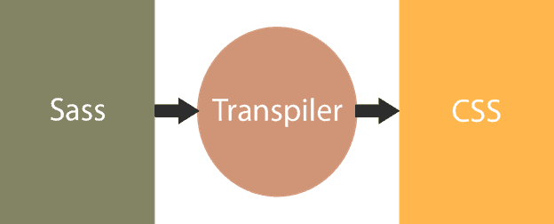

# SCSS Basics

<br/>

## Q. Explain what is Sass?

Sass (which stands for 'Syntactically awesome style sheets) is an extension of CSS that enables you to use things like variables, nested rules, inline imports and more. It also helps to keep things organized and allows you to create style sheets faster.

Sass works by writing your styles in .scss (or .sass) files, which will then get compiled into a regular CSS file. The newly compiled CSS file is what gets loaded to your browser to style your web application. This allows the browser to properly apply the styles to your web page.

<p align="center">
  
</p>

**Live Demo**: [Sass Example](https://codepen.io/learning-zone/pen/RwVprvO)

<div align="right">
    <b><a href="#">↥ back to top</a></b>
</div>

## Q. What are the SCSS basic features?

**1. Variables**

Variables are useful for things like colors, fonts, font sizes, and certain dimensions, as you can be sure always using the same ones. Variables in SCSS start with `$` sign

**SCSS Style**

```scss
$font-stack:    Helvetica, sans-serif;
$primary-color: #333;

body {
  font: 100% $font-stack;
  color: $primary-color;
}
```

**CSS Style**

```css
body {
  font: 100% Helvetica, sans-serif;
  color: #333;
}
```

When the Sass is processed, it takes the variables we define for the `$font-stack` and `$primary-color` and outputs normal CSS with our variable values placed in the CSS. This can be extremely powerful when working with brand colors and keeping them consistent throughout the site.

**Live Demo**: [Sass Variables](https://codepen.io/learning-zone/pen/LYyWNGM)

**2. Nesting**

Basic nesting refers to the ability to have a declaration inside of a declaration.

**SCSS Style**

```scss
nav {
  ul {
    margin: 0;
    padding: 0;
    list-style: none;
  }

  li { display: inline-block; }

  a {
    display: block;
    padding: 6px 12px;
    text-decoration: none;
  }
}
```

**CSS Style**

```css
nav ul {
  margin: 0;
  padding: 0;
  list-style: none;
}
nav li {
  display: inline-block;
}
nav a {
  display: block;
  padding: 6px 12px;
  text-decoration: none;
}
```

**Live Demo**: [Sass Nesting](https://codepen.io/learning-zone/pen/qBmrZmv)

**3. Partials**

The partial Sass files contain little snippets of CSS that can be included in other Sass files. This is a great way to modularize your CSS and help keep things easier to maintain. A partial is a Sass file named with a leading underscore. You might name it something like `_partial.scss`. The underscore lets Sass know that the file is only a partial file and that it should not be generated into a CSS file. Sass partials are used with the `@use` rule.

**4. Modules**

This rule loads another Sass file as a module, which means we can refer to its variables, mixins, and functions in our Sass file with a namespace based on the filename. Using a file will also include the CSS it generates in your compiled output!

**SCSS Style**

```scss
// _base.scss
$font-stack:    Helvetica, sans-serif;
$primary-color: #333;

body {
  font: 100% $font-stack;
  color: $primary-color;
}
```

```scss
// styles.scss
@use 'base';

.inverse {
  background-color: base.$primary-color;
  color: white;
}
```

**CSS Style**

```css
body {
  font: 100% Helvetica, sans-serif;
  color: #333;
}

.inverse {
  background-color: #333;
  color: white;
}
```

**5. Mixins**

A mixin provide to make groups of CSS declarations that you want to reuse throughout your site. You can even pass in values to make your mixin more flexible.

**SCSS Style**

```scss
@mixin transform($property) {
  -webkit-transform: $property;
  -ms-transform: $property;
  transform: $property;
}
.box { @include transform(rotate(30deg)); }
```

**CSS Style**

```css
.box {
  -webkit-transform: rotate(30deg);
  -ms-transform: rotate(30deg);
  transform: rotate(30deg);
}
```

**Live Demo**: [Sass Mixins](https://codepen.io/learning-zone/pen/xxdqVPM)

**6. Inheritance**

Using `@extend` lets you share a set of CSS properties from one selector to another.  

**SCSS Style**

```scss
/* This CSS will print because %message-shared is extended. */
%message-shared {
  border: 1px solid #ccc;
  padding: 10px;
  color: #333;
}

// This CSS won\'t print because %equal-heights is never extended.
%equal-heights {
  display: flex;
  flex-wrap: wrap;
}

.message {
  @extend %message-shared;
}

.success {
  @extend %message-shared;
  border-color: green;
}

.error {
  @extend %message-shared;
  border-color: red;
}

.warning {
  @extend %message-shared;
  border-color: yellow;
}
```

**CSS Style**

```css
/* This CSS will print because %message-shared is extended. */
.message, .success, .error, .warning {
  border: 1px solid #ccc;
  padding: 10px;
  color: #333;
}

.success {
  border-color: green;
}

.error {
  border-color: red;
}

.warning {
  border-color: yellow;
}
```

**Live Demo**: [Sass Inheritance](https://codepen.io/learning-zone/pen/ExmWKLG)

**7. Operators**

Sass has a handful of standard math operators like `+`, `-`, `*`, `/`, and `%`. In our example we're going to do some simple math to calculate widths for an aside & article.  

**SCSS Style**

```scss
.container {
  width: 100%;
}

article[role="main"] {
  float: left;
  width: 600px / 960px * 100%;
}

aside[role="complementary"] {
  float: right;
  width: 300px / 960px * 100%;
}
```

**CSS Style**

```css
.container {
  width: 100%;
}

article[role="main"] {
  float: left;
  width: 62.5%;
}

aside[role="complementary"] {
  float: right;
  width: 31.25%;
}
```

<div align="right">
    <b><a href="#">↥ back to top</a></b>
</div>

## Q. List out the data types that Sass supports?

Sass supports the following data types:

| Data Type | Example |
|---|---|
| **Numbers** | `1`, `1.5`, `10px`, `2em` |
| **Strings** | `"hello"`, `'world'`, `bold` (quoted and unquoted) |
| **Colors** | `#fff`, `red`, `rgb(0,0,0)`, `hsl(0,100%,50%)` |
| **Booleans** | `true`, `false` |
| **Null** | `null` |
| **Lists** | `1px 2px 3px`, `(10px, 20px)` (space or comma separated) |
| **Maps** | `("key": value, "key2": value2)` |
| **Functions** | First-class function references via `meta.get-function()` |

```scss
@use "sass:meta";
@use "sass:math";

$number:  42px;                          // Number
$string:  "Helvetica";                   // String
$color:   #3498db;                       // Color
$bool:    true;                          // Boolean
$null:    null;                          // Null
$list:    10px 20px 30px;               // List
$map:     ("sm": 576px, "md": 768px);   // Map

.box {
  width: $number;
  font-family: $string;
  color: $color;
  @if $bool { display: block; }
  margin: if($null == null, 0, 10px);
}
```

<div align="right">
    <b><a href="#">↥ back to top</a></b>
</div>

## Q. Explain the @include, @mixin, @function functions and how they are used. What is %placeholder?

i) ```@mixin``` A mixin lets you make groups of CSS declarations that you want to reuse throughout your site

```scss
@mixin border-radius($radius) {
  -webkit-border-radius: $radius;
     -moz-border-radius: $radius;
      -ms-border-radius: $radius;
          border-radius: $radius;
}
```

```scss
.box { @include border-radius(10px); }
```

ii) ```@extend``` directive provides a simple way to allow a selector to inherit/extend the styles of another one.
```scss
.message {
  border: 1px solid #ccc;
  padding: 10px;
  color: #333;
}

.success {
  @extend .message;
  border-color: green;
}

.error {
  @extend .message;
  border-color: red;
}
```

iii) ```%placeholder``` are classes that aren’t output when your SCSS is compiled

```scss
%awesome {
    width: 100%;
    height: 100%;
}
body {
    @extend %awesome;
}
p {
    @extend %awesome;
}
```

```scss
/* Output */
body, p {
    width: 100%;
    height: 100%;
}
```

<div align="right">
    <b><a href="#">↥ back to top</a></b>
</div>

## Q. What is file splitting and why should you use it?

File splitting helps organize your CSS into multiple files, decreasing page load time and making things easier to manage. How you decide to split them up is up to you, but it can be useful to separate files by component. For example, we can have all button styles in a file called `_buttons.scss` or all your header-specific styles in a file called `_header.scss`, main file, say _app.scss, and we can import those files by writing @import 'buttons';

<div align="right">
    <b><a href="#">↥ back to top</a></b>
</div>

## Q. What is the @content directive used for?

The `@content` directive is used inside a `@mixin` to allow the caller to pass a block of styles into the mixin. This makes mixins more flexible by acting as a placeholder for content passed via `@include`.

```scss
@mixin respond-to($breakpoint) {
  @if $breakpoint == "small" {
    @media (max-width: 767px) { @content; }
  } @else if $breakpoint == "medium" {
    @media (min-width: 768px) and (max-width: 1024px) { @content; }
  }
}

.sidebar {
  width: 300px;

  @include respond-to("small") {
    width: 100%;
  }
}
```

**Compiled CSS:**

```css
.sidebar {
  width: 300px;
}
@media (max-width: 767px) {
  .sidebar {
    width: 100%;
  }
}
```

<div align="right">
    <b><a href="#">↥ back to top</a></b>
</div>

## Q. What is wrong with Sass nesting?

Over-nesting is the most common pitfall. It produces overly specific CSS selectors, increases file size, hurts performance, and makes styles hard to override.

**Bad (over-nested):**

```scss
nav {
  ul {
    li {
      a {
        span { color: red; }
      }
    }
  }
}
```

**Compiled CSS (overly specific):**

```css
nav ul li a span { color: red; }
```

**Good practice:** Limit nesting to a maximum of **3 levels** deep. Use BEM or flat selectors where possible.

```scss
.nav__link {
  color: blue;

  &:hover { color: red; }
}
```

<div align="right">
    <b><a href="#">↥ back to top</a></b>
</div>

## Q. What is variable interpolation in Sass?

Variable interpolation (`#{}`) allows you to embed the value of a Sass variable into a selector, property name, or string — anywhere that a plain variable `$var` cannot be used directly.

```scss
$property: margin;
$side: top;
$theme: "dark";

.box-#{$theme} {
  #{$property}-#{$side}: 10px;
}
```

**Compiled CSS:**

```css
.box-dark {
  margin-top: 10px;
}
```

<div align="right">
    <b><a href="#">↥ back to top</a></b>
</div>

## Q. What is the difference between SCSS and Sass?

Both are syntaxes for the same preprocessor. The key differences are:

| Feature | SCSS | Sass (Indented) |
|---|---|---|
| File extension | `.scss` | `.sass` |
| Syntax style | CSS-like (curly braces `{}`, semicolons `;`) | Indentation-based (no braces or semicolons) |
| CSS compatibility | Valid CSS is valid SCSS | Not compatible with plain CSS |
| Popularity | More widely used | Less common |

**SCSS:**

```scss
$color: red;
body {
  color: $color;
}
```

**Sass (indented):**

```sass
$color: red
body
  color: $color
```

<div align="right">
    <b><a href="#">↥ back to top</a></b>
</div>

## Q. What are the advantages/disadvantages of using CSS preprocessors?

**Advantages:**

* Variables, nesting, mixins, and functions reduce repetition (DRY code)
* Modular file organization via `@use` and `@forward`
* Better maintainability for large stylesheets
* Built-in math and color functions
* Source maps for easier debugging

**Disadvantages:**

* Requires a build/compilation step
* Debugging compiled CSS can be harder without source maps
* Over-nesting leads to specificity problems
* Learning curve for new developers
* Adds tooling complexity to the project

<div align="right">
    <b><a href="#">↥ back to top</a></b>
</div>

## Q. Explain what is the use of Mixin function in Sass? What is the meaning of DRY-ing out a mixin?

A `@mixin` allows you to define reusable blocks of CSS declarations that can be included anywhere with `@include`. They support arguments, default values, and `@content` blocks.

```scss
@mixin flex-center($direction: row) {
  display: flex;
  justify-content: center;
  align-items: center;
  flex-direction: $direction;
}

.card {
  @include flex-center(column);
}
```

**DRY-ing out a mixin** means refactoring repeated CSS patterns into a single mixin so the same code is not duplicated across multiple selectors. "DRY" stands for **Don\'t Repeat Yourself**. Instead of writing vendor-prefixed or repeated declarations in every rule, you write them once inside a mixin and `@include` it wherever needed.

<div align="right">
    <b><a href="#">↥ back to top</a></b>
</div>

## Q. Explain what Sass Maps is and what is the use of Sass Maps?

A Sass map is a data structure that stores key-value pairs, similar to a dictionary or object in programming languages. Maps are useful for grouping related values such as theme colors, breakpoints, or spacing scales.

```scss
$theme-colors: (
  "primary":   #3498db,
  "secondary": #2ecc71,
  "danger":    #e74c3c,
);

// Access a value
.btn-primary {
  background-color: map.get($theme-colors, "primary");
}

// Loop over a map
@use "sass:map";

@each $name, $color in $theme-colors {
  .text-#{$name} {
    color: $color;
  }
}
```

**Compiled CSS:**

```css
.btn-primary { background-color: #3498db; }
.text-primary { color: #3498db; }
.text-secondary { color: #2ecc71; }
.text-danger { color: #e74c3c; }
```

<div align="right">
    <b><a href="#">↥ back to top</a></b>
</div>

## Q. Explain how Sass comments are different from regular CSS?

Sass supports two types of comments:

| Type | Syntax | Appears in compiled CSS? |
|---|---|---|
| Loud (CSS) comment | `/* ... */` | Yes (preserved in output) |
| Silent (Sass) comment | `// ...` | No (stripped from output) |

```scss
// This comment will NOT appear in the compiled CSS

/* This comment WILL appear in the compiled CSS */

.box {
  color: red; // inline silent comment — removed
  /* inline loud comment — kept */
}
```

<div align="right">
    <b><a href="#">↥ back to top</a></b>
</div>

## Q. Does Sass support inline comments?

Yes. Sass supports `//` single-line (silent) comments that do not appear in the compiled CSS output, in addition to the standard CSS `/* */` multi-line comments which are preserved.

```scss
$primary: #333; // silent — stripped from output

/* loud comment — kept in output */
body {
  color: $primary;
}
```

<div align="right">
    <b><a href="#">↥ back to top</a></b>
</div>

## Q. Explain when can you use the %placeholders in Sass?

`%placeholders` (silent/abstract classes) are selectors defined with `%` that produce no CSS output on their own — they only generate output when extended with `@extend`. Use them when:

* You want shared styles without a standalone CSS class in the output
* You want to avoid repeating the same set of rules across multiple selectors

```scss
%visually-hidden {
  position: absolute;
  width: 1px;
  height: 1px;
  overflow: hidden;
  clip: rect(0, 0, 0, 0);
}

.sr-only {
  @extend %visually-hidden;
}

.skip-link {
  @extend %visually-hidden;
}
```

**Compiled CSS:**

```css
.sr-only, .skip-link {
  position: absolute;
  width: 1px;
  height: 1px;
  overflow: hidden;
  clip: rect(0, 0, 0, 0);
}
```

<div align="right">
    <b><a href="#">↥ back to top</a></b>
</div>

## Q. Is it possible to nest variables within variables in Sass?

Sass does not support direct variable interpolation of one variable inside another variable\'s value at declaration time. However, you can use **interpolation** (`#{}`) to dynamically build variable names and use them in selectors or property names. For values, you compose them at use time.

```scss
$size: "large";
$font-large: 2rem;
$font-small: 1rem;

// Use a map instead for dynamic variable lookups
$font-sizes: (
  "large": 2rem,
  "small": 1rem,
);

.heading {
  font-size: map.get($font-sizes, $size); // 2rem
}
```

<div align="right">
    <b><a href="#">↥ back to top</a></b>
</div>

## Q. What are Sass cons and pros?

**Pros:**

* Reduces CSS repetition with variables, mixins, and functions
* Modular architecture via `@use` / `@forward`
* Nesting mirrors HTML structure for readability
* Built-in color, math, string, and list functions
* Large community, well-maintained, integrates with most build tools

**Cons:**

* Requires compilation — adds a build step
* Debugging can be complex without source maps
* Over-nesting creates overly specific and brittle CSS
* Teammates unfamiliar with Sass need onboarding
* Global namespace issues (mitigated by `@use` but older `@import` still common)

<div align="right">
    <b><a href="#">↥ back to top</a></b>
</div>

## Q. Explain how Mixins is useful?

Mixins let you define reusable groups of CSS declarations with optional parameters. This eliminates duplication and centralizes changes.

```scss
@mixin box-shadow($x: 0, $y: 2px, $blur: 6px, $color: rgba(0,0,0,0.2)) {
  -webkit-box-shadow: $x $y $blur $color;
          box-shadow: $x $y $blur $color;
}

.card {
  @include box-shadow();
}

.modal {
  @include box-shadow(0, 4px, 12px, rgba(0,0,0,0.4));
}
```

Benefits: vendor-prefix management, responsive breakpoints, theming utilities, and any repetitive pattern can be abstracted into a mixin.

<div align="right">
    <b><a href="#">↥ back to top</a></b>
</div>

## Q. What are the similarities between LESS and Sass?

* Both are CSS preprocessors that extend plain CSS
* Both support **variables**, **nesting**, **mixins**, and **imports**
* Both support **arithmetic operations** on values
* Both support **functions** (color manipulation, math, string)
* Both compile to standard CSS
* Both support **comments** (`//` and `/* */`)
* Both have support in major build tools (webpack, Vite, Gulp)

The main difference is syntax and ecosystem: Sass uses `$` for variables and is written in Dart; LESS uses `@` for variables and runs on JavaScript.

<div align="right">
    <b><a href="#">↥ back to top</a></b>
</div>

## Q. Explain what is the use of &combinator ?

The `&` (parent selector) combinator references the current parent selector. It is used to create pseudo-classes, pseudo-elements, modifier classes, and BEM-style naming without repeating the parent selector.

```scss
.button {
  background: blue;

  &:hover        { background: darkblue; }   // .button:hover
  &:focus        { outline: 2px solid; }      // .button:focus
  &::before      { content: ""; }             // .button::before
  &--primary     { background: green; }       // .button--primary (BEM modifier)
  &.is-disabled  { opacity: 0.5; }            // .button.is-disabled
}
```

<div align="right">
    <b><a href="#">↥ back to top</a></b>
</div>

## Q. What is the way to write a placeholder selector in Sass?

A placeholder selector is written with a `%` prefix. It is never output as a CSS rule on its own — it only generates CSS when another selector extends it with `@extend`.

```scss
%reset-list {
  margin: 0;
  padding: 0;
  list-style: none;
}

.nav-list {
  @extend %reset-list;
}

.breadcrumb {
  @extend %reset-list;
}
```

**Compiled CSS:**

```css
.nav-list, .breadcrumb {
  margin: 0;
  padding: 0;
  list-style: none;
}
```

<div align="right">
    <b><a href="#">↥ back to top</a></b>
</div>

## Q. What are number operations in Sass?

Sass supports standard arithmetic operators on numbers: `+`, `-`, `*`, `/` (via `math.div()`), and `%` (modulo). The `sass:math` module is required for division in modern Sass.

```scss
@use "sass:math";

$base: 16px;

.container {
  width: $base * 60;                    // 960px
  padding: math.div($base, 2);          // 8px
  margin: $base + 4px;                  // 20px
  font-size: $base - 2px;               // 14px
  opacity: math.percentage(math.div(3, 4)); // 75%
}
```

> Note: The `/` operator for division is deprecated in modern Sass. Use `math.div()` instead.

<div align="right">
    <b><a href="#">↥ back to top</a></b>
</div>

## Q. Explain @if, @else, @for, @include, @at-root, @extend, @error, @debug directives?

| Directive | Purpose |
|---|---|
| `@if` / `@else` | Conditional logic based on expressions |
| `@for` | Loop a fixed number of times |
| `@include` | Include a mixin\'s styles |
| `@at-root` | Emit rules at the root of the stylesheet, outside the current nesting |
| `@extend` | Inherit styles from another selector or placeholder |
| `@error` | Throw a fatal error and stop compilation |
| `@debug` | Print a debug message to the console during compilation |

```scss
@use "sass:math";

// @if / @else
@mixin theme-color($theme) {
  @if $theme == dark {
    background: #111;
    color: #fff;
  } @else {
    background: #fff;
    color: #111;
  }
}

// @for
@for $i from 1 through 4 {
  .col-#{$i} { width: math.percentage(math.div($i, 4)); }
}

// @at-root
.parent {
  color: red;
  @at-root .child { color: blue; } // outputs .child { ... } at root level
}

// @error / @debug
@mixin font-size($size) {
  @if type-of($size) != number {
    @error "Expected a number, got #{$size}.";
  }
  @debug "font-size set to #{$size}";
  font-size: $size;
}
```

<div align="right">
    <b><a href="#">↥ back to top</a></b>
</div>

## Q. Which directive displays an error message in SASS?

The `@error` directive displays a fatal error message and stops compilation. The `@warn` directive shows a warning without stopping, and `@debug` prints a debug value to the console.

```scss
@mixin set-color($color) {
  @if type-of($color) != color {
    @error "#{$color} is not a valid color.";
  }
  color: $color;
}

.box {
  @include set-color(notacolor); // Error: notacolor is not a valid color.
}
```

<div align="right">
    <b><a href="#">↥ back to top</a></b>
</div>

## Q. How many output styles are there in sass?

The Dart Sass compiler (current standard) supports **2 output styles**:

| Style | Description |
|---|---|
| `expanded` | Default — each property on its own line, human-readable |
| `compressed` | Minified — all whitespace removed for production |

> Note: Older Ruby Sass/LibSass supported 4 styles (`nested`, `expanded`, `compact`, `compressed`), but `nested` and `compact` are **no longer supported** in Dart Sass.

```bash
# Dart Sass CLI
sass input.scss output.css --style=expanded
sass input.scss output.css --style=compressed
```

<div align="right">
    <b><a href="#">↥ back to top</a></b>
</div>

## Q. Which symbol is used to refer parent selector in sass?

The `&` (ampersand) symbol refers to the parent selector inside a nested rule.

```scss
.link {
  color: blue;
  &:hover   { color: darkblue; }  // .link:hover
  &--active { font-weight: bold; } // .link--active (BEM modifier)
}
```

**Compiled CSS:**

```css
.link { color: blue; }
.link:hover { color: darkblue; }
.link--active { font-weight: bold; }
```

<div align="right">
    <b><a href="#">↥ back to top</a></b>
</div>

## Q. What is the difference between `@use` and `@import` in Sass?

`@use` is the modern replacement for `@import`, introduced in Dart Sass. `@import` is **deprecated** and will eventually be removed.

| Feature | `@import` (deprecated) | `@use` (modern) |
|---|---|---|
| Namespace | Global — all variables/mixins pollute global scope | Namespaced by filename |
| Loaded multiple times? | Yes — re-executes file each time | No — file loaded only once |
| Private members | Not supported | Prefix with `-` or `_` to make private |
| Configuration | Not possible | Use `with` keyword |
| Recommended | No | Yes |

**@import (old, deprecated):**

```scss
// _variables.scss
$primary: #3498db;

// main.scss
@import 'variables';
body { color: $primary; } // direct access — no namespace
```

**@use (modern):**

```scss
// _variables.scss
$primary: #3498db;
$-secret: #999; // private — not accessible outside

// main.scss
@use 'variables';
body { color: variables.$primary; } // namespaced access
```

**@use with alias:**

```scss
@use 'variables' as v;
body { color: v.$primary; }
```

**@use with wildcard (use sparingly):**

```scss
@use 'variables' as *;
body { color: $primary; } // no namespace — like @import
```

<div align="right">
    <b><a href="#">↥ back to top</a></b>
</div>

## Q. What is `@forward` in Sass and how does it differ from `@use`?

`@forward` loads a Sass file and makes its public members (variables, mixins, functions) available to files that `@use` the current file. It is used to build a single entry-point index file that re-exports multiple partials.

| Rule | Purpose |
|---|---|
| `@use` | Load a module for use **within the current file** |
| `@forward` | Re-export a module\'s members so downstream files can access them |

```scss
// _colors.scss
$primary: #3498db;
$danger: #e74c3c;

// _typography.scss
$font-base: 1rem;
$font-lg: 1.5rem;

// _index.scss  ← entry point
@forward 'colors';
@forward 'typography';

// main.scss
@use 'index' as tokens;   // gets everything from _index.scss

body {
  color: tokens.$primary;
  font-size: tokens.$font-base;
}
```

**`@forward` with `show` / `hide`:**

```scss
// Only expose $primary, hide $danger
@forward 'colors' show $primary;

// Hide specific members
@forward 'colors' hide $danger;
```

**`@forward` with `as` prefix:**

```scss
@forward 'colors' as color-*;
// $primary becomes $color-primary for consumers
```

<div align="right">
    <b><a href="#">↥ back to top</a></b>
</div>

## Q. What is the difference between a Sass `@function` and a `@mixin`?

| Feature | `@function` | `@mixin` |
|---|---|---|
| Returns | A **value** (number, color, string, etc.) | A **block of CSS declarations** |
| Used with | Assigned to a property value | `@include` directive |
| Purpose | Compute and return a value | Output reusable styles |
| `@content` | Not supported | Supported |

**@function — returns a computed value:**

```scss
@use "sass:math";

@function rem($px, $base: 16) {
  @return math.div($px, $base) * 1rem;
}

@function clamp-fluid($min, $max, $min-vw: 320px, $max-vw: 1280px) {
  $slope: math.div($max - $min, $max-vw - $min-vw);
  $intercept: $min - $slope * $min-vw;
  @return clamp(#{$min}, #{$intercept} + #{$slope * 100}vw, #{$max});
}

h1 {
  font-size: rem(32px);          // 2rem
  margin-bottom: rem(24px);      // 1.5rem
}
```

**@mixin — outputs CSS declarations:**

```scss
@mixin visually-hidden {
  position: absolute;
  width: 1px;
  height: 1px;
  clip: rect(0,0,0,0);
  overflow: hidden;
}

.sr-only { @include visually-hidden; }
```

**Rule of thumb:** Use `@function` when you need a computed **value**; use `@mixin` when you need to output **multiple CSS properties**.

<div align="right">
    <b><a href="#">↥ back to top</a></b>
</div>

## Q. What is the difference between `@extend` and `@mixin`? When would you use one over the other?

| Feature | `@extend` | `@mixin` |
|---|---|---|
| Output | Groups selectors (`a, b { ... }`) | Duplicates declarations in each selector |
| Arguments / parameters | Not supported | Supported |
| Works across media queries | No — not allowed across different breakpoints | Yes |
| Produces smallest CSS | Yes (when used well) | No |
| Recommended for | Static shared styles, placeholders | Configurable, parameterized patterns |

**@extend (selectors are grouped):**

```scss
%btn-base {
  padding: 8px 16px;
  border-radius: 4px;
  cursor: pointer;
}

.btn-primary {
  @extend %btn-base;
  background: blue;
}

.btn-danger {
  @extend %btn-base;
  background: red;
}
```

**Compiled CSS:**

```css
.btn-primary, .btn-danger { padding: 8px 16px; border-radius: 4px; cursor: pointer; }
.btn-primary { background: blue; }
.btn-danger { background: red; }
```

**@mixin (declarations duplicated but configurable):**

```scss
@mixin btn($bg) {
  padding: 8px 16px;
  border-radius: 4px;
  background: $bg;
}

.btn-primary { @include btn(blue); }
.btn-danger  { @include btn(red); }
```

**Use `@extend` / `%placeholder`** for purely static, shared property sets.  
**Use `@mixin`** whenever you need parameters, `@content`, or use inside `@media` blocks.

<div align="right">
    <b><a href="#">↥ back to top</a></b>
</div>

## Q. What are Sass lists and how do you work with them?

A Sass **list** is an ordered collection of values, separated by spaces or commas. Lists are immutable — functions return new lists rather than modifying the original.

```scss
@use "sass:list";

$sizes: 8px 16px 24px 32px;             // space-separated
$breakpoints: (576px, 768px, 992px);    // comma-separated

// list.length()
$count: list.length($sizes);            // 4

// list.nth()
$md: list.nth($sizes, 3);              // 24px (1-based index)

// list.append()
$sizes-extended: list.append($sizes, 48px);

// list.join()
$all: list.join($sizes, $sizes-extended);

// Iterate with @each
@each $size in $sizes {
  .m-#{$size} { margin: $size; }
}
```

**Compiled CSS (from @each):**

```css
.m-8px  { margin: 8px; }
.m-16px { margin: 16px; }
.m-24px { margin: 24px; }
.m-32px { margin: 32px; }
```

<div align="right">
    <b><a href="#">↥ back to top</a></b>
</div>

## Q. Explain `@each` and `@while` loop directives in Sass?

**`@each`** iterates over a list or map:

```scss
// Iterate over a list
$colors: red, green, blue;

@each $color in $colors {
  .text-#{$color} { color: $color; }
}

// Iterate over a map (destructuring)
$icons: ("home": "\f015", "user": "\f007", "gear": "\f013");

@each $name, $code in $icons {
  .icon-#{$name}::before { content: $code; }
}

// Multiple assignment (list of lists)
$sizes: ("sm" 576px), ("md" 768px), ("lg" 992px);

@each $label, $value in $sizes {
  .container-#{$label} { max-width: $value; }
}
```

**`@while`** loops as long as a condition is true (use sparingly — `@for` or `@each` is preferred):

```scss
@use "sass:math";

$i: 1;
@while $i <= 5 {
  .opacity-#{$i * 10} { opacity: math.div($i, 10); }
  $i: $i + 1;
}
```

**Compiled CSS:**

```css
.opacity-10 { opacity: 0.1; }
.opacity-20 { opacity: 0.2; }
/* ... */
.opacity-50 { opacity: 0.5; }
```

<div align="right">
    <b><a href="#">↥ back to top</a></b>
</div>

## Q. What is the difference between Sass variables and CSS custom properties (CSS variables)?

| Feature | Sass Variables (`$var`) | CSS Custom Properties (`--var`) |
|---|---|---|
| Resolved at | **Compile time** — static | **Runtime** — dynamic |
| Available in browser DevTools | No — compiled away | Yes — inspectable and editable |
| Can be changed by JavaScript | No | Yes — `element.style.setProperty('--color', 'red')` |
| Scope | Sass lexical scope | CSS cascade / DOM scope |
| Works inside `calc()` | Limited | Yes — `calc(var(--size) * 2)` |
| Supports fallback | No | Yes — `var(--color, red)` |
| Inherited through DOM | No | Yes |
| Useful for theming/dark mode | No | Yes |

```scss
// Sass variable — resolved at compile time
$primary: #3498db;

.btn { background: $primary; }

// CSS custom property — lives in the browser
:root {
  --primary: #{$primary}; // use #{} to embed Sass value into CSS var
}

.btn-dynamic {
  background: var(--primary);
}
```

**Best practice:** Use Sass variables for build-time values (breakpoints, spacing scale, base font size). Use CSS custom properties for runtime theming, dark mode, and values that JavaScript needs to read or modify.

<div align="right">
    <b><a href="#">↥ back to top</a></b>
</div>

## Q. What is variable scope in Sass? What are the `!default` and `!global` flags?

**Variable scope:** Sass variables are lexically scoped. A variable declared inside a rule, mixin, or function is local to that block and not accessible outside it.

```scss
$color: red;   // global

.box {
  $color: blue;  // local — shadows global inside this block
  color: $color; // blue
}

p { color: $color; } // red — global unaffected
```

**`!global` flag:** Assigns or modifies a variable in the global scope from inside a local block (use sparingly):

```scss
$theme: light;  // global

@mixin set-dark() {
  $theme: dark !global; // modifies the global $theme
}

@include set-dark();
// $theme is now "dark" globally
```

**`!default` flag:** Sets a variable only if it is not already defined or is `null`. Used in libraries and design-token files so consumers can override defaults before `@use`:

```scss
// _config.scss (library file)
$primary: #3498db !default;
$font-size: 16px  !default;

// main.scss (consumer)
$primary: hotpink;         // override BEFORE @use
@use 'config';

.btn { background: config.$primary; } // hotpink — consumer wins
```

<div align="right">
    <b><a href="#">↥ back to top</a></b>
</div>

## Q. What are Sass built-in modules? List the main ones and give examples.

Dart Sass ships with built-in modules loaded via `@use "sass:<module>"`:

| Module | Purpose |
|---|---|
| `sass:math` | Math functions: `math.div()`, `math.round()`, `math.pow()`, `math.percentage()` |
| `sass:color` | Color manipulation: `color.adjust()`, `color.mix()`, `color.scale()`, `color.channel()` |
| `sass:string` | String functions: `string.quote()`, `string.slice()`, `string.length()`, `string.to-upper-case()` |
| `sass:list` | List functions: `list.nth()`, `list.length()`, `list.append()`, `list.join()` |
| `sass:map` | Map functions: `map.get()`, `map.set()`, `map.merge()`, `map.keys()`, `map.values()` |
| `sass:selector` | Selector inspection: `selector.parse()`, `selector.extend()` |
| `sass:meta` | Meta-programming: `meta.type-of()`, `meta.get-function()`, `meta.call()`, `meta.load-css()` |

```scss
@use "sass:math";
@use "sass:color";
@use "sass:map";
@use "sass:string";

$palette: ("primary": #3498db, "danger": #e74c3c);

.btn-hover {
  // math
  width: math.percentage(math.div(3, 4));   // 75%

  // color — darken primary by 10%
  background: color.adjust(map.get($palette, "primary"), $lightness: -10%);

  // color.scale() — relative scaling (safer than adjust)
  border-color: color.scale(map.get($palette, "primary"), $saturation: 20%);

  // string
  font-family: string.quote(Helvetica);     // "Helvetica"
}
```

<div align="right">
    <b><a href="#">↥ back to top</a></b>
</div>

## Q. What are rest/splat arguments (`...`) in Sass mixins and functions?

Sass supports **rest arguments** (also called splat arguments) using `...`. They allow a mixin or function to accept any number of arguments, collected into a list or map.

**Rest arguments in mixins:**

```scss
@mixin transitions($transitions...) {
  transition: $transitions;
}

.box {
  // Pass multiple transitions
  @include transitions(color 0.3s ease, background 0.5s linear, opacity 0.2s);
}
```

**Compiled CSS:**

```css
.box {
  transition: color 0.3s ease, background 0.5s linear, opacity 0.2s;
}
```

**Splat operator when calling — expand a list/map into arguments:**

```scss
@mixin box-shadow($x, $y, $blur, $color) {
  box-shadow: $x $y $blur $color;
}

$args: 0px 4px 8px rgba(0,0,0,0.3);

.card {
  @include box-shadow($args...); // expands list into positional args
}
```

**Keyword splat from a map:**

```scss
$kwargs: ("x": 0, "y": 2px, "blur": 6px, "color": rgba(0,0,0,0.2));

.card {
  @include box-shadow($kwargs...); // map keys map to parameter names
}
```

<div align="right">
    <b><a href="#">↥ back to top</a></b>
</div>

## Q. How do you implement a theming system using SCSS?

A scalable theming approach uses CSS custom properties (runtime) defined from Sass maps (build-time), combined with a theme mixin or data attribute selector.

```scss
// _tokens.scss
$themes: (
  "light": (
    "bg":      #ffffff,
    "text":    #111111,
    "primary": #3498db,
    "surface": #f5f5f5,
  ),
  "dark": (
    "bg":      #111111,
    "text":    #f5f5f5,
    "primary": #64b5f6,
    "surface": #1e1e1e,
  ),
);

// _theme.scss
@use 'tokens';
@use 'sass:map';

@mixin define-theme($theme-map) {
  @each $token, $value in $theme-map {
    --#{$token}: #{$value};
  }
}

:root {
  @include define-theme(map.get(tokens.$themes, "light"));
}

[data-theme="dark"] {
  @include define-theme(map.get(tokens.$themes, "dark"));
}

// Component usage
.card {
  background: var(--surface);
  color: var(--text);
  border: 1px solid var(--primary);
}
```

**Switching theme with JavaScript:**

```js
document.documentElement.setAttribute('data-theme', 'dark');
```

<div align="right">
    <b><a href="#">↥ back to top</a></b>
</div>

## Q. What is BEM methodology and how does SCSS support it?

**BEM** (Block, Element, Modifier) is a CSS naming convention that produces flat, predictable, and collision-free class names.

- **Block** — standalone component: `.card`
- **Element** — part of a block: `.card__title`, `.card__image`
- **Modifier** — variant of a block or element: `.card--featured`, `.card__title--large`

SCSS\'s `&` (parent selector) makes BEM clean to write without repeating the block name:

```scss
.card {
  padding: 16px;
  border: 1px solid #ddd;
  border-radius: 8px;

  // Elements
  &__image {
    width: 100%;
    object-fit: cover;
  }

  &__title {
    font-size: 1.25rem;
    margin: 0 0 8px;

    // Element modifier
    &--large { font-size: 1.75rem; }
  }

  &__body {
    font-size: 0.875rem;
    color: #555;
  }

  // Block modifiers
  &--featured {
    border-color: #3498db;
    box-shadow: 0 4px 12px rgba(0,0,0,0.15);
  }

  &--compact {
    padding: 8px;
  }
}
```

**Compiled CSS selectors:**

```css
.card { }
.card__image { }
.card__title { }
.card__title--large { }
.card__body { }
.card--featured { }
.card--compact { }
```

> Avoid deeply nesting BEM inside SCSS — keep it one level of nesting inside the Block.

<div align="right">
    <b><a href="#">↥ back to top</a></b>
</div>

## Q. How do you create a responsive breakpoint mixin system in SCSS?

A breakpoint mixin wraps `@media` queries so breakpoints are defined once in a map and reused consistently throughout the codebase.

```scss
// _breakpoints.scss
$breakpoints: (
  "xs": 0,
  "sm": 576px,
  "md": 768px,
  "lg": 992px,
  "xl": 1200px,
  "xxl": 1400px,
);

@use "sass:map";

// Mobile-first (min-width)
@mixin bp-up($name) {
  $value: map.get($breakpoints, $name);
  @if $value == null {
    @error "Breakpoint `#{$name}` not found. Available: #{map.keys($breakpoints)}";
  }
  @if $value == 0 {
    @content; // xs — no media query needed
  } @else {
    @media (min-width: $value) { @content; }
  }
}

// Desktop-first (max-width)
@mixin bp-down($name) {
  $value: map.get($breakpoints, $name);
  @media (max-width: ($value - 0.02px)) { @content; }
}

// Between two breakpoints
@mixin bp-between($lower, $upper) {
  $min: map.get($breakpoints, $lower);
  $max: map.get($breakpoints, $upper);
  @media (min-width: $min) and (max-width: ($max - 0.02px)) { @content; }
}
```

**Usage:**

```scss
@use 'breakpoints' as *;

.container {
  padding: 16px;

  @include bp-up("md") { padding: 24px; }
  @include bp-up("xl") { padding: 32px; }
}

.sidebar {
  display: none;
  @include bp-up("lg") { display: block; width: 280px; }
}
```

<div align="right">
    <b><a href="#">↥ back to top</a></b>
</div>

## Q. How do you configure Sass with webpack (sass-loader) and Vite?

**webpack with `sass-loader`:**

```bash
npm install --save-dev sass sass-loader css-loader style-loader
```

```js
// webpack.config.js
module.exports = {
  module: {
    rules: [
      {
        test: /\.scss$/,
        use: [
          'style-loader',   // 3. inject styles into DOM
          'css-loader',     // 2. resolve @use / @forward imports
          {
            loader: 'sass-loader',  // 1. compile SCSS → CSS
            options: {
              sassOptions: {
                style: 'compressed',     // output style
                loadPaths: ['src/styles'], // resolve paths
              },
            },
          },
        ],
      },
    ],
  },
};
```

**Vite (built-in SCSS support):**

```bash
npm install --save-dev sass
```

```js
// vite.config.js
export default {
  css: {
    preprocessorOptions: {
      scss: {
        // Automatically import tokens into every file
        additionalData: `@use "@/styles/tokens" as *;`,
        style: 'compressed',
      },
    },
  },
};
```

**Usage in a component (React/Vue):**

```js
import './Button.scss';           // plain import
import styles from './Card.module.scss'; // CSS Modules
```

> In Vite, Sass is processed automatically for any `.scss` file — no extra plugin required.

<div align="right">
    <b><a href="#">↥ back to top</a></b>
</div>
